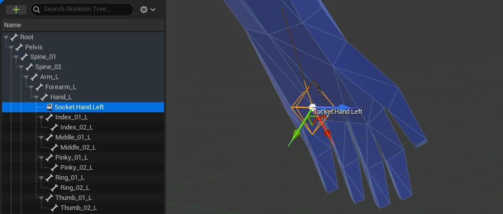
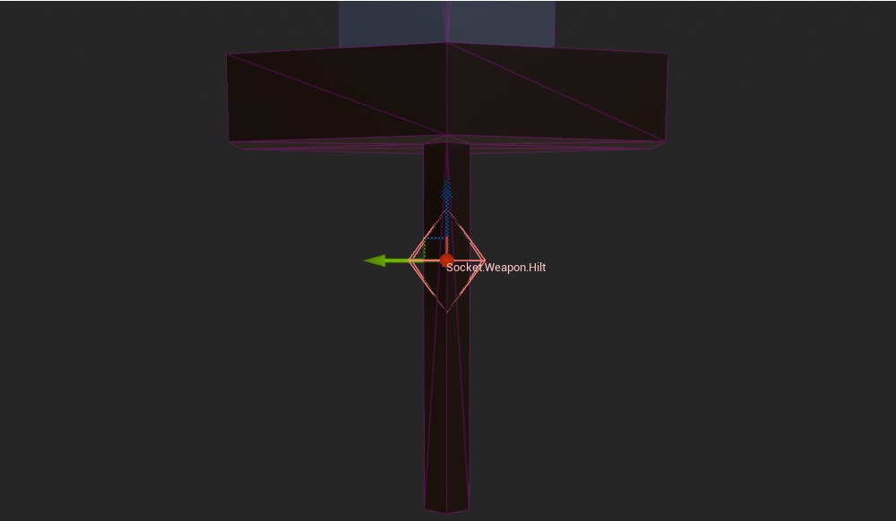
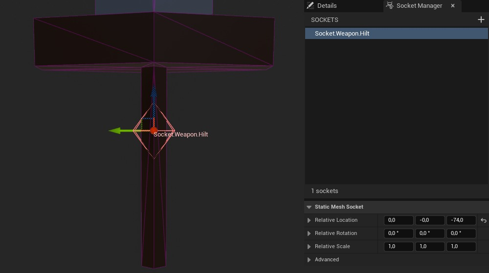
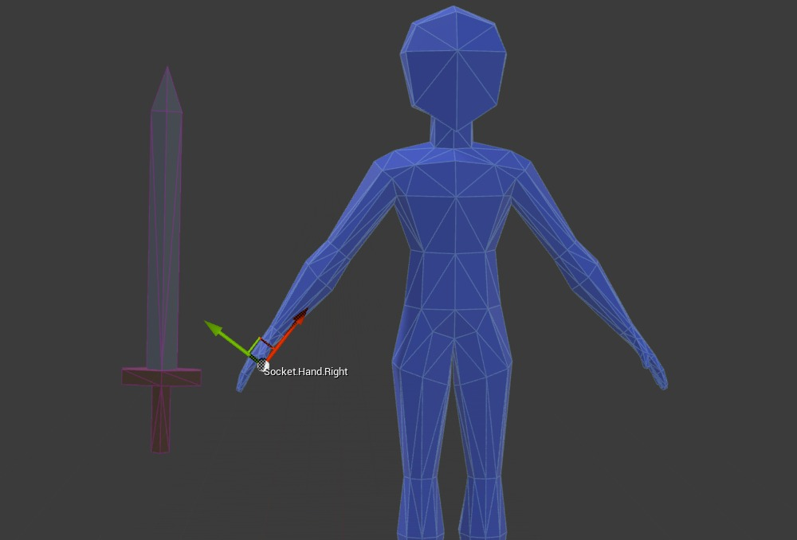
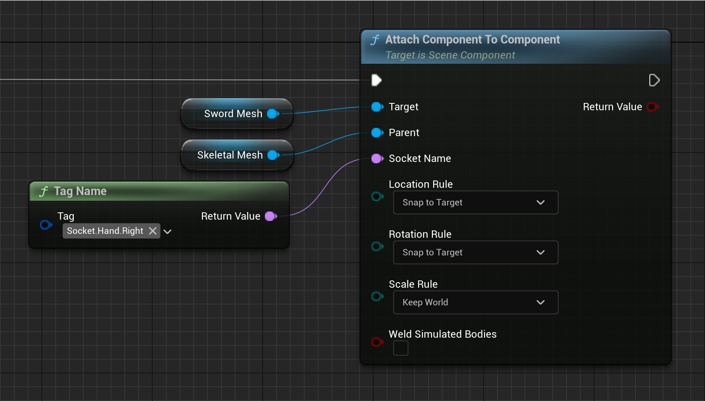
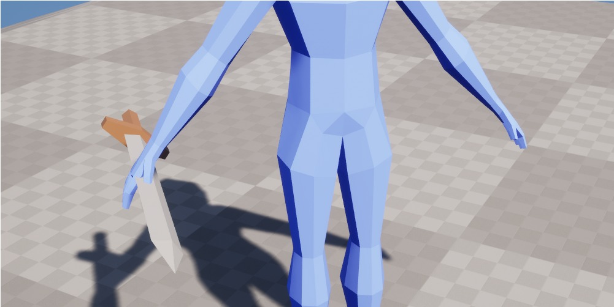
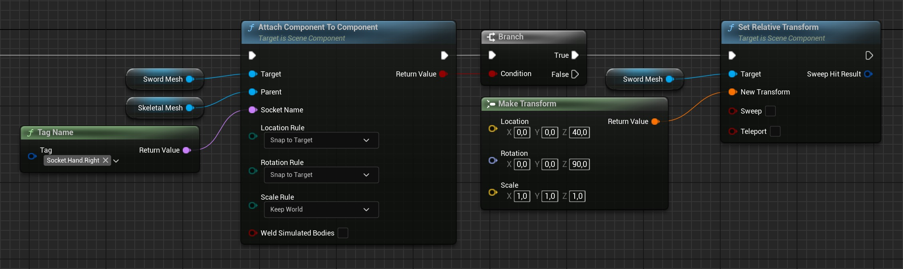
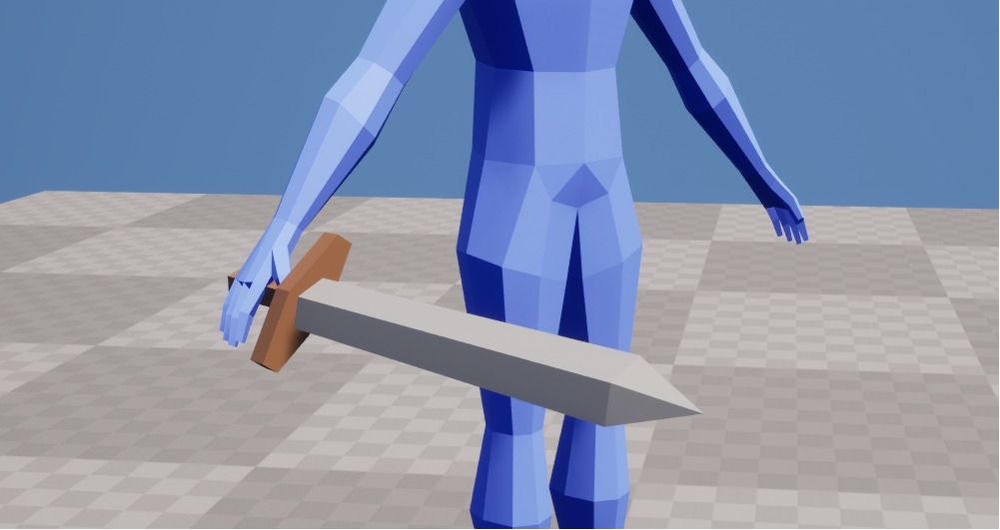
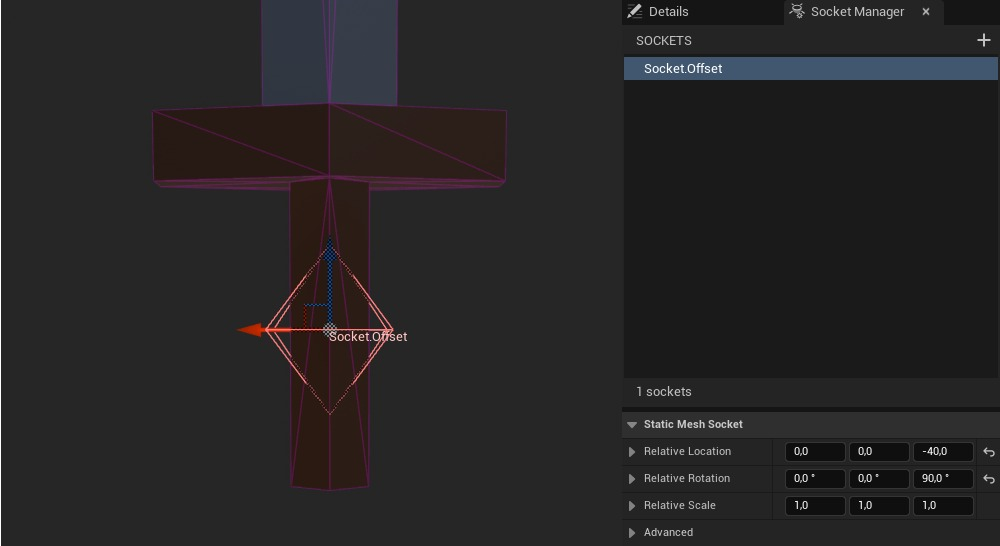
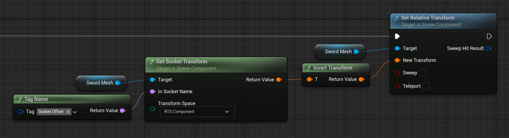

# 🔌 为什么你应该使用静态网格套接字

## 来源与状态

- 原始 URL：https://dev.epicgames.com/community/learning/tutorials/KZXp/unreal-engine-why-you-should-be-using-static-mesh-sockets
- 原始文件：unreal-engine-why-you-should-be-using-static-mesh-sockets.origin.md
- 分段：第 1/2 段

## 运行时分类

- 类型：图文教程
- 判断：API 未识别到核心视频信号，可整理正文约 16227 字符。

## 摘要

静态网格体套接字是虚幻引擎最容易被忽视的功能之一。虽然大多数开发人员熟悉用于附件的骨架网格物体套接字，但静态网格物体套接字为更智能的工作流程、更简洁的代码和更灵活的设计工具打开了大门。在本教程中，我们将探索如何将它们用于附件、动画、命中框等 - 将简单的概念转变为强大的数据驱动系统，使您的游戏更容易构建，设计更有趣。

## 中文整理

### 什么是静态网格套接字？

如果您在虚幻引擎中花费过一定时间，您可能已经熟悉*骨架网格物体套接字*。



原则上，套接字是在设计时在“相对于某物”空间中声明的变换（位置、旋转和缩放）。对于骨架网格物体套接字，它们定义相对于骨架网格物体中的父骨骼的变换。因此，*静态网格体套接字*定义相对于静态网格体的变换也就不足为奇了。



为了简单起见，让我们暂时搁置骨架网格物体和静态网格物体套接字之间的一些（但很重要）差异，只根据我们的定义讨论静态网格物体套接字：我在这里将展示的内容适用于所有类型的套接字，我们将在[其他类型的套接字](https://dev.epicgames.com/community/learning/tutorials/KZXp/unreal-engine-why-you-should-be-using-static-mesh-sockets#othertypesofsockets)。

### 如何定义它们

一旦你知道怎么做就非常简单，但很容易被忽视。在编辑器中打开任何静态网格物体，然后选择“详细信息”选项卡旁边的“套接字管理器”选项卡。



+ 按钮在位置 (0,0,0) 处向我们的网格添加一个可移动插槽，并允许我们为其命名。我建议使用与游戏标签兼容的命名约定（例如 Socket.Type.Variant），并在我们的所有网格体和套接字中坚持使用它。这样我们就可以获得游戏标签的所有优势，并且可以轻松引用项目中常用的套接字，而不会出现拼写错误的风险。

### 何时使用它们

虚幻引擎文档和教程中最常提到的用例当然是*附件*。 IE。如果我们想将某些东西附加到静态网格物体上，我们将使用套接字。但这只是冰山一角。游戏需要多种不同类型的变换，而套接字可以做更多的事情！让我们看看如何使用套接字启用一些强大的数据驱动工作流程。

### 偏置插座

我们将从熟悉的东西开始：*骨架网格物体附件*。

### 依恋的问题

引擎中的所有附加功能和节点都允许我们指定要附加子级的父级套接字名称。让我们看一个小例子来演示这里的一个问题。我们有一个带有骨架网格物体的简单 pawn，我们想要将剑静态网格物体附加到其 Socket.Hand.Right 插槽。



我们可以在蓝图中实现它，如下所示：



这给了我们这个游戏结果。



哦不！你不应该这样握剑！发生了什么？每当我们将子级附加到父级时，我们都可以指定*父级*套接字名称，但子级始终使用*网格的原点*进行附加。当我在 Blender 中创建剑网格时，我使用网格的“几何中心”作为其原点。 Unreal 将始终使用此点进行附件。

### 常见解决方案

最直接的方法是调整 Socket.Hand.Right 骨架网格物体套接字的位置/旋转。根据项目的复杂程度，这种方法效果很好。如果我们只有几种比例相似的武器类型，这就是正确的选择。但我们应该注意一些注意事项：解决这些问题的工作流程是返回 Blender 并将原点设置为剑柄。同样，根据项目的复杂性，这会很好地工作。但现在我们需要考虑其他一些方面：我们还可以尝试为我们的剑附件提供显式的偏移变换。





太棒了，成功了！但现在我们遇到了一系列新问题：

### 套接字方式

也许你已经明白我的意思了。看来我们正在试图解决错误的问题。我们在这里“实际上”需要什么？这是正确的！我们可以在设计时声明一个相对于我们的剑的变换！我们告诉 Unreal：“嘿，当你将这把剑附加到我们 pawn 的手上时，请确保使用剑柄而不是原点”。



然后，我们使用该套接字的逆变换来应用适当的偏移量。为什么要进行*逆变换？由于我们希望偏移套接字与父套接字重叠，因此我们必须在“相反”方向上偏移整个网格。因此命名为 Socket.Offset。由于静态网格体套接字相对于网格体的原点（即在组件空间中），我们可以直接将它们的变换作为偏移量应用到所属的网格体组件。



完美的！剑已正确连接，我们之前对网格原点和偏移变换的担忧也得到了解决：如果我们将此约定包装在一些不错的 C++ 函数中并将它们暴露给蓝图，那么在处理附件时我们将不需要考虑太多。对于蓝图项目，我们可以将前面的几个节点包装在蓝图函数库中。

```cpp
EResult Attach(USceneComponent* Child, USceneComponent* Parent, const FName Socket, const FName OffsetSocket, const FAttachmentTransformRules AttachmentRules)
{
    if (IsValid(Child) && IsValid(Parent))
    {
        if (Child->AttachToComponent(Parent, AttachmentRules, Socket))
        {
            // We need Component space since we apply this transform as a relative offset
            if (const auto Transform = GetSocketTransform(Child, OffsetSocket, RTS_Component))
            {
                Child->SetRelativeTransform(Transform->Inverse());
```

瞧，我们对依恋的担忧已经成为过去。一旦接触到蓝图，我们就会得到：现在执着已经解决了，我们可以享受一些乐趣了。当大量使用像这样的套接字时，建议选择有关网格和套接字方向的项目约定并严格遵循它。例如，虚幻引擎使用x-forward和z-up。考虑到这一点，确定所有网格和插座的方向会很有帮助。与转换保持一致很重要，并且可以让我们免去以后的麻烦。根据用例，我们还应该考虑多个套接字查找的性能。我们多次迭代一个（小）对象数组。如果我们发现显着的性能影响，我们可以：但是古老的格言仍然适用：*未测量的*优化是万恶之源。

### 在 Sequencer 中使用 Control Rig 制作道具动画

当使用控制装置在音序器中制作动画时，我们还可以将套接字完全用于其他用途。在制作交互式道具动画时，使用正向运动学 (FK) 很难获得所需的结果。道具通常附着在手部骨骼之一上，因此会受到整个骨骼链直至根骨骼的影响。这使得双手保持与道具接触的动画变得具有挑战性。制作*仅道具*动画并使用逆运动学 (IK) 求解手臂要容易得多。考虑到我们在现实世界中如何实际使用道具，这很有意义。当用笔书写时，没有人会有意识地考虑自己的肩膀、肘部或手腕。为了启用此工作流程，我们必须首先调整骨架以支持适当的父骨骼空间中的动画道具。

### 准备骨架

为了在最小化其他骨骼影响的情况下对道具进行动画处理，我们必须将其附加到适当的父骨骼上。根骨和脊柱骨骼是很好的候选者，具体取决于您是否希望道具随脊柱移动。在这一点上，我们还应该提到虚幻引擎中“虚拟骨骼”的存在，它们可能会在这里发挥作用。我们将使用脊柱骨骼作为父级骨骼并创建专用的*支撑骨骼*。我们将在游戏中将道具附加到该骨骼上，但不会在音序器中！ I recommend adding a well-named socket at this point (e.g. Socket.Prop.Primary) and creating an appropriate FK control for this bone in control rig.现在我们准备好制作动画了……

### 约束和套接字

假设我们想要创作一个动画来抛出一个道具（例如一个桶）。我们创建一个新的关卡序列，并添加骨架、控制装置和桶作为音序器轨道。那么我们现在如何处理道具控制呢？第一步是使用*约束*使 prop 控件遵循我们的 prop。选择道具控件并将其限制在枪管上。会弹出一系列静态网格物体套接字。在这种情况下，这并不重要，但我建议在这里使用 [Offset Socket](https://dev.epicgames.com/community/learning/tutorials/KZXp/unreal-engine-why-you-should-be-using-static-mesh-sockets#offsetsockets)，例如在桶的底部。不过，没有选择（=网格的原点）就可以了。确保通过在“约束”选项卡中右键单击约束本身将所有偏移量归零。这是约束的另一个强大功能，但我们不需要它来实现我们的目的。道具现在被限制在枪管上并随枪管一起进行动画处理。我们在世界空间中对桶进行动画处理，从而对支撑骨骼进行动画处理，而无需担心任何父骨骼链。但是我们应该如何处理 IK 手部控件呢？我们如何将它们精确地连接到枪管上？我们可以手动将它们放置在每个关键帧中，但是......我们可以使用什么工具来做到这一点？我们可以在设计时声明一个相对于我们的桶的变换！我们告诉虚幻：“嘿，当这个桶在音序器中移动时，请确保将手部 IK 控件准确地放置在此处”。与我们的附件示例非常相似，我们声明了网格上的变换，这对于放置我们的手来说是理想的。因此，主手和副手的命名约定分别为 Socket.Grip.Primary 和 Socket.Grip.Secondary。现在我们只需重复前面的步骤：选择右侧 IK 控件并将其约束到套接字 Socket.Grip.Primary 处的桶。对于左手 IK，则相反。手部 IK 控件现在被限制在枪管上的抓握位置并为其设置动画。现在，我们可以为投掷动画设置道具和手部 IK 控件的关键帧，将其烘焙为序列，然后简单地将桶连接到游戏中的道具骨骼上。手将继续准确地跟随枪管上的抓握位置，至少直到我们需要将其拆下以再次启用物理模拟为止。这带来了许多优点：

### 命中框

命中箱是大多数战斗系统的核心。我们需要某种几何形状来描述我们的攻击在空间中的“何处”是有效的。在虚幻引擎中有几种可能的方法来处理这个问题，但它们归结为两个原则：*重叠检查*和*形状/线条跟踪*。在动作战斗系统的上下文中，跟踪通常比重叠检查更好，但无论跟踪用于什么用途，以下方法都可能有用。

### 空间语法

我们已经探索了用*一个*套接字可以做什么，但是当我们添加更多套接字时会发生什么？如果我们有 2 个套接字，我们可以计算一条描述它们之间距离的线。或者我们可以将这两种变换解释为描述形状的空间点：如果您熟悉虚幻引擎中的追踪，您可能会注意到这些是扫描轨迹的基本形状。你能猜出我要说什么吗？我们可以使用插槽来定义我们的武器施加伤害的位置，然后追踪确切的形状！
