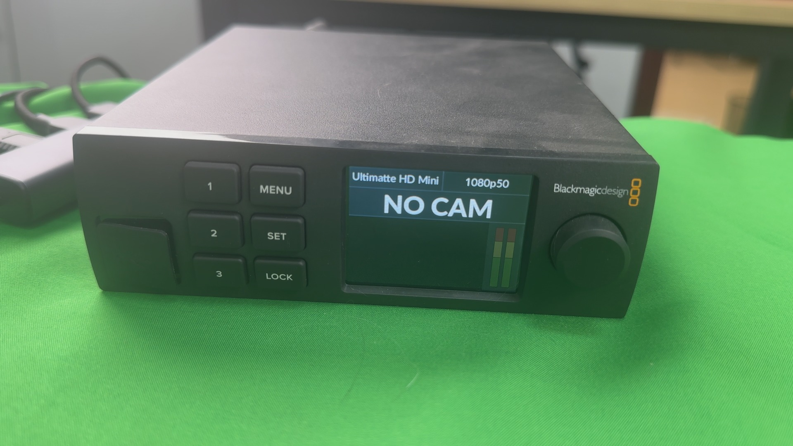
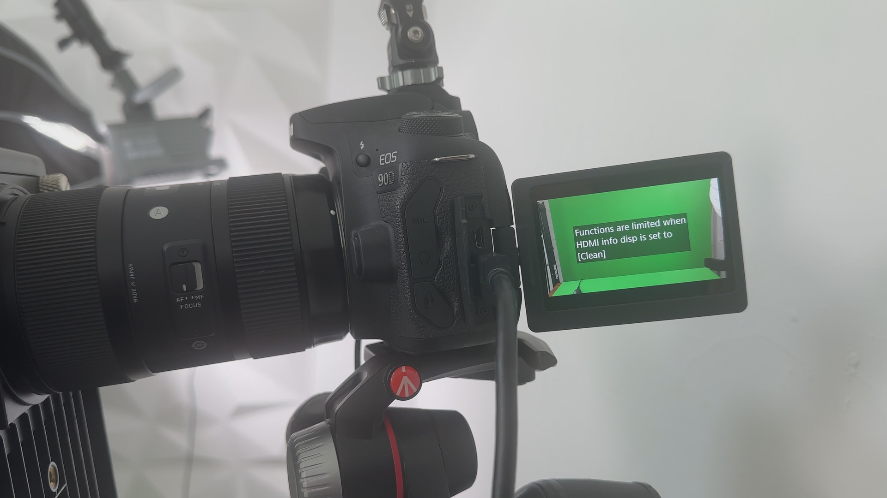
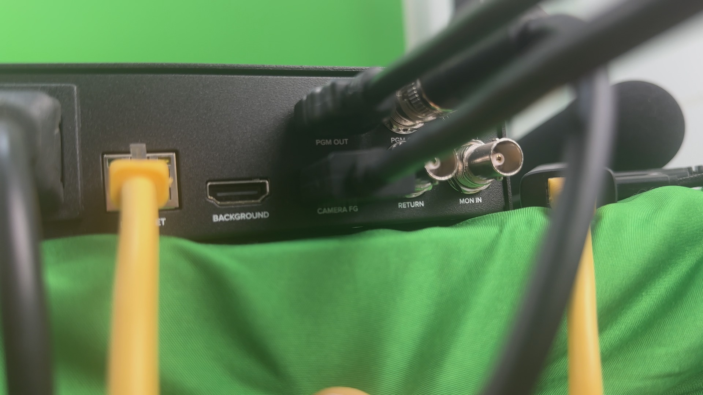
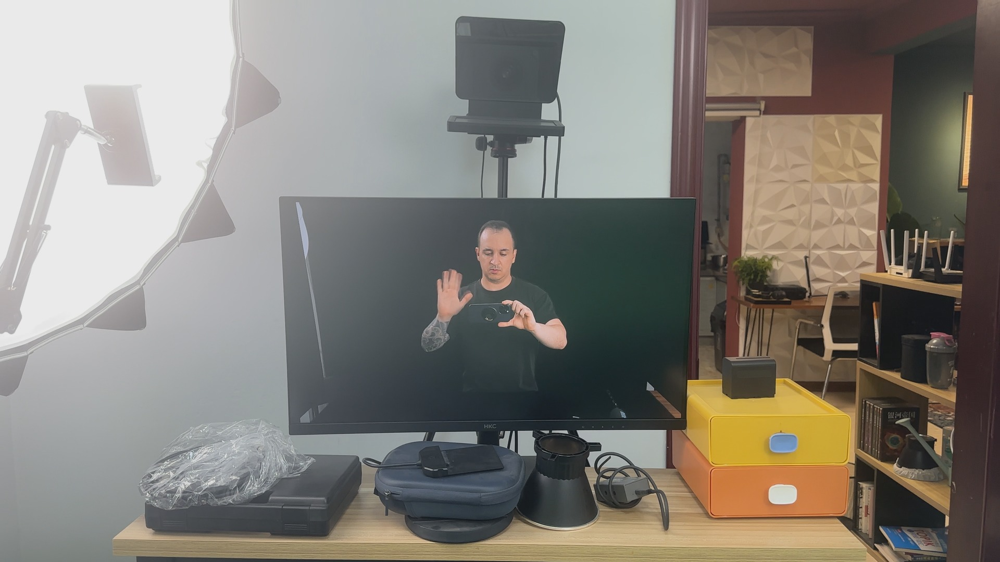
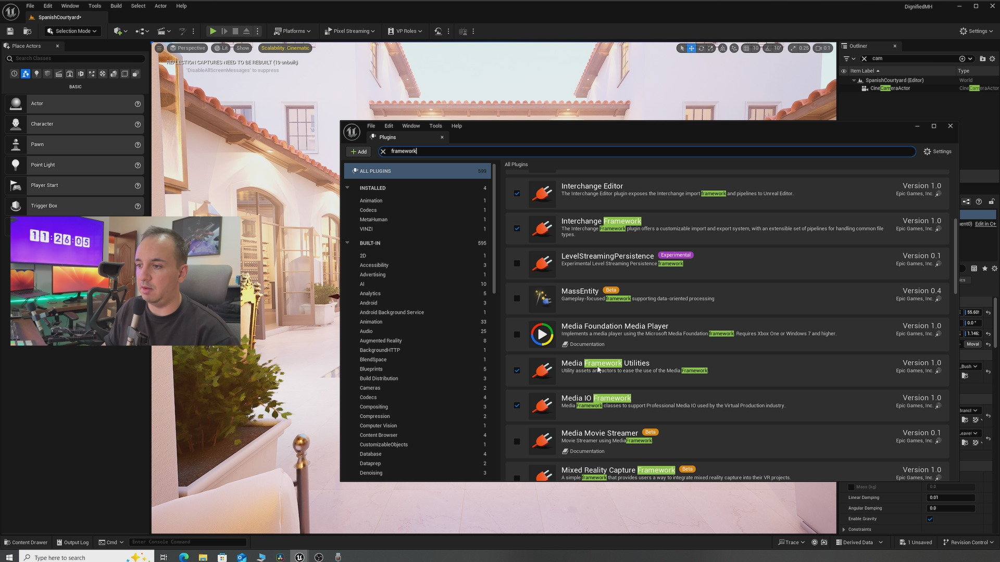
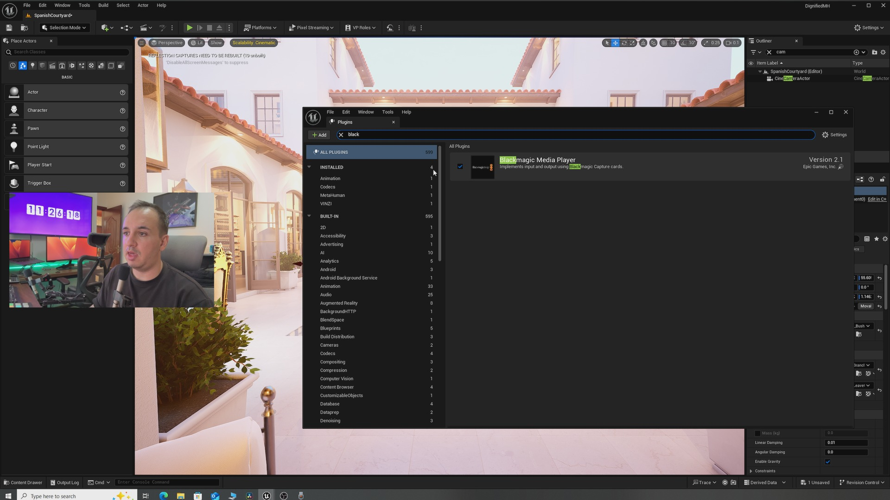
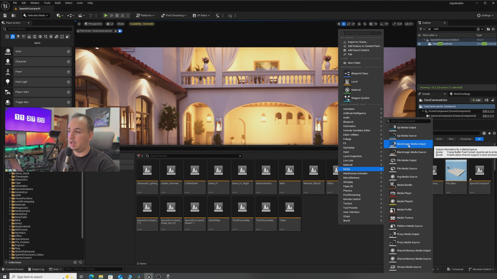
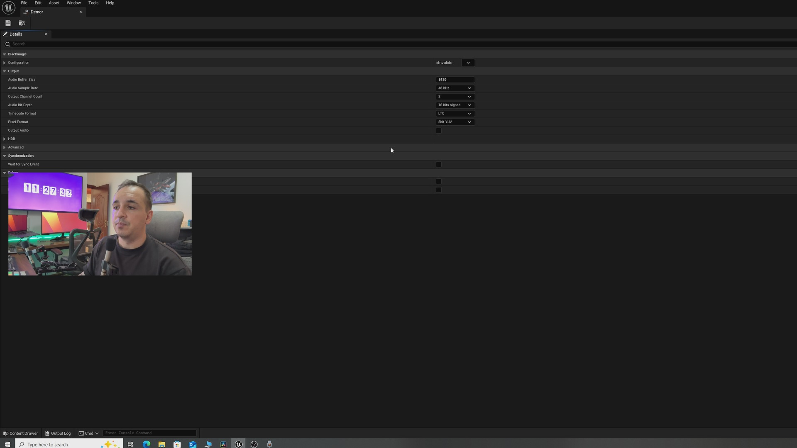
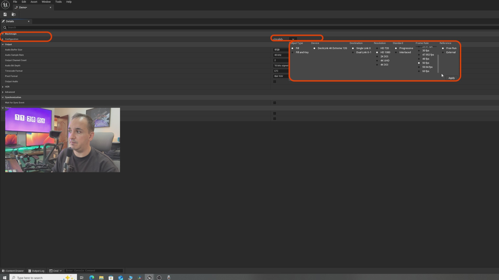
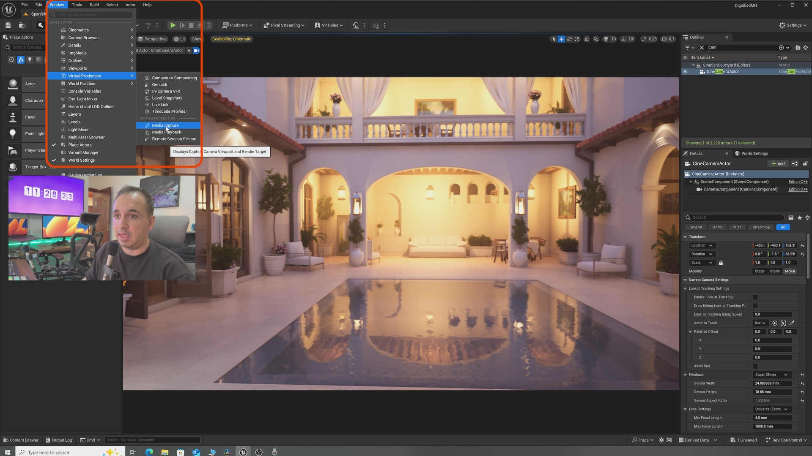

# 如何设置虚幻引擎 5 以与 Ultimatte HD Mini 配合使用

## 来源与状态

- 原始 URL：https://dev.epicgames.com/community/learning/tutorials/JW3z/how-to-set-up-unreal-engine-5-to-work-with-ultimatte-hd-mini

## 运行时分类

- 类型：图文教程
- 判断：API 未识别到核心视频信号，可整理正文约 5049 字符。

## 摘要

在本教程中，您将学习如何使用 Black Magic 的 Ultimatte HD Mini 设置虚幻引擎以进行色度键控

## 中文整理

### 概览

在本教程中，您将学习如何设置虚幻引擎以与 Ultimatte HD Mini 完美配合。首先，您将学习如何通过 HDMI 或 SDI 发送 UE5 相机的视图作为 Ultimatte First 的背景。由于 Ultimatte HD Mini 没有单独的填充和遮罩输出，因此您不会在虚幻引擎内发送人才素材。您所能做的就是让 UE5 作为您的 Ultimatte 的背景。整个堆肥过程在 Ultimatte 内完成

### 目录

1 设置 Ultimatte 和摄像头 2 UE5 设置：插件 3 UE5 设置：摄像头 4 UE5 设置：Blackmagic Media Output 5 UE5 设置：配置 Blackmagic Media Output 6 UE5 设置：媒体捕获 7 需要注意的重要事项 让我们开始...

### 1 设置 Ultimatte 和相机

以下是 Ultimatte HD Mini

下面是我的相机。无论你的相机的帧速率是多少，Ultimatte 的运行速度都是一样的。您的相机决定了 Ultimatte 的帧速率

通过 HDMI 将相机连接到 Ultimatte 的 FG（前景）输入（见下文）

您应该看到自己，但还没有可见背景，因为我们需要进行虚幻引擎设置部分

### 2 UE5 设置：插件

准备好场景后，转到“编辑>插件”中的插件窗口。您将需要 3 个插件：1 个媒体框架实用程序、2 个媒体 IO 框架。 3 Blackmagic 媒体播放器。启用它们（见下文）

### 3 UE5设置：相机

在此设置中，您将通过 SDI 或 HDMI 将摄像机视图发送到 Ultimatte。因此，请确保在 UE5 中添加相机并按照您想要的方式放置它

### 4 UE5 设置：Blackmagic 媒体输出

现在我们需要设置 Blackmagic Media Output，该框架将信息从 UE5 发送到 Ultimatte HD Mini。需要注意的是，对于此设置，您将需要一个支持 AJA 或 Blackmagic 的采集卡。我选择的采集卡是 Blackmagic Decklink 8k pro。在内容浏览器中，右键单击，然后将鼠标悬停在“Media>Blackmagic Media Output”上。单击它并将其命名为您想要的任何名称（见下文）

### 5 UE5 设置：配置 Blackmagic 媒体输出

现在我们需要配置输出。双击您刚刚创建并命名的媒体输出，您应该会看到如下所示的屏幕

如果这里的一切看起来令人畏惧，请不要担心。我们只需要调整一些设置“配置”选项卡的右侧有一个向下的箭头，单击它可以展开菜单。现在您必须选择与您的相机设置完全对应的设置。我的是1080p，50fps。 （见下文）

UE5 内的 Blackmagic Media Output 的配置必须与您的相机完全相同。如果分辨率和帧速率之间存在轻微的不匹配，您将看不到任何信号。这部分设置已完成，您无需在此干预任何其他设置。单击“保存”并关闭此窗口。

### 6 UE5 设置：媒体捕获

到目前为止还没有发生任何事情。我们现在需要做的是配置媒体捕获，将您的摄像机视图发送到 Ultimatte HD Mini。让我们这样做吧。首先单击“窗口>虚拟制作>媒体捕获”（见下文）

弹出窗口将如下所示（见下文），我们只需关注红色圆圈所示的选项卡。如图所示，展开朝下的箭头。该窗口中有很多可以展开的箭头，需要小心。这是最重要的设置窗口，因此请确保您的窗口看起来与我的相同，如下所示。在这里您需要设置/选择两件事：1 您的 UE 摄像头，2 Blackmagic Media Output（见下文）您不需要在此处设置任何其他内容。剩下要做的就是按此弹出窗口左上角的“捕获”按钮。当您按下它时，您的 UE5 摄像机将被发送到您的 Ultimatte HD Mini，您的窗口将如下所示（见下文）。如果任何设置不正确，您将看到红色标志而不是绿色标志（见下文）。如果是这种情况，您可能需要检查真实摄像机配置（如分辨率和帧速率）与 Blackmagic Media Output 框架中的设置以及电缆和采集卡连接之间的差异。由于我的设置正确，我的 Ultimatte HD Mini 将接收 UE5 信号，现在我将拥有背景，而不是之前的黑屏。 （见下文）

### 7 重要注意事项

- 当您单击虚幻引擎一侧的“捕获”时，您的帧速率可能会下降，因为它会渲染您的场景两次。最佳实践是禁用视口。 - Ultimatte HD Mini 还接受图片而不是实时视频源。这意味着，如果您的计算机无法处理此媒体捕获并且帧速率太低，您可能需要选择渲染 UE5 背景的单个图像并将其加载到 Ultimatte HD Mini 上。然而，在执行此操作之前，请确保您使用实时媒体捕获，以确保您的背景高度、视野等……在渲染图像之前与真实相机的一致。

