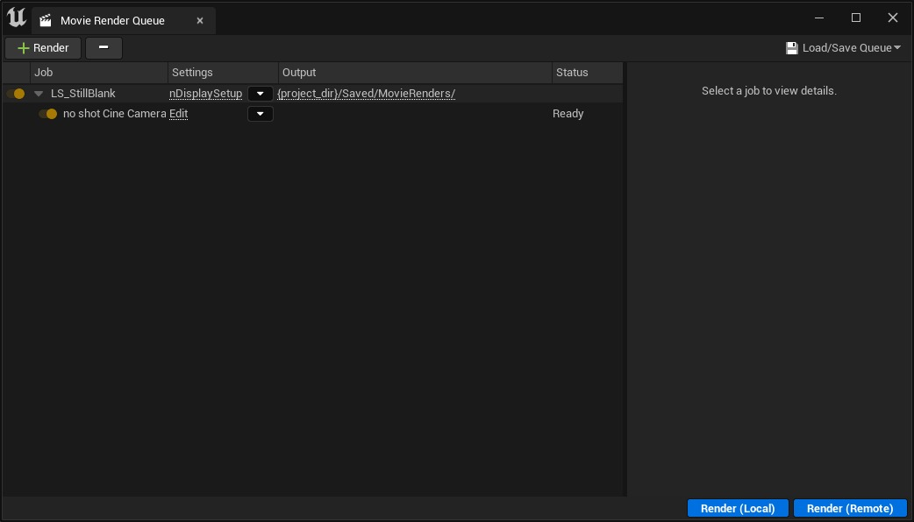
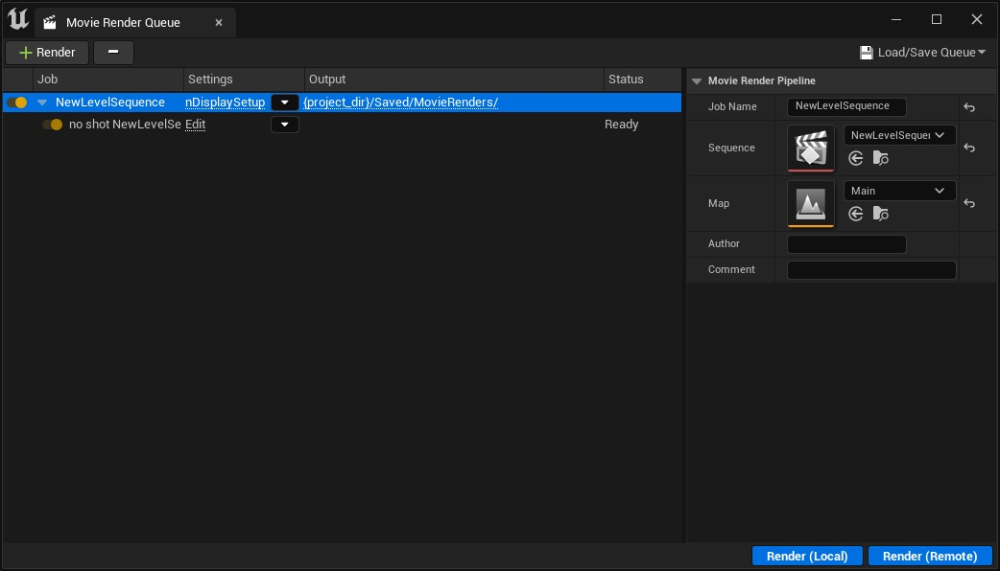
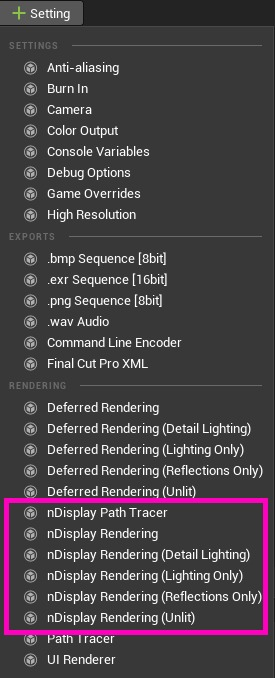
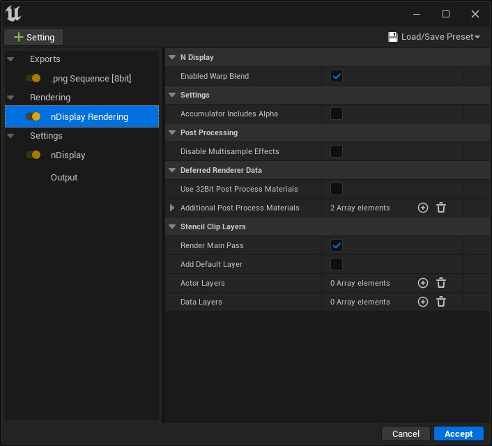
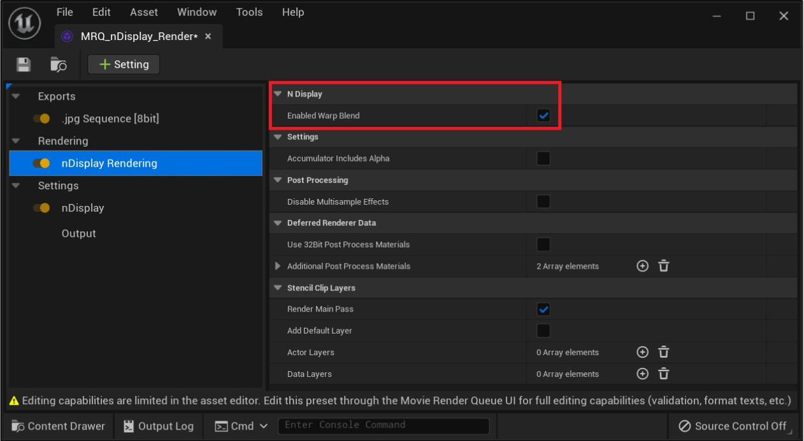
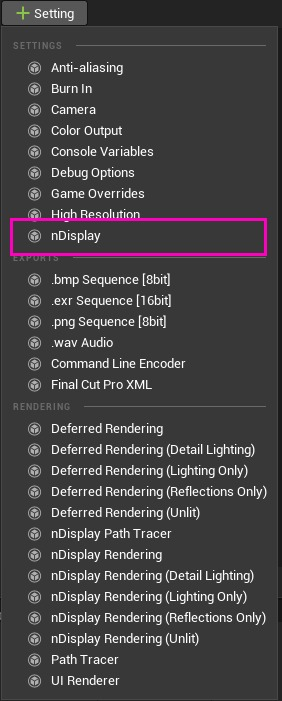
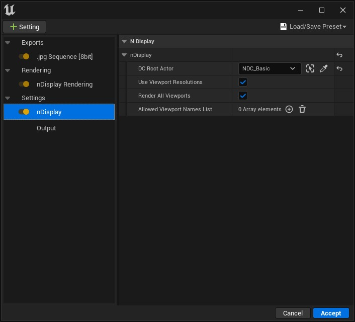
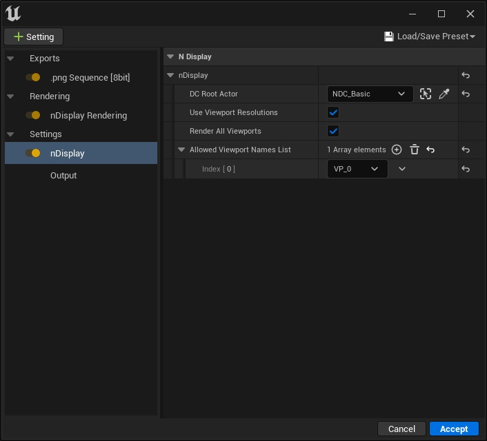
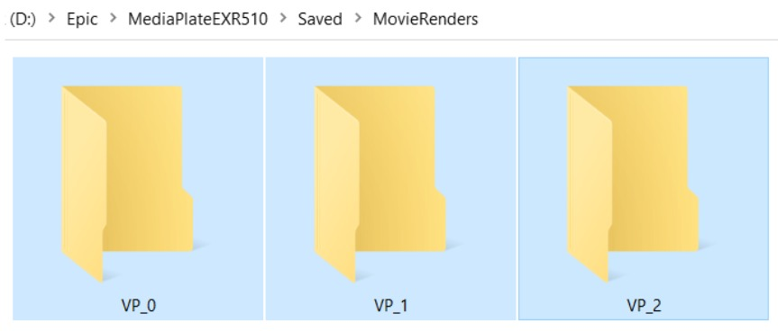

# 使用 MRQ 导出 nDisplay 渲染

## 来源与状态

- 原始 URL：https://dev.epicgames.com/community/learning/tutorials/9VX5/unreal-engine-export-ndisplay-renders-using-mrq

## 运行时分类

- 类型：图文教程
- 判断：API 未识别到核心视频信号，可整理正文约 3457 字符。

## 摘要

从虚幻引擎 5.1 开始，影片渲染队列 (MRQ) 现在可以将选定的 nDisplay 视口渲染到磁盘，以进行高保真离线或备份内容播放。 Unreal Engine / nDisplay 与离线渲染工作流程的集成有多个用于现场活动、ICVFX 和 VR CAVE 应用程序的用例。然后，生成的文件可以重新压缩为任意编解码器或格式，这些编解码器或格式具有高质量盘播放所需的位深度。本教程将介绍如何使用 MRQ 导出高质量 nDisplay 视口渲染的基础知识。

## 中文整理

### 概览

*本教程适用于那些精通 nDisplay 并且熟悉蓝图的人。*

### 概述

本教程将快速引导您完成设置 MRQ 来渲染 nDisplay 视口的步骤，从而将高质量图像生成到磁盘。这并不是一个全面的教程，而是一个快速浏览该过程的过程。

### 设置关卡顺序

影片渲染队列需要关卡和关卡序列才能发挥作用。我们已经有了 nDisplay 关卡，只需要一个关卡序列即可使用 MRQ 进行渲染。如果您已经在 nDisplay 墙的动画中使用关卡序列，请继续使用它。否则，您将需要提供一份。默认情况下，UE 提供名为 LS_StillBlank 的关卡序列，可在 MRQ 中用于渲染静止图像或 nDisplay 视口的短 30 帧序列。但是，请注意，此内置关卡序列的长度限制为 30 帧，如果您只需要单帧静态图像，则需要启用“使用自定义播放范围”并指定自定义开始帧和自定义结束帧。如果您希望生成更长的帧序列，您可以在项目中创建一个空的关卡序列，以使用 MRQ 来指定帧序列长度（如果您愿意）。您不需要向此序列添加任何演员 - 除非您希望出于动画目的。以下是在 MRQ 中添加为作业的每个示例。

### MRQ 设置设置

接下来，在 MRQ 中，我们需要指定输出格式、**nDisplay Rendering** 选项和** nDisplay** 设置**。**

### n显示渲染

nDisplay 渲染选项应该是自我解释的 - 因为它们与其他渲染选项类似。选择您喜欢的 nDisplay 渲染器的 Deferrred 或 Path Tracer 版本。

存在一些选项可供您选择，例如**启用变形混合**选项，该选项可在渲染时有效应用或禁用 nDisplay 变形过程。

### n显示设置

还将 nDisplay 设置添加到 MRQ 作业设置中。在 nDisplay 设置中，指定 **显示集群 (DC) 根 Actor**，它将为 MRQ 提供必要的 nDisplay 配置和要渲染的视口。您还可以选择**使用视口分辨率**和**渲染所有视口**。

如果您想缩小要渲染的视口范围，可以在“允许的视口名称列表”选项中按名称指定它们（如果此列表添加了一个或多个视口，则渲染所有视口将被忽略）。

### 渲染

将任何导出格式或您希望的其他 MRQ 设置添加到 MRQ 作业设置中。准备好后，只需从 MRQ 面板启动渲染即可。生成的图像将输出到磁盘。

### 输出文件系统

生成的文件、图像或视频将存储在 Saved\MovieRenders 下以所选 nDisplay 视口命名的文件夹中。此时需要将 {camera_name} 添加到输出路径中，以便为每个视口提供子文件夹。

