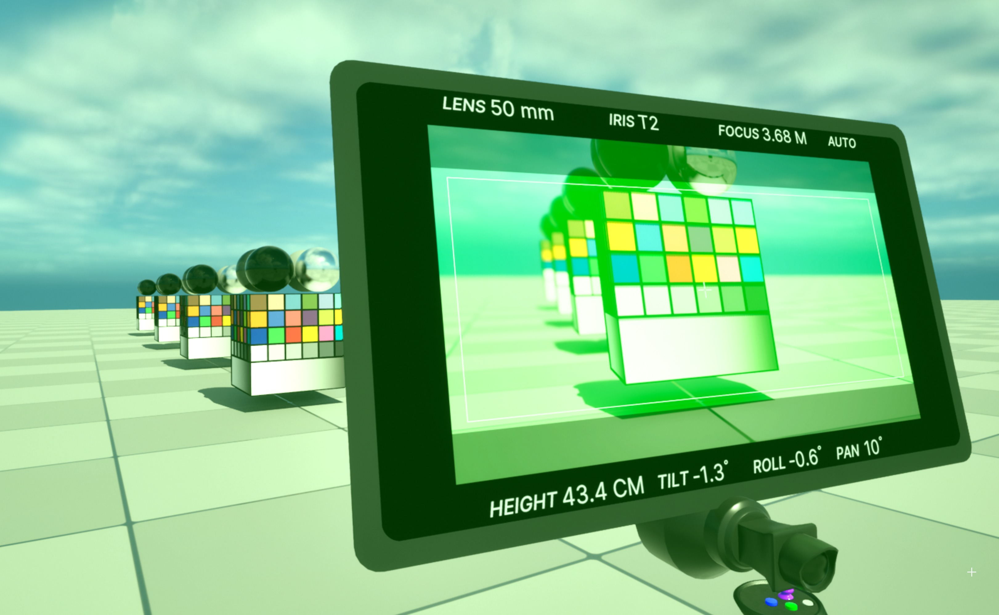
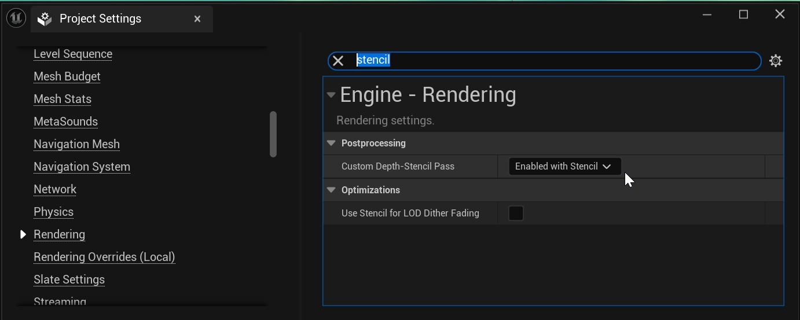
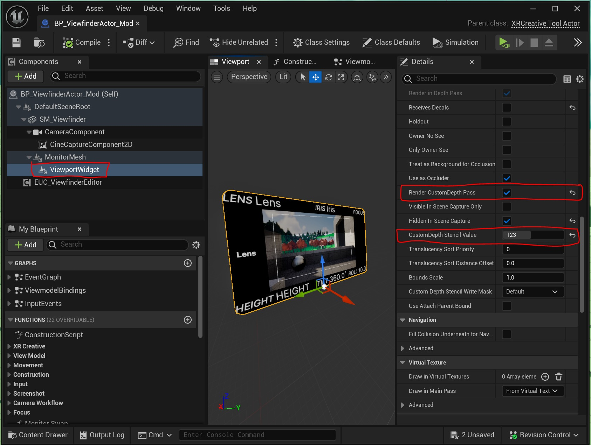
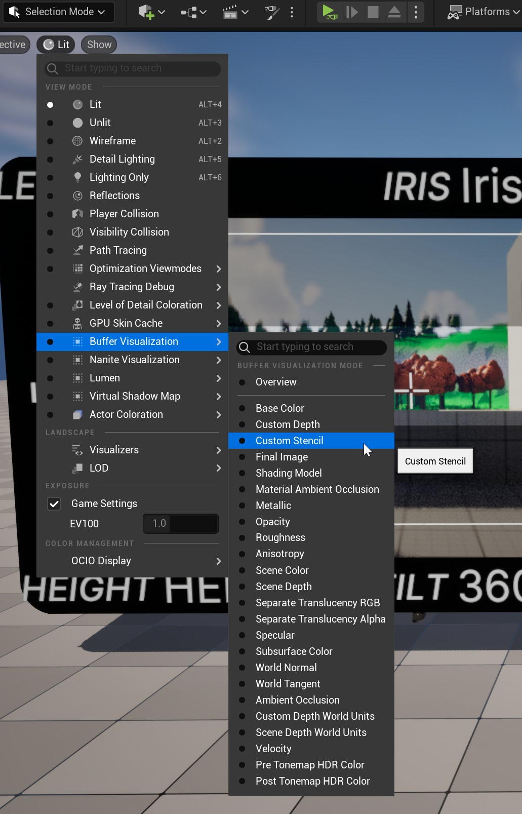
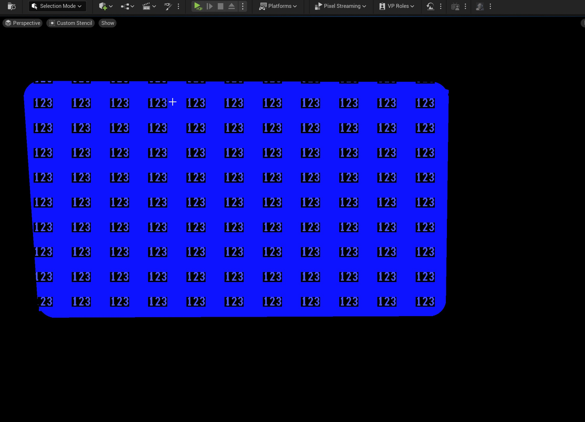
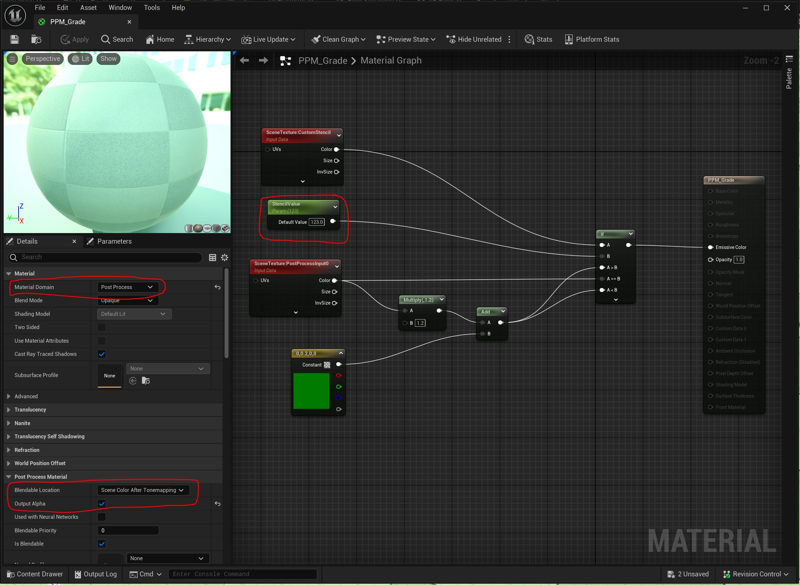
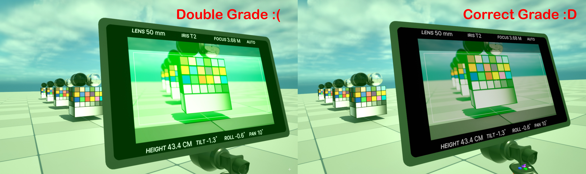
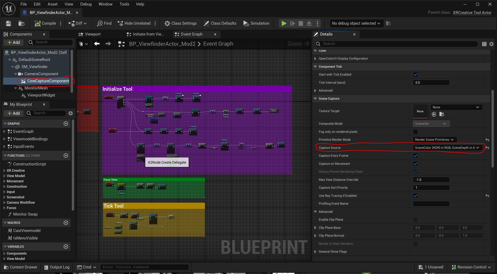
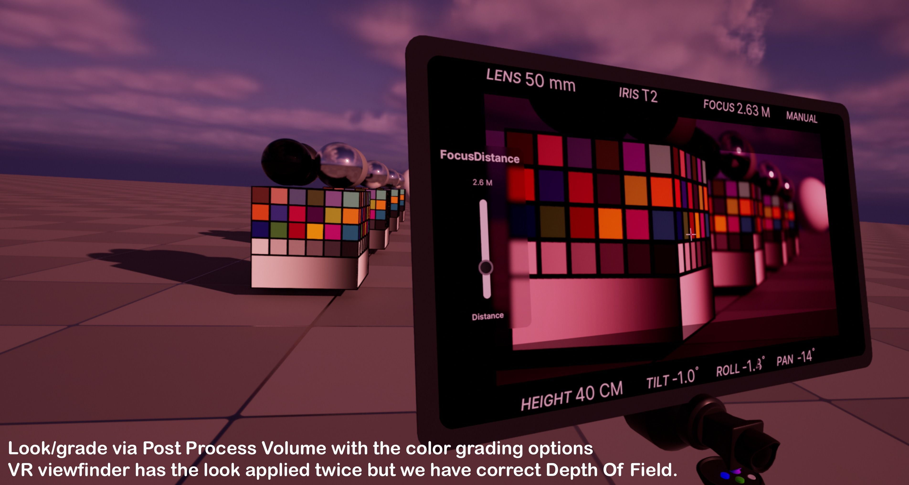
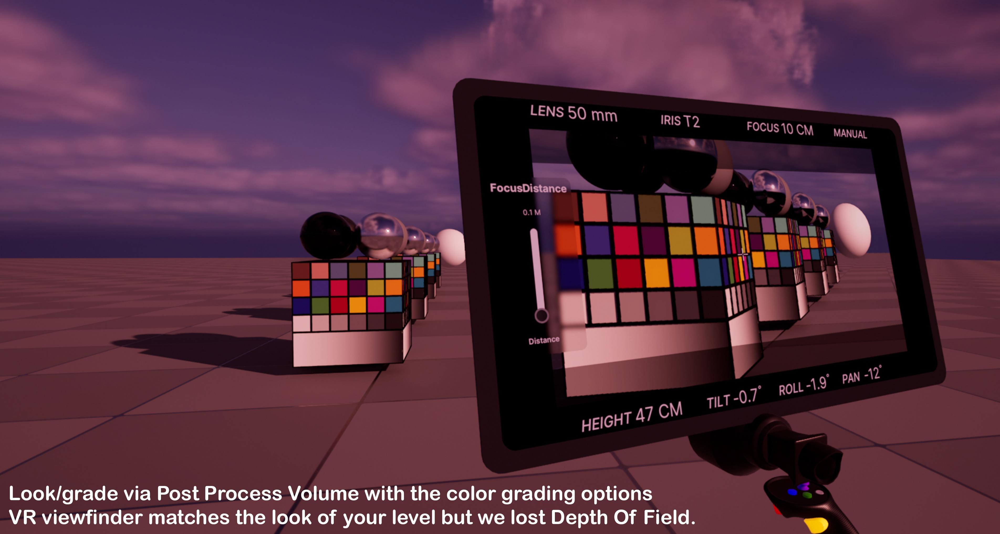

# 如何正确应用 Virtual Scouting 2.0 级别的外观

## 来源与状态

- 原始 URL：https://dev.epicgames.com/community/learning/tutorials/qX0Y/unreal-engine-how-to-apply-correctly-a-look-to-your-level-for-virtual-scouting-2-0

## 运行时分类

- 类型：图文教程
- 判断：API 未识别到核心视频信号，可整理正文约 2725 字符。

## 摘要

本教程介绍如何在使用 Virtual Scouting 2.0 取景器时正确应用外观/等级到您的关卡。

## 中文整理

### 概览

如果您通过关卡后处理体积中的后处理材质将外观/等级应用到关卡，则当您使用 Virtual Scouting 2.0 取景器时，您将看到它应用了两次相同的外观/等级。

这是一种可以防止这种情况发生的方法。在开始之前，本教程使用了一些[在另一篇文章中分享的知识](https://dev.epicgames.com/community/learning/tutorials/OpB3/unreal-engine-custom-viewfinder-exposure-virtual-scout-2-0)。确保你先看一下那个。当我提到“**BP_ViewfinderActor_Mod**”时，您可以了解我如何创建该蓝图。转到您的项目设置。在**引擎 -> 渲染 -> 后处理**下，将 **自定义深度模板通道** 设置为 **通过模板启用**。

打开您的自定义“**BP_ViewfinderActor。”** 在这种情况下，我将选择并打开“**BP_ViewfinderActor_Mod。**” 在“**ViewportWidget**”组件上，**打开**“**渲染自定义深度通道**”，并在“**自定义深度模板值**”上分配一个从 1 到 255 的值。我将使用 123。

要验证其是否有效，请将“**BP_ViewfinderActor_Mod**”添加到您的关卡中，并在视图模式菜单上启用**缓冲区可视化 -> 自定义模板**选项。

自定义模板缓冲区视图显示“**BP_ViewfinderActor_Mod**”具有所需的值“**123**”。任何没有自定义深度通道的东西都会是黑色的。

验证后，您将返回到 Lit 视图模式并创建新材质。我将其命名为“**PPM_Grade**”，并将材质域更改为“**Post Process**”。您将需要创建一个** If 条件**，以便当条件不匹配时，只要将“后处理体积”设置为未绑定，它就会将“外观”应用于关卡中的所有对象，但“**自定义深度模板值**”=123 的任何对象除外。

现在，您的虚拟侦察取景器将不会获得两次外观/等级。

### 如果您通过后期处理体积颜色分级应用外观/等级，则会出现问题。

如果您通过后期处理体积颜色分级应用外观/等级，则自定义深度模板通道技术将不起作用。我们正在研究一种解决方案，以便 VR 取景器不会获得双倍的外观/等级，无论您如何将其应用到您的关卡。这将在 UE 5.5 中提供。同时，如果您使用颜色分级选项通过后期处理体积应用外观/分级，解决方法是更改​​修改后的“**BP_ViewfinderActor_Mod**”的 CineCaptureComponent。在 CineCaptureComponent 中，转到 Capture Source 并将其设置为“SceneColor (HDR)”

这将修复 VR 取景器上的双重外观/等级，但您将失去取景器上的景深（散焦）。

