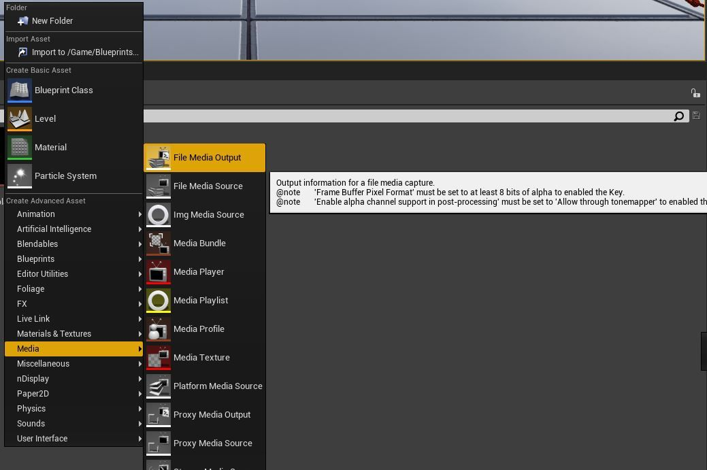
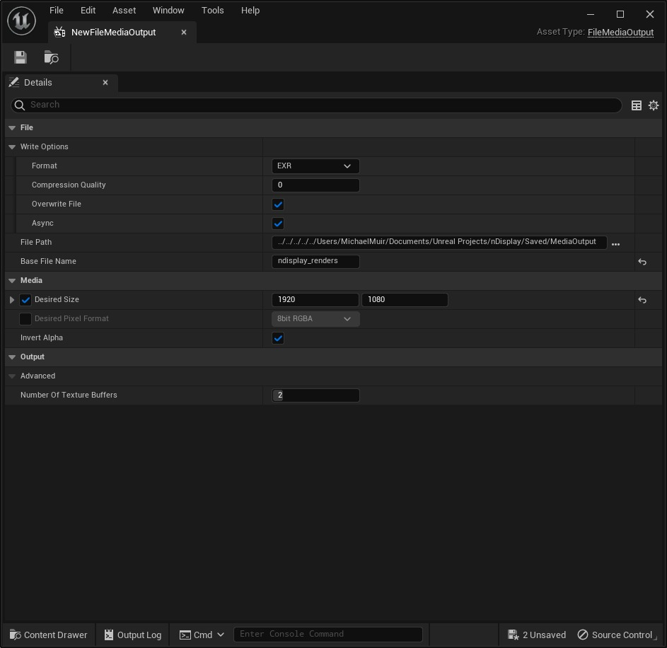
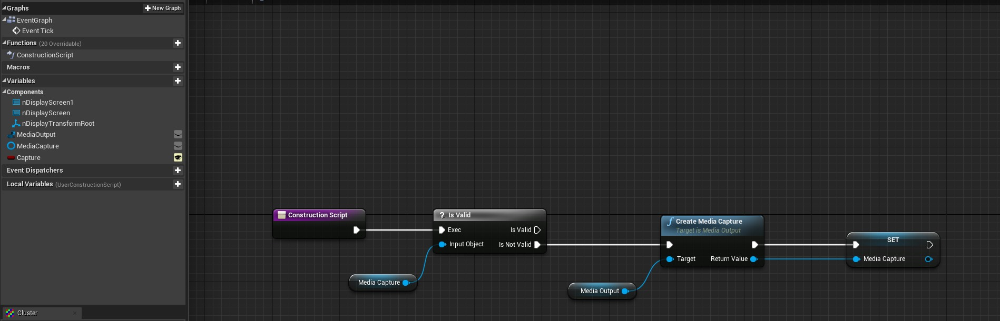
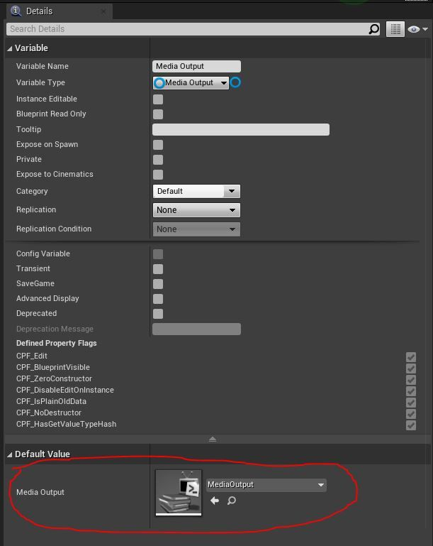
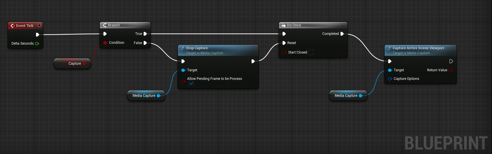

# 如何使用媒体捕获将 nDisplay 视口写入磁盘

## 来源与状态

- 原始 URL：https://dev.epicgames.com/community/learning/tutorials/YD46/unreal-engine-how-to-write-ndisplay-viewports-to-disk-using-media-capture

## 运行时分类

- 类型：图文教程
- 判断：API 未识别到核心视频信号，可整理正文约 6029 字符。

## 摘要

有关如何使用媒体捕获从 nDisplay 视口将媒体写入磁盘的操作方法。

## 中文整理

### 概览

*本教程适用于那些精通 nDisplay 并且熟悉蓝图的人。*

### 5.1更新！通过 MRQ 导出 nDisplay 渲染

从虚幻引擎 5.1 开始，影片渲染队列 (MRQ) 支持将 nDisplay 视口本机渲染到磁盘 - 无需使用媒体捕获来执行此操作。 nDisplay 配置文件参考现在可用于电影渲染队列，以便用户可以将选定的 nDisplay 视口渲染到磁盘以进行高保真离线或备份内容播放。这将有利于虚幻引擎/nDisplay 与离线渲染工作流程的集成，适用于现场活动、ICVFX 和 VR CAVE 应用程序等多种用例。然后，生成的文件可以重新压缩为任意编解码器或格式，这些编解码器或格式具有高质量盘播放所需的位深度。建议使用 UE 5.1 或更高版本的任何人使用此方法。有关使用 MRQ 导出 nDisplay 视口渲染的更多信息，请参阅以下链接： - [使用 MRQ 导出 nDisplay 渲染](https://dev.epicgames.com/community/learning/tutorials/9VX5/unreal-engine-export-ndisplay-renders-using-mrq)

### 使用媒体捕获的旧方法

本节介绍如何使用旧版本虚幻引擎（包括 UE 4.27 和 UE 5.0）的媒体捕获将 nDisplay 视口导出到磁盘。对于 UE 5.1 或更高版本，我们建议使用 MRQ 渲染 nDisplay 视口。 --- 本教程将向您展示如何从 nDisplay 视口生成图像并使用媒体捕获框架将其输出到磁盘。要开始使用，请执行以下操作： 1. 在项目中启用“**Media Framework Utilities**”插件。重新启动发动机。 2. 从内容浏览器的鼠标右键菜单创建“**媒体 -> 文件媒体输出**”Uasset。 3. 双击新创建的文件媒体输出 UAsset 以显示设置。 1. 指定“**文件路径**”和“**基本名称**”以及像素格式。确保磁盘上存在文件路径输出目录 - 它不会自动生成目录结构。 2. 通过启用“**所需尺寸**”和“所需像素格式”选项并相应地指定详细信息，指定“所需尺寸”和“所需像素格式”。如果要渲染为“EXR”格式 - 请务必为像素格式指定“Float RGBA”。 4. 在“文件媒体输出设置”窗口中点击“保存”。

现在我们将进入蓝图...创建一个新的或修改现有的蓝图 Actor（确保将其放入关卡中）： 1. 从 **ConstructionScript ** 拖动一个连接并添加一个“**？ Is Valid**”节点。 2. 将连接从“**？是否有效**”节点的“**输入对象**”拖出，然后选择“**提升到变量**”。将新变量命名为“**媒体捕获**”。将变量类型更改为“**媒体捕获 -> 对象引用**”。 3. 将新变量拖到蓝图中并选择“**设置媒体捕获**”。把它放在一边，我们稍后再连接。 4. 在变量面板中，创建一个新变量并将其命名为“**媒体输出**”。将变量类型更改为“**媒体输出 -> 对象引用**”。 5. 编译蓝图。在新创建的“**媒体输出**”变量的详细信息面板中，将“媒体输出”的默认值设置为您之前创建的文件媒体输出 UAsset。 6. 将新变量拖到蓝图中，然后选择“**获取媒体输出**” 7. 将连接拖离“**媒体输出**”节点，并创建一个新的“**创建媒体捕获**”节点。将其连接到“**？Is Valid**”节点的“**Is Not Valid**”输出的执行引脚。 8. 将“**Create Media Capture**”节点的“Exec”引脚和“Return Value”引脚连接到我们之前创建的“**Set Media Capture**”节点的“Exec”引脚和“Media Capture”引脚。 9. 保存并编译。

对于第二部分 - 继续修改相同的蓝图，但对于蓝图的“Event Tick”部分： 1. 在“**Event Tick**”事件蓝图中，将连接拖离执行引脚并添加“**Branch**”节点。 2. 从“**Branch**”节点中，从条件引脚拖动连接并选择“**升级到变量**”。 3. 将变量重命名为“**Capture**”，并将其设为公共或实例可编辑。 4. 将“媒体捕获”变量拖到蓝图中，然后选择“获取媒体捕获”两次 - 一次用于“停止捕获”，一次用于“捕获活动场景视口”。 5. 从一个“媒体捕获”节点中，拖出输出引脚并从菜单中选择“**停止捕获**”。从另一个“媒体捕获”节点，拖出输出引脚并选择“**捕获活动场景视口**”。 6. 创建一个“Do Once”节点。该节点将确保我们仅启用“捕获活动场景视口”一次，而不是在第一个刻度上启用，而不是在每个刻度上启用。 7. 从“**Branch**”节点上的“**True**”引脚拖动连接，并将其连接到新创建的“Do Once”节点。 8. 对“Do Once”节点执行相同操作，并将其连接到“**Capture Active Scene Viewport**”节点。 9. 从“**Branch**”节点上的**“False**”引脚拖动连接，并将其连接到新创建的“**Stop Capture**”节点。 10. 从“Stop Capture”节点的“Exec”输出中拖动另一个连接，并将其连接到“Do Once”节点的“Reset”执行引脚。 11. 在“**停止捕获**”节点上，启用“**允许处理挂起帧**” 12. 在“**捕获活动场景视口**”节点上，用鼠标右键单击“**捕获选项**”并选择“**分割结构引脚**”。这会将所有捕获选项公开为节点上的引脚。 13.保存并编译。 14. 将蓝图拖到关卡中，将其添加到关卡中。

只需记住几件事。场景将使用不同的视口进行多次渲染 - 除非项目每次都完美运行，否则很可能会出现分歧。拥有同步锁相和锁定的性能有助于稳定输出。此外，在本例中，它将在每个时钟周期写入一次帧。如果您喜欢较慢的速度，则需要添加一个计时器，以便仅按照您想要的速度触发或执行蓝图的其余部分。

