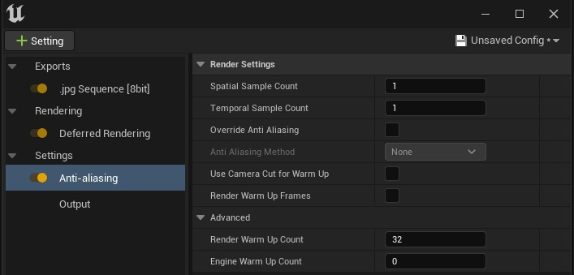
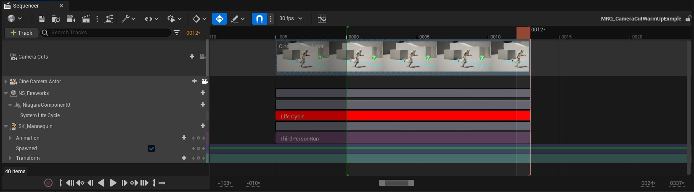

# 影片渲染队列、预热和第一帧问题

## 来源与状态

- 原始 URL：https://dev.epicgames.com/community/learning/tutorials/l4OR/unreal-engine-movie-render-queue-warmup-and-first-frame-issues

## 运行时分类

- 类型：图文教程
- 判断：API 未识别到核心视频信号，可整理正文约 7223 字符。

## 摘要

概述如何使用影片渲染队列中的不同预热功能来确保渲染在第一帧上以正确的视觉效果开始。

## 中文整理

### 概述

由于虚幻引擎的实时特性，电影渲染的第一帧可能会给内容创建者带来许多挑战。虚幻引擎实现这些实时效果的方法之一是将工作分散到多个帧上，并重用前一帧中的信息。这给每个摄像机剪辑的第一帧带来了问题，因为没有前一帧可以从中获取此信息。为了帮助克服这个问题，MRQ 在每个作业的“抗锯齿”设置中提供了各种预热选项。本文档介绍了不同的设置以及为什么您可以使用其中一种而不是另一种。对于大多数设置，建议使用引擎预热计数或使用相机剪切进行预热并启用渲染预热帧。渲染预热计数是一项旧功能，在大多数情况下可以设置为 0。

### 何时使用热身

发动机中的某些系统需要在第一机架上进行特殊考虑。其中许多系统需要渲染场景以创建“场景历史记录”，以累积先前渲染帧的工作。示例： - 粒子模拟 - 布料模拟 - 流明全局照明 - 运动模糊 - 时间 AA/时间超分辨率

### 热身选项

使用默认设置，影片渲染队列将尝试修复尽可能多的问题，而不需要用户提供任何额外数据，但是有些问题在没有额外数据的情况下无法修复。为了进一步控制 MRQ，有： - 渲染预热计数（整数） - 传统，将帧发送到 GPU，不播放序列。 - 引擎预热计数（整数）- 评估序列的第一帧并为指定帧勾选引擎。默认情况下不发送到 GPU - 渲染预热帧（布尔值）- 渲染预热计数的替换。告诉 MRQ 将引擎预热计数或摄像机切换预热发送到 GPU。 - 使用摄像机剪切进行热身（布尔值）- 使用摄像机剪切轨道在开始帧之前播放序列。默认情况下不发送到 GPU。

### 渲染预热计数

这用于解决仅渲染效果，例如 TAA/TSR。这将在正常渲染过程开始创建图像历史记录之前提交额外数量的渲染（默认为 32）。这是一个遗留选项，由于 Lumen 的引入，不再推荐。

### 发动机预热计数

这用于解决不依赖于序列播放的仅 CPU 预热系统，例如 CPU 粒子和布料。随着 GPU 粒子和其他渲染功能的不断进步，建议您将此功能与渲染预热帧结合使用。 **注意：**引擎预热计数在序列的第一帧之前不需要额外的数据，而是评估序列的第一帧，并在序列暂停的情况下勾选引擎指定的帧数。不幸的是，如果在序列开始之前没有数据，许多问题就无法解决。例如，一个穿着布料的动画角色在奔跑时会从身体中发射粒子。使用引擎预热帧，角色将仅评估第一帧上的姿势。这意味着布料会沉降，并且粒子会从该静态姿势中发射出来。当实际渲染开始时，运行的动画也会开始，这会导致意外的布料模拟和一团粒子，而不是跟随它们的轨迹。为了解决这个问题，MRQ 提供了一种在开始前逐帧评估序列直至第一帧的方法，就像它们是关卡序列的一部分一样，而无需将它们写入磁盘。这允许您将内容放置在第一帧之前，例如角色运行到“起始”姿势的额外帧。这需要在序列的起始帧之前提供准确的数据才能正常工作。建议您将其与渲染预热帧布尔值结合使用。

### 渲染预热帧

指定引擎预热计数或使用“使用相机剪切进行预热”帧时的相机剪切将在 GPU 上渲染。出于性能原因，默认情况下它们会跳过 GPU 上的渲染。此选项强制这些帧在 GPU 上渲染，以便它们有助于基于 GPU 的效果。随着流明全局照明、虚拟纹理和 Nanite 的引入，现在建议您始终渲染预热帧以使这些系统稳定下来。

### 使用相机剪辑进行热身

告诉引擎使用序列资源进行预热，允许第一帧之前的数据贡献场景历史记录。这需要 1. 将摄像机剪辑创作为单个镜头，而不是单个摄像机剪辑轨道中的多个剪辑。相机切口需要延伸，如果现有的相机切口部分与该延伸部分重叠，则会对其产生干扰。使用镜头可以让我们单独评估它们。 2. 镜头中的镜头切换在镜头开始之前延伸。这指定了我们应该使用多少帧来进行预热，因此您可以在不需要太多的镜头上使用较短的预热时间。 3. 动画和变换在镜头开始之前延伸。如果物体没有正确的运动，或者在热身时没有处于正确的位置，则运动模糊和其他模拟也将不正确。 4. 生成物也会在这段时间生成。

在序列开始之前将镜头剪辑和动画延长一帧可能就足够了，但也可能需要几帧，因此建议尝试将序列延长几帧。

### 推荐的 MRQ 设置

对于大多数用例，我们建议使用相机剪切预热和渲染预热帧。即选中以下复选框： - 使用相机剪切进行预热 - 在抗锯齿设置中渲染预热帧。这允许序列中的数据对场景历史做出贡献，并且场景历史可以在 GPU 上累积第一帧的数据。使用摄像机剪切进行热身将从摄像机剪切部分的开头（而不是从序列的开始时间）评估镜头。在此期间它也会通过相机进行查看。渲染预热帧将在 GPU 上渲染帧，这对于时间累积非常重要。从摄像机开始到序列开始的所有帧都不会写入光盘，因此您的渲染仍将与镜头的时间匹配。

### 笔记

当禁用“使用相机剪切进行热身”时，MRQ 将尝试通过向后评估来模拟第一帧上的运动模糊。这意味着它将评估帧 0，然后评估帧 1，然后再次评估帧 0。这适用于大多数系统，但可能会导致其他系统（例如布料）出现问题。启用“使用相机剪切进行热身”功能将禁用此模拟运动模糊，但在每次拍摄开始之前您必须至少拥有一帧数据。 MRQ 的时间样本计数功能也会在第一帧之前进行评估，因此最好使用至少一个附加帧来创作内容。 - [使用 Niagara 实现线性内容](https://dev.epicgames.com/community/learning/tutorials/PdDR/unreal-engine-fortnite-using-niagara-for-linear-content)

## 相关链接

- [Using Niagara for Linear Content](https://dev.epicgames.com/community/learning/tutorials/PdDR/unreal-engine-fortnite-using-niagara-for-linear-content)

