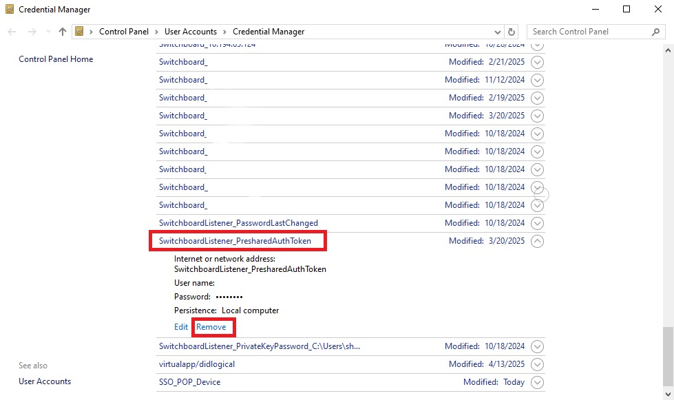
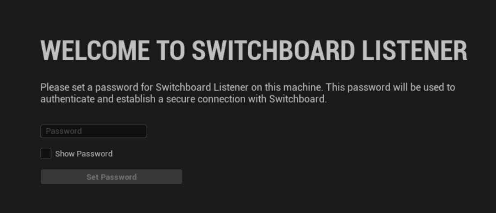

# 重置总机监听密码

## 来源与状态

- 原始 URL：https://dev.epicgames.com/community/learning/tutorials/Ekye/unreal-engine-resetting-the-switchboard-listener-password

## 运行时分类

- 类型：图文教程
- 判断：API 未识别到核心视频信号，可整理正文约 620 字符。

## 摘要

在本教程中，我们将介绍如何重置 Switchboard Listener 密码。

## 中文整理

### 概览

应许多高度敏感制作的要求，我们在虚幻引擎 5.4 中添加了与 Switchboard 更安全的连接的功能。用密码保护任何传入连接变得非常容易。但如果您需要重置密码怎么办？在这个简短的教程中，我将向您展示如何做到这一点！在您的 PC 上，转到***凭据管理器***r 中的 Windows 凭据。将会有一个***SwitchboardListener_PresharedAuthToken***。删除它并重新启动 SBL。

然后您将能够创建一个新密码。

