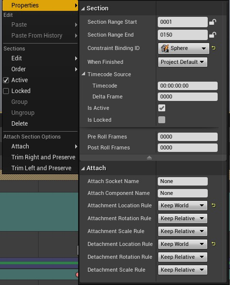
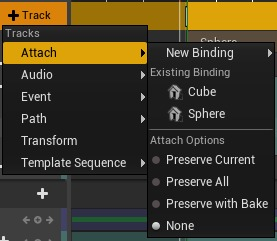
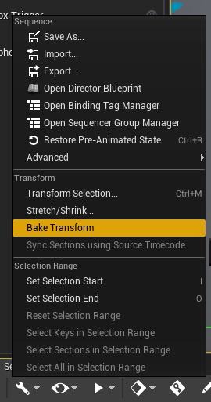

# 音序器附加轨道

## 来源与状态

- 原始 URL：https://dev.epicgames.com/community/learning/knowledge-base/pqPG/unreal-engine-sequencer-attach-tracks

## 运行时分类

- 类型：图文教程
- 判断：API 未识别到核心视频信号，可整理正文约 4066 字符。

## 摘要

文章由 Austin C 撰写。在创作序列时，利用虚幻的附件系统可能会很有用，但有时无法在序列之前创建附件，例如使用 Spa…

## 中文整理

### 概览

*由 [Austin C.](https://dev.epicgames.com/community/profile/L4b2/PiranhaSauce) 撰写的文章* 在创作序列时，利用虚幻的附件系统可能会很有用，但有时无法在序列之前创建附件，例如使用 Spawnables，或者如果存在一些时间因素来决定何时创建附件。 Sequencer 提供了 Attach Tracks，而不是编写对象附加的脚本，它将使用相同的机制 (USceneComponent::AttachToComponent) 自动执行附加和分离。在序列不会为对象的变换设置动画的简单情况下，这会按预期工作。我们为这些部分提供附加和分离规则，以便用户可以控制对象位置的影响方式。

附件规则具有三个选项： - 保持相对（默认）：新父级的变换被视为现有变换的原点。对于位置，这会移动对象，但保持其与父对象的偏移（变换被添加到一起）。 - 保留世界：被附加的对象将重新计算其变换，以便其与其父对象的相对变换将其放入与附加之前相同的世界空间中。对于位置，这会将对象保持在同一位置。 - 捕捉到目标：该对象将继承其新父对象的变换。对于位置，这会将对象移动到新的父对象。这些可以分别应用于位置、旋转和缩放。分离规则有两个选项： - 保持相对（默认）：世界原点将被视为现有相对变换的原点。如果您为附件设置了“保持相对”，这将撤消该操作，因此对于位置，这会将对象移回其原始世界位置（再次减去父级的变换）。 - 保持世界：将重新计算对象的世界变换，使对象保持在同一位置。但是，当序列对对象的变换进行动画处理时，两个系统将相互对抗，并且这些规则将无法按预期工作，因为两者都在设置对象的变换。变换部分将直接为对象的变换设置动画，附件将更改该变换的坐标空间。如果没有对坐标空间移动进行反动画处理，变换部分将不会显示正确。我们支持在添加附加轨道时自动对变换进行反动画处理。这些可以从添加菜单访问，并具有可用的附加选项： - 保留当前：将关键点添加到与附加轨道的开头相对应的变换部分，这将保留对象的世界空间位置。 - 保留全部：为父对象变换中的每个键添加键，以保留整个附件中的世界空间。还将修改现有关键点以保留子对象上已有的任何动画。 - 保留烘焙：烘焙每帧关键点以保留子对象的世界空间变换和动画。 - 无（默认）：添加新附加轨道时不添加任何关键点。

您也可以手动创作序列来避免这种情况。如果您设置了附加轨道，然后为变换设置动画，则您将在已经考虑附件的情况下制作动画。一种策略是在附件持续时间内使用不同的转换部分。这将允许您在整个序列中设置变换动画，并拥有专门为附件定制的单独变换部分。另一种策略是设置附件，然后将其烘焙为转换，以避免系统相互冲突。一旦获得了满意的组合动画，您就可以从音序器工具栏中的“操作”菜单（扳手图标）烘焙变换。您需要选择绑定。

