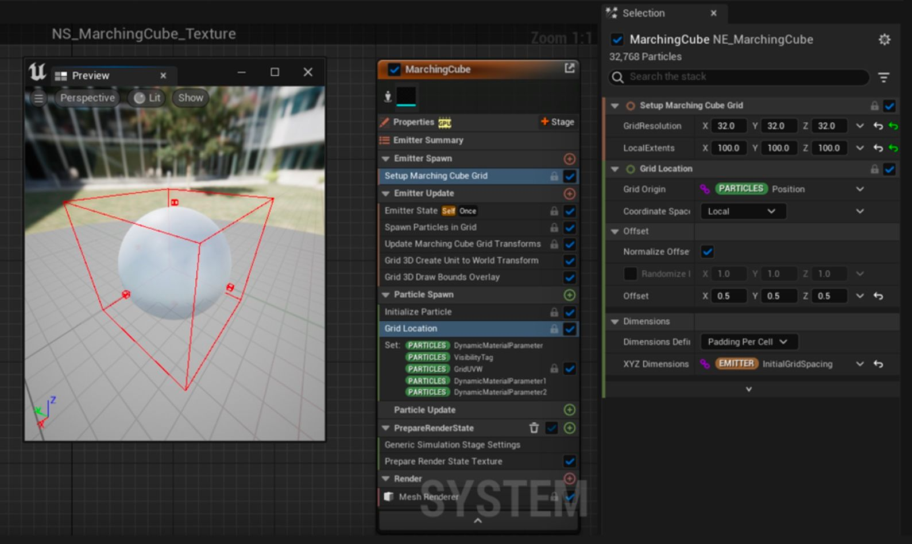
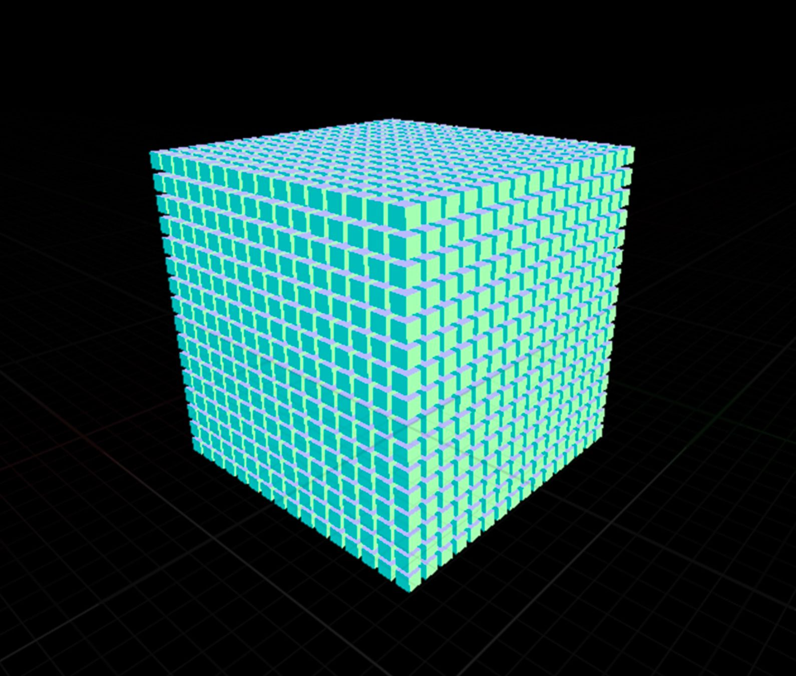
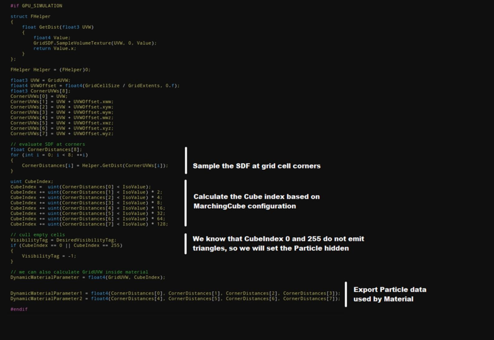
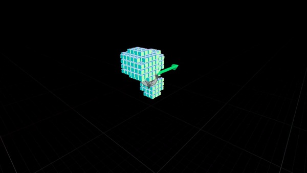
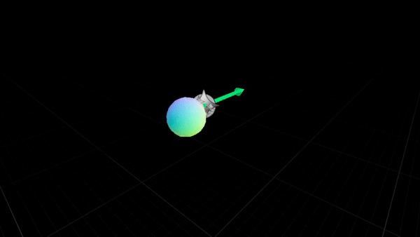
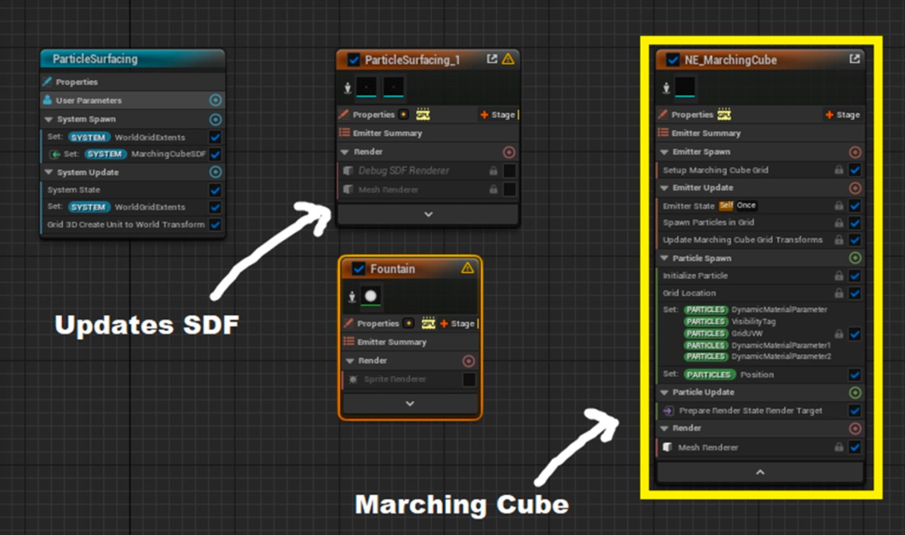
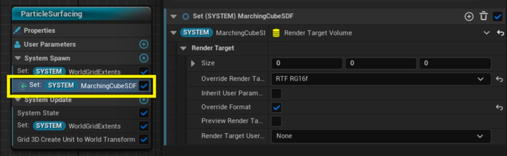
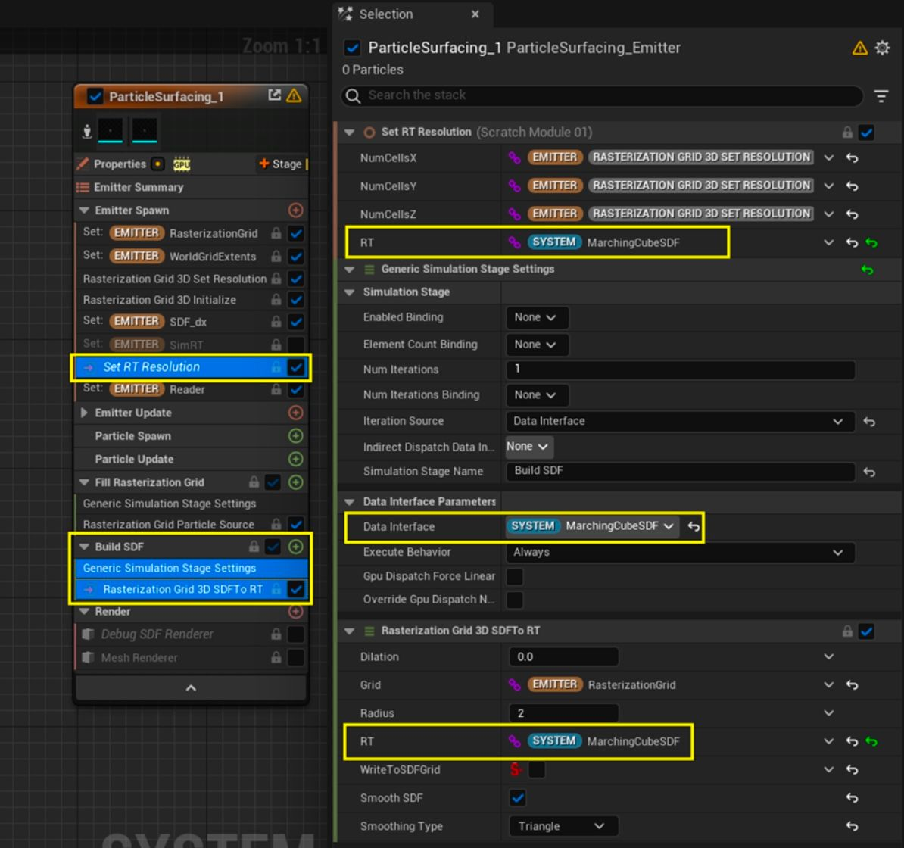
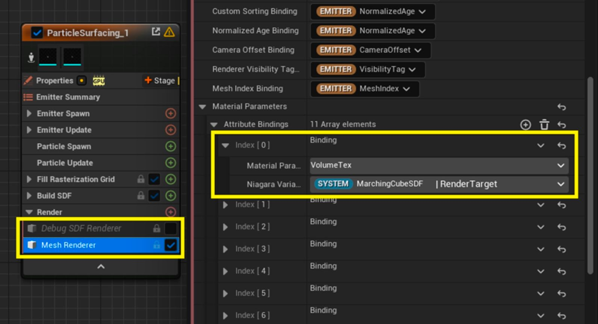
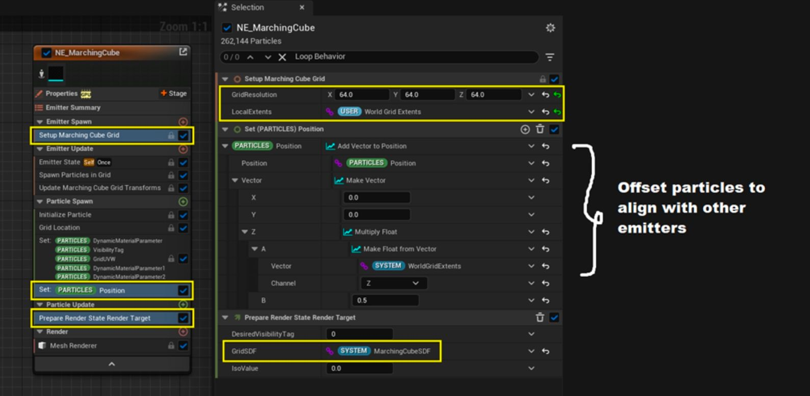

# 使用 Niagara 在虚幻引擎中开发 Marching Cube 插件

## 来源与状态

- 原始 URL：https://dev.epicgames.com/community/learning/tutorials/wvGG/developing-a-marching-cube-plug-in-in-unreal-engine-with-niagara

## 运行时分类

- 类型：图文教程
- 判断：API 未识别到核心视频信号，可整理正文约 6452 字符。

## 摘要

在这篇博文中，3D 艺术家和开发人员 Amit Mehar 分享了适用于虚幻引擎 4.27 及更高版本的 Niagara 支持的 Marching Cube 插件的全面细分，并展示了如何将其实现到现有系统中。

## 中文整理

### 概览

***由 80 Level 与 Unreal Engine 合作提供*** 自 [Niagara Fluids](https://docs.unrealengine.com/5.0/en-US/niagara-fluids-in-unreal-engine/) 插件发布以来，Twitter 上流传着许多有趣的流体模拟效果。虽然大多数效果都使用光线行进来渲染 SDF，但我想探索基于网格的方法的可能性。在此过程中，我编写了一个小插件，可以轻松集成到 Niagara 系统中，用于从 SDF 生成网格。虽然 Marching Cubes 并不是一项新技术，但我找不到任何与 Niagara 集成良好的现有解决方案。我的第一个实现是基于我的[在虚幻引擎 4 中使用计算着色器进行行进立方体设置](https://github.com/amuTBKT/UE4GraphicsSample/tree/master/Content/Examples/ProceduralMesh)。它是一个代码插件，因此需要对引擎进行一些修改才能与 Niagara 良好配合。不幸的是，需要修改引擎意味着这不是我可以轻松与社区分享的东西。在寻找替代方案时，我遇到了 erindale_xyz 的 [几何节点流](https://www.youtube.com/watch?v=pI7rk9Dbl8M)，他试图在 Blender 中实现类似的功能。由于地理节点是在 CPU 上评估的，因此速度可能很慢，但他的技术启发我使用 Niagara 和顶点变形来实现该技术的 GPU 变体。

### 理论

由于移动立方体是一项众所周知的技术，我不会详细介绍它的工作原理，而是想重点关注插件的实现。您可以查看这些参考资料，以更好地了解行进立方体算法： - [编码冒险：Sebastian Lague 的行进立方体](https://www.youtube.com/watch?v=M3iI2l0ltbE) - [Paul Bourke 的多边形标量场](http://paulbourke.net/geometry/polygonise/) 行进立方体的主要组成部分可以概括为： - 标量场，其中我们想要渲染为等值面。在我们的例子中，这将是 VolumeTexture、VolumeTarget 或光栅化为 VolumeRenderTarget 的粒子。 - 网格以定期间隔对标量场进行采样。在我们的例子中，这些将是在网格上产生的粒子。 - 为网格中的每个单元发出三角形的方法。这是通过渲染实例粒子来实现的。现在，让我们看看插件如何处理这些组件。

### 标量场

VolumeTexture 和 VolumeRenderTarget 由 Niagara 支持，可以轻松设置为外部纹理的参考或在 Niagara 中渲染。

### 网格

Niagara 内置了对在网格中生成粒子的支持，它提供了调整网格分辨率和缩放的控件，这是控制行进立方体分辨率所需的。模块**设置行进立方体网格**和**网格位置**确保粒子在网格上均匀生成，从而允许自由缩放、旋转和平移父发射器。 **网格分辨率**控制沿每个轴的单元格数量。可以对此进行调整以增加/减少行进立方体分辨率。 **局部范围**是局部空间中网格的大小，如下图中的红色线框立方体所示。

由于行进立方体在等值面附近发出三角形，我们可以观察到网格中的大部分空间都是空的。这意味着发射器将渲染粒子并丢弃渲染的数据。为了优化设置，我们可以迭代粒子并根据等值面检查将它们设置为隐藏。这是在插件提供的PrepareRenderState_Texture/PrepareRenderState_RenderTarget 模块内处理的。

### 发射三角形

该系统看起来仍然是块状的，根本不像光滑的表面。为了解决这个问题，我们需要沿着网格单元边缘插入三角形顶点。这是通过使用 **MF_MarchingCube** 材质函数来实现的，该函数使用由PrepareRenderState_* 模块导出的粒子数据。由于单元导出的三角形数量可能在 3-15 个三角形之间变化，因此我们需要一个至少包含 15 个三角形的静态网格物体，并动态剔除材质内不需要的三角形。为了剔除材质内部的三角形，我们可以将 WorldPositionOffset 设置为 -WorldPosition。这使得三角形退化，在对像素进行着色时不会考虑它，从而节省了我们一些像素着色器的工作。默认的 **M_MarchingCube** 材质是行进立方体设置工作所需的最少材质。用户可以使用**MF_MarchingCube**功能创建自己的材质来调整顶点WPO和法线。

### 将行进立方体添加到现有系统

该插件附带了一些 Niagara System 示例，展示了如何将设置与纹理和渲染目标结合使用。这是其中之一。对于此示例，我将使用 Niagara Fluids 插件提供的 ParticleSurface 效果。 ParticleSurface 发射器从粒子生成 SDF，并将为如何使用粒子插件提供非常好的参考。

**1.系统更改** 由于行进立方体发射器需要访问由 ParticleSurface 发射器修改的 SDF 渲染目标，我们将在系统级别添加一个新的渲染目标，以便所有发射器可以共享相同的纹理。

**2. ParticleSurface 发射器更改** 我们需要将所有对 SimRT 的引用替换为系统提供的 MarchingCubeSDF 渲染目标。

**3. NE_MarchingCube 发射器** 我们现在将添加 Marching Cube 插件提供的发射器，并设置对 MarchingCubeSDF 渲染目标的引用。

就是这样！您刚刚实施了您的第一个行进立方体设置！对于更高级的用例，您可以查看[NiagaraLaser 效果](https://amumhr.gumroad.com/l/pshqpm)。您还可以在我的 [Twitter](https://twitter.com/amu_mhr/status/1542910830118719488) 上找到激光效果的快速分解。

### Amit Mehar，3D 艺术家和开发人员

- [了解有关 Niagara Fluids 的更多信息](https://docs.unrealengine.com/5.0/en-US/niagara-fluids-quick-start-guide-for-unreal-engine) - [关于 Marching Cubes 的虚幻引擎文档](https://docs.unrealengine.com/5.0/en-US/API/Plugins/GeometricObjects/Generators/FMarchingCubes) - [Amit Mehar Twitter](https://twitter.com/amu_mhr) - [Amit Mehar Gumroad](https://amumhr.gumroad.com) - [免费下载插件！](https://amumhr.gumroad.com/l/ihtzi)

## 相关链接

- [Learn more about Niagara Fluids](https://docs.unrealengine.com/5.0/en-US/niagara-fluids-quick-start-guide-for-unreal-engine)
- [Unreal Engine documentation on Marching Cubes](https://docs.unrealengine.com/5.0/en-US/API/Plugins/GeometricObjects/Generators/FMarchingCubes)
- [Amit Mehar Twitter](https://twitter.com/amu_mhr)
- [Amit Mehar Gumroad](https://amumhr.gumroad.com)
- [Download the plug-in for free!](https://amumhr.gumroad.com/l/ihtzi)

