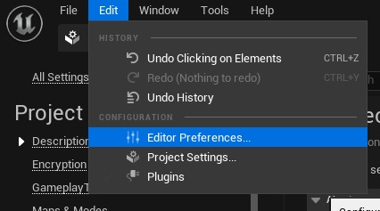
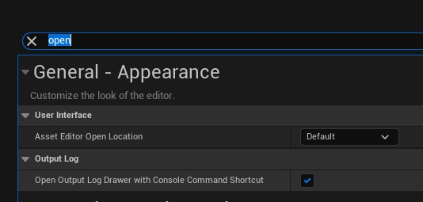
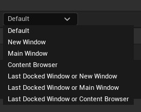

# 资产编辑器打开位置

## 来源与状态

- 原始 URL：https://dev.epicgames.com/community/learning/tutorials/zwrm/unreal-engine-asset-editor-open-location

## 运行时分类

- 类型：图文教程
- 判断：API 未识别到核心视频信号，可整理正文约 437 字符。

## 摘要

更改新资源编辑器的位置。

## 中文整理

### 概览

您是否曾经对打开资产时它将作为新窗口打开这一事实感到恼火，我确实有过。我知道这是一件小事，但以下是如何改变它。转到菜单栏并找到*编辑 > 编辑器首选项...*

接下来在输入字段中查询“open”。

您将在“用户界面”部分下找到一个下拉列表，用于选择应在何处打开新资源编辑器。

