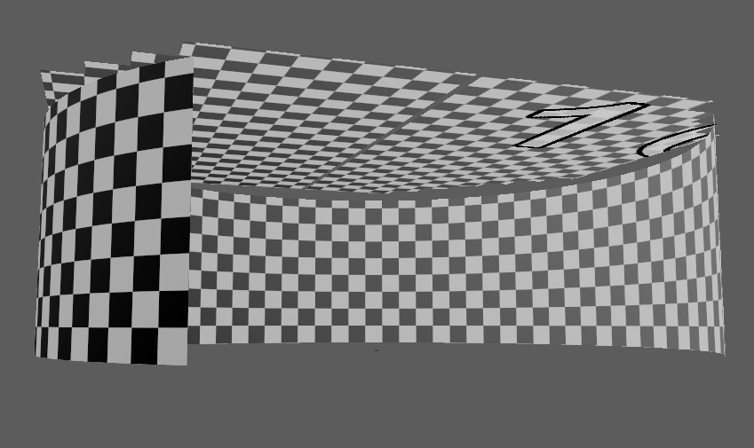
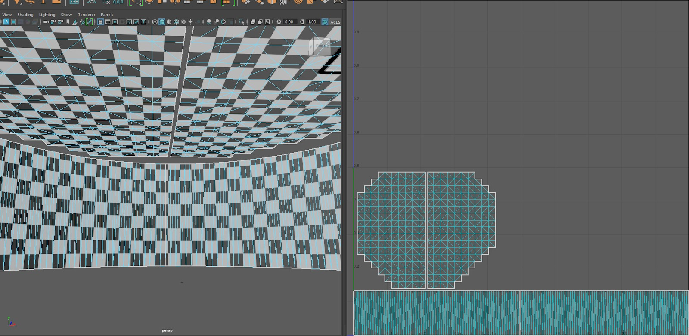
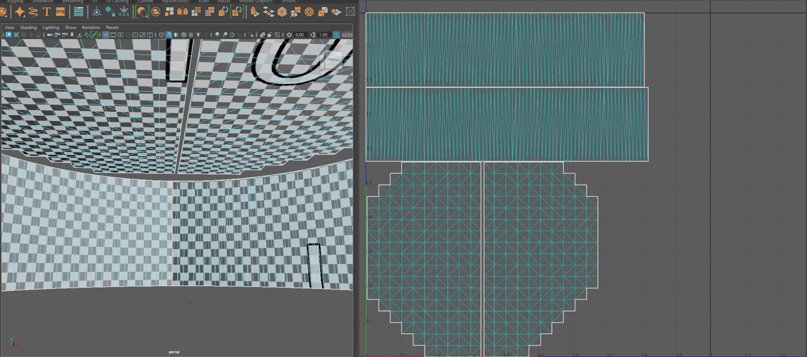
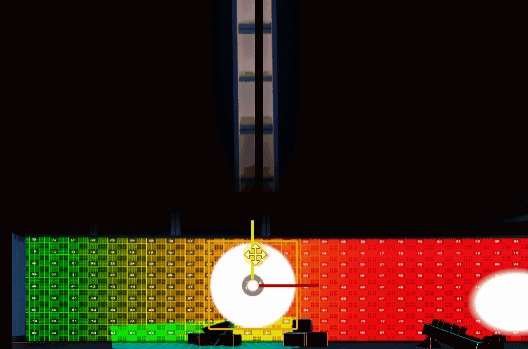
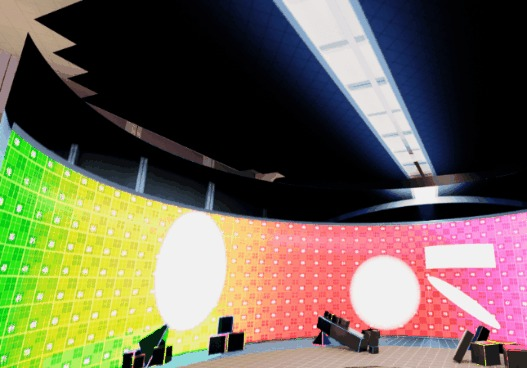
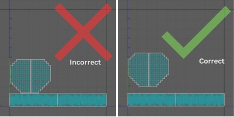

# 为 nDisplay 创建辅助 UV

## 来源与状态

- 原始 URL：https://dev.epicgames.com/community/learning/tutorials/EDy6/unreal-engine-creating-secondary-uvs-for-ndisplay

## 运行时分类

- 类型：图文教程
- 判断：API 未识别到核心视频信号，可整理正文约 2970 字符。

## 摘要

本指南将介绍如何为 nDisplay 投影网格正确创建第二个 UV 通道，以便相机内 VFX 编辑器可以充分利用其所有功能。

## 中文整理

### 概述

注意：本指南适用于投影网格的 UV1。 [UV 通道 0 用于在 nDisplay 中使用网格投影策略进行扭曲映射。](https://docs.unrealengine.com/5.3/en-US/projection-policies-in-ndisplay-in-unreal-engine/#mesh) 由于 **nDisplay** 如何将“2D 样式”效果应用于投影网格，我们利用第二个 UV 通道并期望网格上的所有 UV 壳都被赋予相同的纹素密度，并且每个 UV 壳没有重叠。

还需要考虑舞台的形状。例如，一堵非常宽的连续 LED 墙，虽然可能由单独的网格组成，但应该始终是一组连续的 UV，因为墙在现实中会站立。我们将使用 **ICVFXExample Project** 中的舞台网格。如果您想继续操作，请转至 /Content/nDisplayConfigs/Meshes 将相关静态网格物体导出到 **FBX** 并在您选择的 DCC 中继续操作。

Though this may seem like a poor use of UV space, it is more important for the shells in this second UV set to be representative of their real-life counterpart’s construction.在此示例中，这两个网格的接缝位于弯曲墙的中心。在此配置中，棋​​盘纹理可以正确流动。 This is important for the **Chroma Key mode** of **nDisplay**, as incorrect layout and uneven texel density can cause markers to be cut off and have different sizes across the Volume.

上面的示例更好地利用了 UV 空间，但不适合机内 VFX 编辑器的需求。您可以看到棋盘不再正确流动。 **紫外线卡**穿过中缝看起来不正确。对于**公共平面面板组**（例如天花板），如果它们具有任何突出的特征（例如间隙），最好进行**平面投影**。该间隙必须与现实情况成正比，否则，**UV 空间效应**将无法正确转换。在下面的示例中，您可以看到**UV 光卡**如何能够在编辑器视口 nDisplay 预览中保持其正确的比例。

考虑 UV 壳的布局和方向也很重要。在紫外线下翻转外壳可能会导致不直观的反馈，例如感觉控件“向后”。请参阅上面的光卡如何从弯曲的墙壁顶部“出来”，它部分地显示在天花板上。在 UV1 中，最好将天花板的 UV1 外壳移离墙壁更远，这样当 UV 光卡悬挂在墙壁 UV 外壳的边缘时，就有空间让其“隐藏”。

这些网格应该保持独立，因此导出时不要组合它们。您可以在打开 DCC 的 UV 布局编辑器时选择每个网格来同时处理它们。

