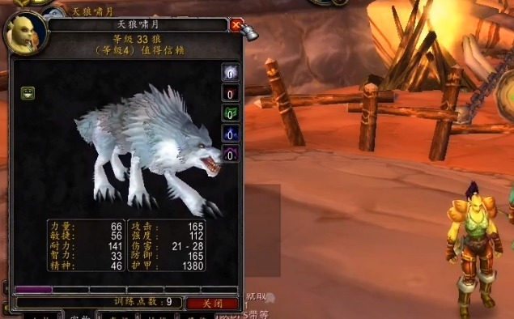
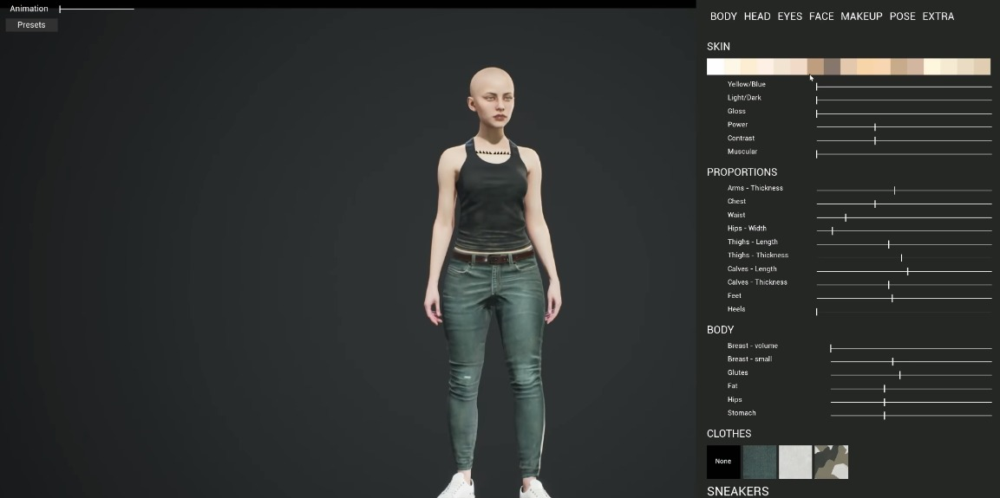
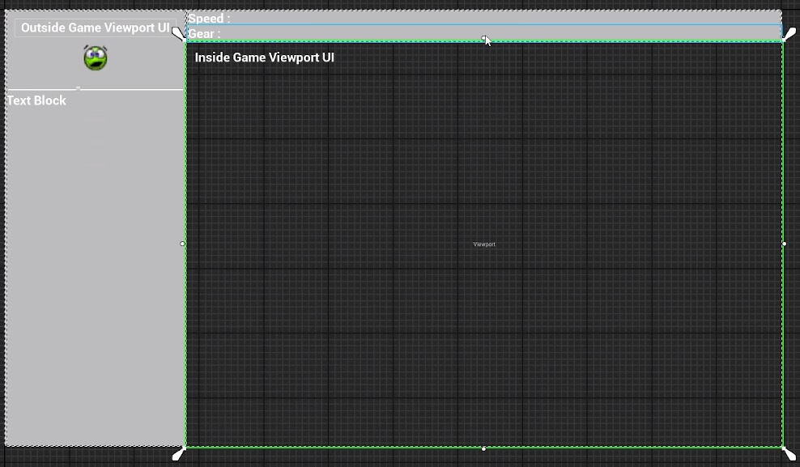
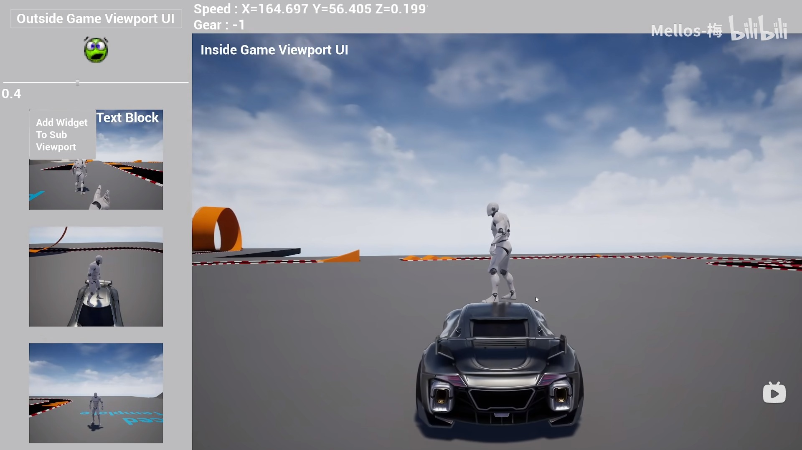
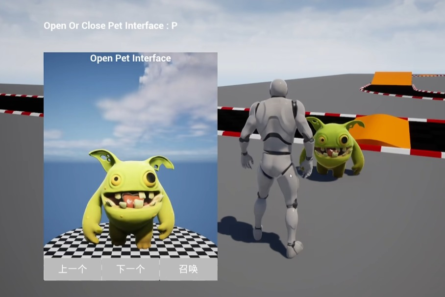

# 自定义渲染窗口和控制器来直接控制不同的窗口。

## 来源与状态

- 原始 URL：https://dev.epicgames.com/community/learning/tutorials/RnWX/unreal-engine-custom-rendering-windows-and-controllers-to-directly-control-different-windows

## 运行时分类

- 类型：图文教程
- 判断：API 未识别到核心视频信号，可整理正文约 2138 字符。

## 摘要

自定义渲染窗口和控制器来直接控制不同的窗口。

## 中文整理

### 概览

虚幻引擎并不直接提供多游戏画面的功能。对于FPS游戏来说确实如此，但是很多人使用虚幻引擎来制作非FPS游戏。这时，你可能会遇到无法直接创建多个游戏画面的问题。例如：

还有以下情况。由于游戏屏幕始终是全屏，因此角色必须放置在窗口的中央。如果角色的位置不在窗口的中心，你会遇到很多不好的问题。

正是在这些问题的影响下，我最终决定了解决方案。我做了一个方法，可以通过“User Widget”修改屏幕位置并添加游戏窗口。

上图显示被选中的Widget就是游戏画面。游戏画面不再总是全屏。更多的“用户小部件”可以放置在游戏屏幕之外，而不是总是覆盖游戏屏幕。 （左侧UI中也有3个游戏画面，但我没有选择，所以没有显示它们的存在。）

有趣的是它不完成渲染功能，可以直接与之交互。当您点击屏幕时，您的“本地播放器”将使用相应的控制器。所以你可以直接控制这个窗口中显示的Pawn。所以，当我想为上图中的宠物开发一个窗口时，我可以在新的世界中使用Controller和Pawn来编写如何通过UI旋转宠物和切换宠物。对于诸如召唤之类的功能，我只需要调用准备好的委托即可。只需等待其他人创建此窗口并连接到委托即可。

这使得您编写的代码更容易在其他项目中重用，因为您不会创建任何重复的不良代码，例如处理输入、处理渲染。而且你也可以尽量少用C++开发，可以直接在Controller中接收输入。插件链接：https://www.unrealengine.com/marketplace/en-US/product/5694a4bb6c7f45aab1c9ad3012b5234c YouTube：https://www.youtube.com/watch?v=I6CgXJjvM3k

