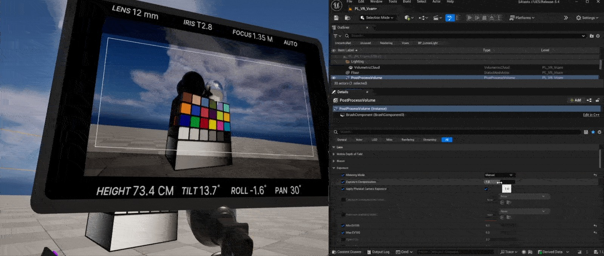
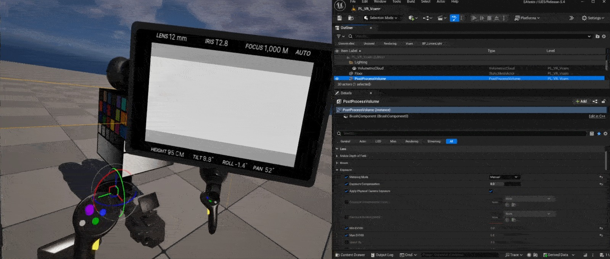
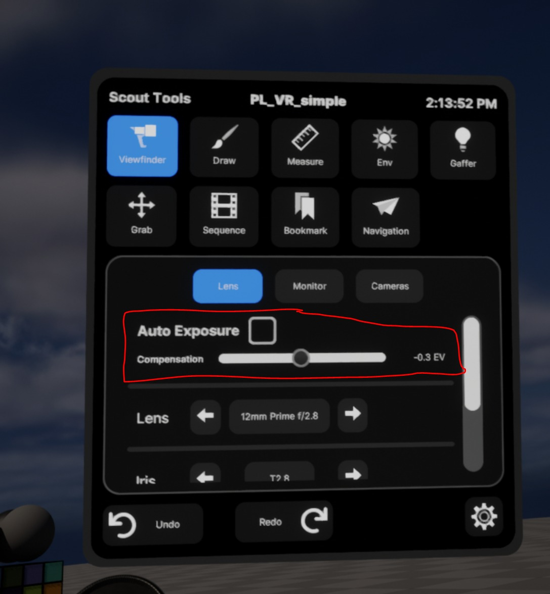
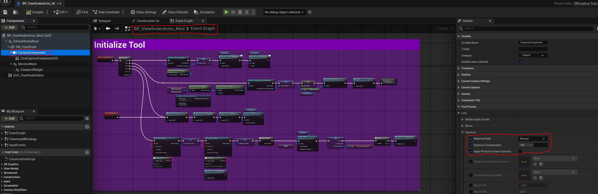
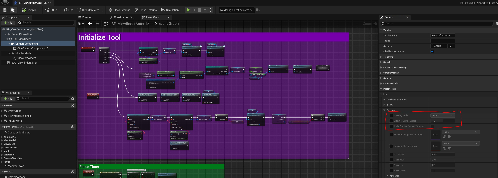
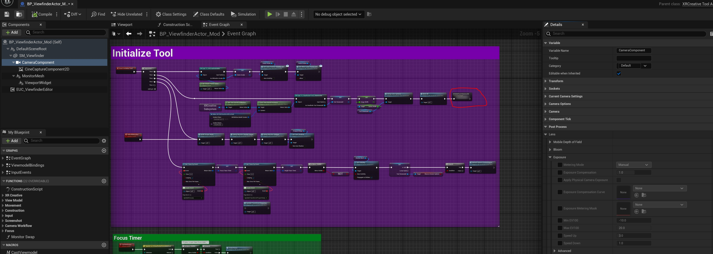
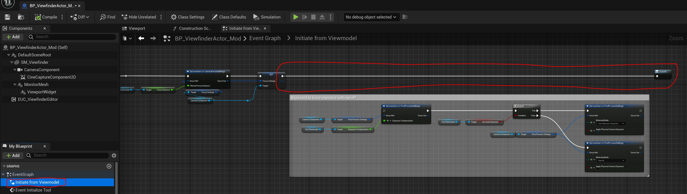
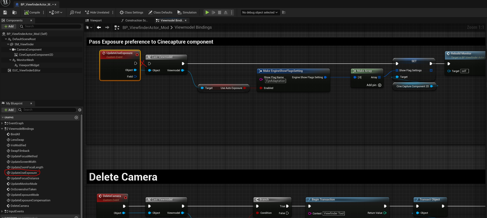
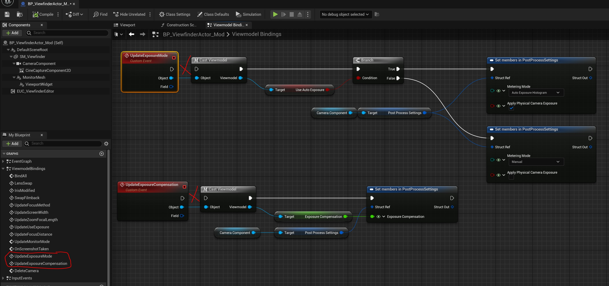
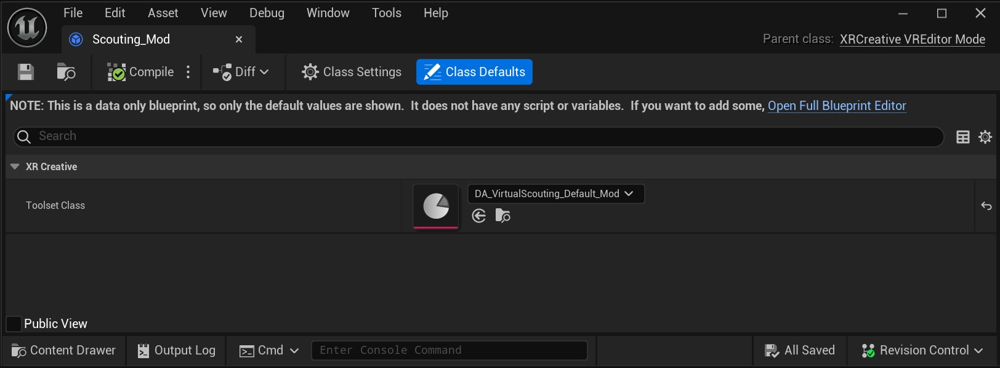

# 自定义取景器曝光 Virtual Scout 2.0

## 来源与状态

- 原始 URL：https://dev.epicgames.com/community/learning/tutorials/OpB3/unreal-engine-custom-viewfinder-exposure-virtual-scout-2-0

## 运行时分类

- 类型：图文教程
- 判断：API 未识别到核心视频信号，可整理正文约 4373 字符。

## 摘要

在这里，我将回顾修改 VR Scouting 2.0 Viewfinder 以使用与关卡的后期处理体积相同的曝光的步骤。

## 中文整理

### 概览

我对 UE 5.4 中的新 Virtual Scouting 2.0 工具感到非常兴奋。我们从多个媒体和娱乐被许可方那里听到了很好的反馈。最好的事情之一是您可以轻松地自定义它。最近，有人问我如何修改“**Scout Tools**”取景器，使其继承关卡中设置的曝光。换句话说，有没有办法自动设置取景器曝光补偿以匹配关卡中的PostProcessVolume曝光？

人们可能会发现关卡与通过“**Scout Tools**”取景器看到的内容之间存在曝光差异。

您可以轻松调整取景器 UI 上的“**Scout Tools**”取景器曝光补偿，以匹配关卡中的整体曝光。

通常，一个具有不同 PostProcessVolume 曝光设置的多个级别，因此更新每个级别的取景器曝光补偿并不理想。在这里，我将回顾修改 VR Scouting 2.0 Viewfinder 以使用与关卡的后期处理体积相同的曝光的步骤。首先，将 **BP_ViewfinderActor.uasset** 从 **/All/EngineData/Plugins/VirtualScouting/Tools/Viewfinder** 复制到您选择的内容文件夹中，例如，我创建了一个名为 **/Content/Tools/Scout_Mod/** 的文件夹，然后我将该文件重新存放到 **BP_ViewfinderActor_Mod.** 打开该文件，您将找到一个 CameraComponent，其前三个曝光设置设置为 ON。

您必须关闭这三个设置。

然后，在“Initialize tool”紫色注释框中的 **BP_ViewfinderActor_Mod** 的事件图表上，双击 **InitiateFromViewmodel.**

它将打开 **InitiateFromViewmodel ** 图表并绕过设置曝光设置的最后一个节点，即我将其放在注释框中的节点，您可以在下面的屏幕截图中看到。

编译蓝图并保存。如果您的关卡有 PostProcessVolume 曝光设置，这将允许您的取景器继承该曝光设置。但是，如果您停在这里并更改 Scout 工具 -> 取景器模式内的曝光补偿设置，您的取景器将始终应用您在 Scout 工具 UI 中选择的任何新值。如果您想关闭此功能，以便 ** Scout 工具 - Viewfinder** 始终与您的关卡曝光相匹配，请按照以下步骤操作： 在 **BP_ViewfinderActor_Mod > Viewmodel Bindings** 图表上。断开“**UpdateUseExposure**”函数上的连接。

另外，断开“**UpdateExposureMode**”和“**UpdateExposureCompensation**”函数上的连接。

复制 **/All/EngineData/Plugins/VirtualScouting/Core** 文件夹中的“**Scouting_Default**”。并将其复制到您选择的项目内容文件夹中；例如，我将其复制到与之前相同的 **/Content/Tools/Scout_Mod/** 然后，我将该文件还给 **Scouting_Mod**。另外，复制 **/All/EngineData/Plugins/VirtualScouting/Core** 文件夹中的“**DA_VirtualScouting_Default**”。并将其复制到与之前相同的文件夹 **/Content/Tools/Scout_Mod/** 然后我将该文件重新保存到 **DA_VirtualScouting_Default_Mod** 将“**BP_ViewfinderTool**”复制到 **/All/EngineData/Plugins/VirtualScouting/Tools/Viewfinder** 文件夹中。并将其复制到与之前相同的文件夹 **/Content/Tools/Scout_Mod/** 然后我将该文件重新保存到 **BP_ViewfinderTool_Mod** 打开“**Scouting_Mod**”并将“**DA_VirtualScouting_Default_Mod**”指定为您的工具集类。

打开“**DA_VirtualScouting_Default_Mod**”并将工具集名称重命名为您喜欢的任何名称。在这种情况下，我将其重命名为** Scout Tools Mod**。最后，在工具 -> 索引 [0] -> 工具类：下分配“**BP_ViewfinderTool_Mod**”并保存。在最后一步中，打开“**BP_ViewfinderTool_Mod**”并将新的“**BP_ViewfinderActor_Mod**”指定为您的工具Actor。编译并保存：您可以在配置VR编辑器模式列表下选择新的“**Scouting Mod**”。这允许您使用继承水平集曝光的自定义取景器。查看本课程大纲，了解有关自定义新虚拟侦察 2.0 的更多说明。 - [虚拟侦察 2.0 用户指南](https://dev.epicgames.com/community/learning/courses/VZp/unreal-engine-virtual-scouting-2-0-user-guide/y4aj/unreal-engine-introduction-to-virtual-scouting-2-0) 我希望你觉得它有用。

## 相关链接

- [Virtual Scouting 2.0 User Guide](https://dev.epicgames.com/community/learning/courses/VZp/unreal-engine-virtual-scouting-2-0-user-guide/y4aj/unreal-engine-introduction-to-virtual-scouting-2-0)

