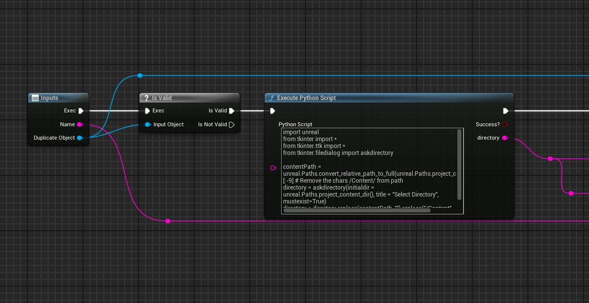

# 编辑器文件对话框

## 来源与状态

- 原始 URL：https://dev.epicgames.com/community/learning/tutorials/Opla/unreal-engine-editor-filedialog

## 运行时分类

- 类型：图文教程
- 判断：API 未识别到核心视频信号，可整理正文约 1140 字符。

## 摘要

这是一个在虚幻中创建文件/保存对话框的小教程。我们需要 Python 和 Tkinter 对话框。

## 中文整理

### 概览

这是一个在虚幻中创建文件/保存对话框的小教程。我们需要 Python 和 Tkinter 对话框。 [https://docs.python.org/3/library/dialog.html](https://docs.python.org/3/library/dialog.html) Tkinter 是 Python 的标准模块，因此我们可以在 Unreal 中使用它。我们只需导入它就可以使用它。使用此 Python 脚本，您可以打开“选择目录”对话框。路径已转换，以便您可以将其与资产子系统中的节点一起使用，例如重复资产。

```
import unreal
from tkinter import *
from tkinter.ttk import *
from tkinter.filedialog import askdirectory

contentPath = unreal.Paths.convert_relative_path_to_full(unreal.Paths.project_content_dir())[:-9] # Remove the chars /Content/ from path
directory = askdirectory(initialdir = unreal.Paths.project_content_dir(), title = "Select Directory", mustexist=True)
directory = directory.replace(contentPath, "").replace("/Content", "/Game")
```



通过这种技术，您还可以使用其他 Tkinter 对话框。例如tkinter.filedialog.askopenfile、tkinter.filedialog.asksaveasfile

