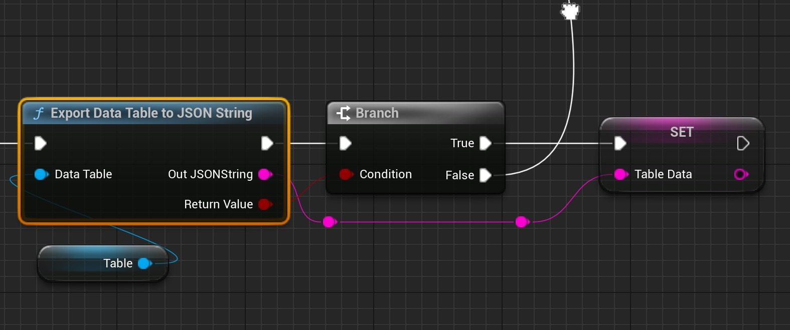
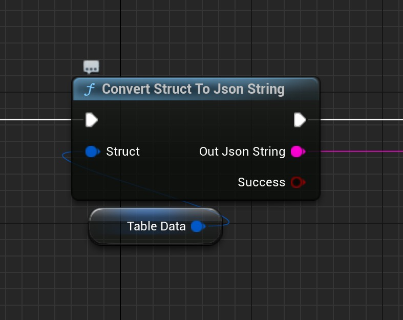

# 带有数据表的编辑器实用程序小部件

## 来源与状态

- 原始 URL：https://dev.epicgames.com/community/learning/tutorials/vw62/unreal-engine-editor-utility-widgets-with-data-table

## 运行时分类

- 类型：图文教程
- 判断：API 未识别到核心视频信号，可整理正文约 2553 字符。

## 摘要

在这个简短的教程中，我想向您展示如何在编辑器实用程序小部件中更改数据表。

## 中文整理

### 概览

在这个简短的教程中，我想向您展示如何在编辑器实用程序小部件中更改数据表。前提条件是虚幻 5.4。因为我们需要节点“将数据表导出到 JSON 字符串”。这使您可以为游戏设计师创建非常有用的工具，例如敌人设定、物品设定等

### 它是如何运作的

首先我们需要 Json 形式的数据表。为此，我们使用“将数据表导出到 JSON 字符串”节点。



现在，我们只需使用一个小的 Python 脚本来解析数据表字符串并覆盖各行的新值。然后 json 对象作为字符串返回。现在，使用“从 JSON 字符串填充数据表”节点将编辑后的 ​​Json 字符串写入数据表。现在您可以保存数据表资源。

```
import json
import os
import copy
import sys
import unreal

def writeRowDataToDataTable(TableDataJson, RowName, DataJson):
	TableRows = json.loads(TableDataJson)
	Data = json.loads(DataJson)
	Data["Name"] = RowName
```

```
Begin Object Class=/Script/BlueprintGraph.K2Node_FunctionEntry Name="K2Node_FunctionEntry_1" ExportPath="/Script/BlueprintGraph.K2Node_FunctionEntry'/Game/GoreSystem/Editor/Widgets/HitImpactEditor/EUW_HitImpactData.EUW_HitImpactData:WriteToDataTable.K2Node_FunctionEntry_1'"
   MetaData=(Category=NSLOCTEXT("", "477D32564737E2C6E489419ABF266CE1", "Data Table"),bCallInEditor=True)
   ExtraFlags=201457664
   FunctionReference=(MemberName="WriteToDataTable")
   bIsEditable=True
   NodePosX=-928
   NodePosY=368
   ErrorType=1
   NodeGuid=F2F69515484BECB9E6FBAAB3F57DEB8D
   CustomProperties Pin (PinId=659FC4C54B96B0741DE88C91DD70D93F,PinName="then",Direction="EGPD_Output",PinType.PinCategory="exec",PinType.PinSubCategory="",PinType.PinSubCategoryObject=None,PinType.PinSubCategoryMemberReference=(),PinType.PinValueType=(),PinType.ContainerType=None,PinType.bIsReference=False,PinType.bIsConst=False,PinType.bIsWeakPointer=False,PinType.bIsUObjectWrapper=False,PinType.bSerializeAsSinglePrecisionFloat=False,LinkedTo=(K2Node_ExecutePythonScript_0 B989E1EA489FE7D0473A64AE13976B11,),PersistentGuid=00000000000000000000000000000000,bHidden=False,bNotConnectable=False,bDefaultValueIsReadOnly=False,bDefaultValueIsIgnored=False,bAdvancedView=False,bOrphanedPin=False,)
```

在此版本中，我使用 Json 字符串值。为此，我使用“Json Blueprint Utilities”插件中的“Convert Struct to Json String”节点。当然你不必这样做，你也可以直接用Python脚本简单地改变你想要的值。



