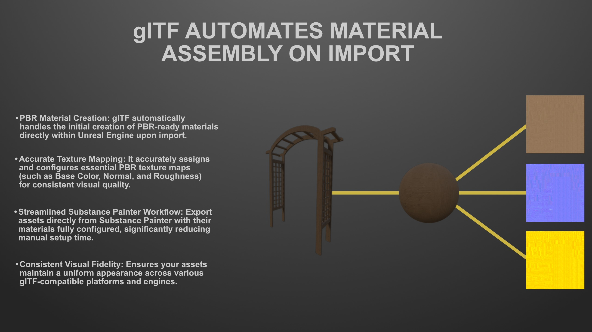
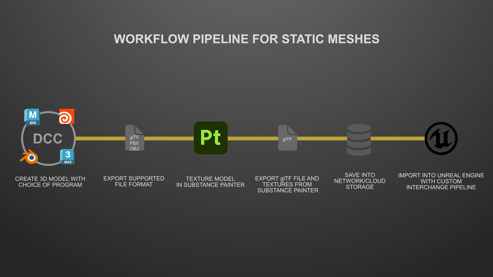
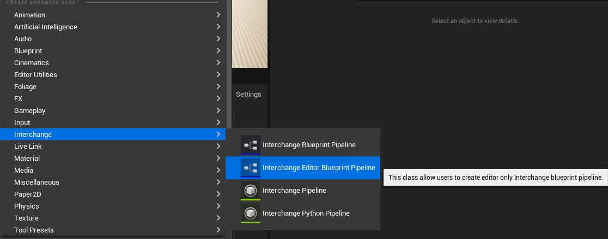
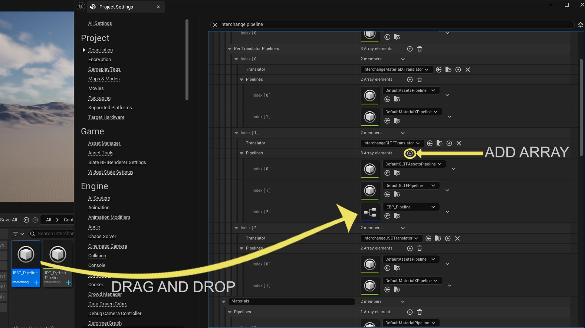

# unreal-engine-gltf-pipeline-solution-for-small-teams-interchange-framework-pipeline.origin (Part 1/3)

Source file: `unreal-engine-gltf-pipeline-solution-for-small-teams-interchange-framework-pipeline.origin.md`.

This document was split during ue-kb import to keep source chunks buildable.

# 适用于小型团队的 glTF 管道解决方案（Interchange Framework Pipeline）

## 来源与状态

- 原始 URL：https://dev.epicgames.com/community/learning/tutorials/lypy/unreal-engine-gltf-pipeline-solution-for-small-teams-interchange-framework-pipeline

## 运行时分类

- 类型：图文教程
- 判断：API 未识别到核心视频信号，可整理正文约 8648 字符。

## 摘要

初学者教程开发设置，介绍如何在小团队环境中与其他艺术家一起启动自己的项目流程。

## 中文整理

### 简介

本文详细介绍了 Global Game Jam 期间 glTF 管道解决方案的开发情况，旨在利用 glTF 文件格式和虚幻引擎的交换框架系统简化艺术家的资产工作流程。该解决方案显着改进了资产实施，并在整个项目生命周期（从开始到完成）中保持了一致的组织。任何虚幻引擎项目中的一个普遍挑战，无论规模大小，都是保持组织和一致性。通常，当项目接近里程碑或截止日期时，对项目风格规则或命名约定的遵守会被搁置，以便稍后进行清理。然而，苛刻的开发速度经常使我们无法返回重命名或重新组织文件。这可能会导致以下问题：“该资产去了哪里？”、“为什么这个文件命名不正确？”、“我们不知何故有重复的资产！”以及“此蓝图仍然链接到旧模型。”实际上，解决这些问题的最有效方法是实施一个管道系统，从一开始就防止这些问题发生，最好是在用户导入资产时立即防止这些问题发生。这正是虚幻引擎交换框架的价值所在。

### glTF 管道工作流程

[虚幻引擎交换框架](https://dev.epicgames.com/documentation/en-us/unreal-engine/importing-assets-using-interchange-in-unreal-engine) 使开发人员能够使用带有修改器堆栈的 **Blueprint** 或 **Python** 创建自定义管道解决方案。我们利用此功能专门针对从 **Substance Painter** 导出的 **glTF** 文件格式构建了管道。为什么是glTF？由于其起源于 [BabylonJS](https://www.babylonjs.com/)，glTF 提供了简单的编码结构、卓越的灵活性，而且最重要的是，它在支持的游戏引擎和 DCC（数字内容创建）工具中**链接和预组装纹理**。这使其成为没有资源从头开始构建自定义管道解决方案的小型团队的理想工作流程。

我们在 Global Game Jam 期间的主要目标是在一周的时间内帮助开发 [Fragments of the Deep](https://teamrubberducky.itch.io/fragmentsofthedeep)，同时尽可能简化艺术家的资产集成流程。我记录了技术建议，涵盖多边形计数限制、各种资源类型的纹理分辨率等方面，以及如何使用 Substance Painter 和导出 glTF 的指南。导出过程本身与传统的纹理导出有点不同。此特定工作流程针对**静态网格物体资源**进行了优化，但对于骨架网格物体并不理想，因为 Substance Painter 不支持导出动画或装备数据。对于骨架网格物体，我的解决方法涉及导入两个文件：一个来自包含装备和动画的 DCC 工具，另一个是 Substance Painter glTF 文件。然后，我将材质列表从静态网格物体资源（来自 Substance Painter）复制到骨架网格物体资源。

### 换乘管道

### 分解

在深入研究管道代码之前，了解虚幻引擎交换管道如何“在幕后”运行至关重要。下面是逐步细分： 1. **文件格式作为运输卡车：** 将您的文件格式（例如 glTF、FBX 或 OBJ）想象为 **运输卡车**，将内容从一个数字内容创建 (DCC) 应用程序运送到另一个应用程序。 2. **翻译者的角色：** 在虚幻引擎中，**翻译者** 充当检查员。它本质上是检查传入的文件，读取其内容，并将它们引导到适当的**交换管道卸货区**。 3. **集装箱（Base Interchange Container）：** 这些运输卡车运输 **集装箱**，Unreal 将其称为 **Base Interchange Containers**。 4. **容器内的节点：** 这些容器内部是单独装箱的“包”，Unreal 称之为 **节点**。 5. **唯一节点 ID：** 每个包都有一个唯一的识别标签，称为 **唯一节点 ID**。此 ID 确定包裹类型及其内容。 6. **定向到工厂：** Unreal 然后使用这些节点 ID 将包定向到它们需要前往的特定 **工厂**。 7. **拆包和组装：** 每个指定的工厂节点将为您的项目解包内容并组装资产。

### 我们的定制管道流程

我们的自定义管道在包解压之前运行执行管道事件。此事件动态地为传入资源创建必要的文件夹（例如，StaticMeshes、Textures 等）。然后，它使用正确的前缀（或后缀，具体取决于您团队的命名约定）重命名资产。然后，我们进入**导入后管道**，在该管道中，我们利用工具根据预定义的变量规则检查静态网格物体、纹理和骨架网格物体的优化情况。如果资产未通过此优化测试，则会触发一个小对话框弹出窗口，并且该资产将通过添加到名为 AssetReview 的新集合中来进行标记。最后，如果禁用 Nanite，管道将自动为您生成详细级别 (LOD)。

### 蓝图交换管道

我们的管道解决方案利用了虚幻引擎交换框架中的两个关键事件：**脚本执行管道**（称为*之前*工厂组装的事件）和**脚本执行导入后管道**（称为*之后*工厂组装的事件）。

### 设置蓝图管道

