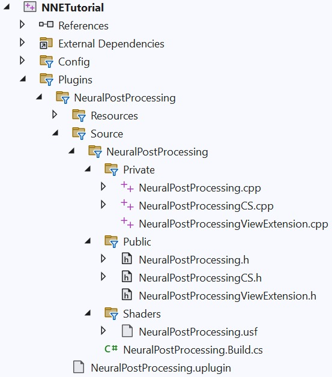

# unreal-engine-nne-neural-post-processing.origin (Part 2/4)

Source file: `unreal-engine-nne-neural-post-processing.origin.md`.

This document was split during ue-kb import to keep source chunks buildable.

### 处理输出

第二个着色器执行 **PrepareInput** 的逆操作。它加载神经网络的输出并将内存布局恢复为通道最后。让我们从函数定义开始。这次，我们不需要装饰器，因为着色器将被称为全屏通道像素着色器。

```cpp
float4 ProcessOutput(float4 Position : SV_POSITION) : SV_Target0
{
	// ...
}
```

在函数体中，我们简单地计算整数 X 和 Y 像素坐标。然后我们查找不同通道的值，将它们组合成一个 float3 并返回该结果。

```cpp
    float X = Position.x * float(Width  - 1) / (float)Width;
    float Y = Position.y * float(Height - 1) / (float)Height;

    int PixelX = clamp((int)X, 0, Width);
    int PixelY = clamp((int)Y, 0, Height);

    int Idx = PixelY * Width + PixelX;
    int Offset1 = Width * Height;
    int Offset2 = Offset1 + Offset1;
    float3 Color = float3(OutputBuffer[Idx], OutputBuffer[Idx + Offset1], OutputBuffer[Idx + Offset2]);
```

### 着色器包装标头

我们需要为输入和输出处理着色器定义两个着色器包装器类。两者都定义了一个结构体来将参数传递给着色器。它们还声明全局着色器和参数结构的用法。此外，它们还定义了一个函数来修改编译环境，我们将使用该函数来设置组线程计数。有关如何设置全局着色器的更多详细信息，请参阅虚幻引擎文档。

```cpp
#pragma once

#include "GlobalShader.h"
#include "ShaderParameterUtils.h"
#include "RenderGraphUtils.h"

#define NEURAL_POST_PROCESSING_THREAD_GROUP_SIZE 32

class NEURALPOSTPROCESSING_API FNeuralPostProcessingPrepareInputCS : public FGlobalShader
{
```

### 着色器包装源

着色器包装类的实现很简单。 **ModifyCompilationEnvironment** 只是设置线程组大小。此外，宏 **IMPLMENT_GLOBAL_SHADER** 用于向引擎注册着色器，告诉它们哪个类包装哪个着色器文件中的哪个入口点。在这里，我们使用上面在模块启动函数中定义的虚拟目录入口点。请注意，第二个着色器是由 **SF_Pixel** 标志定义的像素着色器，因此我们稍后可以使用 **FPixelShaderUtils::AddFullscreenPass** 函数。

```cpp
#include "NeuralPostProcessingCS.h"

void FNeuralPostProcessingPrepareInputCS::ModifyCompilationEnvironment(const FGlobalShaderPermutationParameters& InParameters, FShaderCompilerEnvironment& OutEnvironment)
{
	FGlobalShader::ModifyCompilationEnvironment(InParameters, OutEnvironment);
	OutEnvironment.SetDefine(TEXT("THREAD_GROUP_SIZE"), NEURAL_POST_PROCESSING_THREAD_GROUP_SIZE);
}

void FNeuralPostProcessingProcessOutputPS::ModifyCompilationEnvironment(const FGlobalShaderPermutationParameters& InParameters, FShaderCompilerEnvironment& OutEnvironment)
{
```

### C++

我们需要一个继承自 **FSceneViewExtensionBase** 的 C++ 类，因此每当我们需要将神经后处理网络排队到 RDG 管道时就会调用我们。此外，我们将创建一个 **BlueprintType** 类，以便我们可以轻松地从蓝图中访问我们的视图扩展类。

### 设置

与创建计算着色器文件类似，在 **Public** 文件夹中创建一个新的头文件 **NeuralPostProcessingViewExtension.h**，并在 **Private** 文件夹中创建一个新的源文件 **NeuralPostProcessingViewExtension.cpp**。您的插件文件夹现在应如下所示。



在 **NeuralPostProcessingViewExtension.h** 中，添加标头以包含场景视图扩展、**NNE** 相关类和生成的标头文件，以便我们可以在此标头中定义 **UCLASS**。

```cpp
#pragma once

#include "CoreMinimal.h"
#include "SceneViewExtension.h"

#include "NNEModelData.h"
#include "NNERuntimeRDG.h"

#include "NeuralPostProcessingViewExtension.generated.h"
```

定义一个继承自FSceneViewExtensionBase的类**FNeuralPostProcessingViewExtension**，以及我们需要定义的构造函数和继承的虚函数。请注意，**PrePostProcessPass_RenderThread** 是我们必须使用自定义代码填充的唯一函数。

```cpp
class FNeuralPostProcessingViewExtension : public FSceneViewExtensionBase
{
public:

	FNeuralPostProcessingViewExtension(const FAutoRegister& AutoRegister);

public:

	// ...
```

添加一个函数来设置神经网络模型和相应的私有类成员来完成类定义。

```cpp
class FNeuralPostProcessingViewExtension : public FSceneViewExtensionBase
{
public:

	FNeuralPostProcessingViewExtension(const FAutoRegister& AutoRegister);

public:

	bool SetModel(FString RuntimeName, TObjectPtr<UNNEModelData> ModelData);
```

现在让我们定义一个 **BlueprintType** 类，它允许我们从蓝图控制神经后处理。我们需要 **UCLASS(BlueprintType, Category = "NNE - Tutorial")** 装饰器、一个用于设置模型的函数和一个包含指向 **FNeuralPostProcessingViewExtension** 类的共享指针的类成员。

```cpp
UCLASS(BlueprintType, Category = "NNE - Tutorial")
class UNeuralPostProcessing : public UObject
{
	GENERATED_BODY()

public:

	UFUNCTION(BlueprintCallable, Category = "NNE - Tutorial")
	bool SetModel(FString RuntimeName, UNNEModelData* ModelData);
```

完整的标题看起来像这样

```cpp
#pragma once

#include "CoreMinimal.h"
#include "SceneViewExtension.h"

#include "NNEModelData.h"
#include "NNERuntimeRDG.h"

#include "NeuralPostProcessingViewExtension.generated.h"
```

### 执行

我们现在实现 **NeuralPostProcessingViewExtension.cpp** 中的函数来创建视图扩展、神经网络模型以及将全局着色器和神经网络排队到渲染管道的函数。

### 查看扩展创建

首先将一些必需的标头添加到源文件中。

```cpp
#include "NeuralPostProcessingViewExtension.h"
#include "NNE.h"
#include "NeuralPostProcessingCS.h"
#include "PostProcess/PostProcessing.h"
#include "PixelShaderUtils.h"
```

然后，我们在蓝图第一次在 **UNeuralPostProcessing** 上调用 **SetModel** 时创建并注册视图扩展。仅在第一次调用后，才会启用后处理。

```cpp
bool UNeuralPostProcessing::SetModel(FString RuntimeName, UNNEModelData* ModelData)
{
	if (!NeuralPostProcessingViewExtension.IsValid())
	{
		NeuralPostProcessingViewExtension = FSceneViewExtensions::NewExtension<FNeuralPostProcessingViewExtension>();
	}
	return NeuralPostProcessingViewExtension->SetModel(RuntimeName, TObjectPtr<UNNEModelData>(ModelData));
}
```

**FNeuralPostProcessingViewExtension** 的构造函数只是调用基本构造函数并初始化类成员。将 **LastInputSize** 设置为负值将在以后每当设置新模型或输入大小发生变化时强制调用 **SetInputTensorShapes**。这是 **NNE** 插件所必需的，以允许模型在需要时调整缓冲区大小。

```cpp
FNeuralPostProcessingViewExtension::FNeuralPostProcessingViewExtension(const FAutoRegister& AutoRegister) : FSceneViewExtensionBase(AutoRegister)
{
	LastInputSize = FIntPoint(-1, -1);
}
```

### 神经网络模型创建

我们希望类 **FNeuralPostProcessingViewExtension** 在将正确的 **UNNEModelData** 资产传递给 **SetModel** 时创建一个新模型，并在传递空指针时禁用神经后处理。因此定义函数，检查有效的模型数据或重置 **Model** 和其他类成员。如果没有有效模型，**PrePostProcessPass_RenderThread** 稍后将跳过后处理。

```cpp
bool FNeuralPostProcessingViewExtension::SetModel(FString RuntimeName, TObjectPtr<UNNEModelData> ModelData)
{
	if (!ModelData)
	{
		ModelInstance.Reset();
		LastInputSize = FIntPoint(-1, -1);
		return true;
	}

	// ...
```

接下来我们创建一个神经网络模型实例。首先我们需要获得一个 **NNE ** 运行时。由于我们想要使用 RDG 运行时，因此我们使用模板参数 **INNERuntimeRDG** 调用 **NNE** 的全局函数 **GetRuntime**。然后，我们将模型数据传递给运行时以获取 **RDG ** 模型。最后我们在此模型上调用**CreateModelInstanceRDG **来创建模型实例。

```cpp
bool FNeuralPostProcessingViewExtension::SetModel(FString RuntimeName, TObjectPtr<UNNEModelData> ModelData)
{
	if (!ModelData)
	{
		ModelInstance.Reset();
		LastInputSize = FIntPoint(-1, -1);
		return true;
	}

	using namespace UE::NNE;
```
