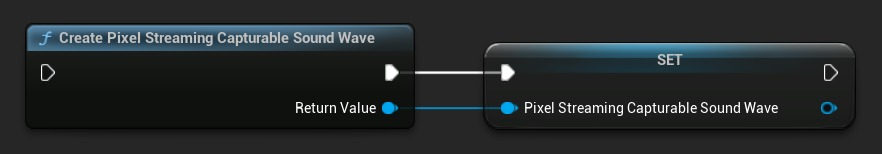
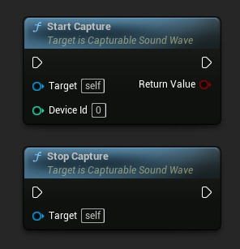
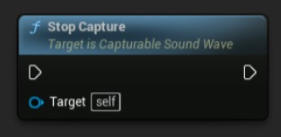
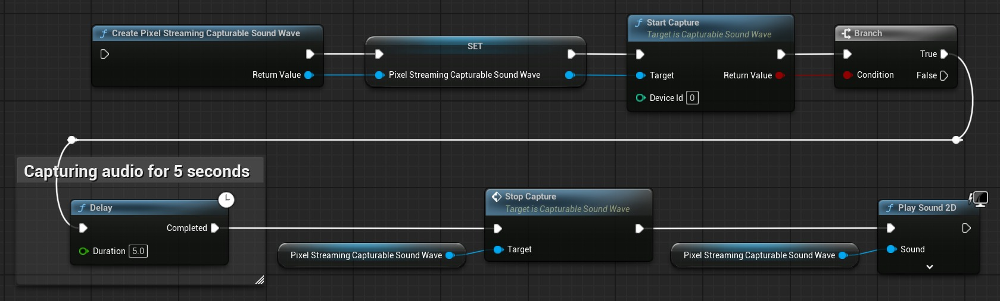
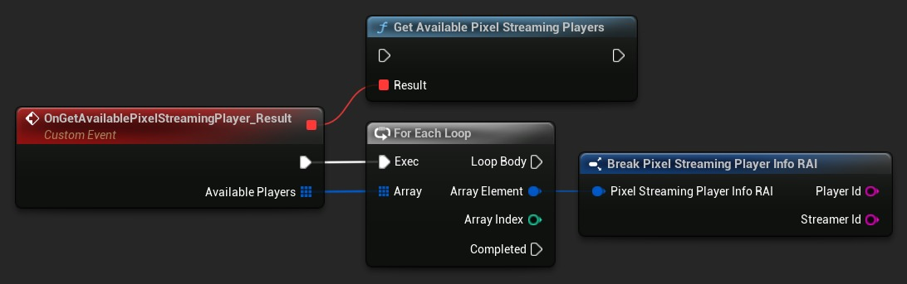
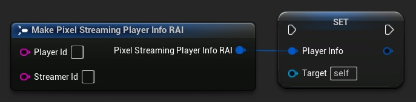

# 在虚幻引擎中从像素流客户端（麦克风）捕获音频

## 来源与状态

- 原始 URL：https://dev.epicgames.com/community/learning/tutorials/wPo3/fab-capturing-audio-from-pixel-streaming-clients-microphone-in-unreal-engine

## 运行时分类

- 类型：图文教程
- 判断：API 未识别到核心视频信号，可整理正文约 6535 字符。

## 摘要

了解如何使用运行时音频导入器插件的 Pixel Streaming 扩展在虚幻引擎中捕获和处理来自远程 Pixel Streaming 客户端的音频。本教程涵盖从基于浏览器的客户端设置音频捕获、管理多个连接以及为交互式流应用程序实现语音聊天或语音命令等功能。

## 中文整理

### 概览

**注意：** 本教程需要 [运行时音频导入器](https://www.fab.com/listings/66e0d72e-982f-4d9e-aaaf-13a1d22efad1) 插件及其像素流音频捕获扩展 ([像素流](https://files.georgy.dev/Plugins/RuntimeAudioImporterPixelStreaming.zip)、[像素流2](https://files.georgy.dev/Plugins/RuntimeAudioImporterPixelStreaming2.zip))。有关全面的文档和高级功能，请参阅[完整文档](https://docs.georgy.dev/runtime-audio-importer/pixel-streaming-audio-capture)。

### 介绍

像素流允许您将虚幻引擎应用程序流式传输到浏览器并接收用户输入。 **[运行时音频导入器](https://www.fab.com/listings/66e0d72e-982f-4d9e-aaaf-13a1d22efad1)**的**[像素流音频捕获扩展](https://docs.georgy.dev/runtime-audio-importer/pixel-streaming-audio-capture)******使您能够从连接的客户端麦克风捕获音频，从而为语音提供了可能性来自远程用户的聊天、语音命令和录音。

### 先决条件

在开始之前，请确保您已： 1. **[运行时音频导入器](https://www.fab.com/listings/66e0d72e-982f-4d9e-aaaf-13a1d22efad1)** 项目中安装了插件 2. ****安装了像素流音频捕获扩展 (**[Pixel Streaming](https://files.georgy.dev/Plugins/RuntimeAudioImporterPixelStreaming.zip)**、**[Pixel Streaming 2](https://files.georgy.dev/Plugins/RuntimeAudioImporterPixelStreaming2.zip)**，取决于您的[所需版本](https://docs.georgy.dev/runtime-audio-importer/pixel-streaming-audio-capture#pixel-streaming-vs-pixel-streaming-2)) 3. 一个有效的 Pixel Streaming 设置（使用 Epic 的基础设施或第三方提供商） 4. 一个 C++ 项目（扩展需要 C++ 支持）

### 兼容性

该解决方案适用于： 1. 官方 Pixel Streaming 基础设施（Epic Games 参考实施） 2. 第三方 Pixel Streaming 提供商，包括： - **[Vagon.io](https://vagon.io/)** - 云游戏和应用程序流平台 - **[Eagle 3D Streaming](https://www.eagle3dstreaming.com/)** - 企业级流解决方案 - 其他基于 WebRTC 的流解决方案 该实施已在这些环境中进行了测试，无论 Pixel Streaming 托管如何，均可正常运行使用的解决方案。

### 基本实现

### 第 1 步：创建像素流可捕获声波

首先，创建一个 **Pixel Streaming Capturable Sound Wave** 对象：

确保将此对象存储为变量以防止其被垃圾收集。

### 第 2 步：开始音频捕获

开始从客户端的麦克风捕获音频：

注意：对于像素流捕获，DeviceId 参数将被忽略，因为源是自动确定的。

### 第 3 步：播放或处理音频

您可以直接播放捕获的音频，就像任何其他声波一样：

或者，您可以处理音频以进行语音识别、录音或其他目的。

### 第 4 步：需要时停止捕获

完成音频捕获后，停止捕获：

### 完整的基本示例

这是一个完整的实现示例：

### 与多个客户合作

当多个用户连接到您的 Pixel Streaming 应用程序时，您可以选择从哪个客户端捕获音频。

### 第 1 步：获取可用的 Pixel Streaming 播放器

首先，检索已连接的客户端列表：

### 第 2 步：选择特定玩家

设置从哪个播放器捕获音频：

这允许您实现诸如选择在多用户场景中收听哪个用户的音频之类的功能。

### 实际应用

### 语音聊天实施

您可以通过以下方式创建语音聊天系统： 1. 为每个连接的播放器创建像素流可捕获声波 2. 捕获并播放每个客户端的音频 3. 使用语音活动检测来确定用户何时说话

### 数字化身的实时唇形同步

创建响应远程用户语音的交互式数字化身： 1. 从 Pixel Streaming 客户端捕获音频 2. 将捕获的音频输入 **[Runtime MetaHuman Lip Sync](https://www.fab.com/listings/b514294e-e78b-4b8b-ad21-78ce51dc7e8c)** 插件([tutorial](https://dev.epicgames.com/community/learning/tutorials/3XY9/unreal-engine-fab-real-time-lip-sync-for-metahuman-and-custom-characters-with-tts-and-chatbots)) 3. 根据远程用户的语音实时制作 MetaHuman 角色（或任何自定义角色）动画 4. 创建身临其境的体验，其中数字化身反映语音模式这对于虚拟演示者、数字孪生、虚拟会议和交互式娱乐应用程序来说尤其强大。

### 语音命令

结合语音识别实现语音命令： 2. 使用 **[Runtime Speech Recognizer](https://www.fab.com/listings/00ffc308-d7f9-4142-ac4c-4aeaa75ab54b)** 插件将语音转换为文本 3. 在游戏逻辑中处理识别的命令

### 录制远程用户音频

录制远程用户的音频以便稍后播放： 1. 使用像素流捕获声波捕获音频 2. **[将音频导出到文件](https://docs.georgy.dev/runtime-audio-importer/export-audio)** 3. 根据需要保存或处理录音

### 高级功能

对于更高级的功能，您可以利用运行时音频导入器插件的全部功能： 1. 使用 **[语音活动检测](https://docs.georgy.dev/runtime-audio-importer/voice-activity-detection)** 检测用户何时说话 2. **[访问原始 PCM数据](https://docs.georgy.dev/runtime-audio-importer/sound-wave-properties#retriving-pcm-buffer)** 用于音频分析或可视化 3. 对捕获的音频应用音频效果或处理

### 结论

**[像素流音频捕获扩展](https://docs.georgy.dev/runtime-audio-importer/pixel-streaming-audio-capture)**提供了一种将远程音频捕获集成到像素流应用程序中的强大方法。无论您是在构建协作工具、多人游戏还是交互式流媒体体验，此功能都为用户交互开辟了新的可能性。如需其他帮助或自定义开发解决方案，请联系 [solutions@georgy.dev](mailto:solutions@georgy.dev) 或加入 [Discord 支持服务器](https://georgy.dev/discord)。
