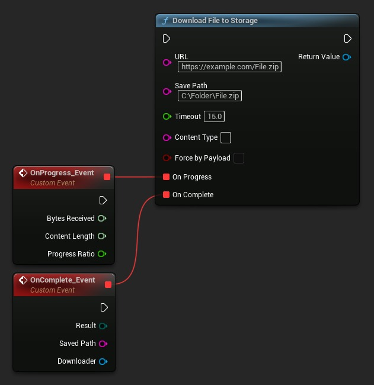
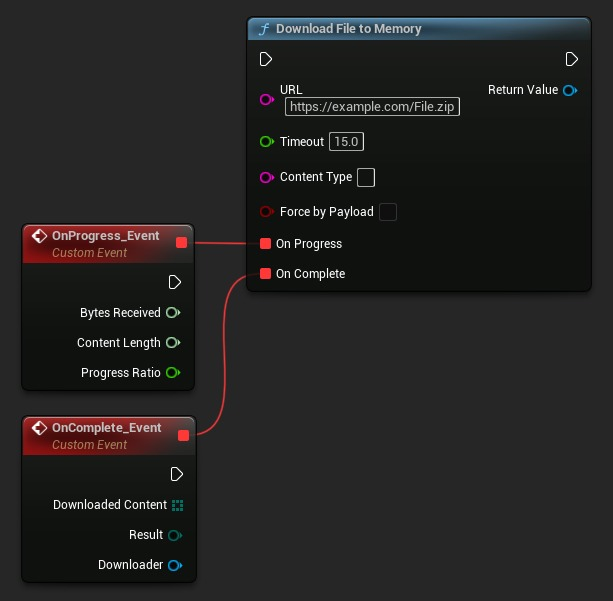
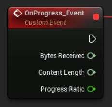
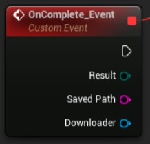
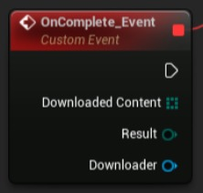
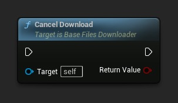
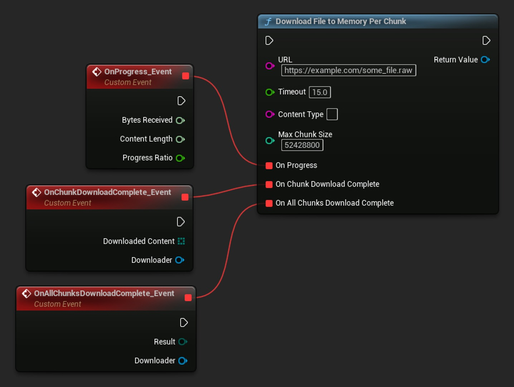

# 虚幻引擎中的文件下载：从基本下载到分块下载

## 来源与状态

- 原始 URL：https://dev.epicgames.com/community/learning/tutorials/RZxv/fab-file-downloading-in-unreal-engine-from-basic-to-chunked-downloads

## 运行时分类

- 类型：图文教程
- 判断：API 未识别到核心视频信号，可整理正文约 4489 字符。

## 摘要

了解如何在虚幻引擎项目中使用运行时文件下载器插件在运行时从互联网下载文件。本教程演示如何将文件下载到存储或内存、跟踪下载进度、处理已完成的下载以及实现大文件的分块下载。该插件适用于所有平台，并支持 HTTP 和 HTTPS 协议。非常适合需要在游戏过程中下载更新、DLC 内容或任何远程资产而无需玩家重新启动游戏的游戏开发人员。

## 中文整理

### 介绍

本教程演示如何在虚幻引擎运行时使用 **[运行时文件下载器](https://www.fab.com/listings/771d5e74-3d7d-49b9-a682-7a6f7f86b94c)** 插件从互联网下载文件。无论您在游戏运行时需要下载补丁、附加内容还是任何其他文件，该插件都提供了一个简单的解决方案。

### 基本文件下载

使用该插件下载文件的主要方式有两种： 1. **下载到存储** - 将文件直接保存到磁盘 2. **下载到内存** - 将文件数据保留在内存中（**字节数组** / **TArray<uint8****>**）以供立即使用

### 下载文件到存储

当您需要将下载的文件保存到设备存储时： 1. 使用**下载文件到存储**功能：

2. 配置以下参数： - **URL**：要下载的文件的网址 - **保存路径**：在设备上保存文件的位置 - **超时**：允许下载的最长时间（以秒为单位） - **内容类型**：可选 MIME 类型（留空以进行自动检测） - **按负载强制下载**：按负载强制下载（高级用法） 3. 连接事件代理： - **进行中**：定期调用并提供下载进度信息 - **完成时**：调用下载完成时（成功或有错误）

### 将文件下载到内存

当您需要文件数据但不需要将其保存到磁盘时： 1. 使用**下载文件到内存**功能：

2. 配置与存储下载类似的参数，但不指定保存路径 3. 下载完成后，**On Complete** 委托以字节数组的形式提供下载的内容

### 跟踪下载进度

两种下载方法都通过 **On Progress** 委托提供进度更新： 1. **接收的字节数**：到目前为止已下载了多少字节 2. **内容长度**：文件的总大小（如果已知） 3. **进度比率**：表示下载完成百分比的 0.0 到 1.0 之间的值

### 处理下载完成

**On Complete** 委托提供有关下载结果的信息： 对于存储下载： 1. **结果**：成功或特定错误代码 2. **保存路径**：保存文件的路径 3. **下载程序**：对下载程序对象的引用

对于内存下载： 1. **下载的内容**：字节数组形式的实际文件数据 2. **结果**：成功或特定错误代码

### 取消下载

您可以随时使用 **取消下载** 功能取消正在进行的下载：

### 高级：分块下载

对于大文件或流媒体应用程序，您可以分块下载文件： 1. 使用**按块下载文件到内存**功能： 2. 配置参数，包括**最大块大小**（以字节为单位） - **On Progress**：定期进度更新 - **On Chunk Download Complete**：下载每个块时调用 - **On All Chunks Download Complete**：整个下载完成时调用

此方法特别适用于： 1. 处理大文件，无需等待完整下载 2. 实现流媒体功能 3. 在下载其余内容时显示预览内容

### 重要提示

1. **超时行为**：在**UE 5.4及更高版本中，**如果总时间超过指定值，超时参数可以取消正在进行的下载。为了避免这种情况，请使用较大的超时值（例如 3600 秒）或将其设置为零以完全禁用超时。 2. **MIME 类型**：您可以选择指定要下载的文件的 MIME 类型。 **[请参阅此处的常见 MIME 类型列表](https://developer.mozilla.org/en-US/docs/Web/HTTP/Guides/MIME_types/Common_types)**。

### 结论

**[运行时文件下载器](https://www.fab.com/listings/771d5e74-3d7d-49b9-a682-7a6f7f86b94c)**插件提供了一种简单而强大的方法来下载虚幻引擎项目中的文件。只需几个节点，您就可以实现具有进度跟踪和错误处理的强大下载功能。
