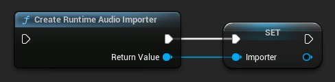
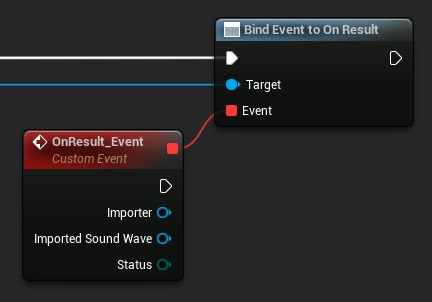
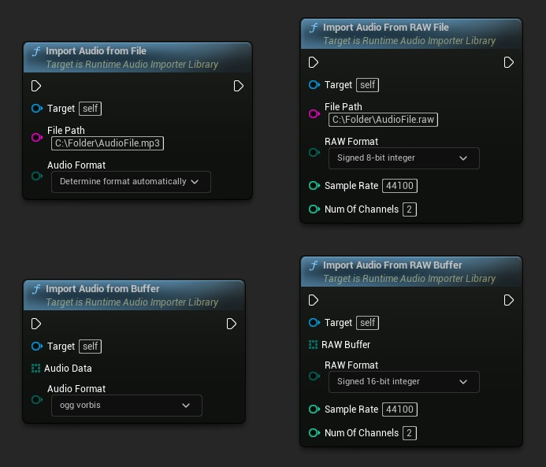
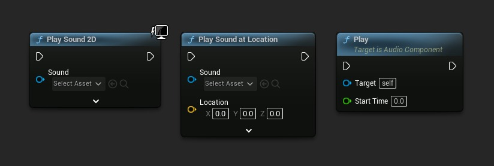
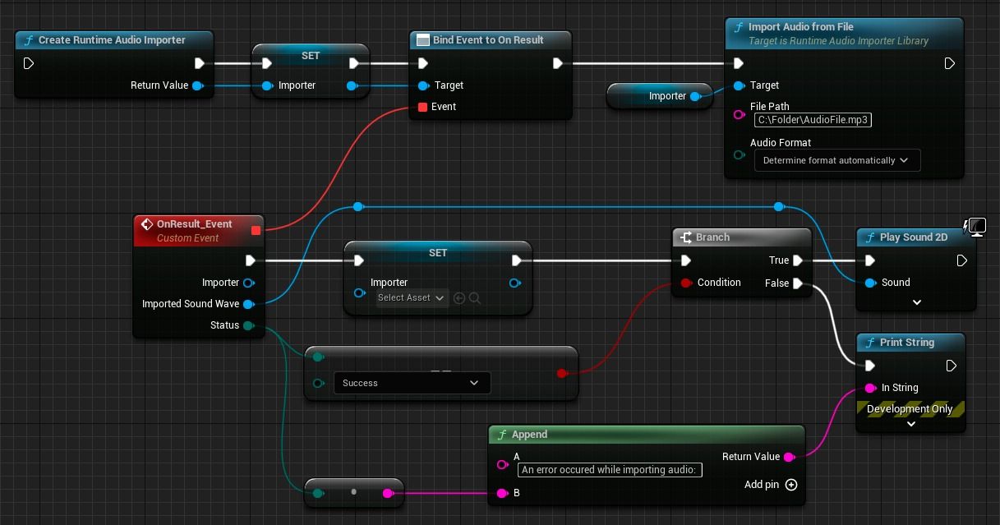
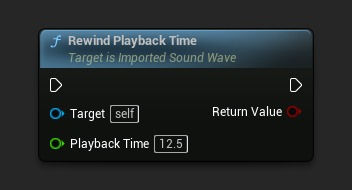
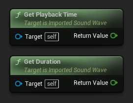
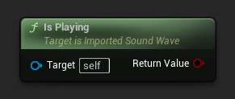
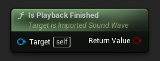
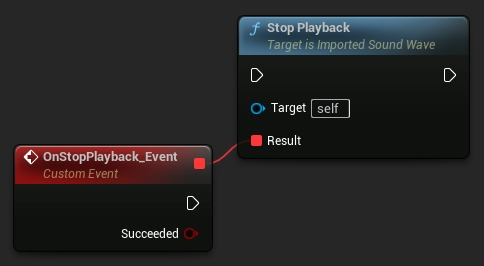

# 在虚幻引擎中运行时导入和播放声音

## 来源与状态

- 原始 URL：https://dev.epicgames.com/community/learning/tutorials/xB1z/fab-importing-and-playing-sounds-at-runtime-in-unreal-engine

## 运行时分类

- 类型：图文教程
- 判断：API 未识别到核心视频信号，可整理正文约 4704 字符。

## 摘要

了解如何使用运行时音频导入器插件在虚幻引擎中运行时导入和播放音频文件。本教程演示如何从文件或内存加载音频、控制播放以及动态操作声波。非常适合需要处理用户生成的内容、流音频或程序生成的声音的游戏。该插件支持MP3、WAV、FLAC、OGG等多种格式，具有跨平台兼容性。

## 中文整理

### 概览

**注意：** 本教程提供了简化的设置说明，以便快速实施。有关全面的文档和高级功能，请参阅[完整文档](https://docs.georgy.dev/runtime-audio-importer/)。访问[产品网站](https://solutions.georgy.dev/runtime-audio-importer)了解更多信息、演示和购买选项。

### 介绍

**[运行时音频导入器](https://www.fab.com/listings/66e0d72e-982f-4d9e-aaaf-13a1d22efad1)**是一个功能强大的插件，允许您在游戏过程中导入和播放音频文件，而无需将它们打包到游戏中。本教程将向您展示如何： 1. **[在运行时导入音频文件](https://docs.georgy.dev/runtime-audio-importer/import-audio)** 2. **[播放导入的音频](https://docs.georgy.dev/runtime-audio-importer/play-audio)** 3. **[控制播放（暂停、恢复、倒带）]（https://docs.georgy.dev/runtime-audio-importer/play-audio#controlling-playback）** 4. **[使用流音频]（https://docs.georgy.dev/runtime-audio-importer/sound-waves/streaming-sound-wave）**

### 支持的音频格式

该插件支持多种音频格式： 1. **MP3** 2. **WAV** 3. **FLAC** 4. **OGG **（**Vorbis** 和 **Opus**） 5. **BINK** 6. **RAW (PCM)**

### 基本音频导入和播放

### 第 1 步：创建运行时音频导入器

首先，创建一个运行时音频导入器对象：

### 第 2 步：处理导入结果

绑定OnResult事件接收导入的声波：

### 步骤 3：从文件或内存导入音频

选择合适的导入方式：

### 第四步：播放导入的声音

导入完成后，使用任何标准虚幻引擎音频函数播放声音：

### 完整的基本示例

完整的实现如下所示：

### 控制音频播放

### 倒带播放

要更改播放位置：

### 获取播放信息

检索有关当前播放的信息：

### 停止播放

要停止音频播放：

### 跟踪播放完成情况

播放结束时收到通知：

### 使用流音频

对于增量接收音频数据的场景（例如从服务器或麦克风输入流式传输）：

### 第 1 步：创建流式声波

### 第 2 步：播放声波（可选）

您甚至可以在添加音频数据之前开始播放：

### 第 3 步：附加音频数据

当音频数据可用时将其添加到流式声波中：

### 第 4 步：处理连续流

对于连续流式传输，请根据需要不断附加数据：

### 高级功能

Runtime Audio Importer 插件提供了许多超出本基本教程范围的高级功能： 1. **[音频导出](https://docs.georgy.dev/runtime-audio-importer/export-audio)**：将声波转换为各种格式 2. **[转码](https://docs.georgy.dev/runtime-audio-importer/transcode-audio)**：在音频格式之间转换 3. **[麦克风Capture](https://docs.georgy.dev/runtime-audio-importer/sound-waves/capturable-sound-wave)**：从输入设备录制音频 4. **[PCM 数据处理](https://docs.georgy.dev/runtime-audio-importer/pcm-data-handling)**：访问原始音频数据以进行自定义处理 5. **[语音活动检测](https://docs.georgy.dev/runtime-audio-importer/voice-activity-detection)**：检测某人何时说话 6. **[MetaSounds Integration](https://docs.georgy.dev/runtime-audio-importer/metasound-integration)**：将导入的音频与虚幻的 MetaSound 系统结合使用 7. **[声波属性](https://docs.georgy.dev/runtime-audio-importer/sound-wave-properties)**：控制音量、音高、循环和其他播放属性 8. **[像素流音频捕获](https://docs.georgy.dev/runtime-audio-importer/pixel-streaming-audio-capture)**：在像素流中从远程客户端捕获音频有关这些高级功能，请参阅[完整文档](https://docs.georgy.dev/runtime-audio-importer/)。

### 结论

使用**[运行时音频导入器](https://www.fab.com/listings/66e0d72e-982f-4d9e-aaaf-13a1d22efad1)**，您可以轻松地将动态音频导入和播放添加到虚幻引擎项目中。这使得用户生成的内容、音频流和程序声音生成等功能成为可能。如需其他帮助或自定义开发解决方案，请联系 [solutions@georgy.dev](mailto:solutions@georgy.dev) 或加入 [Discord 支持服务器](https://georgy.dev/discord)。
