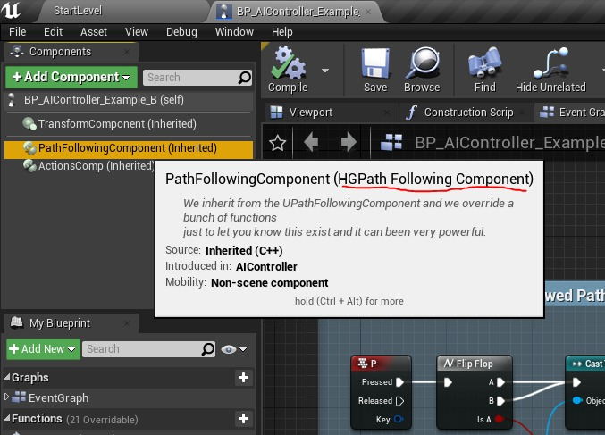
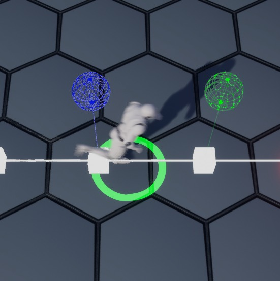

# 虚幻引擎 4 中的六边形网格寻路 (Part 3/3)

Source file: `hexagonal-grid-pathfinding-in-unreal-engine-4.origin.md`.

This document was split during ue-kb import to keep source chunks buildable.

### AHGAI控制器（可选）

我们继续讨论为什么如果我们想使用自定义的 PathFollowingComponent 就必须继承这个类。我们需要告诉继承的 AAIController 类我们要使用 PathFollowingComponent 的哪个类，为此我们需要 ObjectInitializer 父类成员及其 SetDefaultSubobjectClass 函数。我们将在派生类构造函数中的基类初始化时调用它......非常简单，对吗？好吧，好吧，我的英语很不及格（我很抱歉），但别担心，做起来比说起来容易：

```cpp
AHGAIController::AHGAIController(const FObjectInitializer &ObjectInitializer /*= FObjectInitializer::Get()*/)
	: Super(ObjectInitializer.SetDefaultSubobjectClass<UHGPathFollowingComponent>(TEXT("PathFollowingComponent")))
{
}
```

就这样，在构造函数中我们使用： **Super()** 并将 ObjectInitializer （和 SetDefaultSubobjectClass 函数调用）传递给父类的构造函数，这将替换默认的 PathFollowingComponent 类。因此，现在当我们基于我们的类创建 AIController 蓝图而不是默认的 PathFollowingComponent 时，它将具有我们的版本，但请注意 TEXT() 参数，为了正常工作，它必须与父 AIController 类的默认组件相同！ TEXT("PathFollowingComponent") 在您的蓝图中，您仍然会看到名为“PathFollowingComponent”的组件，但如果您用鼠标移过它，您将看到它是派生版本。 （太神奇了）



**注意：** AAIController 中有一个 SetPathFollowingComponet 函数（也是 BlueprintCallable），但我仍然需要弄清楚它是如何工作的，这就是为什么我更喜欢 ObjectInitializer 方法。
### UHGPathFollowingComponent（可选）

通过这个类，我们想向您展示这个组件有多么强大，在我们的示例中，我们重写了两个函数，并且我们将做一些非常简单的事情。我们要重写的第一个函数是 OnActorBump：

```cpp
/** called when moving agent collides with another actor */
virtual void OnActorBump(AActor *SelfActor, AActor *OtherActor, FVector NormalImpulse, const FHitResult &Hit) override;
```

当 AIController 拥有的 Pawn 碰撞到另一个 actor 时调用（就像 BeginOverlap 或 Hit，您已经知道这种行为）。我们决定创建一个委托并在我们想要的地方绑定到它，而不是将其暴露给蓝图。

```cpp
DECLARE_DYNAMIC_MULTICAST_DELEGATE_OneParam(FOnActorBumpDelegate, const FVector&, BumpLocation);
.
.
.
/**
 * Executed if a "Bump" happen, we bind this delegate on the activation of our Behavior Tree Service BTS_BindBump
 */
UPROPERTY(BlueprintAssignable, Category = "GraphAStarExample|PathFollowingComponent")
FOnActorBumpDelegate OnActorBumped;
```

在我们的示例中，我们将其绑定到行为树服务的激活上（请参阅 BTS_BindBump 蓝图）。在 OnActorBump 实现中，我们查看在移动或等待时是否发生碰撞，如果是，我们广播碰撞中涉及的其他演员的位置。

```cpp
void UHGPathFollowingComponent::OnActorBump(AActor *SelfActor, AActor *OtherActor, FVector NormalImpulse, const FHitResult &Hit)
{
	Super::OnActorBump(SelfActor, OtherActor, NormalImpulse, Hit);

	// Let's see if we are moving or waiting.
	if (GetStatus() != EPathFollowingStatus::Idle)
	{
		// Just broadcast the event.
		OnActorBumped.Broadcast(OtherActor->GetActorLocation());
	}
```

我们决定重写的第二个函数是 PathFollowingComponent 中最重要的函数之一，FollowPathSegment 函数是主要的路径跟随函数，它在我们沿着路径行进时滴答作响！我们将使用它进行简单的调试目的，我们绘制当前遵循的路径，当前路径段的起点和终点...

```cpp
/** follow current path segment */
virtual void FollowPathSegment(float DeltaTime) override;

void UHGPathFollowingComponent::FollowPathSegment(float DeltaTime)
{
	Super::FollowPathSegment(DeltaTime);

	/**
	 * FollowPathSegment is the main UE4 Path Follow tick function, and so when you want to add completely 
	 * custom coding you can use this function as your starting point to adjust normal UE4 path behavior!
```


### 项目核心蓝图
### 结论
## 相关链接

- [GraphAStarExample](https://github.com/ZioYuri78/GraphAStarExample)
- [Learn C++](https://learncpp.com)
- [Red Blob Games Hexagonal Grids](https://redblobgames.com/grids/hexagons)
- [Red Blob Games Implementation of Hex Grids](https://redblobgames.com/grids/hexagons/implementation.html)
- [Replacing The Pathfinder](https://unrealcommunity.wiki/replacing-the-pathfinder-h6eyeor0)
- [Neatly replacing NavMesh with A* in UE4](https://crussel.net/2016/06/05/neatly-replacing-navmesh-with-a-in-ue4)
- [Customize Path Following Every Tick](https://unrealcommunity.wiki/ai-navigation-in-cpp-customize-path-following-every-tick-2n7ju142)
