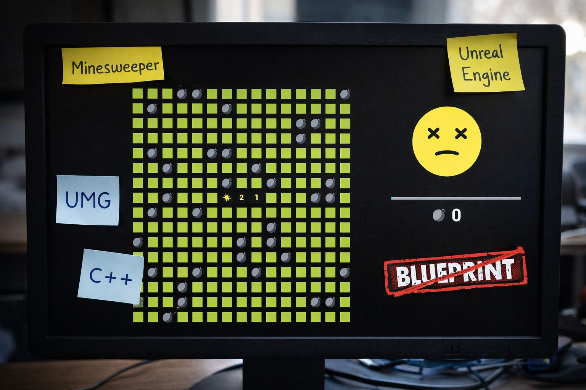

# 虚幻引擎中的扫雷 > UMG > 仅限 C++ > 无蓝图

## 来源与状态

- 原始 URL：https://dev.epicgames.com/community/learning/tutorials/B9J6/minesweeper-in-unreal-engine-umg-c-only-no-blueprints

## 运行时分类

- 类型：图文教程
- 判断：API 未识别到核心视频信号，可整理正文约 5528 字符。

## 摘要

在这篇文章中，我指出了仅使用 C++ 在 UMG 中实现扫雷游戏时的一些有趣的事情。

## 中文整理

### 概览



曾几何时，我想在虚幻引擎 5 中用 UMG 编写一些东西——严格使用 C++（没有蓝图）。同时我也有点好奇想快速了解一下Qt。 “听起来像是一个很酷的小项目，”我想，并根据这个存储库选择了经典的扫雷作为灵感：[https://github.com/Bollos00/LibreMines](https://github.com/Bollos00/LibreMines) 对该存储库的作者表示极大的敬意！这一切都是从一些无意识和冥想的重写开始的……抱歉——将结构和逻辑移植到虚幻的 UMG，同时在后台观看我最喜欢的 YouTube 节目。好时光，好东西！之后，我对代码进行了一些重构，简化了一些部分，删除了不必要的部分——最后就这样了。在这篇简短的文章中，我将重点关注我个人认为有趣的部分。如果有人想仔细看看实现，我在这里上传了这两个的四个源文件人们：[https://drive.google.com/drive/folders/1xXQ3A6WD-KV8PtLdHGmrp0ducspM8Eb9?usp=sharing](https://drive.google.com/drive/folders/1xXQ3A6WD-KV8PtLdHGmrp0ducspM8Eb9?usp=sharing)

### 建筑（有点……）

游戏大致分为两层：视图和模型。用户与视图交互。视图直接调用模型的方法。逻辑层（模型）不了解视图，并且仅通过回调进行通信。为此，我使用了 TFunction。

### 在 C++ 中创建小部件

在 C++ 中，可以使用以下命令创建内置小部件： UUserWidget::WidgetTree->ConstructWidget<WidgetType>()

### 字段初始化

```cpp
struct FDifficultySettings
{
	uint8 RowCount = 0;
	uint8 ColumnCount = 0;
	uint16 MineCount = 0;
};
```

一开始，玩家选择场地大小和地雷数量。在这里，这称为难度，由 FDifficultySettings 定义。

```cpp
void UMineSweeperHudWidget::NewGame(const FDifficultySettings& InDifficultySettings)
{
	LogicGameEngine.NewGame(InDifficultySettings.RowCount, InDifficultySettings.ColumnCount, InDifficultySettings.MineCount);

	auto* GameplayRootWidget = WidgetTree->ConstructWidget<UHorizontalBox>();

	FieldWidget = CreateField(InDifficultySettings.RowCount, InDifficultySettings.ColumnCount);

	CreateGameplayChild<UScaleBox>(*WidgetTree, *GameplayRootWidget, 1.f)->AddChild(FieldWidget);
	CreateGameplayChild<UVerticalBox>(*WidgetTree, *GameplayRootWidget, 0.3f)->AddChild(CreateGameplayPanel());
```

这些参数传递给属于View层的UMineSweeperHudWidget::NewGame。它调用 Model 中相应的 FGameEngine::NewGame 函数，然后构建以下 widget 层次结构： - Gameplay Root Widget UHorizo​​ntalBox - UScaleBox - 用于根据窗口大小缩放游戏场地 - Field Widget UUniformGridPanel - Gameplay Side Panel UVerticalBox 只有将 GameplayRootWidget 添加到根 widget 后，我​​们才能配置水平和垂直对齐。这是通过将小部件附加到其父级后获得的相应插槽（在本例中为 UOverlaySlot）来完成的。创建视觉游戏场：

```cpp
UUniformGridPanel* UMineSweeperHudWidget::CreateField(const uint8 InRowCount, const uint8 InColumnCount)
{
	auto* Grid = WidgetTree->ConstructWidget<UUniformGridPanel>();

	for (uint8 Row = 0; Row < InRowCount; ++Row)
	{
		for (uint8 Col = 0; Col < InColumnCount; ++Col)
		{
			auto* Cell = CreateWidget<UCell>(this);
			Cell->OnClicked = [this, Row, Col](const FKey& InKey)
```

UMineSweeperHudWidget::CreateField - 我们创建一个 UUniformGridPanel - 对于每个网格单元，我们创建一个 UCell 小部件 - 每个单元都有一个 OnClicked 处理程序： - 鼠标左键 - 显示单元 - 鼠标右键 - 切换标志 FGameEngine::NewGame 中发生了什么

```cpp
void FGameEngine::NewGame(const uint8 InRowCount, const uint8 InColumnCount, uint16 InMineCount)
{
	MineCount = InMineCount;
	RowCount = InColumnCount;
	ColumnCount = InColumnCount;

	Field.Empty();

	for (uint8 RowNum = 0; RowNum < InRowCount; ++RowNum)
	{
```

- 我们迭代整个逻辑字段 - 创建 FCell 实例并订阅标志状态更改 - 随机放置所有地雷 - 再次迭代以： - 计算相邻地雷的数量 - 将该数字存储在 FCell::Value 逻辑 FCell 结构中：

```cpp
class FCell
{
public:
	void ToggleState();

	ECellValue GetValue() const { return Value; }
	void SetValue(ECellValue InValue) { Value = InValue; }

	EFlagState GetFlagState() const { return FlagState; }
```

- 值 - 地雷或邻近地雷的数量 - FlagState - NoFlag / Flag / 问号 - IsHidden - 单元是否已被揭示

### 玩家行动

```cpp
void FGameEngine::ClearCell(const uint8 InRow, const uint8 InColumn)
{
    FCell& Cell = Field[InRow][InColumn];
	if (!Cell.IsHidden)
		return;
	if (Cell.GetFlagState() != EFlagState::NoFlag)
		return;

    const ECellValue CellValue = Cell.GetValue();
    if (CellValue == ECellValue::Mine)
```

在鼠标右键上，我们只需切换标志状态。鼠标左键有更多的逻辑： - 如果单元格被标记或已经显示 - 我们停止处理 - 如果我们戳到了地雷 - 那么游戏就结束了 - 否则： - 显示单元格 - 通知订阅者 - 如果值为 0 - 递归地显示邻居 - 最后，检查是否还有任何非我的隐藏单元格 - 如果没有 - 触发获胜事件

### 总结

这几乎就是我想分享的全部内容。一个小型扫雷游戏、一点 UMG、一些 C++ 和零个蓝图。项目完成，心理复选框勾选，乐趣实现。如果你们中的一些人只是滚动浏览这篇文章，点点头，然后想，“嗯……这也是一种方法”——我会更高兴！
