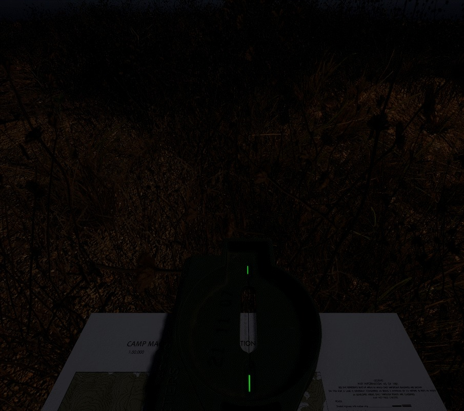
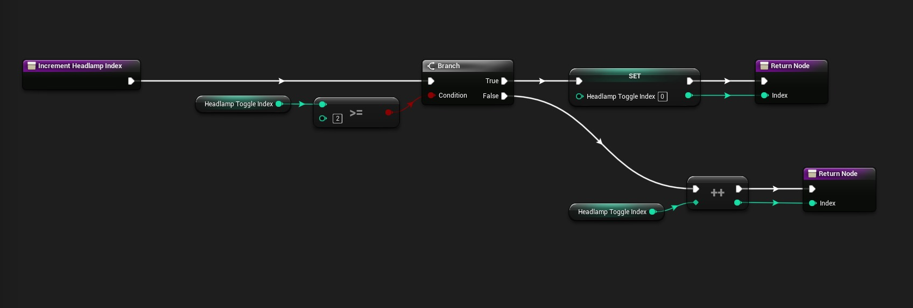
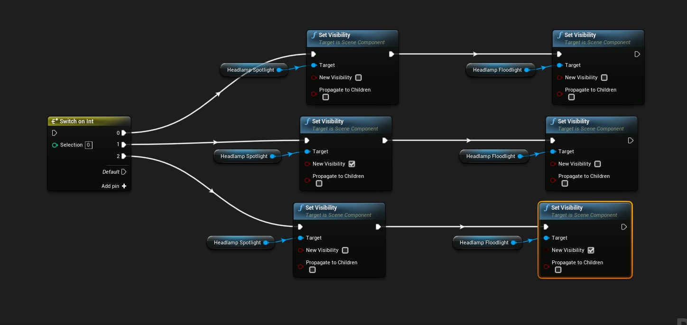
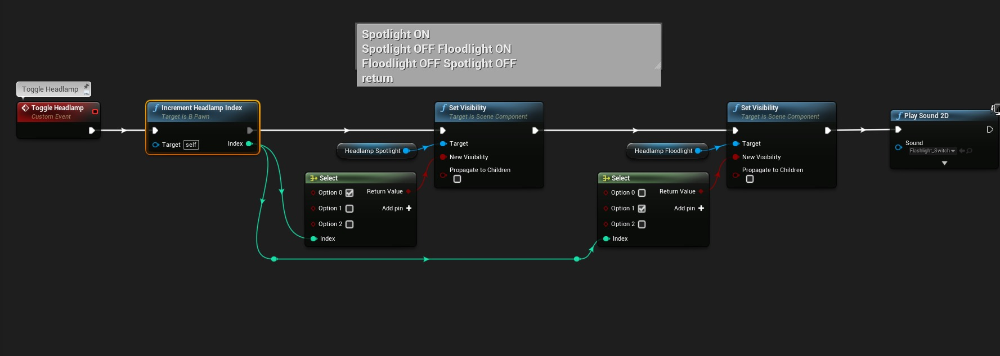

# 初学者微教程：三向开关

## 来源与状态

- 原始 URL：https://dev.epicgames.com/community/learning/tutorials/OPKl/unreal-engine-beginner-micro-tutorial-three-way-switch

## 运行时分类

- 类型：图文教程
- 判断：API 未识别到核心视频信号，可整理正文约 2230 字符。

## 摘要

使用选择节点在多个状态之间切换的实际示例。结果是易于阅读的蓝图代码。初学者教程。

## 中文整理

### 概览

本教程将介绍一些初学者可能不熟悉的有用节点 - 即 **选择节点。** 上面的 GIF 显示了一个实际应用 - 具有 3 种状态的头灯。 1. 聚光灯打开 2. 聚光灯关闭，泛光灯打开 3. 全部关闭 一旦您以简单、易于阅读的方式对其进行了编码，那么就很容易想象如何扩展它以包含更多状态或更改它以适应某些其他情况。

### 步骤一：

首先，我们将使用一个整数作为“计数器”。当输入事件被触发时，我们将使 int 上升。但！有几件事我们必须考虑。 1. 我们不希望整数计数超出我们将使用的状态数。 2. 一旦整数超过我们的状态数，我们就需要重置该整数。 3. 我们将整数默认值设置为-1。这确保了 0 状态被触发（如果这令人困惑，请不要费力思考。只需创建代码，放置一个打印字符串以在每次按下时显示 int，并且不要将 int 设置为 -1。您很快就会明白我的意思。）如果您刚刚开始使用蓝图，那么您可能首先想到要使用的是用于此类情况的开关节点。尝试一下，很快您就会处理很多节点，而这个“简单”的问题可能看起来太复杂了。看一下：

### 第 2 步（不好）：

这可能很难调试，并且不能很好地扩展。

### 第 2 步（好）：

在这里使用一些选择节点是更好的选择。功能最终是相同的，但是当您查看此代码时，您可以轻松地了解它在做什么。调试起来更加容易，对于我们需要的任何新状态，我们只需向选定的节点添加更多引脚即可。太容易了！嗯，我花了一段时间才弄清楚如何更好地利用其中一些节点，所以希望它可以帮助人们更快地掌握东西。附： - 如果你有很多状态，你可以使用枚举器而不是整数。然后你的 select 语句读起来就像一本书一样。设置需要做更多的工作，但是一个月后当您的眼睛和大脑感到疲倦时，您可能会很高兴您使代码尽可能具有可读性。
