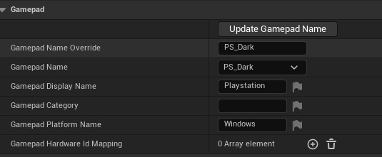
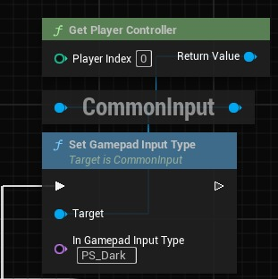

# CommonUI：在运行时切换 CommonInputBaseControllerData

## 来源与状态

- 原始 URL：https://dev.epicgames.com/community/learning/tutorials/KPOD/unreal-engine-commonui-switch-commoninputbasecontrollerdata-at-runtime

## 运行时分类

- 类型：图文教程
- 判断：API 未识别到核心视频信号，可整理正文约 8812 字符。

## 摘要

添加自定义 ControllerData 名称，以便在运行时在控制器布局和样式之间切换，无需 SDK。

## 中文整理

### 概览

嘿伙计们。今天，我将向您展示一个快速扩展，用于将自定义 ControllerData 添加到 CommonUI 插件，添加更多名称而不仅仅是“通用”，以便人们可以在运行时轻松切换它们。本教程是纯C++，依赖于纯复制粘贴+关键字重命名。但我会解释每个代码的内容。让我们开始吧。

### 通用输入控制器数据

CommonInputControllerData 保存已定义键及其对应的 Slate Brushes 的映射。它用于使 CommonUI 能够在 Action Widget、ActionBar 中显示按键的图标，或者通过从当前输入数据表查询按键的图标。该类包含一个 FName，它定义当前使用的控制器方案的名称。 Unreal 本身就在这里设置了“Generic”。安装和启用更多 SDK（例如 Xbox 或 PlayStation）时。方案名称的枚举列表展开。问题是，您不能直接自己添加新名称，因为名称字段不会立即进行编辑。我们将通过将我们自己的名称添加到类中+一个按钮来解决此问题，以将当前设置的名称覆盖为我们的自定义名称。通过“编辑器工具”>“新建 C++ 类”或通过您最喜欢的 IDE 创建新的 C++ 类。给这个类一个特定的名称，如“MyProjectCustom_ControllerData.h/.cpp”，记住这个名称，我们现在需要它。这是要使用的头文件 (*.h)：

**自定义控制器数据标头**

```cpp
#pragma once

#include "CoreMinimal.h"
#include "CommonInputBaseTypes.h"
#include "<ControllerData>.generated.h"

UCLASS()
class <ProjectAPI> U<ControllerData> : public UCommonInputBaseControllerData
{
	GENERATED_BODY()
```

改变这里的一些东西很重要。第一：通过替换 <ProjectAPI> 设置项目的 API。这通常是您项目的大写文件名，并附加“_API”。像“MYPROJECTNAME_API”一样，您的项目名称在这里是项目的模块。您可以通过使用文本编辑器/IDE 打开根目录中项目的 *.uproject 文件并查找模块名称来找到它。第二：将所有出现的 <ControllerData> 替换为“MyProjectCustom_ControllerData” 您现在还需要此标头的定义 (*.cpp) 文件：

**自定义控制器数据定义**

```cpp
#include "<ControllerData>.h"

U<ControllerData>::U<ControllerData>()
{
	GamepadName = GamepadNameOverride;
}

void U<ControllerData>::UpdateGamepadName()
{
	GamepadName = GamepadNameOverride;
```

相同的过程。将 <ControllerData> 替换为“MyProjectCustom_ControllerData” 该类现在只需向控制器数据添加一个新的 FName，并在调用 UpdateGamepadName() 或通过该类的构造函数时用我们自己的自定义 GamepadName 覆盖 UCommonInputBaseControllerData 的 GamepadName。由于我们无法在编辑器中直接调用此类的函数，因此我们需要添加一种直接与该类交互的方法 - 一个按钮 - 我们添加到编辑器窗口中。

### 定制细节定制

Unreal有一个直接与编辑器的细节面板交互的界面系统——IDetailCustomization界面。可以简单地继承它来扩展我们的 ControllerData 类的编辑器。由于编辑器使用 Slate，因此我们需要在 Unreal 基于代码的 UI 系统中编写 Button。我们再次从标题开始。创建一个新类并将其命名为“MyControllerData_CustomDetail.h/.cpp”。再次，记住这个名字。

**自定义详细信息自定义标头**

```cpp
#pragma once

#include "CoreMinimal.h"
#if WITH_EDITOR
#include <IDetailCustomization.h>
#include "<ControllerData>.h"

class F<CustomModule> : public IDetailCustomization
{
public:
```

在这里，我们现在将所有出现的 <CustomModule> 替换为名称“MyControllerData_CustomDetail”。我们还再次将 <ControllerData> 替换为我们的 ControllerData 名称。这会将详细信息链接到我们的 ControllerData 类。您可能会在此标头末尾看到 #if WITH_EDITOR 和 #endif。这些指令确保此详细信息仅在编辑器中使用，并且不会被烘焙和打包。因为我们无法将编辑器扩展打包到我们的游戏可执行文件中。除此之外，标题并不引人注目。但定义不是：

**自定义详细信息定义**

```cpp
#include "<CustomModule>.h"
#if WITH_EDITOR
#include "DetailCategoryBuilder.h"
#include "DetailLayoutBuilder.h"
#include "DetailWidgetRow.h"
#include <IDetailChildrenBuilder.h>
#include "Widgets/Input/SButton.h"
#include "Widgets/Text/STextBlock.h"
#include "Editor/PropertyEditor/Public/PropertyEditorModule.h"
#include "Modules/ModuleManager.h"
```

同样，我们首先将 <CustomModule> 替换为此类的名称，并将 <ControllerData> 替换为我们的 ControllerData 类的名称。现在一些信息：我们再次将整个定义包装在WITH_EDITOR指令中，以确保无错误包装。 void F<CustomModule>::CustomizeDetails(IDetailLayoutBuilder& DetailLayout) 为我们创建一个 Slate 对象，这是一个 Text 和 SButton，其中包含一个 SText。和UMG 有点像。我们的文本将显示“更新游戏手柄名称”。 Button 的 .OnClicked(FOnClicked::CreateSP(this, &F<CustomModule>::OnUpdateGamepadNameClicked)) 将 OnClicked 链接到我们的 ControllerData 类的函数 `UpdateGamepadName()` 。因此，每次我们在编辑器中单击它时，它都会使用我们的自定义名称更新 GamepadName。 FReply F<CustomModule>::OnUpdateGamepadNameClicked() 是一个调试函数回复，也附加到按钮上。它将一条消息打印到编辑器的输出日志中，以确保单击已通过或失败。

### 依赖关系

为了使其按预期运行，我们需要向项目添加一些依赖项。进入项目的 Source-Root 目录。您会找到 *.build.cs 文件。使用 IDE（或文本编辑器）打开它。在里面你会发现这样的一行： PublicDependencyModuleNames.AddRange(new[]{"Core", ...etc});和 privateDependencyModuleNames.AddRange(new[]{});我们想要将以下内容添加到 PublicDependency Range： "Slate","SlateCore","UMG","CommonUI","CommonInput" 像这样： PublicDependencyModuleNames.AddRange(new[]{"Core","Slate","SlateCore","UMG","CommonUI","CommonInput"});这将允许我们的代码包含 Slate 标头并处理 CommonUI 类。现在我们只需要确保我们的项目也可以处理编辑器标题。就像 IDetails 接口一样。但是，由于我们无法打包或烘焙这些依赖项，因此我们需要确保它仅在编辑器环境中使用。 Unreal 提供了一个 bool 来检查编辑器状态： Target.bBuildEditor 我们可以在构建类的 if 语句中使用它： if (Target.bBuildEditor) { } 我们现在在此语句中向我们的依赖项添加一个新的公共 Range。要处理 Slate 样式和编辑器扩展，我们需要： EditorStyle、UnrealEd 和 EditorScriptingUtilities 要处理详细信息，我们还需要： PropertyEditor 现在生成的语句是这样的： if (Target.bBuildEditor) { PublicDependencyModuleNames.AddRange(new string[]{ "EditorStyle", "PropertyEditor", "UnrealEd", "EditorScriptingUtilities" });您只需将其添加到正常的 PublicDependency Range 下面即可。

### 添加扩展模块

要启用我们的自定义详细信息，我们需要将其作为模块添加到我们的项目中。每个项目都有自己的模块类。它也位于 Source-Root 目录中的 *.build.cs 旁边。 Module类被命名为ProjectName.h和ProjectName.cpp 打开CPP文件。在里面，我们首先需要编辑一下包含内容：

**模块包括**

```cpp
#include "<YourProjectName>.h"
#include "<CustomModule>.h"
#include "Modules/ModuleManager.h"

#if WITH_EDITOR
	#include "PropertyEditorModule.h"
#endif
```

与往常相同的过程，将 <YourProjectName> 替换为模块 *.h 文件的文件名，并将 <CustomModule> 替换为详细自定义的类名称。 if 指令再次确保不包含打包构建中的内容。现在，在包含的正下方，您将项目定义为主模块：

**添加主模块**

```cpp
// The primary game module implementation for <YourProjectName>
IMPLEMENT_PRIMARY_GAME_MODULE(F<YourProjectName>Module, <YourProjectName>, "<YourProjectName>");
```

这确保我们可以在此基础上添加新模块。我们现在需要用我们自己的实现覆盖 StartupModule()。

**启动模块()**

```cpp
void F<YourProjectName>Module::StartupModule()
{
	// Register customizations
	#if WITH_EDITOR
		FPropertyEditorModule& PropertyModule = FModuleManager::LoadModuleChecked<FPropertyEditorModule>("PropertyEditor");
		PropertyModule.RegisterCustomClassLayout("<ControllerData>", FOnGetDetailCustomizationInstance::CreateStatic(&F<CustomModule>::MakeInstance));
		PropertyModule.NotifyCustomizationModuleChanged();
	#endif
	// Add other initialization code here if needed
}
```

Again, replace the <YourProjectName>, <ControllerData> and <CustomModule>. This registers our new Details as a new Module within the Main module, allowing to have them both enabled. Since we Added the Module, we now also need to remove it.因此，我们添加 ShutdownModule()

**关闭模块()**

```cpp
void F<YourProjectName>Module::ShutdownModule()
{
	// Unregister customizations
	#if WITH_EDITOR
		if (FModuleManager::Get().IsModuleLoaded("PropertyEditor"))
		{
			FPropertyEditorModule& PropertyModule = FModuleManager::GetModuleChecked<FPropertyEditorModule>("PropertyEditor");
			PropertyModule.UnregisterCustomClassLayout("<ControllerData>");
		}
	#endif
```

这将项目本身定义为启动模块，其中添加了修改和自定义。我建议再次重新生成可视项目文件（在 Rider 中，使用生成项目文件按钮）。然后编译解决方案并打开编辑器。模块头 ProjectName.h 仅包含以下代码：

**.h**

```cpp
#pragma once

#include "CoreMinimal.h"

class F<YourProjectName>Module : public FDefaultGameModuleImpl
{
public:
	virtual void StartupModule() override;
	virtual void ShutdownModule() override;
};
```

### 创建自定义控制器数据

如果您尚未在项目中创建 CommonInputControllerData，现在就可以创建。在内容浏览器中右键单击 > 创建新蓝图。但是，您可以展开弹出窗口底部的“所有类”列表，而不是预定义的类。在搜索字段中输入自定义 ControllerData 类的名称并选择它。如果您已经创建了一个，则只需将其重新设置为自定义 ControllerData 类即可。打开它，打开“类设置”，在顶部设置“父级”的位置，打开选择器并选择您的自定义 ControllerData 类。关闭窗口并再次打开资源，以确保编辑器正确更新。您现在应该在详细信息中看到这一点：



虽然您无法更改“游戏手柄名称”，但您可以编辑“游戏手柄名称覆盖”，这是我们的自定义名称。点击“更新游戏手柄名称”按钮后，新输入的名称将同时设置为游戏手柄名称和显示名称。如果未在显示屏中设置，您现在只需选择它即可。要在运行时更改游戏手柄方案，请使用以下 3 个蓝图节点：



### 结论

就这样。您现在可以根据需要为不同方案添加游戏手柄名称和图标。玩得开心:)
