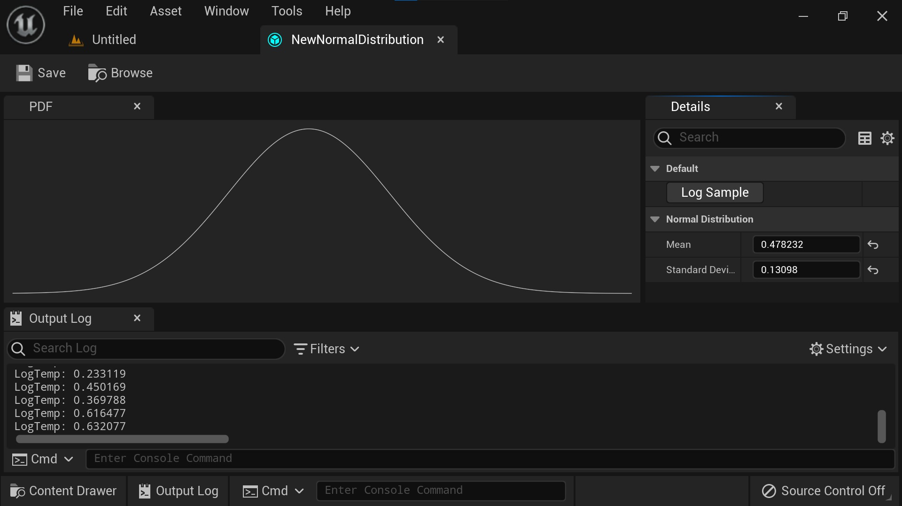
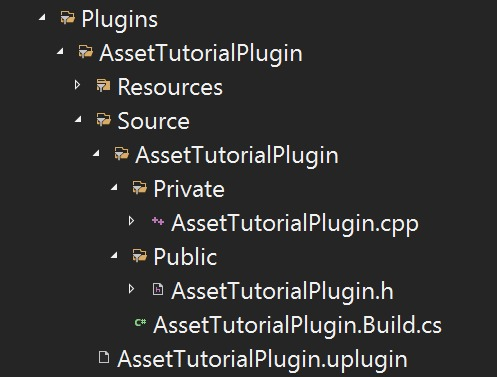

# 使用 C++ 自己的编辑器创建自定义资源类型 (Part 1/2)

Source file: `unreal-engine-creating-a-custom-asset-type-with-its-own-editor-in-c.origin.md`.

This document was split during ue-kb import to keep source chunks buildable.

## 来源与状态

- 原始 URL：https://dev.epicgames.com/community/learning/tutorials/vyKB/unreal-engine-creating-a-custom-asset-type-with-its-own-editor-in-c
## 运行时分类

- 类型：图文教程
- 判断：API 未识别到核心视频信号，可整理正文约 23489 字符。
## 摘要

在本教程中，您将学习如何创建一个代码插件，将自定义资源类型（带有自己的编辑器）添加到引擎中。作为示例，我将引导您创建正态分布资产类型，其平均值和标准差属性可以在图形编辑器中设置。
## 中文整理
### 介绍

在虚幻引擎中，资产是具有持久属性的对象，可以在编辑器中进行操作。 Unreal 附带多种资源类型，从 UStaticMesh 到 UMetasoundSources 等等。自定义资源类型是实现专门对象的好方法，这些对象需要专门构建的编辑器来进行高效操作。通过在插件中实现这些类型，它们可以在项目和开发人员之间轻松共享。在本教程中，我们将编写一个插件，将自定义资源类型添加到引擎中。我们的资产类型将代表我们可以从中抽取样本的正态分布。我们将设置一个编辑器来显示分布的概率密度函数 (PFD)，并让我们同时编辑其平均值和标准差。


### 入门

要继续操作，请打开一个空白的 C++ Unreal 游戏项目。首先导航到顶部菜单栏中的“编辑”>“插件”，然后单击对话框窗口左上角的“添加”。选择“Blank”插件模板，输入名称“AssetTutorialPlugin”，然后单击“创建插件”。插件创建完成后，切换到 Visual Studio。应出现一个对话框，要求您重新加载修改后的解决方案。单击“重新加载全部”并在出现提示时停止调试。如果创建插件时 Visual Studio 未打开，请打开项目文件夹，右键单击 .uproject 文件并单击“生成 Visual Studio 项目文件”，然后打开生成的 .sln 文件。



在 Visual Studio 中，在解决方案资源管理器中找到项目的 Plugins 文件夹。它应该具有如上所示的结构。 .uplugin 文件包含有关您的插件的信息以及启用插件时要加载的模块列表。模块包含代码和编译设置（在模块的 .Build.cs 文件中设置）。
### 添加仅编辑器模块

Unreal 为我们创建了一个与我们的插件同名的模块。它在我们的 .uplugin 文件中作为运行时模块列出。为了实现我们的自定义资源编辑器，我们需要一个未在打包游戏中加载的附加编辑器模块。在文件资源管理器中打开项目的文件夹，导航到“Plugins\AssetTutorialPlugin\Source”并创建位于此处的“AssetTutorialPlugin”模块文件夹的副本。将副本重命名为“AssetTutorialPluginEditor”，并将所有文件名和文件内容中出现的所有“AssetTutorialPlugin”替换为“AssetTutorialPluginEditor”。然后导航回项目的根文件夹，右键单击 .uproject 文件并重新生成 Visual Studio 项目文件。打开 .uplugin 文件并编辑“模块”列表以包含新的编辑器模块，如下所示。

```
	"Modules": [
		{
			"Name": "AssetTutorialPlugin",
			"Type": "Runtime",
			"LoadingPhase": "Default"
		},
		{
			"Name": "AssetTutorialPluginEditor",
			"Type": "Editor",
			"LoadingPhase": "Default"
```
### 创建自定义资产类型

通过在 Visual Studio 中构建和调试项目并将构建配置设置为“开发编辑器”来重新启动虚幻编辑器，然后导航到顶部菜单栏中的“工具>新建 C++ 类...”。切换到对话框顶部的“所有类”，然后选择“对象”作为父类。单击“下一步”，将“类类型”设置为“公共”，输入“NormalDistribution”作为名称，然后从名称输入字段旁边的下拉菜单中选择“AssetTutorialPlugin (Runtime)”作为目标模块。然后点击“创建班级”。创建完成后，切换回 Visual Studio 并重新加载解决方案（出现提示时停止调试）。我们现在将声明并定义我们的自定义资产类型。在此步骤中，您决定资产类型应具有哪些属性以及它支持哪些操作。出于本教程的目的，我们将创建一个简单的资产类型，允许使用 std::normal_distribution 从具有给定均值和标准差的正态分布中抽取样本。
### 声明自定义资产类型

打开新创建的“NormalDistribution.h”以声明自定义资源类型，如下所示。

```cpp
#pragma once

#include "CoreMinimal.h"
#include "UObject/NoExportTypes.h"
#include <random>
#include "NormalDistribution.generated.h"

UCLASS(BlueprintType)
class ASSETTUTORIALPLUGIN_API UNormalDistribution : public UObject
{
```

我们的自定义资源类型的声明方式与任何其他 UObject 派生类类似，因此我们包含 . generated.h 文件并确保调用 UCLASS() 和 GENERATED_BODY() 宏。
### 定义自定义资产类型

现在打开“NormalDistribution.cpp”来定义自定义资产类型的功能，如下所示。

```cpp
#include "NormalDistribution.h"

UNormalDistribution::UNormalDistribution()
    : Mean(0.5f)
    , StandardDeviation(0.2f)
{}

float UNormalDistribution::DrawSample()
{
    return std::normal_distribution<>(Mean, StandardDeviation)(RandomNumberGenerator);
```

Unreal 现在可以识别我们的 NormalDistribution 类型，正如您在构建项目并重新启动 Unreal 编辑器时所看到的那样，然后打开“Tools>Class Viewer”，确保未选中“Actors Only”过滤器并搜索“NormalDistribution”。但是，我们还无法通过在内容浏览器中右键单击来创建 NormalDistribution 资源。为了实现这一点，我们需要将 UNormalDistribution 注册为资产类型并提供一个工厂来创建新实例。
### 注册自定义资产类型

再次打开“工具>新建 C++ 类...”对话框。这次，选择“None”作为父类，将“Class Type”设置为“Public”，将类命名为“NormalDistributionActions”，并选择“AssetTutorialPluginEditor（编辑器）”作为目标模块。然后单击“创建类”并像以前一样返回到 Visual Studio。我们需要实现一个继承自 IAssetTypeActions 的类来向引擎注册我们的资产类型。通过重写界面的方法，我们可以设置资产在编辑器的内容浏览器中的外观和行为。我们可以选择名称、类别、颜色、右键单击资产时上下文菜单的操作等。打开“NormalDistributionActions.h”为我们的资产类型声明资产类型操作，如下所示。请注意，类名称为“FNormalDistributionAssetTypeActions”，以符合 Unreal 命名约定。

```cpp
#pragma once

#include "CoreMinimal.h"
#include "AssetTypeActions_Base.h"

class FNormalDistributionAssetTypeActions : public FAssetTypeActions_Base
{
public:
	UClass* GetSupportedClass() const override;
	FText GetName() const override;
```

使用“NormalDistributionActions.cpp”定义资产类型操作的函数，如下所示。

```cpp
#include "NormalDistributionActions.h"
#include "NormalDistribution.h"

UClass* FNormalDistributionAssetTypeActions::GetSupportedClass() const
{
    return UNormalDistribution::StaticClass();
}

FText FNormalDistributionAssetTypeActions::GetName() const
{
```
### 注册资产类型操作

FNormalDistributionAssetTypeActions 不是从 UObject 派生的，因此引擎和编辑器不知道它的存在。我们需要手动将其注册到引擎的AssetToolsModule中。由于我们希望只要插件处于活动状态，我们的自定义资源类型就可以在编辑器中使用，因此手动注册的好地方是我们的 FAssetTutorialPluginEditorModule 类的 StartupModule() 函数。当首次加载模块并调用 StartupModule() 函数时，将创建此类型的唯一对象。因此我们可以使用它来执行模块范围的设置和注册。当模块关闭时，我们还将取消注册资产类型操作。打开“AssetTutorialPluginEditor.h”来声明我们的编辑器模块类，如下所示。

```cpp
#pragma once

#include "CoreMinimal.h"
#include "Modules/ModuleManager.h"
#include "NormalDistributionActions.h"

class FAssetTutorialPluginEditorModule : public IModuleInterface
{
public:
	void StartupModule() override;
```

打开“AssetTutorialPluginEditor.cpp”来定义我们的编辑器模块类的函数，如下所示。

```cpp
#include "AssetTutorialPluginEditor.h"

void FAssetTutorialPluginEditorModule::StartupModule()
{
	NormalDistributionAssetTypeActions = MakeShared<FNormalDistributionAssetTypeActions>();
	FAssetToolsModule::GetModule().Get().RegisterAssetTypeActions(NormalDistributionAssetTypeActions.ToSharedRef());
}

void FAssetTutorialPluginEditorModule::ShutdownModule()
{
```
### 添加模块依赖项

现在编译将会失败，因为我们的资产类型操作类位于 AssetTutorialPluginEditor 模块中，而我们的 UNormalDistribution 则始终位于 AssetTutorialPlugin 模块中。我们需要添加运行时模块作为编辑器模块的依赖项。此外，我们需要添加对 UnrealEd 模块的依赖项，这是注册资产类型操作所需的。打开“AssetTutorialPluginEditor.Build.cs”并编辑以“PrivateDependencyModuleNames.AddRange(...)”开头的语句，如下所示。

```
		PrivateDependencyModuleNames.AddRange(
			new string[]
			{
				"CoreUObject",
				"Engine",
				"Slate",
				"SlateCore",
				"AssetTutorialPlugin",
				"UnrealEd"
				// ... add private dependencies that you statically link with here ...
```
