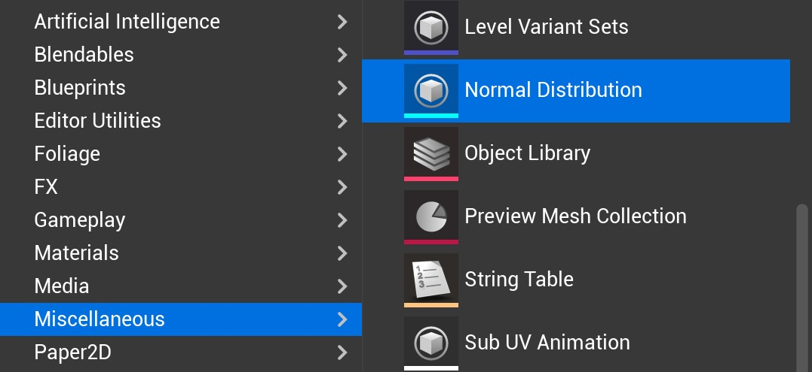
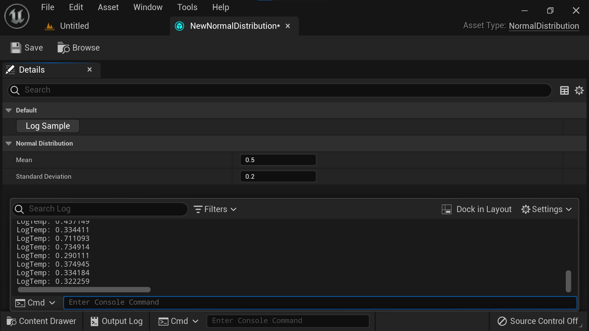

# 使用 C++ 自己的编辑器创建自定义资源类型 (Part 2/2)

Source file: `unreal-engine-creating-a-custom-asset-type-with-its-own-editor-in-c.origin.md`.

This document was split during ue-kb import to keep source chunks buildable.

### 创建工厂

在内容浏览器中右键单击以创建新资产时，我们的正态分布资产类型仍然没有显示。但我们已经快到了！再次在虚幻编辑器中使用“Tools>New C++ Class...”，切换到“All Classes”，搜索“factory”并选择“Factory”作为父类。您可能需要折叠一些层次结构，例如“ActorFactory”，直到仅出现“Factory”。选择“Public”，将其命名为“NormalDistributionFactory”，然后选择“AssetTutorialPluginEditor（编辑器）”作为目标模块。创建类并切换回 Visual Studio。从 UFactory 派生的类用于指定所选资产类型的创建或导入逻辑。有些工厂在创建资产时会打开一个对话框来收集用户的设置。我们将创建一个最小工厂，当请求资产类型的新实例时，它基本上只是包装对 NewObject() 的调用。打开“NormalDistributionFactory.h”并声明我们的工厂类型，如下所示。

```cpp
#pragma once

#include "CoreMinimal.h"
#include "Factories/Factory.h"
#include "NormalDistributionFactory.generated.h"

UCLASS()
class UNormalDistributionFactory : public UFactory
{
    GENERATED_BODY()
```

打开“NormalDistributionFactory.cpp”并定义构造函数和 FactoryCreateNew()，如下所示。在构造函数中将 bCreateNew 设置为 true 将允许我们在内容浏览器中创建我们类型的资源！

```cpp
#include "NormalDistributionFactory.h"
#include "NormalDistribution.h"

UNormalDistributionFactory::UNormalDistributionFactory()
{
    SupportedClass = UNormalDistribution::StaticClass();
    bCreateNew = true;
}

UObject* UNormalDistributionFactory::FactoryCreateNew(UClass* Class, UObject* InParent, FName Name, EObjectFlags Flags, UObject* Context, FFeedbackContext* Warn)
```

UNormalDistributionFactory 确实派生自 UObject，因此当加载其模块时，其 UCLASS 会自动注册到引擎。编译并运行虚幻编辑器，在内容浏览器中右键单击，导航至“Miscellaneous>Normal Distribution”，看看我们已经取得了什么成果。



创建一个新的正态分布资产并双击它以打开其编辑器。您将看到默认的资产编辑器，它仅显示可用于编辑资产属性的详细信息视图。请注意，我们有一个“Log Sample”按钮，因为我们将“CallInEditor”说明符添加到 UNormalDistribution 中 LogSample 函数的 UFUNCTION() 声明中。您可以使用平均值和标准差，按“记录样本”并检查输出日志以验证我们的资产是否按预期工作。


### 创建资产编辑器

我想使用概率分布函数的交互式图来编辑我的正态分布。为此，我们需要创建一个 Slate 小部件来绘制一些线条，然后我们需要让引擎知道我们要在资源编辑器中使用它。
### 创建交互式 PDF 绘图板小部件

“Tools>New C++ Class...”，“None”作为父类，设置为“Public”，命名为“SNormalDistributionWidget”，选择“AssetTutorialPluginEditor（编辑器）”作为目标模块。创建类并切换回 Visual Studio。 Slate 是 Unreal 的 UI 框架，可用于在应用程序的窗口中定位和绘制交互式文本、线条、纹理、材质等。 Unreal 附带了大量的小部件，从处理布局的面板小部件（如 SHorizo​​ntalBox）到显示（可能是动态）内容的 STextBlock 之类的叶小部件。现在，我们将创建一个叶子小部件，它将显示 PDF 绘图，并让我们通过在其上拖动鼠标来编辑分布。打开“SNormalDistributionWidget.h”并声明我们的小部件，如下所示。

```cpp
#pragma once

#include "CoreMinimal.h"
#include "Widgets/SLeafWidget.h"

DECLARE_DELEGATE_OneParam(FOnMeanChanged, float /*NewMean*/)
DECLARE_DELEGATE_OneParam(FOnStandardDeviationChanged, float /*NewStandardDeviation*/)

class SNormalDistributionWidget : public SLeafWidget
{
```

让我们对上面的声明进行一些详细说明。我们首先声明一些委托类型：FOnMeanChanged 和 FOnStandardDeviationChanged。这些类型的对象可以绑定到其他对象的成员函数，当我们的小部件触发某些事件时，这些对象会做出反应。通过使用委托，我们的小部件与 UNormalDistribution 实现保持分离。我们继续声明我们的 SLeafWidget 派生类型，利用一些 Slate 宏来使用 Slate 的声明语法来实例化我们的小部件。像 Mean 和 StandardDeviation 这样的 Slate 属性也可以使用委托对象进行初始化，这样我们就可以在需要时轮询其他对象来获取这些值。当我们的小部件在声明性 Synatx 中实例化时，Slate 会调用 Construct() 成员函数。其余的公共函数重写虚拟 SWidget 成员函数来定义我们的小部件的行为。 Slate 会给我们分配一个特定的 FGeometry，它代表屏幕上我们可以绘制的一个矩形。它会考虑我们想要的尺寸，但我们不能依赖分配的几何形状为该尺寸。我们希望绘图有一个动态边距，能够响应分配的几何图形，这就是 GetPointsTransform() 的目的。接下来，打开“SNormalDistributionWidget.cpp”来定义我们的小部件的功能，如下所示。

```cpp
#include "SNormalDistributionWidget.h"
#include "Editor.h"

void SNormalDistributionWidget::Construct(const FArguments& InArgs)
{
    Mean = InArgs._Mean;
    StandardDeviation = InArgs._StandardDeviation;
    OnMeanChanged = InArgs._OnMeanChanged;
    OnStandardDeviationChanged = InArgs._OnStandardDeviationChanged;
}
```

上面显示的实现的一些细节：在 OnPaint() 中，我们传递了一个“OutDrawElements”列表，我们可以向其中添加文本、线条等来构建视觉表示。我们的 PDF 在多个点进行评估，x 值范围从 0 到 1。计算出的“PointTransform”负责将点从其原始空间放置到“AllottedGeometry”指定的空间。使用 FSlateDrawElement::MakeLines() 添加将变换后的点连接到绘制元素的线后，我们只需返回“LayerId”，因为我们只绘制 1 层元素。为了在通过将鼠标拖动到小部件上来设置平均值和标准差时启用撤消/重做，我们分别在 OnMouseButtonDown() 和 OnMouseButtonUp() 中的 GEditor 上使用 BeginTransaction() 和 EndTransaction()。我们还捕获任何单击的鼠标，直到释放鼠标按钮，这样即使在拖出小部件时我们也可以编辑我们的分布。在 OnMouseMove() 中，我们仅在当前捕获鼠标时更新分布。平均值和标准偏差是根据鼠标的位置计算的，考虑到分配的几何形状和我们当前的点变换，然后在它们被绑定的情况下调用事件处理程序。最后，GetPointsTransform() 会考虑动态边距并翻转 y 轴，因为 Slate 小部件的原点位于左上角。
### 创建资产编辑器工具包

现在我们有了一个小部件，我们仍然需要在打开正态分布资产编辑器时显示它。有两种方法可以实现此目的：要么保留显示正在编辑的资产的详细信息视图的默认资产编辑器，要么创建并注册从 IDetailCustomization 派生的类。这样的类可以将交互式 PDF 图添加到正态分布的所有详细视图中。另一种方法是创建一个从 FAssetEditorToolkit 派生的类，并使用我们的自定义资产编辑器覆盖默认资产编辑器。我们将采用后一种方式，因为它使我们能够在默认资产编辑器布局中包含输出日志。最后一次，运行虚幻编辑器，转到“Tools>New C++ Class...”，选择“None”作为父模块，将其设置为“Public”，将其命名为“NormalDistributionEditorToolkit”，然后选择“AssetTutorialPluginEditor (Editor)”作为目标模块。创建类并切换回 Visual Studio。使用我们自己的资产编辑器工具包，我们可以定义资产编辑器的布局并注册选项卡生成器，这些选项卡生成器用于使用包含我们选择的小部件的选项卡填充我们的布局。打开“NormalDistributionEditorToolkit.h”来声明我们的资产编辑器工具包类，如下所示。

```cpp
#pragma once

#include "CoreMinimal.h"
#include "NormalDistribution.h"
#include "Toolkits/AssetEditorToolkit.h"

class FNormalDistributionEditorToolkit : public FAssetEditorToolkit
{
public:
	void InitEditor(const TArray<UObject*>& InObjects);
```

我们将在 InitEditor() 中创建布局，并在相应的函数中（取消）注册选项卡生成器。我们还为 FAssetEditorToolkit 的纯虚拟成员函数提供重写。请注意，我们不会在以世界为中心的模式下使用此编辑器。此外，我们保留一个指向 UNormalDistribution 的普通指针...

```cpp
#include "NormalDistributionEditorToolkit.h"
#include "Widgets/Docking/SDockTab.h"
#include "SNormalDistributionWidget.h"
#include "Modules/ModuleManager.h"

void FNormalDistributionEditorToolkit::InitEditor(const TArray<UObject*>& InObjects)
{
	NormalDistribution = Cast<UNormalDistribution>(InObjects[0]);

	const TSharedRef<FTabManager::FLayout> Layout = FTabManager::NewLayout("NormalDistributionEditorLayout")
```
### 使用我们的资产编辑器工具包

```cpp
	void OpenAssetEditor(const TArray<UObject*>& InObjects, TSharedPtr<class IToolkitHost> EditWithinLevelEditor) override;
```

```cpp
#include "NormalDistributionEditorToolkit.h"

void FNormalDistributionAssetTypeActions::OpenAssetEditor(const TArray<UObject*>& InObjects, TSharedPtr<class IToolkitHost> EditWithinLevelEditor)
{
    MakeShared<FNormalDistributionEditorToolkit>()->InitEditor(InObjects);
}
```


### 结论
## 相关链接

- [Code on Github](https://github.com/JanKXSKI/AssetTutorialPlugin)
