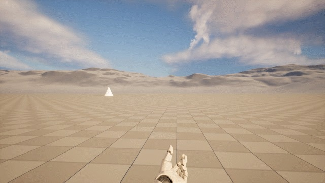
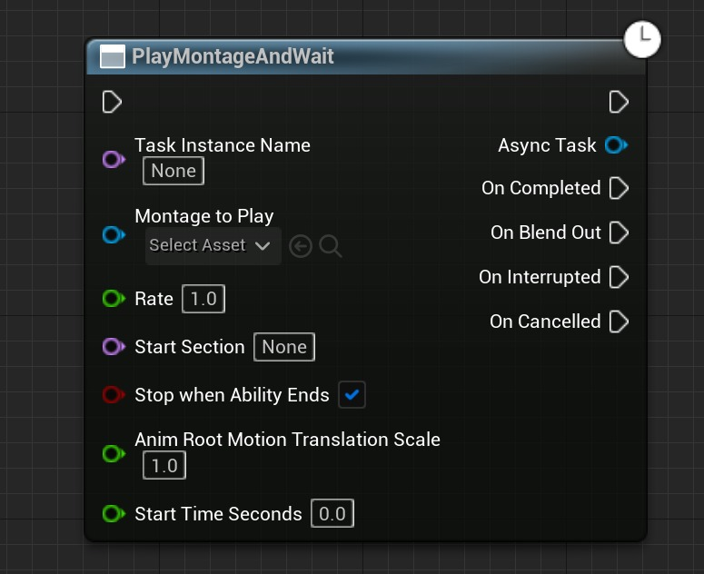
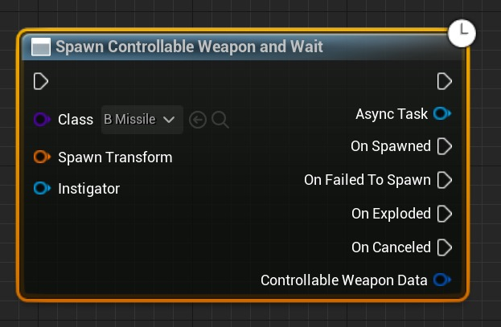

# 创建自定义异步能力任务 (Part 1/2)

Source file: `unreal-engine-creating-a-custom-async-ability-task.origin.md`.

This document was split during ue-kb import to keep source chunks buildable.

## 来源与状态

- 原始 URL：https://dev.epicgames.com/community/learning/tutorials/Yav7/unreal-engine-creating-a-custom-async-ability-task
## 运行时分类

- 类型：图文教程
- 判断：API 未识别到核心视频信号，可整理正文约 11766 字符。
## 摘要

本教程使用实际示例引导您完成创建自定义能力任务的过程。它概述了能力任务是什么、您何时可能想要使用能力任务，并详细介绍了构成能力任务的基本组件。
## 中文整理
### 介绍

在本教程中，我们将介绍如何创建自定义游戏能力任务。当您想要启动某些潜在操作、等待游戏输入或事件以及处理能力图中操作的状态更改时，能力任务非常有用。要学习本教程，您需要对虚幻引擎中的游戏编程有基本的了解，以及游戏能力系统的基本工作知识。我们将创建一个能力任务，生成一个玩家可以驾驶的导弹演员。导弹将消耗玩家的输入和视野，直到其在撞击时被摧毁或任务被取消。该项目将建立在之前的项目的基础上，该项目演示了如何使用游戏标签和增强输入系统（[使用游戏标签 C++ 增强输入绑定](https://dev.epicgames.com/community/learning/tutorials/aqrD/unreal-engine-enhanced-input-binding-with-gameplay-tags-c)）将本机输入处理函数绑定到输入操作。为了限制该项目的范围，我们不会涵盖： - 设置输入绑定。您可以根据需要绑定输入，或者按照链接的教程进行操作。 - 设置游戏能力系统项目样板 - 复制


### 能力任务

能力任务允许您在游戏能力蓝图图中运行一些异步或潜在任务。它们通常遵循启动操作并等待操作完成或中断的模式。例如，PlayMontageAndWait 能力任务将播放动画蒙太奇并触发相应的执行引脚 OnCompleted、OnBlendOut、OnInterrupted 和 OnCancelled。使这些节点工作的繁重工作由 *UK2Node_LatentAbilityCall * 和 *UK2Node_LatentGameplayTaskCall * 完成。具体来说，*UK2Node_LatentGameplayTaskCall::ExpandNode*，它创建异步任务代理对象，绑定执行引脚的输出委托，创建 actor 生成函数，并处理其他 K2Node 样板文件。


### 能力任务剖析
### 静态工厂函数

此函数定义任务节点的输入，实例化您的能力任务，并在实例上设置默认值。典型的模式是： - 初始化任何依赖系统 - 使用 *NewAbilityTask()* 创建任务实例 - 将输入参数从工厂函数复制到任务实例中 - 返回指向任务实例的指针
### 示例语法

**工厂功能示例**

```cpp
//Declaration
UFUNCTION(BlueprintCallable, meta = (HidePin = "OwningAbility", DefaultToSelf = "OwningAbility", BlueprintInternalUseOnly = "true"), Category = "Ability|Tasks")
static USpawnControllableWeaponAndWait* SpawnControllableWeaponAndWait(UGameplayAbility* OwningAbility, TSubclassOf<AControllableWeapon> Class, const FTransform& SpawnTransform);

//Definition
USpawnControllableWeaponAndWait* USpawnControllableWeaponAndWait::SpawnControllableWeaponAndWait(UGameplayAbility* OwningAbility, TSubclassOf<AControllableWeapon> ControllableWeaponClass, const FTransform& SpawnTransform)
{
	//Create the task and pass along the defaults from the task node inputs
	 USpawnControllableWeaponAndWait* MyObj = NewAbilityTask<USpawnControllableWeaponAndWait>(OwningAbility);
	 MyObj->WeaponSpawnTransform = SpawnTransform;
```
### 任务激活

根据您的任务是否生成参与者，激活的处理方式有所不同。如果您的任务没有生成 actor，您只需覆盖* UGameplayTask::Activate*。您的激活实现是您“做某事”的地方，例如，播放动画蒙太奇、等待输入、等待特定的游戏状态。如果您的任务确实生成了一个 actor，那么您必须实现 *BeginSpawningActor()* 和 *FinishSpawningActor()* 函数，而不是覆盖 *UGameplayTask::Activate*。这些函数必须命名为 **BeginSpawningActor** 和 **FinishSpawningActor** 才能正常工作，因为它们是在节点扩展期间作为编译过程的一部分按名称查找的。

**开始/结束生成 Actor**

```cpp
UFUNCTION(BlueprintCallable, meta = (HidePin = "OwningAbility", DefaultToSelf = "OwningAbility", BlueprintInternalUseOnly = "true"), Category = "Abilities")
bool BeginSpawningActor(UGameplayAbility* OwningAbility, TSubclassOf<AControllableWeapon> Class, AControllableWeapon*& SpawnedActor);

UFUNCTION(BlueprintCallable, meta = (HidePin = "OwningAbility", DefaultToSelf = "OwningAbility", BlueprintInternalUseOnly = "true"), Category = "Abilities")
void FinishSpawningActor(UGameplayAbility* OwningAbility, AControllableWeapon* SpawnedActor);
```

*BeginSpawningActor()* 需要一个名为“Class”的 *TSubclassOf(YourActorToSpawn)* 参数。它还必须有一个名为“SpawnedActor”的 *YourActorClassToSpawn*&* 类型的输出引用参数。如果您需要在运行 UserConstructionScript 之前设置 actor 生成参数，*BeginSpawningActor()* 可以推迟 actor 生成。任何标记为 ExposeOnSpawn 的 actor 属性都将动态添加其相应的引脚作为能力任务节点的输入。 *FinishSpawningActor()* 是您执行任何其他初始化并在 actor 上调用 FinishSpawning 的地方。
### 输出执行引脚

默认输入和输出执行引脚与任何其他节点一样工作，并立即传递执行流。可以通过在能力任务中定义动态多播蓝图可分配委托来创建其他输出执行引脚。这些委托将在 *UK2Node_LatentGameplayTaskCall::ExpandNode* 中的节点扩展期间被选取，并且将自动为您创建执行引脚。这些输出引脚通过广播任务中的关联委托来执行。使用这些引脚来处理能力图中的能力任务状态更改，例如 OnStart、OnComplete、OnCanceled。
### 能力任务示例

为了看到所有这些的实际效果，让我们创建一个能力任务来生成一个可控的武器 actor。在本例中，我们将生成一个导弹 actor，玩家可以手动飞行它并尝试引导它进入目标。我们想要的游戏流程是： - 玩家激活能力。 - 产生一个可控导弹演员。 - 将玩家的视野和控制路由到导弹上。 - 等待玩家驾驶导弹，直到导弹爆炸或能力被取消。 - 将玩家的视野和控制权恢复到他们的棋子上。


为了实现这一目标，我们将定义几个类： - 可控武器生成器任务 - 可控武器基础 - 可控武器专业化类（导弹） - 可控武器移动组件 - 激活任务的能力蓝图
### SpawnControllableWeaponAndWait 任务


### 班级概况

我们的可控武器任务将有四个事件：OnSpawned、OnFailedToSpawn、OnExploded 和 OnCancelled。任务输入将是要生成的武器的类别及其生成变换。我们还将定义一个数据有效负载 (*FControllableWeaponEventData*)，以提供在触发其中一个事件时该功能可以使用的有用信息。可控武器数据将提供对生成的武器 actor、命中 actor 和命中结果的引用。 **属性** - 事件委托：*OnSpawned、OnFailedToSpawn、OnExploded、OnCanceled* - 这些事件被广播以更新拥有能力。 - *FTransform SpawnTransform* - 生成可控武器 actor 时使用的变换。 - *TWeakObjectPtr SpawnedControllableWeapon* - 指向生成的 actor 的弱指针。 **函数** - *SpawnControllableWeaponAndWait* - 这是任务所需的工厂函数。 - *BeginSpawningActor* - 这由任务自动调用并开始延迟生成 actor。 - *FinishSpawningActor* - 这由任务自动调用，并允许您在执行 actor 构造和最终确定 actor 之前覆盖 CDO 默认值。 - *OnWeaponExploded* - 这与可控武器的 OnExplodedEvent 绑定。我们将在这里广播任务的 OnExploded 事件并恢复玩家 pawn 的视图。 - *ExternalCancel* - 如果外部取消任务，则会触发此事件，因此我们广播 OnCanceled，销毁可控武器，并结束任务。
### SpawnControllableWeaponAndWait.h

**SpawnControllableWeaponAndWait.h**

```cpp
// Copyright Epic Games, Inc. All Rights Reserved.
 
#pragma once
 
#include "CoreMinimal.h"
#include "Abilities/Tasks/AbilityTask.h"
#include "Abilities/GameplayAbility.h"
#include "ControllableWeapon.h"
#include "SpawnControllableWeaponAndWait.generated.h"
```
### SpawnControllableWeaponAndWait.cpp

**SpawnControllableWeaponAndWait.cpp**

```cpp
// Copyright Epic Games, Inc. All Rights Reserved.
 
 
#include "SpawnControllableWeaponAndWait.h"
#include "GameplayAbilities/Public/AbilitySystemComponent.h"
#include "ControllableWeapon.h"
 
USpawnControllableWeaponAndWait::USpawnControllableWeaponAndWait(const FObjectInitializer& ObjectInitializer)
	: Super(ObjectInitializer)
{
```
### 可控武器
