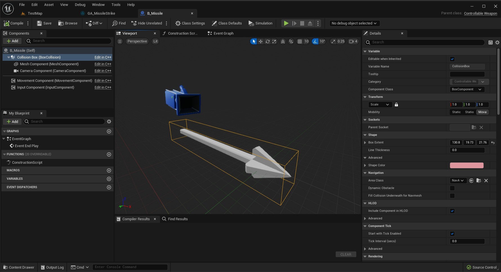
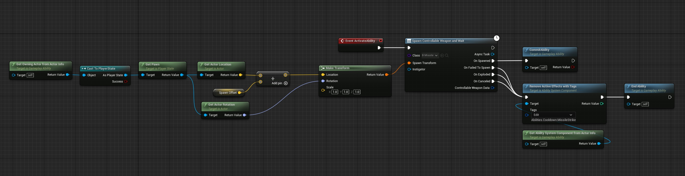

# 创建自定义异步能力任务 (Part 2/2)

Source file: `unreal-engine-creating-a-custom-async-ability-task.origin.md`.

This document was split during ue-kb import to keep source chunks buildable.

### 班级概况

我们将建立一个最小的基础实现，所有可控武器都将从中继承。基本功能是移动、接受输入、成为视图目标和爆炸的能力。我们还定义了所有可控武器都可能需要的一些基本组件，例如网格、运动、相机和碰撞组件。 - *UInputActionMapping* InputConfig* - 用于将输入操作与游戏标签关联以绑定输入功能的数据资产。这是使用之前教程 [Enhanced Input Binding with Gameplay Tags C++](https://dev.epicgames.com/community/learning/tutorials/aqrD/unreal-engine-enhanced-input-binding-with-gameplay-tags-c) 中的代码。您不必遵循此模式，您可以使用自己的解决方案。 - *APlayerController* PlayerController* - 生成时由所属任务设置的玩家控制器引用。用于初始化输入并设置视图目标。 - *FOnExplodeEvent OnExplodedDelegate* - 用于广播可控武器已爆炸。 *USpawnControllableWeaponAndWait::OnWeaponExploded* 与此绑定。 - *bool bHasExploded* - 跟踪可控武器是否爆炸。用于阻止多个手动爆炸输入并防止 OnExplodedDelegate 的重复广播 - *BeginPlay* - 用于将玩家的视图目标设置为可控制武器。 - *SetupInput* - 这是我们将可控武器的本机输入功能绑定到编辑器中定义的输入操作的地方。同样，这是使用上一个教程 [Enhanced Input Binding with Gameplay Tags C++](https://dev.epicgames.com/community/learning/tutorials/aqrD/unreal-engine-enhanced-input-binding-with-gameplay-tags-c) 中的代码。您不必遵循此模式，您可以使用自己的解决方案。 - *Input_Steer* - 将玩家输入路由到武器的移动组件。 - *Input_Detonate* - 处理玩家输入以手动引爆武器。 - *BecomeViewTarget* - 这由 PlayerCameraManager 自动调用，因此我们将使用它作为设置输入的挂钩。 - *EndViewTarget* - 这由 PlayerCameraManager 自动调用，因此我们将使用它作为钩子来禁用输入。 - *OnControllableWeaponBeginOverlap* - 这与碰撞组件的重叠事件绑定并用于触发 AControllableWeapon::Explode。 - *Explode* - 广播 *OnExplodedDelegate* 以通知任务爆炸并销毁自身。
### 可控武器.h

**可控武器.h**

```cpp
// Copyright Epic Games, Inc. All Rights Reserved.
 
#pragma once
 
#include "CoreMinimal.h"
#include "GameFramework/Actor.h"
#include "InputActionValue.h"
#include "ControllableWeapon.generated.h"
 
class UEnhancedInputComponent;
```
### 可控武器.cpp

**可控武器.cpp**

```cpp
// Copyright Epic Games, Inc. All Rights Reserved.
 
 
#include "ControllableWeapon.h"
#include "Camera/CameraComponent.h"
#include "InputActionValue.h"
#include "EIDemoEnhancedInputComponent.h"
#include "EIGameplayTags.h"
#include "Components/BoxComponent.h"
#include "ControllableWeaponMovementComp.h"
```
### 可控武器运动补偿
### 班级概况

这是一个非常基本的运动组件实现，主要是为了创建可控武器的通用基础类型。
### 可控武器运动Comp.h

**可控武器运动Comp.h**

```cpp
// Copyright Epic Games, Inc. All Rights Reserved.
 
#pragma once
 
#include "CoreMinimal.h"
#include "GameFramework/MovementComponent.h"
#include "ControllableWeaponMovementComp.generated.h"
 
/**
 *
```
### 可控武器运动Comp.cpp

**可控武器运动Comp.cpp**

```cpp
// Copyright Epic Games, Inc. All Rights Reserved.
 
 
#include "ControllableWeaponMovementComp.h"
 
void UControllableWeaponMovementComp::TickComponent(float DeltaTime, enum ELevelTick TickType, FActorComponentTickFunction* ThisTickFunction)
{
 
}
```
### 导弹运动组件
### 班级概况

此类扩展了 *UControllableWeaponMovementComp* 并添加了助推概念并覆盖 Tick 以添加旋转增量并沿其前向矢量移动导弹。
### MissileMovementComponent.h

**MissileMovementComponent.h**

```cpp
// Copyright Epic Games, Inc. All Rights Reserved.
 
#pragma once
 
#include "CoreMinimal.h"
#include "ControllableWeaponMovementComp.h"
#include "MissileMovementComponent.generated.h"
 
/**
 *
```
### MissileMovementComponent.cpp

**MissileMovementComponent.cpp**

```cpp
// Copyright Epic Games, Inc. All Rights Reserved.
 
 
#include "MissileMovementComponent.h"
 
void UMissileMovementComponent::TickComponent(float DeltaTime, enum ELevelTick TickType, FActorComponentTickFunction* ThisTickFunction)
{
	FVector MoveDelta = GetOwner()->GetActorForwardVector() * ((Speed + BoostSpeed) * DeltaTime);
 
	FRotator NewRotation = UpdatedComponent->GetComponentRotation() + RotationDelta;
```
### 导弹蓝图

这是一个基于 *AControllableWeapon 的蓝图。它有一个空的事件图，但 * 用于配置一些默认值。值得注意的覆盖： - 移动组件 - 这是用 MissileMovementComponent 覆盖的。它继承自 UControllableWeaponMovementComp，仅沿前向矢量应用恒定加速度，并应用可选的升压。 - MeshComponent - 我使用了引擎中的占位网格。 - CollisionComponent - 设置框范围以匹配导弹网格。


### 导弹打击能力

示例导弹打击能力仅调用 SpawnControllableWeaponAndWait 任务 OnActivateAbility。它将生成类设置为我们的 B_Missile 蓝图，并使用玩家的 pawn 和偏移量计算生成变换。我还添加了一个可选的冷却时间，以防止一次超过一枚导弹袭击。由于持续时间未知，因此冷却时间设置为无限，并应用标签来阻止额外的激活。当能力完成时，我们删除添加的标签，以便可以触发下一次激活。



**导弹打击能力**

```
Begin Object Class=/Script/BlueprintGraph.K2Node_Event Name="K2Node_Event_0"
   EventReference=(MemberParent=Class'"/Script/GameplayAbilities.GameplayAbility"',MemberName="K2_ActivateAbility")
   bOverrideFunction=True
   NodePosX=816
   NodePosY=16
   bCommentBubblePinned=True
   NodeGuid=9DC5F57047335FB2C3E7C984AA774701
   CustomProperties Pin (PinId=9253CBFB46D1671F96BEC88BFDF91EA8,PinName="OutputDelegate",Direction="EGPD_Output",PinType.PinCategory="delegate",PinType.PinSubCategory="",PinType.PinSubCategoryObject=None,PinType.PinSubCategoryMemberReference=(MemberParent=Class'"/Script/GameplayAbilities.GameplayAbility"',MemberName="K2_ActivateAbility"),PinType.PinValueType=(),PinType.ContainerType=None,PinType.bIsReference=False,PinType.bIsConst=False,PinType.bIsWeakPointer=False,PinType.bIsUObjectWrapper=False,PinType.bSerializeAsSinglePrecisionFloat=False,PersistentGuid=00000000000000000000000000000000,bHidden=False,bNotConnectable=False,bDefaultValueIsReadOnly=False,bDefaultValueIsIgnored=False,bAdvancedView=False,bOrphanedPin=False,)
   CustomProperties Pin (PinId=1DE7C8D647298B5352B4ACAF4ED52954,PinName="then",Direction="EGPD_Output",PinType.PinCategory="exec",PinType.PinSubCategory="",PinType.PinSubCategoryObject=None,PinType.PinSubCategoryMemberReference=(),PinType.PinValueType=(),PinType.ContainerType=None,PinType.bIsReference=False,PinType.bIsConst=False,PinType.bIsWeakPointer=False,PinType.bIsUObjectWrapper=False,PinType.bSerializeAsSinglePrecisionFloat=False,LinkedTo=(K2Node_LatentAbilityCall_0 AC8DA8F6401965958BEB12A5B8920BE7,),PersistentGuid=00000000000000000000000000000000,bHidden=False,bNotConnectable=False,bDefaultValueIsReadOnly=False,bDefaultValueIsIgnored=False,bAdvancedView=False,bOrphanedPin=False,)
End Object
```
### 结论

现在，我们有了一个 SpawnControllableWeaponAndWait 能力任务，只需放置一个节点即可在任何游戏能力蓝图中使用它。这使设计人员能够快速创建可控的武器变体，而无需担心底层输入和视图处理。 - [带有游戏标签的增强型输入绑定](https://dev.epicgames.com/community/learning/tutorials/aqrD/unreal-engine-enhanced-input-binding-with-gameplay-tags-c) - [能力任务文档](https://docs.unrealengine.com/5.2/en-US/gameplay-ability-tasks-in-unreal-engine)
## 相关链接

- [Enhanced Input Binding with Gameplay Tags](https://dev.epicgames.com/community/learning/tutorials/aqrD/unreal-engine-enhanced-input-binding-with-gameplay-tags-c)
- [Ability Tasks Docs](https://docs.unrealengine.com/5.2/en-US/gameplay-ability-tasks-in-unreal-engine)
