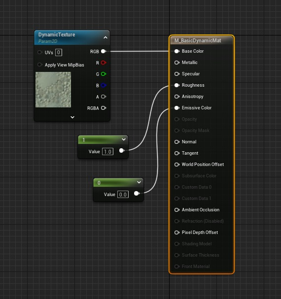
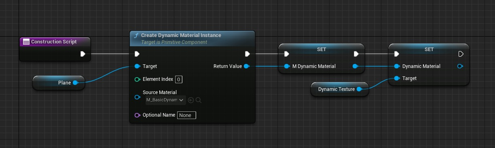
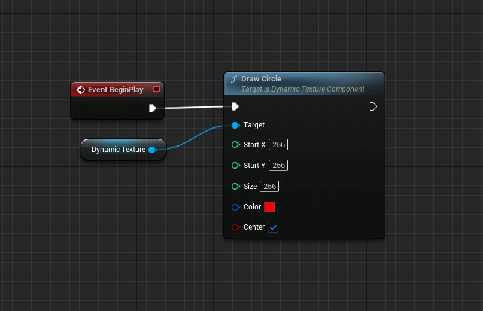
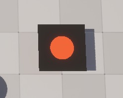

# 在 C++ 中创建运行时可编辑纹理 (Part 2/2)

Source file: `unreal-engine-creating-a-runtime-editable-texture-in-c.origin.md`.

This document was split during ue-kb import to keep source chunks buildable.

### 画一个圆

它以与 DrawRectangle() 相同的方式循环遍历每个像素，但它仅设置位于圆半径内的像素，圆半径是大小的一半，通过获取从圆心到相关像素的向量的大小来确定。它可以选择以 StartX/Y 为中心或从顶部/左侧开始绘制圆。

```cpp
--- Header ---
UFUNCTION(BlueprintCallable, Category="Dynamic Texture")
void DrawCircle(int32 StartX, int32 StartY, int32 Size, FLinearColor Color, bool Center = true);'


--- CPP ---
void UDynamicTextureComponent::DrawCircle(int32 StartX, int32 StartY, int32 Size, FLinearColor Color, bool Center /*= true*/)
{
    float radius = Size / 2;
    int32 offset = FMath::Floor(radius * Center);
```
### 从纹理绘制

这是我将在本教程中介绍的最高级的绘图函数。它缺乏一些功能，例如旋转或缩放采样的纹理，但它显示了如何将纹理资源中的值读取到动态纹理中的基础知识。

```cpp
--- Header ---
    UFUNCTION(BlueprintCallable, Category="Dynamic Texture")
    void DrawFromTexture(int32 StartX, int32 StartY, UTexture2D* Texture, FLinearColor Filter = FLinearColor::White);


--- CPP ---
void UDynamicTextureComponent::DrawFromTexture(int32 StartX, int32 StartY, UTexture2D* Texture, FLinearColor Filter)
{
    if (!Texture) {
        return;
```

请注意，这是调用 SetPixelValue() 而不是 SetPixelColor()。不同之处在于 SetPixelValue() 不会将颜色乘以 255，而是采用 FColor，而不是 FLinearColor。 SetPixelValue() 也是一个私有函数。

```cpp
--- Header ---
private:
    void SetPixelValue(int32 X, int32 Y, FColor Color);


--- CPP ---
void UDynamicTextureComponent::SetPixelValue(int32 X, int32 Y, FColor Color)
{
    // If Pixel is outside of Texture return
    if (X < 0 || Y < 0 || X >= TextureWidth || Y >= TextureHeight) {
```
### 使用动态纹理

到目前为止，虽然我们已经创建了纹理并可以进行修改，但我们仍然没有任何方法来查看纹理。在本教程中，我将通过更新纹理参数来使用动态材质中的动态纹理。首先，我们需要访问动态材质，因此在动态纹理组件中创建几个变量

```cpp
public:
    UPROPERTY(BlueprintReadWrite)
    UMaterialInstanceDynamic* DynamicMaterial;

    // The Name of the Texture Parameter in the Material
    UPROPERTY(EditDefaultsOnly)
    FName DynamicMaterialParamName = "DynamicTexture";
```
### 在编辑器中

以下是让某些东西发挥作用的基本步骤。我提供了屏幕截图来帮助完成本节。 1. 使用TextureSampleParameter2D 创建一个新材质，并将RGB 输出输入到基色中。确保纹理参数的名称为“**DynamicTexture**”，或者如果您使用不同的名称，请确保将组件上的 DynamicMaterialParamName 的值设置为完全匹配。应用并保存材料。 2. 创建一个 Actor 蓝图并向其中添加一个 **Plane** 组件，这将是应用动态材质的组件。 3. 将 DynamicTexture 组件添加到您刚刚创建的 Actor 蓝图中。 4. 在 Actor 蓝图的构造脚本中，调用函数 **创建动态材质实例 **，目标是我们添加的平面，并选择我们之前创建的材质。 5. 右键单击​​ **Return Value** 和 **Promote to Variable。** 6. 获取对我们添加的 DynamicTexture 组件的引用，并使用我们刚刚从创建动态材质实例中获得的值调用 **Set Dynamic Material **。将我们刚刚创建的 Actor 放入场景中。当你点击播放时，如果你遵循我的默认设置，飞机应该看起来是黑色的。接下来，您可以尝试使用我们之前创建的绘图函数之一在其上绘图。例如，在 Actor 的 BeginPlay 上，尝试绘​​制一个大小为 256、X 和 Y 为 256、颜色为红色的圆圈。如果一切正常，当您点击播放时，您应该会在飞机上看到一个红色圆圈。如果您想更改纹理分辨率，可以在我们创建的动态纹理组件上执行此操作。
### 注意事项和注意事项

- 修改TextureData数组实际上在性能上相当便宜，但每次更新动态纹理对象时都需要将其复制到GPU上，因此纹理尺寸越大，对性能的影响就越大。在我的测试中，2048x2048 的纹理大小没有太大影响，但将其加倍到 4096x4096 对性能产生了重大影响，因此如果可能的话，可能有多个较小的动态纹理，只有在它们单独需要而不是真正的大纹理时才会更新。









**动态纹理组件.h**

```cpp
#pragma once

#include "CoreMinimal.h"
#include "Components/ActorComponent.h"
#include "DynamicTextureComponent.generated.h"


UCLASS( ClassGroup=(Custom), meta=(BlueprintSpawnableComponent) )
class PROJECTNAME_API UDynamicTextureComponent : public UActorComponent
{
```

**动态纹理组件.cpp**

```cpp
#include "DynamicTextureComponent.h"

#include "RHICommandList.h"
#include "Rendering/Texture2DResource.h"

// Sets default values for this component's properties
UDynamicTextureComponent::UDynamicTextureComponent()
{
	// Set this component to be initialized when the game starts, and to be ticked every frame.  You can turn these features
	// off to improve performance if you don't need them.
```

- [创建程序材质](https://unrealcommunity.wiki/procedural-materials-klecyfhm) - [将 OpenCV 集成到虚幻引擎 4 中](https://nerivec.github.io/old-ue4-wiki/pages/integrating-opencv-into-unreal-engine-4.html)
## 相关链接

- [Creating Procedural Materials](https://unrealcommunity.wiki/procedural-materials-klecyfhm)
- [Integrating OpenCV Into Unreal Engine 4](https://nerivec.github.io/old-ue4-wiki/pages/integrating-opencv-into-unreal-engine-4.html)
