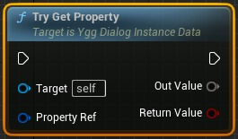

# 创建返回引用的 UK2Node (Part 1/3)

Source file: `unreal-engine-creating-a-uk2node-returning-a-reference.origin.md`.

This document was split during ue-kb import to keep source chunks buildable.

## 来源与状态

- 原始 URL：https://dev.epicgames.com/community/learning/tutorials/2lZj/unreal-engine-creating-a-uk2node-returning-a-reference
## 运行时分类

- 类型：图文教程
- 判断：API 未识别到核心视频信号，可整理正文约 21670 字符。
## 摘要

在本教程中，我介绍了自定义 thunk 函数的创建，该函数可以返回通用值作为参考。作为示例，我展示了我的一个项目中的一个用例。
## 中文整理
### 概览

编写泛型函数通常并不像想到创建一个函数那么简单。如果我想实现我的下一个疯狂想法，通常需要花费几个小时到几天的时间，而某些简单的自动生成的代码并未涵盖该想法。这次我需要引用给定类的属性。为此，我创建了一个属性引用结构，它将预期的类型与 FieldPath 一起保留。前者只能在默认值（即蓝图）上进行编辑，而后者只能在实例上进行更改。原因是，蓝图不需要关心它引用了哪个属性。我希望能够指定一个函数，它可以获取传递的 Context 对象，该对象保存我可以引用的属性。因此，我需要创建所述蓝图的一个实例，它知道什么类型的 Context 对象将传递给它的函数。这样我就可以用正确的 FieldPath 填充属性引用。然后，在函数调用中，蓝图可以解析它应从传递的上下文对象中读取的属性。但实现这一目标并不那么简单，基本上需要两个步骤。第一步是编写一些编辑器代码，允许从某些对象类中选择属性。第二步是编写一个自定义节点，允许从某个对象获取属性实例。在这篇文章中我将介绍后者。
### 自定义Thunk

让我们将以下内容作为给定的。我们有一个 FPropertyRef 类型和一些 UInstanceData 基类，它们用于使整个事情稍微更加类型安全。

```cpp
USTRUCT(BlueprintType)
struct FPropertyRef
{
    GENERATED_BODY()

#if WITH_EDITORONLY_DATA
    UPROPERTY(EditDefaultsOnly)
    FEdGraphPinType VarType;
#endif
    UPROPERTY(EditInstanceOnly)
```

但是我们现在如何从 UInstanceData 实例解析 PropertyRef 呢？我首先想到的答案是：CustomThunk！好吧，自定义重击。那是什么？长话短说，它描述了一个函数，UHT 不会为其生成主体。它只会创建必要的反射来调用该函数，但仅此而已。下面是一个简单的例子：

```cpp
// Header
class  UInstanceData : public UObject
{
    GENERATED_BODY()

public:
    UFUNCTION(BlueprintPure=False, CustomThunk, meta = (CustomStructureParam = "OutValue"))
    bool TryGetProperty(const FPropertyRef& PropertyRef, int32& OutValue) const;
    DECLARE_FUNCTION(execTryGetProperty);
};
```

这一切意味着什么？通过将 UFUNCTION 标记为 CustomThunk，我们确保不会生成函数体。通过添加 meta = (CustomStructureParam = "OutValue") 我们告诉生成器，名为 OutValue 的参数可以是任何类型，在 BP 编译期间解析。上面的代码将创建一个像这样的节点：



但是我们的函数是做什么的呢？使用 UInstanceData::execTryGetProperty，我们可以实现反射将调用的内容（如果我们的 UFUNCTION 被调用）。这意味着我们现在可以更接近 BPVM 工作。由于我在这个领域没有那么丰富的经验，让我们保持简单。我们有一些带有数据的堆栈，我们可以逐步执行。该函数所做的首先是获取第一个函数参数，它是堆栈上的下一个值，因此我们可以使用 P_GET_STRUCT_REF 宏来获取对输入参数的引用，在本例中是 FPropertyRef 的实例。该函数的下一个参数预计是某个属性，因此我们只需调用 StepCompiledIn 即可单步执行下一个 Stack 值。堆栈上的 MostRecentPropertyAddress 现在将指向传递给要写入的函数的属性，以及它的 FProperty 类，我们可以使用它来验证正确的类型。现在我们需要做的就是从当前操作对象的类中获取我们想要读取的属性，检查类型是否匹配并通过复制分配值。如果一切顺利，我们返回 true，否则返回 false。那么，我们现在就完成了，对吧？这不是很难吗？你花了几天时间才实现？ - 否。该节点有三个缺点： 1. 我们需要连接一个分支来检查是否有值 2. 输出引脚类型不是根据输入引脚确定的 3. 输出是副本。 （这对于普通类型来说没什么大不了的，但我不想复制容器）为了解决这个问题，我们需要编写一个自定义的 UK2Node。
