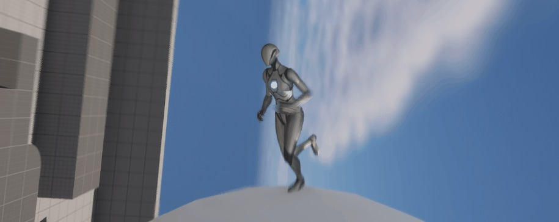
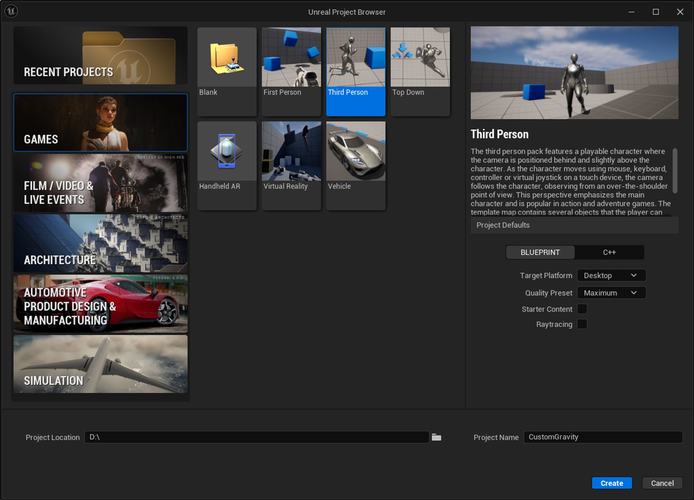
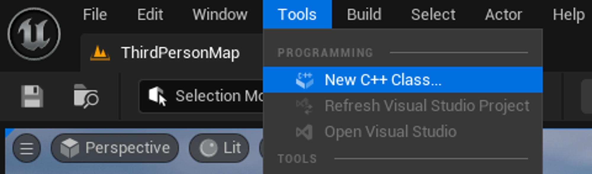
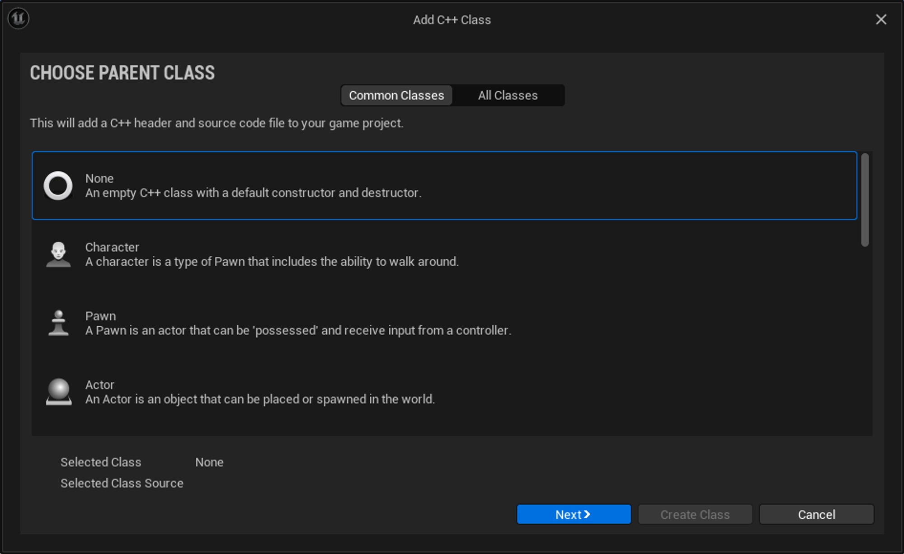
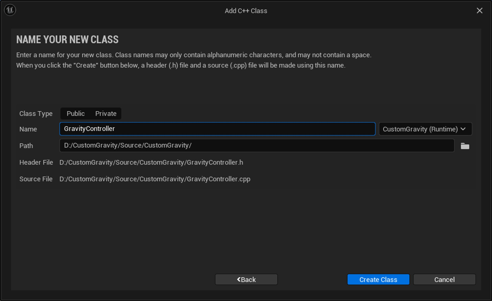
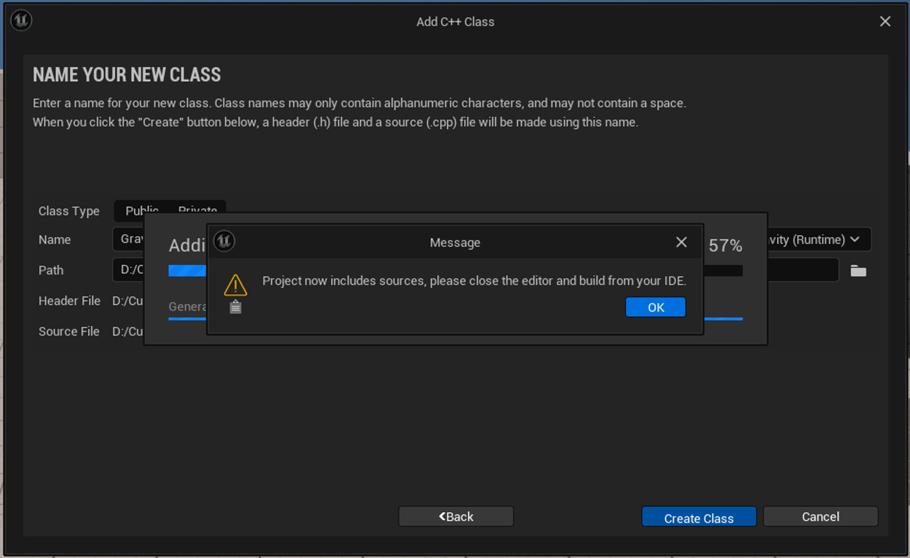
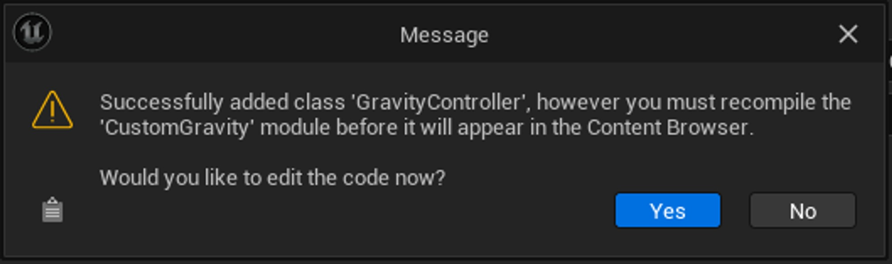
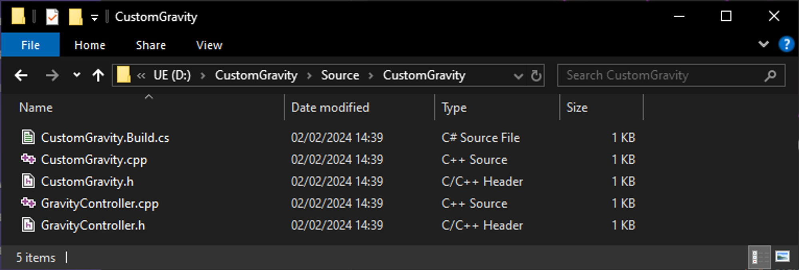
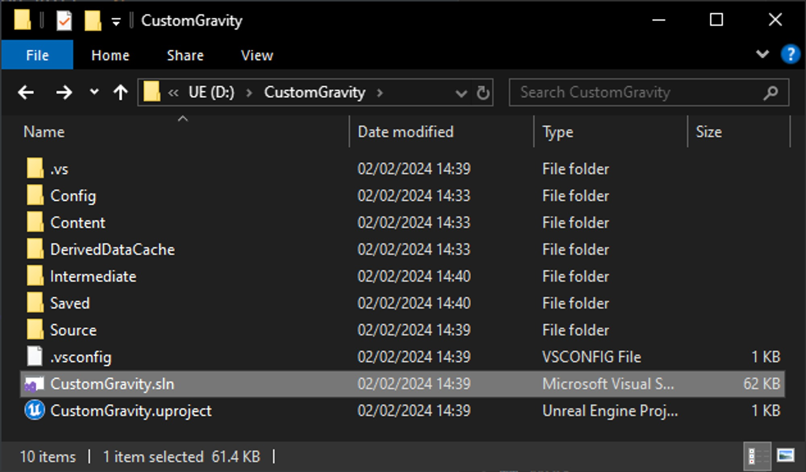
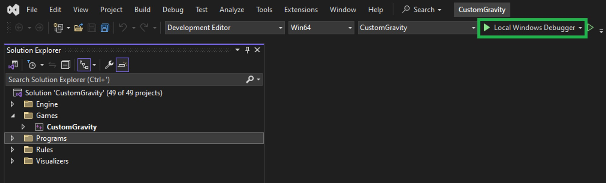

# UE 5.4 中的自定义重力

## 来源与状态

- 原始 URL：https://dev.epicgames.com/community/learning/tutorials/w6l7/unreal-engine-custom-gravity-in-ue-5-4

## 运行时分类

- 类型：图文教程
- 判断：API 未识别到核心视频信号，可整理正文约 7645 字符。

## 摘要

Unreal 5.4 在CharacterMovementController 中引入了对自定义重力的支持。了解如何利用它并做一些很酷的事情，例如重力谜题或创建像重力游戏这样的迷你星球。

## 中文整理

### 简介

在本教程中，我们将利用 UE 5.4 的重力覆盖功能让玩家能够绕着一个小星球奔跑。这应该为您自己的项目的任何其他类型的重力操纵提供良好的基础。自定义重力在 5.4 之前的 Unreal 版本中无法完全发挥作用。代码可能存在，但存在一些问题导致其无法使用。



### 创建项目

对于这个项目，我们将扩展第三人称蓝图项目。我们不需要本教程的入门内容，因此我将跳过它，但欢迎您将其包含在内。



### 添加重力相机处理 (C++)

当您在游戏中移动鼠标时，虚幻引擎将获取该鼠标输入并将其转发到玩家控制器以用于在玩家周围移动相机。但鼠标坐标始终相对于世界本身，负 Z 向下。例如，当玩家上下颠倒时，这些鼠标输入需要考虑到这一点，否则我们的相机控制将被反转。为了解决这个问题，我们将添加一些代码来接收此输入，然后将其转换为“局部重力空间”，以便相机控制可以保持“相对”。我们通过创建一个名为 GravityController 的新 C++ 类来实现此目的，该类扩展了普通的 APlayerController 类，但添加了对相对重力输入处理的支持。这是本教程所需的唯一 C++ 类，其他所有内容都将在蓝图中。让我们通过单击 **Tools → New C++ Class...** 添加它



对于父类，我们现在只需单击**无**，无论如何，我们将在下一步中将代码复制并粘贴到其中。



调用新类 GravityController 并创建它。 Unreal 现在会将项目转换为 C++ 项目，并为我们创建一个默认的代码模块。



按“确定”继续。



按“否”关闭此对话框。



现在我们将关闭虚幻并填充我们的新类。转到项目的文件夹并打开源文件夹。其中应该有一个与您的项目名称相同的子文件夹，这是您的默认游戏模块。我们的新班级应该在那里。



在文本编辑器（例如 Visual Studio 甚至记事本）中打开 **GravityController.h**。删除其中的所有内容并将其替换为以下代码：

```cpp
#pragma once

#include "CoreMinimal.h"
#include "GameFramework/PlayerController.h"
#include "GravityController.generated.h"

/**
 * A Player Controller class which adds input-handling functionality for
 * CharacterMovementController's custom gravity mechanics.
 */
```

现在打开**GravityController.cpp**，删除其中的所有内容并将其替换为以下代码：

```cpp
#include "GravityController.h"
#include "GameFramework/Character.h"
#include "GameFramework/CharacterMovementComponent.h"

void AGravityController::UpdateRotation(float DeltaTime)
{
	FVector GravityDirection = FVector::DownVector;
	if (ACharacter* PlayerCharacter = Cast<ACharacter>(GetPawn()))
	{
		if (UCharacterMovementComponent* MoveComp = PlayerCharacter->GetCharacterMovement())
```

### 编译项目

在此部分，您需要安装 Visual Studio。如果您尚未安装，请查看本教程，了解如何执行此操作：[设置 Visual Studio | Epic 开发者社区](https://dev.epicgames.com/documentation/en-us/unreal-engine/setting-up-visual-studio-development-environment-for-cplusplus-projects-in-unreal-engine)。打开项目的 Visual Studio 解决方案文件。



然后按 **F5**，或按“**▷ Local Windows Debugger**”按钮，编译项目并使用新类运行虚幻编辑器。



编译一次项目后，可以通过.uproject文件正常打开，并且可以跳过Visual Studio步骤。

### 使用新的重力控制器

我们现在已经创建了重力控制器类，但我们需要告诉虚幻使用它而不是默认的内置类。第三人称角色模板已在虚幻引擎 5.6 中更新，因此请按照下面与您的 UE 版本相关的说明进行操作。

### 虚幻 5.4 - 5.5

进入虚幻编辑器后，打开 **Content/ThirdPerson/Blueprints/BP_ThirdPersonGameMode** 蓝图并更改 PlayerControllerClass 属性以使用我们新的 GravityController 类。然后编译并保存蓝图。

### 虚幻 5.6 及更高版本

进入虚幻编辑器后，打开 **Content/ThirdPerson/Blueprints/BP_ThirdPersonPlayerController** 蓝图，单击 **Class Settings** 按钮，然后将父类更改为我们新的 GravityController 类。

### 重力相对鼠标输入

现在我们需要稍微修复一下鼠标输入。对于左/右 pawn 输入，第三人称角色会丢弃控制器控制旋转的俯仰部分，以便输入值垂直于玩家的胶囊，即始终从玩家的右侧伸出。否则，例如，如果相机朝下，则玩家会减慢速度，因为控制旋转也将指向下方。我们也只需要偏航部分来进行前向/后向输入。但现在控制旋转已经旋转了！所以我们不能再扔掉 Pitch 了。我们解决这个问题的方法是，首先将控制旋转从世界变换转换为相对“局部重力”变换。然后我们可以像平常一样扔掉 Pitch，然后我们将控制旋转**返回**到世界变换，然后再将其提供给 Player Pawn。我们在上一步中添加的代码引入了几个方便的蓝图函数来帮助我们做到这一点：GetGravityRelativeRotation 和 GetGravityWorldRotation。现在让我们使用它们吧！

### 虚幻 5.4 - 5.5

打开 **Content/ThirdPerson/Blueprints/BP_ThirdPersonCharacter** （或者如果您愿意，可以将其复制以创建您自己的角色，只需记住更改 **BP_ThirdPersonGameMode** 也可以）并将输入处理更改为：

### 虚幻 5.6 及更高版本

打开 **Content/ThirdPerson/Blueprints/BP_ThirdPersonCharacter** （或者如果您愿意，可以将其复制以创建您自己的角色，只需记住更改 **BP_ThirdPersonGameMode** 也可以）并将 **Move** 函数更改为：

### 所有版本

要让重力旋转节点显示三个浮动而不是像上面的屏幕截图中那样的旋转器，您可以右键单击旋转器返回值引脚并选择“拆分结构引脚”。

### 修复动画图

第三人称角色假设其 X 和 Y 速度是其行走速度。但如果角色旋转，这就不成立了。我们需要它考虑所有轴的行走速度。 **在虚幻 5.4 - 5.6 中**，打开 **Content/Characters/Mannequins/Animations/ABP_Manny**。 **在虚幻 5.6 及更高版本中**，打开 **Content/Characters/Mannequins/Anims/ABP_Unarmed**。在“事件图”选项卡中，我们更改地面速度计算以使用整个矢量的长度，而不仅仅是 X 和 Y。我们可以在此处更新注释。之前： 之后：

### 操纵重力

现在到有趣的部分了！现在，您可以通过其 SetGravityDirection 蓝图节点随意更改 CharacterMovementComponent 的重力！ **重力切换器** 这就是您需要一个体积来改变玩家与其重叠时的重力方向的体积。非常适合将重力颠倒过来，或者让玩家爬上墙壁。 **行星重力** 如果您想让玩家的重力每帧都发生变化，例如使玩家的重力始终相对于另一个对象（例如行星），您可以将类似的内容放入 PlayerCharacter 的 Tick 函数中。 “Target Gravity Actor”是一个变量，用于保存您想要让玩家在其上行走的目标 Actor。
