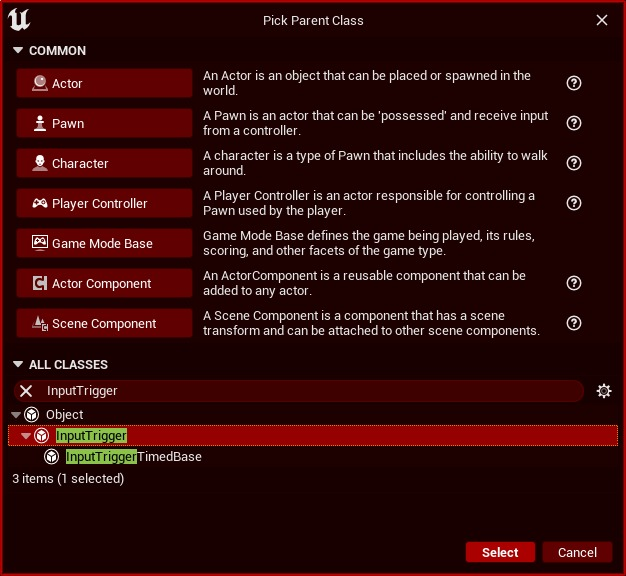
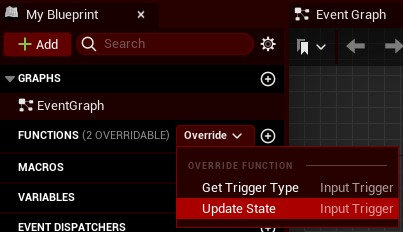

# 延迟增强输入操作的“完成”事件 (Part 2/3)

Source file: `unreal-engine-delaying-the-enhanced-input-action-s-completed-event.origin.md`.

This document was split during ue-kb import to keep source chunks buildable.

### 创建触发资产：

在内容浏览器中，创建蓝图。在“选择父类”弹出窗口中，从“所有类”下拉列表中搜索 **InputTrigger**。给这个资产一个名字，我把我的称为“TriggerInjection”。



在 **我的蓝图** 选项卡中，在 **Functions** 一词旁边，查找名为 **Override** 的下拉列表。选择 **更新状态** 选项。



在 **Variables** 下，添加以下三个变量： 1. **ThisAction** - 类型：**InputAction** 和 **Instance Editable**（睁开眼睛） 2. **Values** - 类型：**** Floats** 3. **SampleLength** - 类型：**Integer** 和 **Instance Editable**（睁开眼睛）。将默认值设置为 120。SampleLength 确定输入操作停止之前等待的时间。要计算此值，请使用以下简单公式： SampleLength = Desired Time * FPS 因此，如果我希望此输入操作在停止前等待 2 秒，并且我的游戏以 120 FPS 运行，则： SampleLength = 2 秒 * 120 FPS = 240 如果要将 SampleLength 更改为默认值以外的任何值，请在 **Mapping Context** 中执行此操作，因此对此变量的更改是特定于键绑定的（即更改此参数不会更改它）此触发资产的所有实例）。创建一个纯函数。此函数将计算所提供的浮点数组的算术平均值（平均值）。该函数如下所示：

```
Begin Object Class=/Script/BlueprintGraph.K2Node_FunctionEntry Name="K2Node_FunctionEntry_0" ExportPath=/Script/BlueprintGraph.K2Node_FunctionEntry'":ArrayMean.K2Node_FunctionEntry_0"'
   LocalVariables(0)=(VarName="Total",VarGuid=CD0899F54BC76522A9C5CA81CEA5934D,VarType=(PinCategory="real",PinSubCategory="double"),FriendlyName="Total",Category=NSLOCTEXT("KismetSchema", "Default", "Default"),PropertyFlags=5)
   ExtraFlags=201457664
   FunctionReference=(MemberName="ArrayMean")
   bIsEditable=True
   NodeGuid=D4964AF742354F12A0D9BF92E40A4955
   CustomProperties Pin (PinId=C6BE504E43860255569ABAB7C5632A0B,PinName="then",Direction="EGPD_Output",PinType.PinCategory="exec",PinType.PinSubCategory="",PinType.PinSubCategoryObject=None,PinType.PinSubCategoryMemberReference=(),PinType.PinValueType=(),PinType.ContainerType=None,PinType.bIsReference=False,PinType.bIsConst=False,PinType.bIsWeakPointer=False,PinType.bIsUObjectWrapper=False,PinType.bSerializeAsSinglePrecisionFloat=False,LinkedTo=(K2Node_MacroInstance_0 0AC0B45D437A51A3AFC035A4550DD153,),PersistentGuid=00000000000000000000000000000000,bHidden=False,bNotConnectable=False,bDefaultValueIsReadOnly=False,bDefaultValueIsIgnored=False,bAdvancedView=False,bOrphanedPin=False,)
   CustomProperties Pin (PinId=8CDEF9B94074E9B1147C2691F0969411,PinName="Array",Direction="EGPD_Output",PinType.PinCategory="real",PinType.PinSubCategory="double",PinType.PinSubCategoryObject=None,PinType.PinSubCategoryMemberReference=(),PinType.PinValueType=(),PinType.ContainerType=Array,PinType.bIsReference=False,PinType.bIsConst=False,PinType.bIsWeakPointer=False,PinType.bIsUObjectWrapper=False,PinType.bSerializeAsSinglePrecisionFloat=False,LinkedTo=(K2Node_MacroInstance_0 E15BB26142028DA6446AC393E7CE30EB,K2Node_CallArrayFunction_0 F3FA079C4AF172AC5C15E0ACFC5E0ADD,),PersistentGuid=00000000000000000000000000000000,bHidden=False,bNotConnectable=False,bDefaultValueIsReadOnly=False,bDefaultValueIsIgnored=False,bAdvancedView=False,bOrphanedPin=False,)
   CustomProperties UserDefinedPin (PinName="Array",PinType=(PinCategory="real",PinSubCategory="double",ContainerType=Array),DesiredPinDirection=EGPD_Output)
End Object
```

返回 **UpdateState** 函数并添加以下内容： 下面代码片段中的“MeanArray”函数可能不会粘贴到您的蓝图图中，需要将其替换为您在上面刚刚创建的函数。

```
Begin Object Class=/Script/BlueprintGraph.K2Node_FunctionEntry Name="K2Node_FunctionEntry_0" ExportPath=/Script/BlueprintGraph.K2Node_FunctionEntry'"TriggerInjection:UpdateState.K2Node_FunctionEntry_0"'
   FunctionReference=(MemberParent=/Script/CoreUObject.Class'"/Script/EnhancedInput.InputTrigger"',MemberName="UpdateState")
   NodePosX=-160
   NodeGuid=34F497794EA1A87111EB8BAD32DAE6C0
   CustomProperties Pin (PinId=15BC84384DE82830AE2480836BDAC62B,PinName="then",Direction="EGPD_Output",PinType.PinCategory="exec",PinType.PinSubCategory="",PinType.PinSubCategoryObject=None,PinType.PinSubCategoryMemberReference=(),PinType.PinValueType=(),PinType.ContainerType=None,PinType.bIsReference=False,PinType.bIsConst=False,PinType.bIsWeakPointer=False,PinType.bIsUObjectWrapper=False,PinType.bSerializeAsSinglePrecisionFloat=False,LinkedTo=(K2Node_CallParentFunction_0 36E563BF436B9586A5C25D91B74405D3,),PersistentGuid=00000000000000000000000000000000,bHidden=False,bNotConnectable=False,bDefaultValueIsReadOnly=False,bDefaultValueIsIgnored=False,bAdvancedView=False,bOrphanedPin=False,)
   CustomProperties Pin (PinId=C8B32628442620072EDC84A9CE2612D9,PinName="PlayerInput",PinToolTip="PlayerInput\nEnhanced Player Input Object Reference",Direction="EGPD_Output",PinType.PinCategory="object",PinType.PinSubCategory="",PinType.PinSubCategoryObject=/Script/CoreUObject.Class'"/Script/EnhancedInput.EnhancedPlayerInput"',PinType.PinSubCategoryMemberReference=(),PinType.PinValueType=(),PinType.ContainerType=None,PinType.bIsReference=False,PinType.bIsConst=True,PinType.bIsWeakPointer=False,PinType.bIsUObjectWrapper=False,PinType.bSerializeAsSinglePrecisionFloat=False,LinkedTo=(K2Node_CallParentFunction_0 F0F27B33465389F1E343BE9B5779DAF1,K2Node_CallFunction_0 C8226E58421CC1DD319CF9833E8BF52F,),PersistentGuid=00000000000000000000000000000000,bHidden=False,bNotConnectable=False,bDefaultValueIsReadOnly=False,bDefaultValueIsIgnored=False,bAdvancedView=False,bOrphanedPin=False,)
   CustomProperties Pin (PinId=A6194DB244E8176E8EA66DB17F2B7F48,PinName="ModifiedValue",PinToolTip="ModifiedValue\nInput Action Value Structure",Direction="EGPD_Output",PinType.PinCategory="struct",PinType.PinSubCategory="",PinType.PinSubCategoryObject=/Script/CoreUObject.ScriptStruct'"/Script/EnhancedInput.InputActionValue"',PinType.PinSubCategoryMemberReference=(),PinType.PinValueType=(),PinType.ContainerType=None,PinType.bIsReference=False,PinType.bIsConst=False,PinType.bIsWeakPointer=False,PinType.bIsUObjectWrapper=False,PinType.bSerializeAsSinglePrecisionFloat=False,LinkedTo=(K2Node_CallParentFunction_0 657A07664DB4A53F38DF98B1F2FB3284,K2Node_CallFunction_3 E5A8029A44083D703FD6D6B021801443,),PersistentGuid=00000000000000000000000000000000,bHidden=False,bNotConnectable=False,bDefaultValueIsReadOnly=False,bDefaultValueIsIgnored=False,bAdvancedView=False,bOrphanedPin=False,)
   CustomProperties Pin (PinId=695564384DC4DA2E677F7AAC24C34FDC,PinName="DeltaTime",PinToolTip="DeltaTime\nFloat (single-precision)",Direction="EGPD_Output",PinType.PinCategory="real",PinType.PinSubCategory="float",PinType.PinSubCategoryObject=None,PinType.PinSubCategoryMemberReference=(),PinType.PinValueType=(),PinType.ContainerType=None,PinType.bIsReference=False,PinType.bIsConst=False,PinType.bIsWeakPointer=False,PinType.bIsUObjectWrapper=False,PinType.bSerializeAsSinglePrecisionFloat=False,DefaultValue="0.0",AutogeneratedDefaultValue="0.0",LinkedTo=(K2Node_CallParentFunction_0 9AB69B64483A531DF063478246284F0F,),PersistentGuid=00000000000000000000000000000000,bHidden=False,bNotConnectable=False,bDefaultValueIsReadOnly=False,bDefaultValueIsIgnored=False,bAdvancedView=False,bOrphanedPin=False,)
End Object
Begin Object Class=/Script/BlueprintGraph.K2Node_FunctionResult Name="K2Node_FunctionResult_0" ExportPath=/Script/BlueprintGraph.K2Node_FunctionResult'"TriggerInjection:UpdateState.K2Node_FunctionResult_0"'
```

**RemoveIndex** 节点的索引值必须为 **0**。 **MeanArray** （或等效）函数的返回值应连接到 **NotEqual** 节点，另一个值为 **0.0 **（0.0 表示没有玩家输入）。在一段时间没有玩家输入后，该分支节点将停止输入执行，直到有玩家输入。上面代码片段中标记为 **/Script/Blueprint Graph.K2Node Get Subsystem From PC** 的节点是一个 **GetEnhancedInputLocalPlayerSubsystem** 节点（深灰色的大节点）。
