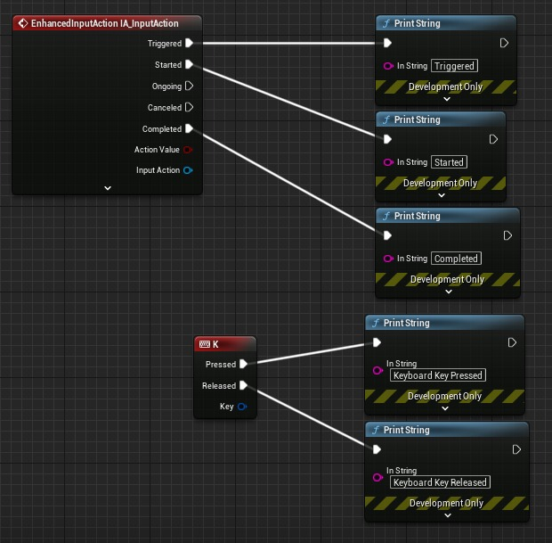
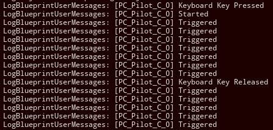
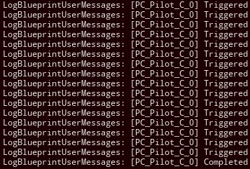

# 延迟增强输入操作的“完成”事件 (Part 3/3)

Source file: `unreal-engine-delaying-the-enhanced-input-action-s-completed-event.origin.md`.

This document was split during ue-kb import to keep source chunks buildable.

### 创建输入操作：

有很多关于如何使用增强输入系统、创建输入操作等的教程。我将简要概述。请注意**步骤 1**。如果您没有正确设置 **ThisAction** 变量，那么该系统将无法工作。 1. 在内容浏览器中，创建一个输入操作（我将其命名为**“IA_InputAction”**）。将一个元素添加到 **Triggers ** 数组。将新元素值设置为之前创建的 **触发器资产**。将 **ThisAction** 变量设置为当前操作（在我的例子中，该变量将设置为 **IA_InputAction**）。 2. 创建映射上下文。 3. 将输入操作添加到映射上下文，并为输入操作分配一个键（我已为我的分配了 **K** 键）。 4. 在玩家控制器中，生成一个 **EnhancedInputLocalPlayerSubsystem** 节点。拖出该节点并生成一个 **AddMappingContext** 节点（将“MappingContext”变量设置为您在步骤 2 中创建的映射上下文。 5. 通过搜索输入操作的名称，生成与播放器控制器中的输入操作关联的事件节点。 6. 将 **AddMappingContext** 节点连接到事件节点，最好是 **BeginPlay。**
### 最终结果：

为了测试系统，我将以下节点添加到我的播放器控制器中：

**ActionValue** 引脚可以是 bool 或 float，以便该系统工作（bool 可以隐式转换为 float，其中 true == 1.0）。如果您需要向量，则可能需要修改触发器资源以解决此问题（例如，计算向量数组而不是浮点数组的平均向量值）。当我点击开始播放并按下并释放绑定键（在我的例子中，键盘上的“K”）时，我在日志中得到以下输出：

释放按键后，仍然会触发输入动作，直到满足前面描述的条件，然后输入动作停止，并在日志中返回“Completed”。在“已完成”消息之后，不再有“已触发”消息，直到我再次按“K”。 - [使用增强输入的旧版轴映射](https://dev.epicgames.com/community/learning/tutorials/pv90/unreal-engine-legacy-axis-mapping-using-enhanced-inputs)
## 相关链接

- [Legacy Axis Mapping Using Enhanced Inputs](https://dev.epicgames.com/community/learning/tutorials/pv90/unreal-engine-legacy-axis-mapping-using-enhanced-inputs)
