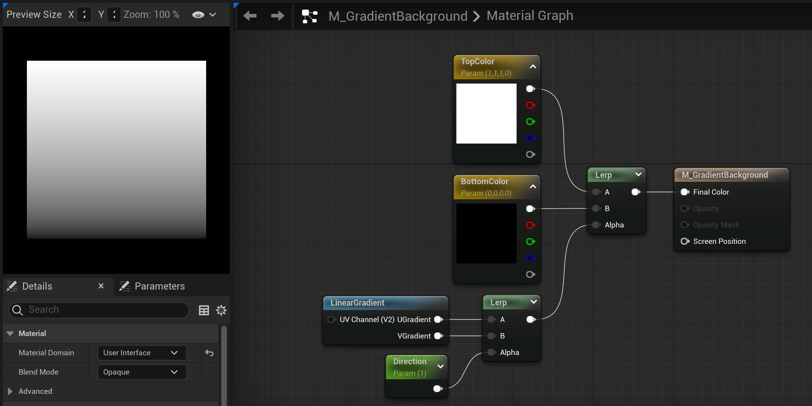
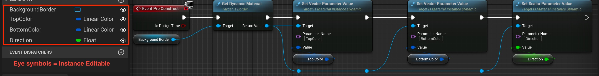
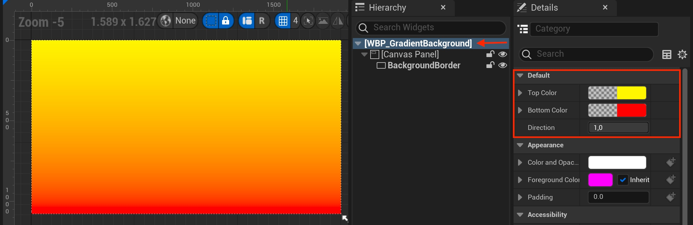

# UMG 小部件中的动态材质

## 来源与状态

- 原始 URL：https://dev.epicgames.com/community/learning/tutorials/l0PK/unreal-engine-dynamic-materials-in-umg-widgets

## 运行时分类

- 类型：图文教程
- 判断：API 未识别到核心视频信号，可整理正文约 1415 字符。

## 摘要

渐变背景展示了如何控制小部件蓝图中的材质参数。

## 中文整理

### 概览

1. 创建材质并将材质域设置为用户界面。 2. 为两种颜色创建两个矢量参数，并将它们连接到线性插值或 Lerp 节点上的 A 和 B。 3. 获取 LinearGradient 节点并将 U 和 V 输出连接到 Lerp 节点上的 A 和 B。 4. 创建一个标量参数并将其连接到 LinearGradient Lerp 的 alpha 输入。 5. 将 Lerp 连接到两种颜色的 Lerp Alpha 的 Alpha 中。 6. 将两种颜色的 Lerp 连接到 Final Color 输入。 7.保存材料。

**渐变材质**

```
Begin Object Class=/Script/UnrealEd.MaterialGraphNode_Root Name="MaterialGraphNode_Root_1"
   Material=PreviewMaterial'"/Engine/Transient.M_GradientBackground"'
   NodePosX=-256
   NodePosY=5
   NodeGuid=1006798D5140052B780AC8AB50746C14
   CustomProperties Pin (PinId=944673216E4CA441E0E2A59313C299C9,PinName="Base Color",PinType.PinCategory="materialinput",PinType.PinSubCategory="5",PinType.PinSubCategoryObject=None,PinType.PinSubCategoryMemberReference=(),PinType.PinValueType=(),PinType.ContainerType=None,PinType.bIsReference=False,PinType.bIsConst=False,PinType.bIsWeakPointer=False,PinType.bIsUObjectWrapper=False,PinType.bSerializeAsSinglePrecisionFloat=False,PersistentGuid=00000000000000000000000000000000,bHidden=False,bNotConnectable=False,bDefaultValueIsReadOnly=False,bDefaultValueIsIgnored=False,bAdvancedView=False,bOrphanedPin=False,)
   CustomProperties Pin (PinId=A6EF485E6446885D4E8999A64748817E,PinName="Metallic",PinType.PinCategory="materialinput",PinType.PinSubCategory="6",PinType.PinSubCategoryObject=None,PinType.PinSubCategoryMemberReference=(),PinType.PinValueType=(),PinType.ContainerType=None,PinType.bIsReference=False,PinType.bIsConst=False,PinType.bIsWeakPointer=False,PinType.bIsUObjectWrapper=False,PinType.bSerializeAsSinglePrecisionFloat=False,PersistentGuid=00000000000000000000000000000000,bHidden=False,bNotConnectable=False,bDefaultValueIsReadOnly=False,bDefaultValueIsIgnored=False,bAdvancedView=False,bOrphanedPin=False,)
   CustomProperties Pin (PinId=183CA9E73347D0AEED471B86A1F16CAA,PinName="Specular",PinType.PinCategory="materialinput",PinType.PinSubCategory="7",PinType.PinSubCategoryObject=None,PinType.PinSubCategoryMemberReference=(),PinType.PinValueType=(),PinType.ContainerType=None,PinType.bIsReference=False,PinType.bIsConst=False,PinType.bIsWeakPointer=False,PinType.bIsUObjectWrapper=False,PinType.bSerializeAsSinglePrecisionFloat=False,PersistentGuid=00000000000000000000000000000000,bHidden=False,bNotConnectable=False,bDefaultValueIsReadOnly=False,bDefaultValueIsIgnored=False,bAdvancedView=False,bOrphanedPin=False,)
   CustomProperties Pin (PinId=E13C1E812F4FF8D07BD7D698AAD0368C,PinName="Roughness",PinType.PinCategory="materialinput",PinType.PinSubCategory="8",PinType.PinSubCategoryObject=None,PinType.PinSubCategoryMemberReference=(),PinType.PinValueType=(),PinType.ContainerType=None,PinType.bIsReference=False,PinType.bIsConst=False,PinType.bIsWeakPointer=False,PinType.bIsUObjectWrapper=False,PinType.bSerializeAsSinglePrecisionFloat=False,PersistentGuid=00000000000000000000000000000000,bHidden=False,bNotConnectable=False,bDefaultValueIsReadOnly=False,bDefaultValueIsIgnored=False,bAdvancedView=False,bOrphanedPin=False,)
   CustomProperties Pin (PinId=4F74687A3342C9ADDF7B61A5886588EA,PinName="Anisotropy",PinType.PinCategory="materialinput",PinType.PinSubCategory="9",PinType.PinSubCategoryObject=None,PinType.PinSubCategoryMemberReference=(),PinType.PinValueType=(),PinType.ContainerType=None,PinType.bIsReference=False,PinType.bIsConst=False,PinType.bIsWeakPointer=False,PinType.bIsUObjectWrapper=False,PinType.bSerializeAsSinglePrecisionFloat=False,PersistentGuid=00000000000000000000000000000000,bHidden=False,bNotConnectable=False,bDefaultValueIsReadOnly=False,bDefaultValueIsIgnored=False,bAdvancedView=False,bOrphanedPin=False,)
```



1. 创建一个用户小部件并添加一个画布面板（如果尚不存在）。 2. 将边框添加到画布面板并将锚点设置为完整，并确保所有偏移量设置为 0,0。 3. 勾选边框上的“可变”。 4. 将材质添加到画笔下的图像中。 5. 进入小组件的图表编辑器。 6. 所需的蓝图代码位于片段中。 7. 确保将所有向量和标量参数值提升为变量并使它们“实例可编辑”。 8. 返回设计器编辑器。 9. 选择层次结构中的根，该根由您创建的小部件的名称指示。 10. 您现在可以在设计器中访问这些设置。 11. 额外：如果将方向值更改为 -1000 或 500 之类的值，您可以获得一些有趣的结果。

**小部件蓝图图形编辑器**

```
Begin Object Class=/Script/BlueprintGraph.K2Node_Event Name="K2Node_Event_0"
   EventReference=(MemberParent=Class'"/Script/UMG.UserWidget"',MemberName="PreConstruct")
   bOverrideFunction=True
   bCommentBubblePinned=True
   NodeGuid=449A3E768546DEE9D53B5DA15D10C858
   CustomProperties Pin (PinId=38B24BF77B401C60B86B6FA3E07B765F,PinName="OutputDelegate",Direction="EGPD_Output",PinType.PinCategory="delegate",PinType.PinSubCategory="",PinType.PinSubCategoryObject=None,PinType.PinSubCategoryMemberReference=(MemberParent=Class'"/Script/UMG.UserWidget"',MemberName="PreConstruct"),PinType.PinValueType=(),PinType.ContainerType=None,PinType.bIsReference=False,PinType.bIsConst=False,PinType.bIsWeakPointer=False,PinType.bIsUObjectWrapper=False,PinType.bSerializeAsSinglePrecisionFloat=False,PersistentGuid=00000000000000000000000000000000,bHidden=False,bNotConnectable=False,bDefaultValueIsReadOnly=False,bDefaultValueIsIgnored=False,bAdvancedView=False,bOrphanedPin=False,)
   CustomProperties Pin (PinId=55DC9E3DCB4E2367B3C1FCB35A495D26,PinName="then",Direction="EGPD_Output",PinType.PinCategory="exec",PinType.PinSubCategory="",PinType.PinSubCategoryObject=None,PinType.PinSubCategoryMemberReference=(),PinType.PinValueType=(),PinType.ContainerType=None,PinType.bIsReference=False,PinType.bIsConst=False,PinType.bIsWeakPointer=False,PinType.bIsUObjectWrapper=False,PinType.bSerializeAsSinglePrecisionFloat=False,LinkedTo=(K2Node_CallFunction_0 EEA27D9A744D3228D6645CA721F1BE61,),PersistentGuid=00000000000000000000000000000000,bHidden=False,bNotConnectable=False,bDefaultValueIsReadOnly=False,bDefaultValueIsIgnored=False,bAdvancedView=False,bOrphanedPin=False,)
   CustomProperties Pin (PinId=B438F0B3E94AE41879139DA6F77393CB,PinName="IsDesignTime",PinToolTip="Is Design Time\nBoolean",Direction="EGPD_Output",PinType.PinCategory="bool",PinType.PinSubCategory="",PinType.PinSubCategoryObject=None,PinType.PinSubCategoryMemberReference=(),PinType.PinValueType=(),PinType.ContainerType=None,PinType.bIsReference=False,PinType.bIsConst=False,PinType.bIsWeakPointer=False,PinType.bIsUObjectWrapper=False,PinType.bSerializeAsSinglePrecisionFloat=False,DefaultValue="false",AutogeneratedDefaultValue="false",PersistentGuid=00000000000000000000000000000000,bHidden=False,bNotConnectable=False,bDefaultValueIsReadOnly=False,bDefaultValueIsIgnored=False,bAdvancedView=False,bOrphanedPin=False,)
End Object
Begin Object Class=/Script/BlueprintGraph.K2Node_VariableGet Name="K2Node_VariableGet_0"
```




