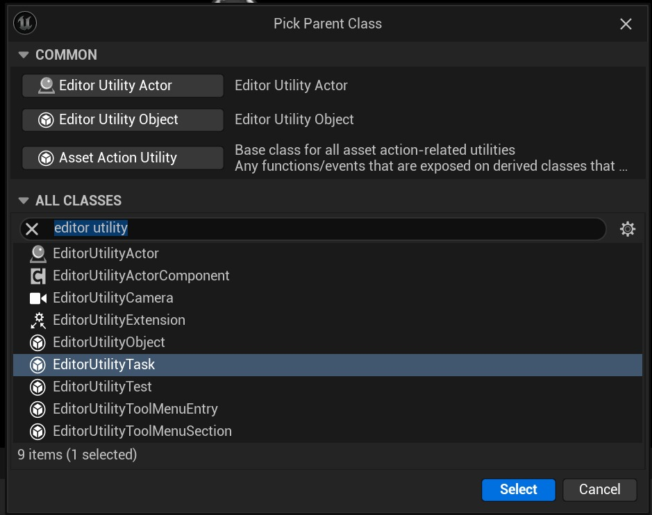

# 编辑器实用程序任务

## 来源与状态

- 原始 URL：https://dev.epicgames.com/community/learning/tutorials/0lxq/unreal-engine-editor-utility-tasks

## 运行时分类

- 类型：图文教程
- 判断：API 未识别到核心视频信号，可整理正文约 2423 字符。

## 摘要

一个简短的教程，解释什么是编辑器实用任务、它们的优点以及如何设置和执行它们

## 中文整理

### 概览

编辑器实用程序任务是一种特殊类型的编辑器实用程序蓝图，可以排队并作为后台任务异步运行。与标准实用程序蓝图相比，这具有一些优势： - 对范围的严格控制允许按顺序执行多个任务，而无需先前的节点保留引用 - 编辑器通知允许在一段时间内通过状态更新摊销工作（而不是冻结编辑器） - 将脚本功能分解为独立任务，以便轻松重用它们 - 内置队列系统允许不同的脚本添加要执行的作业，而不会相互干扰 首先，通过选择编辑器实用程序 -> 编辑器实用程序来创建编辑器实用程序任务蓝图并选择 EditorUtilityTask 作为父类。



您的任务应覆盖两个事件：BeginExecution 和 CancelRequested。 BeginExecution 是您添加任务逻辑的地方，它应该在完成后调用 FinishExecutingTask 节点，以通知任务队列它可以继续执行下一个任务。如果单击通知上的“取消”按钮，CancelRequested 将触发，并提供在安全结束任务之前清理任何正在进行的任务的机会。

**BeginExecution 和 CancelRequested 的示例实现**

```
Begin Object Class=/Script/BlueprintGraph.K2Node_Event Name="K2Node_Event_0" ExportPath=/Script/BlueprintGraph.K2Node_Event'"/Game/Developers/codyalbert/MyTask.MyTask:EventGraph.K2Node_Event_0"'
   EventReference=(MemberParent=/Script/CoreUObject.Class'"/Script/Blutility.EditorUtilityTask"',MemberName="ReceiveBeginExecution")
   bOverrideFunction=True
   NodePosX=48
   NodePosY=256
   NodeGuid=561BACFC458080CE3B0D1CBEEB3ED3BD
   CustomProperties Pin (PinId=7789A1DB40A73BDA80FA539950902E3C,PinName="OutputDelegate",Direction="EGPD_Output",PinType.PinCategory="delegate",PinType.PinSubCategory="",PinType.PinSubCategoryObject=None,PinType.PinSubCategoryMemberReference=(MemberParent=/Script/CoreUObject.Class'"/Script/Blutility.EditorUtilityTask"',MemberName="ReceiveBeginExecution"),PinType.PinValueType=(),PinType.ContainerType=None,PinType.bIsReference=False,PinType.bIsConst=False,PinType.bIsWeakPointer=False,PinType.bIsUObjectWrapper=False,PinType.bSerializeAsSinglePrecisionFloat=False,PersistentGuid=00000000000000000000000000000000,bHidden=False,bNotConnectable=False,bDefaultValueIsReadOnly=False,bDefaultValueIsIgnored=False,bAdvancedView=False,bOrphanedPin=False,)
   CustomProperties Pin (PinId=3F6A0517471B114DB9720B841E818ACF,PinName="then",Direction="EGPD_Output",PinType.PinCategory="exec",PinType.PinSubCategory="",PinType.PinSubCategoryObject=None,PinType.PinSubCategoryMemberReference=(),PinType.PinValueType=(),PinType.ContainerType=None,PinType.bIsReference=False,PinType.bIsConst=False,PinType.bIsWeakPointer=False,PinType.bIsUObjectWrapper=False,PinType.bSerializeAsSinglePrecisionFloat=False,LinkedTo=(K2Node_CallFunction_0 D2517C3B40800BEC082F27A59CC6AFF7,),PersistentGuid=00000000000000000000000000000000,bHidden=False,bNotConnectable=False,bDefaultValueIsReadOnly=False,bDefaultValueIsIgnored=False,bAdvancedView=False,bOrphanedPin=False,)
End Object
Begin Object Class=/Script/BlueprintGraph.K2Node_Event Name="K2Node_Event_1" ExportPath=/Script/BlueprintGraph.K2Node_Event'"/Game/Developers/codyalbert/MyTask.MyTask:EventGraph.K2Node_Event_1"'
```

创建任务后，您需要从其他编辑器脚本执行它。例如，您可以制作一个带有按钮的编辑器实用程序小部件，用于对任务实例进行排队。您将通过编辑器实用程序子系统和 RegisterAndExecuteTask 节点来完成此操作。

**创建并执行 EditorUtilityTask 的按钮的示例实现**

```
Begin Object Class=/Script/BlueprintGraph.K2Node_ComponentBoundEvent Name="K2Node_ComponentBoundEvent_0" ExportPath=/Script/BlueprintGraph.K2Node_ComponentBoundEvent'"/Game/Developers/codyalbert/QueueTaskWidget.QueueTaskWidget:EventGraph.K2Node_ComponentBoundEvent_0"'
   DelegatePropertyName="OnClicked"
   DelegateOwnerClass=/Script/CoreUObject.Class'"/Script/UMG.Button"'
   ComponentPropertyName="QueueTask"
   EventReference=(MemberParent=/Script/CoreUObject.Package'"/Script/UMG"',MemberName="OnButtonClickedEvent__DelegateSignature")
   bInternalEvent=True
   CustomFunctionName="BndEvt__QueueTaskWidget_QueueTask_K2Node_ComponentBoundEvent_0_OnButtonClickedEvent__DelegateSignature"
   NodePosY=656
   NodeGuid=1EF4F59B4886FA74FBF140BEB2E82392
   CustomProperties Pin (PinId=6F45509B4815401BC4A931964FCCBDAD,PinName="OutputDelegate",Direction="EGPD_Output",PinType.PinCategory="delegate",PinType.PinSubCategory="",PinType.PinSubCategoryObject=None,PinType.PinSubCategoryMemberReference=(MemberParent=/Script/UMG.WidgetBlueprintGeneratedClass'"/Game/Developers/codyalbert/QueueTaskWidget.QueueTaskWidget_C"',MemberName="BndEvt__QueueTaskWidget_QueueTask_K2Node_ComponentBoundEvent_0_OnButtonClickedEvent__DelegateSignature"),PinType.PinValueType=(),PinType.ContainerType=None,PinType.bIsReference=False,PinType.bIsConst=False,PinType.bIsWeakPointer=False,PinType.bIsUObjectWrapper=False,PinType.bSerializeAsSinglePrecisionFloat=False,PersistentGuid=00000000000000000000000000000000,bHidden=False,bNotConnectable=False,bDefaultValueIsReadOnly=False,bDefaultValueIsIgnored=False,bAdvancedView=False,bOrphanedPin=False,)
```

此处指定父任务将允许您安排任务在其父任务之后执行，而不是添加到整个队列的末尾。这样，我们可以多次单击“队列任务”按钮，并观察显示每个任务实例的开始和完成的编辑器通知。 - [虚幻编辑器脚本编写和自动化](https://docs.unrealengine.com/5.0/en-US/scripting-and-automating-the-unreal-editor) - [使用蓝图编写虚幻编辑器脚本](https://docs.unrealengine.com/5.0/en-US/scripting-the-unreal-editor-using-blueprints) - [代码片段：实用程序任务调度程序](https://dev.epicgames.com/community/snippets/5zRW/unreal-engine-editor-utility-widget-task-dispatcher)

## 相关链接

- [Scripting and Automating the Unreal Editor](https://docs.unrealengine.com/5.0/en-US/scripting-and-automating-the-unreal-editor)
- [Scripting the Unreal Editor using Blueprints](https://docs.unrealengine.com/5.0/en-US/scripting-the-unreal-editor-using-blueprints)
- [Snippet: Utility Task Dispatcher](https://dev.epicgames.com/community/snippets/5zRW/unreal-engine-editor-utility-widget-task-dispatcher)
