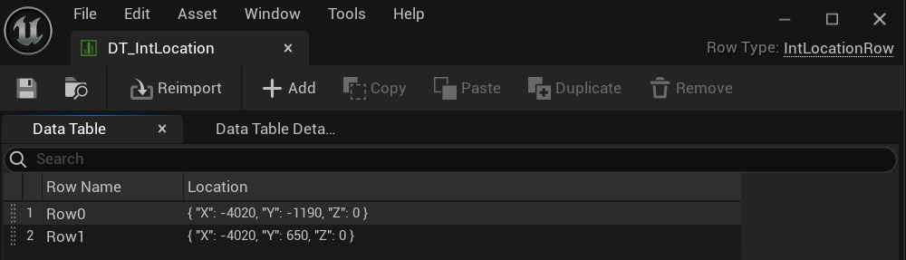

# 编辑器实用工具小部件，用于用演员的位置填充数据表

## 来源与状态

- 原始 URL：https://dev.epicgames.com/community/learning/tutorials/eP4V/unreal-engine-editor-utility-widget-to-fill-a-data-table-with-the-locations-of-actors

## 运行时分类

- 类型：图文教程
- 判断：API 未识别到核心视频信号，可整理正文约 4802 字符。

## 摘要

本教程展示了如何创建一个编辑器实用程序小部件，您可以运行该小部件来存储数据表中某个关卡上某些角色的信息，而无需运行游戏。

## 中文整理

### 概览

简介 在编辑器中工作时，在有关参与者的数据表中保存一些信息可能会很有用。特别是，对于在空间上加载到具有世界分区的关卡上的参与者，相应地，并不总是在运行时可访问。我们将创建一个带有 2 个按钮的编辑器实用程序小部件。按下按钮**加载所有演员**将确保所有演员都加载到编辑器中，但所有演员的加载也可以通过世界分区窗口完成。通过单击“缓存位置”按钮可以将信息保存在数据表中。假设对于至少 1 个轴，参与者坐标之间的差异至少为 1 个单位，因此不同参与者的位置（截断为整数）是不同的。 **具有位置的数据表的应用示例** 考虑具有位置的数据表的应用示例。假设我们在整个地图上都有战利品生成点（带有世界分区）。最初，就在游戏开始后，战利品以一定的概率出现在每个点，**p **（或者至少应该在战利品点加载时出现）。拾取战利品后，会随机选择战利品出现的新点，以便保持相同数量的战利品。生成点在空间上加载，它们的位置存储在数据表中。当游戏开始时，战利品管理器从数据表中加载信息并创建 **TMap **，其中 **FIntLocation ** 作为键，布尔值作为值（例如，在 **AGameModeBase::InitGameState(),** 中，以便它发生在调用关卡上演员的 **BeginPlay ** 之前）。布尔值表示此时是否应该出现战利品，因此它最初以给定的概率 **p** 设置为 true。生成点相应地在其 **BeginPlay ** 和 **EndPlay** 上的战利品管理器中注册和取消注册。他们使用 **TMap ** 中的布尔值来决定是否应该出现战利品。此外，当拾取战利品时，它们会通知战利品管理器，以便管理器在加载战利品时选择一个新的生成点来生成战利品。实现 让我们实现实用程序小部件，它将有助于数据表！ 1. 创建一个空白的 C++ 项目。我假设它被称为 **TableUtilityTut**。 **Source **文件夹包含 **TableUtilityTut **文件夹 (**Source\TableUtilityTut**)。在您应该创建的 **Helpers ** 文件夹中创建一个新文件 **TutHelpers.h** - **Source\****TableUtilityTut\Helpers - ** 使用以下代码：TutHelpers.h

**TutHelpers.h代码**

```cpp
#pragma once

#include "CoreMinimal.h"
#include "TutHelpers.generated.h"

USTRUCT(BlueprintType)
struct FIntLocationRow : public FTableRowBase
{
	GENERATED_BODY()
```

2. 添加文件夹**TableUtilityTutEditor **(**Source\TableUtilityTutEditor**)。在 **Source\TableUtilityTutEditor** 目录中添加以下文件：**TableUtilityTutEditor.Build.cs**、**TableUtilityTutEditor.h**、**TableUtilityTutEditor.cpp**。 （您可以从 **Source\TableUtilityTut****,** 复制现有的相似文件，并修改它们。） **TableUtilityTutEditor.Build.cs**

**TableUtilityTutEditor.Build.cs代码**

```cpp
using UnrealBuildTool;

public class TableUtilityTutEditor : ModuleRules
{
	public TableUtilityTutEditor(ReadOnlyTargetRules Target) : base(Target)
	{
		PCHUsage = PCHUsageMode.UseExplicitOrSharedPCHs;
	
		PublicDependencyModuleNames.AddRange(new string[] {
			"TableUtilityTut", // Project name
```

TableUtilityTutEditor.h

**TableUtilityTutEditor.h代码**

```cpp
#pragma once

#include "Engine.h"
#include "Modules/ModuleInterface.h"
#include "Modules/ModuleManager.h"
#include "UnrealEd.h"

class FTableUtilityTutEditorModule: public IModuleInterface
{
public:
```

TableUtilityTutEditor.cpp

**TableUtilityTutEditor.cpp代码**

```cpp
#include "TableUtilityTutEditor.h"

#include "Modules/ModuleInterface.h"
#include "Modules/ModuleManager.h"

IMPLEMENT_GAME_MODULE( FTableUtilityTutEditorModule, TableUtilityTutEditor);

void FTableUtilityTutEditorModule::StartupModule()
{
```

3、修改**TableUtilityTut.uproject**文件——在**TableUtilityTut**之后添加一个模块**TableUtilityTutEditor **（已添加）：TableUtilityTut.uproject

**TableUtilityTut.u项目代码**

```
{
	"FileVersion": 3,
	"EngineAssociation": "5.3",
	"Category": "",
	"Description": "",
	"Modules": [
		{
			"Name": "TableUtilityTut",
			"Type": "Runtime",
			"LoadingPhase": "Default",
```

4. 在新文件夹 **Source\TableUtilityTutEditor\Utilities** 中添加 **TableUtilityWidget.h** 和 **TableUtilityWidget.****cpp**（其中包含 **EditorUtilityWidget** 的子级）。 TableUtilityWidget.h

**TableUtilityWidget.h代码**

```cpp
#pragma once

#include "CoreMinimal.h"
#include "EditorUtilityWidget.h"
#include "TableUtilityWidget.generated.h"

class UDataTable;

UCLASS()
class TABLEUTILITYTUTEDITOR_API UTableUtilityWidget : public UEditorUtilityWidget
```

TableUtilityWidget.cpp

**TableUtilityWidget.cpp代码**

```cpp
#include "TableUtilityWidget.h"
#include "WorldPartition/WorldPartitionEditorLoaderAdapter.h"
#include "WorldPartition/WorldPartition.h"
#include "WorldPartition/LoaderAdapter/LoaderAdapterShape.h"
#include "Kismet/DataTableFunctionLibrary.h"
#include "Engine/DataTable.h"
#include "JsonObjectConverter.h"
#include "JsonUtilities.h"
#include "Serialization/JsonWriter.h"
#include "Serialization/JsonSerializer.h"
```

5. 重新生成解决方案并构建它。 6. 然后打开编辑器并创建 **BP_TableUtilityWidget ** 及其父 **UTableUtilityWidget**。添加 2 个按钮。将下面的脚本粘贴到小部件的“设计器”选项卡中以获取小部件树（或手动创建按钮）。

**实用工具树**

```cpp
Begin Object Class=/Script/UMG.CanvasPanel Name="CanvasPanel_0" ExportPath="/Script/UMG.CanvasPanel'/Game/BP_TableUtilityWidget.BP_TableUtilityWidget:WidgetTree.CanvasPanel_0'"
   Begin Object Class=/Script/UMG.CanvasPanelSlot Name="CanvasPanelSlot_2" ExportPath="/Script/UMG.CanvasPanelSlot'/Game/BP_TableUtilityWidget.BP_TableUtilityWidget:WidgetTree.CanvasPanel_0.CanvasPanelSlot_2'"
   End Object
   Begin Object Name="CanvasPanelSlot_2" ExportPath="/Script/UMG.CanvasPanelSlot'/Game/BP_TableUtilityWidget.BP_TableUtilityWidget:WidgetTree.CanvasPanel_0.CanvasPanelSlot_2'"
      LayoutData=(Offsets=(Left=12.000000,Top=44.000000,Bottom=40.000000))
      bAutoSize=True
      Parent="/Script/UMG.CanvasPanel'CanvasPanel_0'"
      Content="/Script/UMG.VerticalBox'VerticalBox_0'"
   End Object
   Slots(0)="/Script/UMG.CanvasPanelSlot'CanvasPanelSlot_2'"
```

7. 调用 **BP_TableUtilityWidget** 中的 **Fill Data Table** 函数需要 2 个参数，因此选择一个 Actor 类（在示例中，**BP_TestActor** 是 **Actor** 的子蓝图，该类的少数 Actor 放置在一个关卡 ** ** 上）和一个数据表。要填充数据表参数，请创建一个空表 **DT_IntLocation**，其中包含 **FIntLocationRow** 类型的行。

**BP_TableUtilityWidget**

```
Begin Object Class=/Script/BlueprintGraph.K2Node_ComponentBoundEvent Name="K2Node_ComponentBoundEvent_0" ExportPath="/Script/BlueprintGraph.K2Node_ComponentBoundEvent'/Game/BP_TableUtilityWidget.BP_TableUtilityWidget:EventGraph.K2Node_ComponentBoundEvent_0'"
   DelegatePropertyName="OnClicked"
   DelegateOwnerClass="/Script/CoreUObject.Class'/Script/UMG.Button'"
   ComponentPropertyName="CacheLocationsBtn"
   EventReference=(MemberParent="/Script/CoreUObject.Package'/Script/UMG'",MemberName="OnButtonClickedEvent__DelegateSignature")
   bInternalEvent=True
   CustomFunctionName="BndEvt__BP_EUW_Utils_Button_0_K2Node_ComponentBoundEvent_0_OnButtonClickedEvent__DelegateSignature"
   NodePosX=-688
   NodePosY=128
   NodeGuid=5BD3F941461F55455C0BCDA8C61C7FCC
```

8. 现在关闭数据表，运行编辑器小部件，单击 **LoadAllActors ** 和 **CacheLocations**；采集后保存数据表。现在您拥有了包含某个类别的演员的所有（截断为 int）位置的数据表！



- [编辑器实用程序小部件文档](https://docs.unrealengine.com/5.3/en-US/editor-utility-widgets-in-unreal-engine) - [世界分区文档](https://docs.unrealengine.com/5.3/en-US/world-partition-in-unreal-engine)

## 相关链接

- [Editor Utility Widget Documentation](https://docs.unrealengine.com/5.3/en-US/editor-utility-widgets-in-unreal-engine)
- [World Partition Documentation](https://docs.unrealengine.com/5.3/en-US/world-partition-in-unreal-engine)
