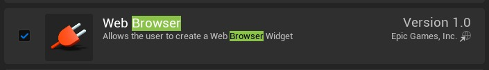
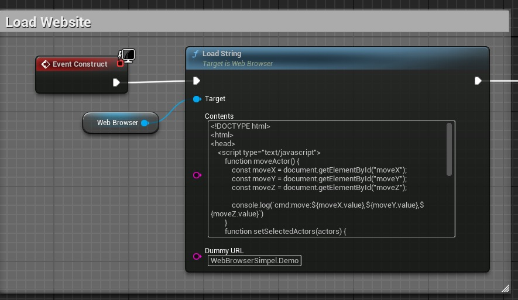
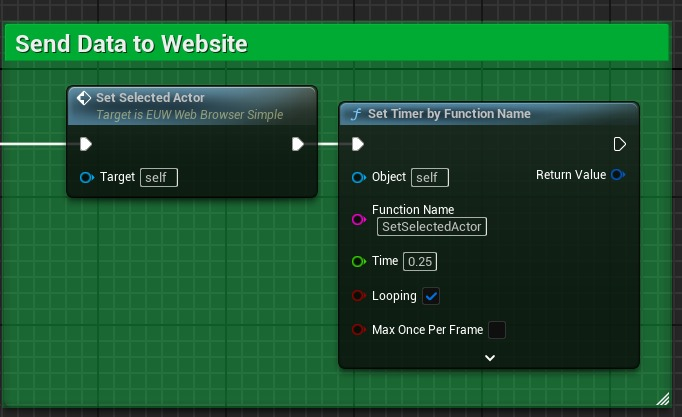
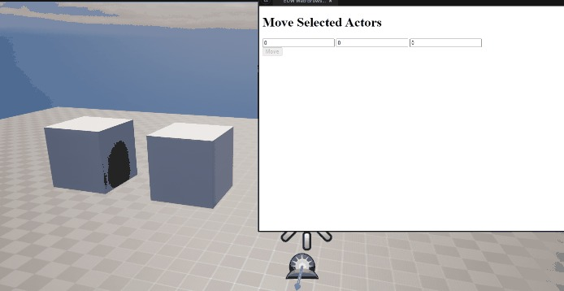

# 使用网络浏览器的编辑器实用程序小部件 (Part 1/2)

Source file: `unreal-engine-editor-utility-widgets-with-webbrowser.origin.md`.

This document was split during ue-kb import to keep source chunks buildable.

## 来源与状态

- 原始 URL：https://dev.epicgames.com/community/learning/tutorials/z0zP/unreal-engine-editor-utility-widgets-with-webbrowser
## 运行时分类

- 类型：图文教程
- 判断：API 未识别到核心视频信号，可整理正文约 10279 字符。
## 摘要

In this tutorial I will show you how to use the WebBrowser plugin to integrate web services into Unreal.您可以使用它来下载和导入模型（例如 Sketchfab）或改进规划（例如 Jira）。基本上你可以取代恼人的切换到网络浏览器。
## 中文整理
### 概览

In this tutorial I will show you how to use the WebBrowser plugin to integrate web services into Unreal.您可以使用它来下载和导入模型（例如 Sketchfab）或改进规划（例如 Jira）。基本上你可以取代恼人的切换到网络浏览器。
### 它是如何运作的

想法如下，Unreal 的 WebBrowser 小部件可以执行 Javascript，我们可以使用“On Console Message”事件从 WebBrowser 获取数据。也许有更好的方法来达到同样的效果。不幸的是，WebBrowser 插件没有真正的文档。
### 基础简单

首先，我们需要 Epic 的 WebBrowser 插件。



现在我们创建一个编辑器实用程序小部件。现在我们创建一个编辑器实用程序小部件。 Web 浏览器已添加到此小部件中。将小部件设置为变量。在构造事件中我们加载一个 HTML 字符串。该网站有三个输入和一个按钮。标题中还有两个函数。



```
<!DOCTYPE html>
<html>
<head>
	<script type="text/javascript">
		function moveActor() {
			const moveX = document.getElementById("moveX");
			const moveY = document.getElementById("moveY");
			const moveZ = document.getElementById("moveZ");

			console.log(`cmd:move:${moveX.value},${moveY.value},${moveZ.value}`)
```

如果您现在单击该按钮，则会创建一个 console.log，其中包含以下内容： “cmd:move:0,0,100”，其中最后一个数字来自输入字段。我们现在可以执行以下操作，如果日志开头带有“cmd”，我们用分隔符“：”分隔此消息。作为第二个条目，我们指定它是命令名称。我们现在可以使用一个简单的“切换节点”并且可以处理命令。最后是命令的数据。整个事情是一个极其简单的“协议”，你当然也可以使用 JSON。

```
Begin Object Class=/Script/BlueprintGraph.K2Node_FunctionEntry Name="K2Node_FunctionEntry_0" ExportPath="/Script/BlueprintGraph.K2Node_FunctionEntry'/Game/Basics/Simple/EUW_WebBrowserSimple.EUW_WebBrowserSimple:ReceiveData.K2Node_FunctionEntry_0'"
   MetaData=(bCallInEditor=True)
   ExtraFlags=201457664
   FunctionReference=(MemberName="ReceiveData")
   bIsEditable=True
   NodePosX=208
   NodePosY=544
   NodeGuid=31966BA34C60632D0F719B9AC5972F85
   CustomProperties Pin (PinId=89A499C74E14B763DD7CBBB4DDE45C58,PinName="then",Direction="EGPD_Output",PinType.PinCategory="exec",PinType.PinSubCategory="",PinType.PinSubCategoryObject=None,PinType.PinSubCategoryMemberReference=(),PinType.PinValueType=(),PinType.ContainerType=None,PinType.bIsReference=False,PinType.bIsConst=False,PinType.bIsWeakPointer=False,PinType.bIsUObjectWrapper=False,PinType.bSerializeAsSinglePrecisionFloat=False,LinkedTo=(K2Node_VariableSet_1 DBA9C73C43EE4F80A43EB29515B25FCD,),PersistentGuid=00000000000000000000000000000000,bHidden=False,bNotConnectable=False,bDefaultValueIsReadOnly=False,bDefaultValueIsIgnored=False,bAdvancedView=False,bOrphanedPin=False,)
   CustomProperties Pin (PinId=8685DE7A45FA531EA12C669F750BC036,PinName="Message",Direction="EGPD_Output",PinType.PinCategory="string",PinType.PinSubCategory="",PinType.PinSubCategoryObject=None,PinType.PinSubCategoryMemberReference=(),PinType.PinValueType=(),PinType.ContainerType=None,PinType.bIsReference=False,PinType.bIsConst=False,PinType.bIsWeakPointer=False,PinType.bIsUObjectWrapper=False,PinType.bSerializeAsSinglePrecisionFloat=False,LinkedTo=(K2Node_VariableSet_1 83AB6B934DD1181C6A13ED85959EBBD8,K2Node_CallFunction_1 D0E44A4842782C4CA95D65A44151EB0A,),PersistentGuid=00000000000000000000000000000000,bHidden=False,bNotConnectable=False,bDefaultValueIsReadOnly=False,bDefaultValueIsIgnored=False,bAdvancedView=False,bOrphanedPin=False,)
```

这是从网络浏览器获取数据的方式，但是其他方向呢？ Unreal 如何与网络浏览器配合使用？这非常简单，我们使用节点“执行 Javascript”。这样你就可以简单地执行Javascript。例如。我们的 setSelectedActors 函数。这样我们就可以将当前选定的演员姓名发送到网络浏览器。我们将整个事情放入一个函数中，并让它每 0.25 秒执行一次。

```
Begin Object Class=/Script/BlueprintGraph.K2Node_FunctionEntry Name="K2Node_FunctionEntry_0" ExportPath="/Script/BlueprintGraph.K2Node_FunctionEntry'/Game/Basics/Simple/EUW_WebBrowserSimple.EUW_WebBrowserSimple:SetSelectedActor.K2Node_FunctionEntry_0'"
   MetaData=(bCallInEditor=True)
   LocalVariables(0)=(VarName="showString",VarGuid=5E1CC86448C33BFABF692CA9C7166577,VarType=(PinCategory="string"),FriendlyName="Show String",Category=NSLOCTEXT("KismetSchema", "Default", "Default"),PropertyFlags=5)
   ExtraFlags=201457664
   FunctionReference=(MemberName="SetSelectedActor")
   bIsEditable=True
   NodePosX=1232
   NodePosY=320
   NodeGuid=30AFE4B44AA9223205949382C5171539
   CustomProperties Pin (PinId=0C3A288D4E2B2902AD9E43B655FBEE58,PinName="then",Direction="EGPD_Output",PinType.PinCategory="exec",PinType.PinSubCategory="",PinType.PinSubCategoryObject=None,PinType.PinSubCategoryMemberReference=(),PinType.PinValueType=(),PinType.ContainerType=None,PinType.bIsReference=False,PinType.bIsConst=False,PinType.bIsWeakPointer=False,PinType.bIsUObjectWrapper=False,PinType.bSerializeAsSinglePrecisionFloat=False,LinkedTo=(K2Node_CallFunction_21 33243E43478DB68EFB855BBCDAF02E7F,),PersistentGuid=00000000000000000000000000000000,bHidden=False,bNotConnectable=False,bDefaultValueIsReadOnly=False,bDefaultValueIsIgnored=False,bAdvancedView=False,bOrphanedPin=False,)
```




