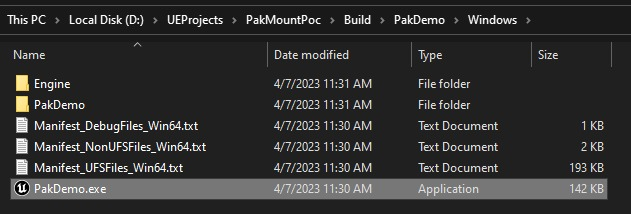
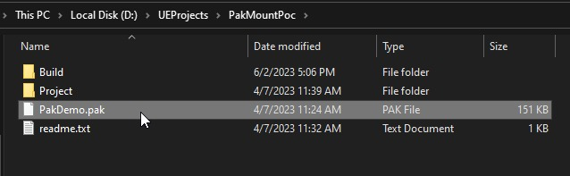
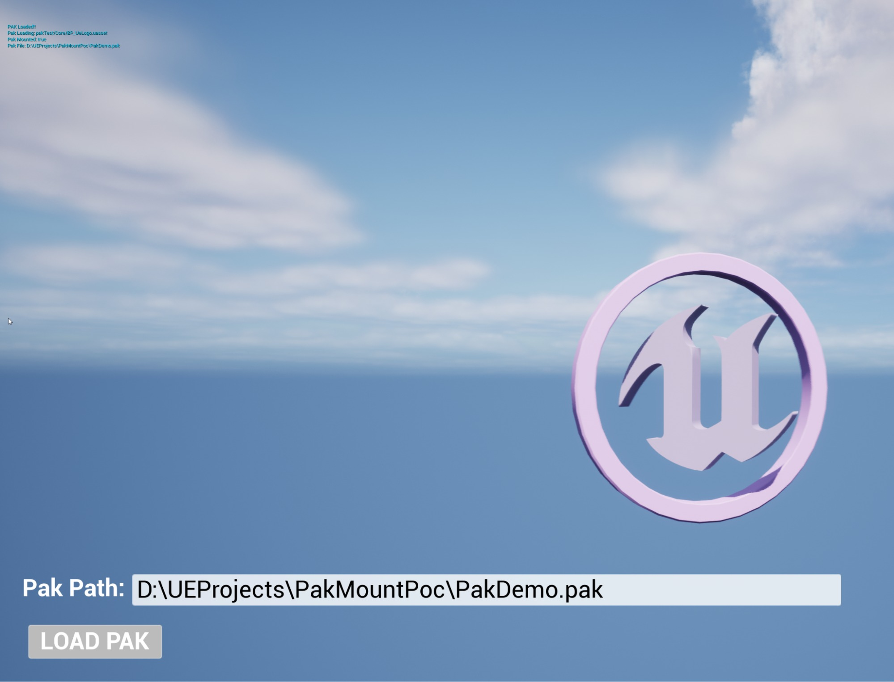
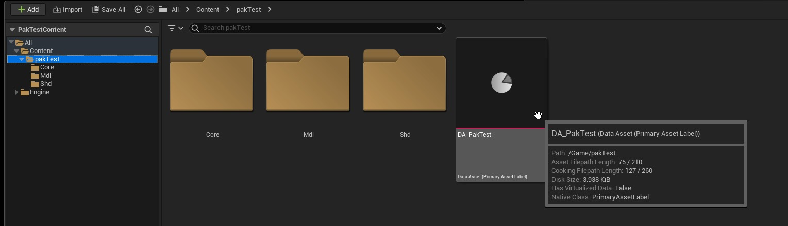
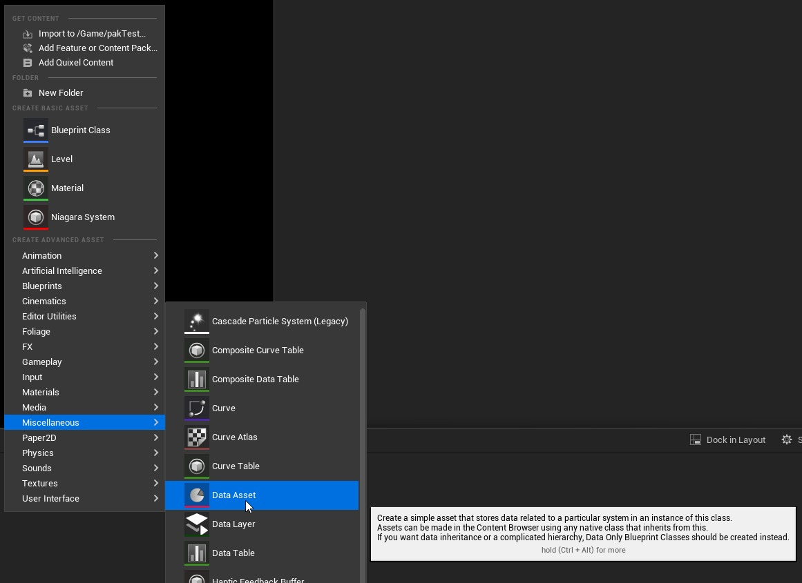
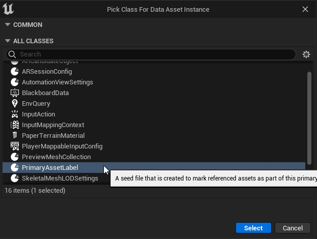
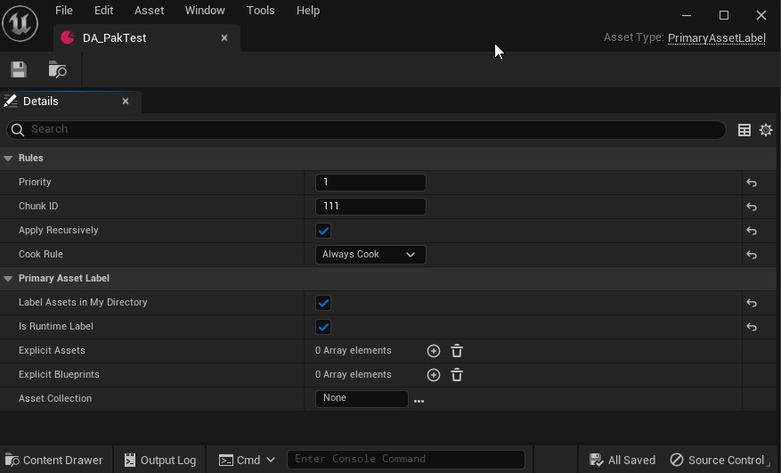
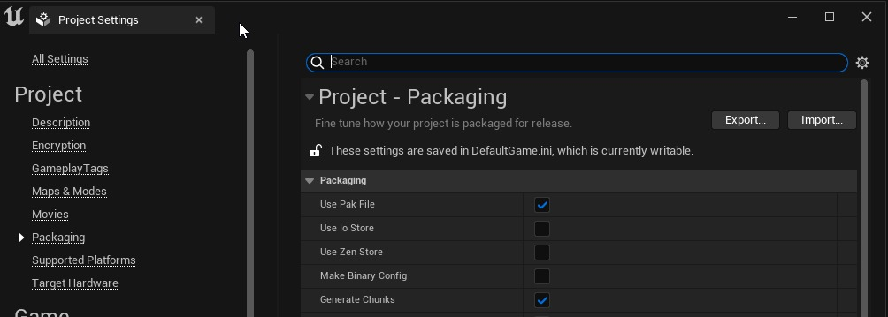
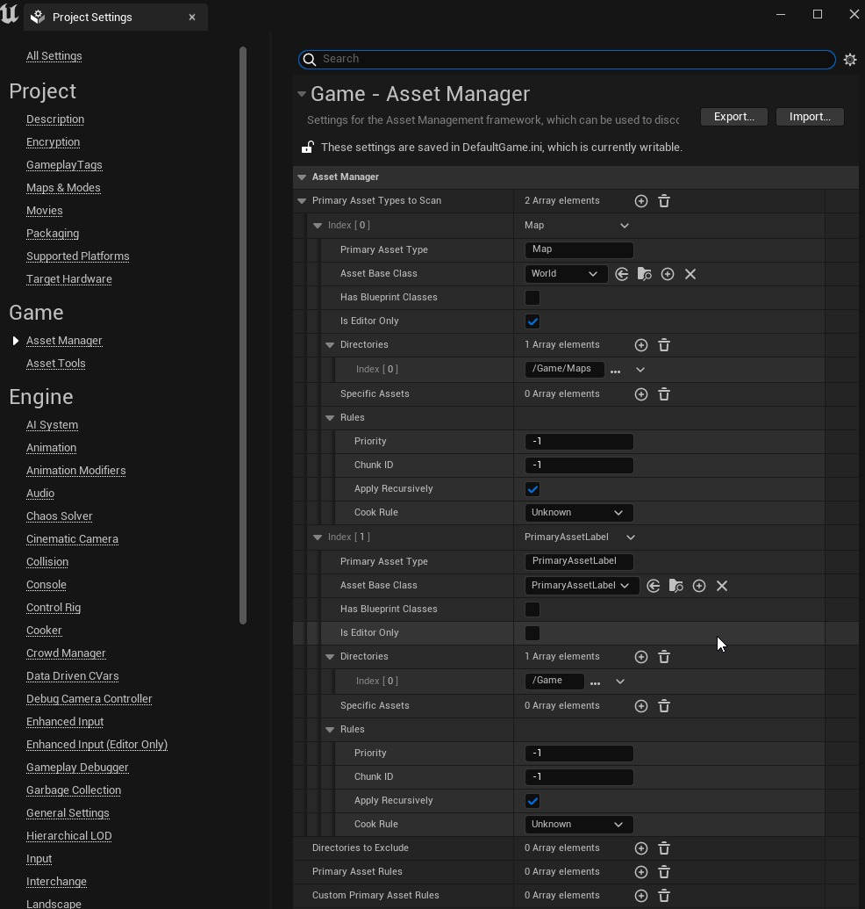
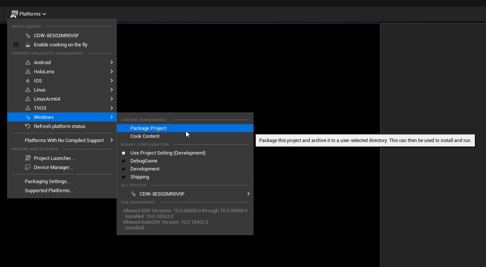

# 示例项目：在运行时加载 Pak 文件 (Part 1/2)

Source file: `unreal-engine-example-project-loading-pak-files-at-runtime.origin.md`.

This document was split during ue-kb import to keep source chunks buildable.

## 来源与状态

- 原始 URL：https://dev.epicgames.com/community/learning/tutorials/7Bj8/unreal-engine-example-project-loading-pak-files-at-runtime
## 运行时分类

- 类型：图文教程
- 判断：API 未识别到核心视频信号，可整理正文约 20383 字符。
## 摘要

PakDemo 项目演示了由虚幻引擎项目创建的独立应用程序，该应用程序可以从本地文件系统或在单独项目中处理的可寻址路径加载 .pak 文件中的资源。本教程将逐步介绍提供的 PakTestContent 项目示例（将生成 Pak 文件）和 PakDemo 项目（将在运行时加载 Pak 文件）。
## 中文整理
### 概括

虚幻引擎 (UE) 可以以 .pak 文件的形式在应用程序的主可执行文件之外提供资产。为此，我们将资产组织成块，这些块是烹饪过程识别的资产文件组。此参考实现将展示如何在虚幻编辑器中将资源组织成块。这将生成一个示例项目，该项目将生成 .pak 文件，您可以通过修补系统交付并使用 C++ 蓝图函数库加载蓝图内容。 Pak 文件依赖于功能的软引用，您的主虚幻引擎应用程序将以这种方式与任何 Pak 加载的内容进行通信。有关对象引用在虚幻引擎中如何工作的回顾，请参阅官方文档。 [提供的 PakMountPoc.zip 项目文件](https://epicgames.box.com/s/hecu7ew61l3yu9smc5ll44vp8xdbdtgz) 包含两个项目和一个 Windows 可执行文件的示例构建。注意：由于缺少一组可执行文件，此文件已更新。请务必下载最新的项目文件。更新：盒子上的 PakFileReader(UpdatedCodebase_Oct2024).zip 存档中有一些代码更改。蓝图功能相同，但底层代码稍作修改。 PakDemo 项目演示了由虚幻引擎项目创建的独立应用程序，该应用程序可以从本地文件系统或可寻址路径加载任何 .pak 文件。本文档将介绍将生成 Pak 文件的 PakTestContent 项目的示例以及将在运行时加载 Pak 文件的 PakDemo 项目。
### 示范

在提取的“Build”文件夹中，还有生成的 PakDemo 项目的 Windows 可执行文件，用于快速运行应用程序并在本地进行测试。



该应用程序有一个 Pak Path 输入字段，它采用文件路径。按照指示输入 PakDemo.pak 文件的有效路径。



按 Load PAK 按钮导入 Pak 文件的内容并显示它。在此示例中，蓝图生成了一个旋转的 UE 徽标。屏幕左上角还打印了一些消息。



Clear Pak 按钮将从运行时应用程序中卸载 Pak 文件内容。
### 版本与平台匹配规则

Pak 文件与 Uassets 非常相似，与给定版本的虚幻引擎兼容。使用虚幻引擎 5.1 创建的 Pak 文件可用于该特定版本的虚幻引擎 5.1，但不适用于之前或更高版本。最佳实践是对应用程序实施强大的版本控制策略，以便在对项目进行版本升级时具有战略意义。虚幻引擎以其内部使用的特定格式存储内容资源，例如用于纹理数据的 PNG 或用于音频的 WAV。然而，这些内容需要针对不同的平台转换为不同的格式，要么是因为平台使用专有格式，不支持虚幻用来存储资源的格式，要么存在内存或性能更有效的格式。将内容从内部格式转换为平台特定格式的过程称为烹饪。有关烹饪的更多信息，请参阅[官方文档](https://docs.unrealengine.com/5.2/en-US/cooking-content-in-unreal-engine/)。 Pak 文件是针对特定平台编写的，因此在 Windows 上生成的 Pak 文件将与 Android 不兼容。其原因是内容是针对平台目标和着色器图形语言编写的。在某些边缘情况下，缓存和类似的与平台无关的内容可以跨平台共享，但原则上希望为每个平台进行打包。创建 Pak 文件 PakTestContent 项目展示了如何生成在应用程序中使用的 Pak 文件。强烈建议您的管道采用 ChunkID 策略，以便管理跨项目和应用程序使用的 ID。 Pak 文件非常强大，需要主动管理。
### Pak 生成工作流程概述

1. 在项目内构建 Pak 内容以满足应用程序的要求 2. 定义 Pak 输出的数据 3. 配置项目以生成 Pak 文件 4. 打包项目以生成 Pak 文件 5. 检查 Pak 文件内容（可选） 为分块和打包准备资源的工作流程详细信息请参见 [官方文档]文档](https://docs.unrealengine.com/5.0/en-US/preparing-assets-for-chunking-in-unreal-engine/)。项目样本的具体细节详述如下。
### 1. 构建 Pak 内容

在虚幻编辑器的内容浏览器中，有一个文件夹结构包含每个 Pak 文件的内容，它是 pakTest 文件夹。 pakTest 中的示例子文件夹： - Core - 蓝图示例 - Mdl - 静态网格物体 - Shd - 材质和一个实例，以证明任何东西都可以在 Pak 文件中。 2. 数据资产（主要资产标签） 在 pakTest 文件夹中，有一个数据资产用于定义 Pak 输出。



要创建此类的数据资产，请右键单击内容浏览器并选择其他 -> 数据资产



选择类类型“PrimaryAssetLabel”



根据以下原则配置数据资产： - 块ID - 每个包唯一的整数 - 为每个定义的ChunkID 整数（例如：100）生成一个Pak 文件。每个 ID 都应根据您的项目结构特定于所需的结果。建议跟踪并生成 ChunkID 作为通用唯一标识符 (UUID) 或类似标识符，这样在使用大型应用程序时就不会发生冲突。 ID 整数越高，烹饪时间越长，因此建议将此数字保持在 10,000 以下。 - 递归应用 - 启用 - 这会将 pakTest 内容文件夹中的子目录包含到 Pak 文件输出中。默认情况下也会包含 pakTest 文件夹根目录中的项目。 - 烹饪规则 - 始终烹饪 - 默认情况下，这将确保该内容始终在包装上烹饪。这里有一些选项可供探索，对于此示例，我们将始终烘焙内容以确保其生成。有关设置 Chunks 的更多信息，请参阅[官方文档](https://docs.unrealengine.com/5.2/en-US/cooking-content-and-creating-chunks-in-unreal-engine/)


### 3. 项目设置

有关项目设置的更多信息，请查看[官方文档](https://docs.unrealengine.com/4.26/en-US/Basics/Projects/Packaging/#advancedsettings)。项目需要配置的关键设置是：
### 包装设置



- 使用 Pak 文件 - 是否将项目的资产打包为单个文件或单个包。如果启用，所有资源将被放入单个 .pak 文件中，而不是复制出所有单个文件。如果您的项目使用大量资源文件，那么使用 Pak 文件可能会更容易分发，因为它减少了需要传输的文件量。默认情况下禁用此选项。 - 生成块 - 是否生成可用于流式安装的 .pak 文件块。
### 资产管理器设置



- PrimaryAssetLabel - 仅编辑器 - 禁用 - 这告诉没有主资产标签的内容将生成为 Pak0，并且它们不仅仅是编辑器使用的内容。 Pak0 始终包含未使用数据资产定义的内容。
### 4. Android OBB 过滤器定义

Android 使用 OBB 文件将应用程序分成多个部分，类似于我们的 Pak 文件。为项目定义要从 OBB 打包中过滤掉的每个 PakChunk 的 DefaultEngine.ini 非常重要。这将从 OBB 中排除名称中包含所提供字符串的任何部分的 pak 文件。然后，Pak 文件可以与 APK 和 OBB 方法分开处理。

```
[/Script/AndroidRuntimeSettings.AndroidRuntimeSettings]
 +ObbFilters="-*pakchunk1*"
 +ObbFilters="-*pakchunk2*"
 +ObbFilters="-*pakchunk3*"
 +ObbFilters="-*pakchunk4*"
 +ObbFilters="-*pakchunk5*"
 +ObbFilters="-*pakchunk6*"
 +ObbFilters="-*pakchunk7*"
 +ObbFilters="-*pakchunk8*"
 +ObbFilters="-*pakchunk9*"
```
### 5. 打包项目以Cook Pak文件

使用典型工作流程打包项目。请记住，Pak 文件将根据目标规范进行烘焙时按平台生成。包装将创造一个特定的



出现提示时，选择要构建包的文件夹。我选择了示例文件夹根目录中的 Build 文件夹。请注意，我没有选择 PakDemo 文件夹，因为这是我们与此演示共享的预构建项目。创建适合您的项目的结构。虚幻编辑器将生成具有以下格式名称的 Paks： - pakchunk[ChunkID]-[PLATFORM] - 在我们的示例中为 pakchunk111-Windows.pak。我们选择 111 作为数据资产中的 ChunkID。建议用于定义 ChunkID 的任何规则也应该用于跟踪这些 Pak 文件。这将有助于将来在其他应用程序中使用 Pak 文件时。 Pak 文件可以重命名。示例根目录中的 PakDemo.pak 文件是为示例生成并重命名的。
### 6.查看Pak文件内容（可选）

检查 UnrealPak.exe 以查看 pak 文件内的内容，包括路径

```
Unrealpak.exe pakfilepath -list
```
### Pak一代常见问题解答
### Pak 文件块 ID 是否需要唯一？

是的，Pak Chunk ID 在项目内应该是唯一的。用于更高级分配的块 ID UUID 生成器，出于性能原因，数字应保持在 10,000 以下。
### 如果我只想将内容添加到应用程序中，是否需要烹饪并打包应用程序？

它是特定于管道的，但只要主应用程序中的逻辑没有改变。 Pak 文件本质上是软引用，因此只要您的原始应用程序没有更改，您就可以将内容与主应用程序逻辑分开。
### 我可以重命名生成的 Pak 文件吗？

是的，您可以重命名 pak 文件。许多人创建了一个实用程序，使用数据表或其他跟踪机制来将 pakchunkID 管理为项目中有意义的名称。
### 是否可以对 Pak 文件进行签名和加密？

是的，当在发货产品中分发时，Pak 文件可以进行签名或加密，通常是为了阻止数据提取或篡改。要激活、停用或调整项目的加密设置，请转到“项目设置”菜单并找到“加密”部分。 [这里有官方文档链接供参考](https://docs.unrealengine.com/4.26/en-US/Basics/Projects/Packaging/#signingandencryption)。
### 虚幻引擎是否有针对 Pak 文件的修补策略？

是的，有[有关应用程序修补工作流程的文档](https://docs.unrealengine.com/5.0/en-US/updating-unreal-engine-projects-with-patches-after-release/)。
### 在运行时应用程序中加载 Pak 文件

PakDemo 项目是一个示例 C++ 项目，它将概述 Pak 加载器功能。此示例演示了直接在运行时应用程序中加载 Pak 文件。
### 1.打开Pack演示项目

PakDemo 项目是在虚幻引擎 5.1 版本中创建的，但这些概念将从 4.27 开始生效。 PakDemo 项目是一个 C++ 项目，因此当您加载它时，可能会出现以下提示，要求您从源代码重建模块。出现提示时回答“是”。
