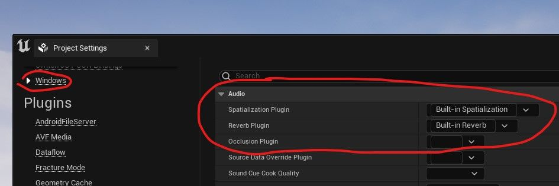
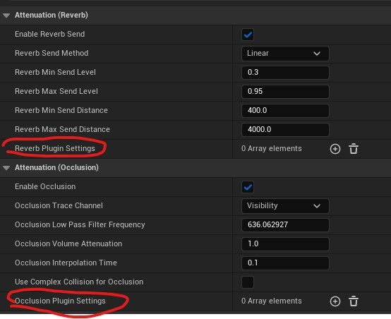

# 通过现有接口通过插件扩展虚幻音频引擎

## 来源与状态

- 原始 URL：https://dev.epicgames.com/community/learning/tutorials/wZwV/unreal-engine-expanding-unreal-audio-engine-through-plugins-via-existing-interfaces

## 运行时分类

- 类型：图文教程
- 判断：API 未识别到核心视频信号，可整理正文约 12756 字符。

## 摘要

介绍如何通过 IAudioExtensionPlugins.h 中的接口自定义和扩展虚幻引擎的音频混合器。由于接口已经存在，因此在执行自定义项目中使用的空间化功能等任务时，虚幻引擎可以轻松地直接开始使用信号处理代码。这是一个中级教程，假设您已经具有在虚幻引擎中创建插件、在虚幻引擎中使用 C++ 进行编码、虚幻引擎音频引擎的高级结构以及编写音频 DSP 代码的一些经验。

## 中文整理

### 概览

Unreal 的内置音频引擎包含一些功能，例如传达声源相对于听者的方向、应用与音频音量相关的混响效果以及根据声源是否被遮挡来改变声源。

此外，还有一些第三方插件可以增强此功能，例如 Google Resonance、Project Acoustics 或 Oculus Audio 等工具。

这让用户可以自定义音频空间化设置以最适合他们的游戏，无论是通过工作流程的改变、性能与性能的权衡。

准确的建模、游戏中的几何图形和音频行为之间的关系等等。

然而，有时游戏对音频空间化的需求比普通虚幻引擎开箱即用的需求更具体。

对于在虚幻之外的环境中已经拥有自己喜欢的算法或空间化工具的用户来说尤其如此。

好消息是，虚幻引擎拥有用于创建旨在改变音频空间化的音频插件的现有接口，使您可以轻松地专注于 DSP 代码，而不必担心诸如更改现有虚幻音频引擎或向现有虚幻音频引擎添加挂钩之类的事情。

这就是我们今天要讨论的话题。

**什么是音频插件接口？** 在这种情况下，**接口** 指的是接口的编程概念 - 一个定义一组继承者应实现的虚拟函数的类。

这允许程序员通过将它们转换为基接口类，使用相同的代码与在这些函数的实现方面可能存在很大差异的类进行交互。

由于现有的音频空间化工具和方法有很多，而且通常团队可以集中大量资源来研究和实施空间化解决方案，因此虚幻引擎有强烈的动机让这些工具的使用变得尽可能简单，而不会干扰虚幻的其余音频功能。

因此，Unreal 具有各种插件接口，旨在实现定向空间化、混响或遮挡功能。

这意味着您可以执行诸如启用或禁用音频插件进行测试、测试项目使用不同音频插件的声音效果或在不同平台上使用不同音频插件等操作。

这也意味着，在创建自己的音频空间化插件时，您可以看到需要实现哪些功能。

而且，由于 Unreal 的核心音频引擎代码依赖于对这些接口的调用，而不是依赖于任何特定的实现，因此您可以在模块化环境中编写插件，而无需担心更改任何现有的音频引擎代码。

**空间化、混响和遮挡** 您可以在文件 IAudioExtensionPlugin.h (\Engine\Source\Runtime\AudioExtensions\Public\IAudioExtensionPlugin.h) 中找到现有的音频插件接口。

虽然此文件中有多个接口，但与本教程最相关的接口是 IAudioSpatialization、IAudioReverb 和 IAudioOcclusion。

这些插件接口在代码和游戏内实现需求方面具有许多重要的品质，因此本教程中的大部分信息以相同的方式适用于所有三个接口。

也就是说，虽然它们都影响着音频行业中通常被广泛称为空间化的内容，但它们在音频管道中的作用点略有不同，并且控制着空间化处理的不同方面。

**IAudioSpatialization **是一个控制声源的方向性和距离衰减等方面的接口。

考虑平移、耳间时间延迟和 HRTF 之间的差异 - 例如，源位置和听众之间的角度如何传达、距离如何改变声音以及自定义属性如何影响此行为。

该接口应用于声源级别，并假设应用到该接口的所有对象的位置数据在音频引擎更新循环中都是最新的。

**IAudioReverb **是一个** **添加混响效果的界面，通常与房间相关。

它可以在声源级别实现，也可以作为子混合效果实现。

建议在子混合效果级别实现它 - 许多混响算法都很昂贵，因此将效果应用于音频混合缓冲区可以比按源效果处理带来性能提升。

音频音量和音频游戏音量都可以直接绑定到混响插件和关联的设置对象。

**IAudioOcclusion **是一个覆盖 Unreal 内置遮挡处理的接口，与 IAudioSpatialization 处理的方向和距离处理相反。

例如，它控制当另一个物体阻碍声音时声音的表现方式。

有关如何使用此功能的一些示例可能包括添加部分遮挡的计算或考虑遮挡对象的材质。

上述每个接口还允许您创建与其关联的自定义设置对象，让您确定用户在使用插件时应该能够自定义哪些参数。

**制作您的插件** 本教程假设您对在虚幻中制作插件有些熟悉（如果不熟悉，可能值得查看[有关如何在虚幻中制作插件的文档](https://docs.unrealengine.com/en-US/ProductionPipelines/Plugins/)）。

您需要添加对音频混合器的私有模块依赖项 - 音频混合器是我们最新的音频引擎，如果音频混合器被禁用，您将不想运行您的插件。

除此之外，您还需要在插件中做两件主要事情：实现所需界面的功能，并实现界面工厂，以便虚幻知道您的插件可以在项目设置中的空间化/混响/遮挡点中使用。

如果您是一个主要通过查看现有代码来学习的人，那么 ITDSpatializer.h 和 .cpp 提供了这两者的相当轻量级的示例。

混响和遮挡接口的结构与空间化接口非常相似，因此无论您使用哪种接口，ITD 都是一个有用的示例。

*实现工厂* 实现工厂速度更快，所以让我们从这里开始。

在 IAudioExtensionPlugin.h 中，每个接口类型都有一个“IAudio[Type]Factory”类。

在您的插件中，您需要创建一个从该工厂继承的类，并实现虚拟函数。

对于工厂来说，您的实现可能非常短，特别是考虑到许多工厂都有默认实现。

您要做的主要事情是让 CreateNew[Type]Plugin 返回一个指向相关插件类型的指针 - 具体来说，它应该是一个指向接口实现实例的指针。

工厂也是您分配任何自定义设置类的地方，并且可以设置诸如功能名称及其最大支持通道之类的详细信息。

为了进行测试，我建议在这里创建所需接口的虚拟实现，或者返回另一个已经存在的实现，并确认工厂此时正在工作。

如果您设置正确，您的插件在激活后应该出现在平台项目设置“[空间化/混响/遮挡]插件”的下拉菜单中 - 有关更多详细信息，请参阅测试您的插件部分。

如果您正在创建自定义设置类，您可能还想在深入创建接口实现之前在这里实现它，以确认它按预期工作。

您可以通过继承关联的 U[Type]PluginSourceSettingsBase 来完成此操作 - 通常，您将主要向其中添加 UPROPERTIES。

创建自定义设置对象可以让您更好地控制声源和/或音频音量如何相互变化。

*实现接口* 现在来了有趣的部分：实际的接口。

它们都共享一些基本功能 - Initialize、Shutdown、OnInitSource、OnReleaseSource 和 ProcessAudio。

您需要在 Initialize 函数中处理来自 FAudioPluginInitializationParams 对象的项目级音频信息，例如采样率、缓冲区长度和输出通道数量的数据。

OnInitSource 是您接收任何源特定设置的地方（如果您为插件创建了自定义设置类），并且应该用于初始化插件每个源所需的任何数据。

ProcessAudio 是大部分 DSP 代码所在的函数。

OnReleaseSource 和 Shutdown 应分别包含对各个源和整个插件所需的清理。

此外，IAudioSpatialization 包含一些用于初始化、创建和获取空间化效果的函数，而 IAudioReverb 包含与效果子混合交互的函数。

额外的 IAudioSpatialization 函数是可选的，不会在引擎代码中直接调用。

但是，需要实现 GetSubmix() 和 GetEffectSubmix() 才能使 IAudioReverb 正常工作，并用于加载项目的混响子混合。

可能值得进行代码搜索，以了解在音频引擎的更广泛上下文中调用每个接口的位置。

AudioMixerSourceManager.cpp 中对 SpatialInterfaceInfo、ReverbPluginInterface 和 OcclusionInterface 的调用分别是您想要查看的相关对象，以便更好地了解每个接口在管道中的使用位置。

例如，您会注意到接口的应用顺序是“混响”、“遮挡”、“空间化”。

**测试您的插件** 在项目中编译并激活插件后，下一步是将其设置为您所需平台的空间化/混响/遮挡插件。

您可以在平台的“项目设置”选项卡中的“音频”字段下找到它。

您应该能够在相关插件字段的下拉列表中看到您的插件作为选项列出 - 如果它不存在，则插件工厂步骤可能出现问题，或者您的插件可能未在插件面板上正确启用。

但假设您的插件位于下拉菜单中，请将其设置为与您实现的任何接口关联的插件类型的选项。

从这里开始，如果您有任何插件设置对象，现在是实现它们的好时机。空间化、混响和遮挡自定义设置都可以通过声音衰减资源应用于声源。此外，混响插件设置还可以应用于音频音量和音频游戏音量，或用作子混合效果。要创建设置对象，您可以从接受设置对象的插槽中创建新对象，也可以通过右键单击内容浏览器并进入声音菜单来手动创建设置对象。然后，您可以使用您的资源和潜在的自定义设置运行游戏，并确认您的插件听起来符合预期。可能还值得查看一些可用的音频控制台命令，以获取任何调试的帮助。特别是，“au.DisableBinauralSpatialization 1”、“au.DisableReverbSubmix 1”和“au.DisableOcclusion 1”等命令可以帮助快速比较经过插件处理和未经插件处理的音频听起来如何。

**结论** 希望本教程足以让您开始了解如何利用自己的知识扩展虚幻的音频空间化功能。音频空间化是一个广泛而广阔的领域，因此有很多方向需要进一步学习。 HRTF、高阶 Ambisonic 场和反射建模只是更广泛音频行业的研究如何通过扩展插件来增强 Unreal 的一些示例。同样，业界也在不断学习有关优化性能或提高真实性的算法方法的新知识。除此之外，还值得进一步研究虚幻音频的更抽象接口，以及使用同一插件实现多个接口的更先进技术，允许空间化、混响和遮挡数据相互交互，而不是单独计算。享受尝试的乐趣！
