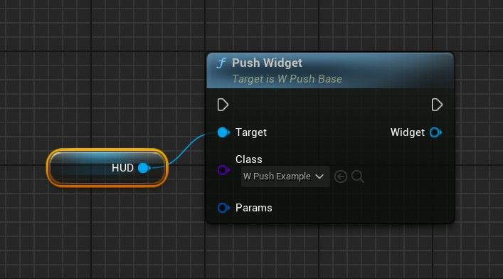
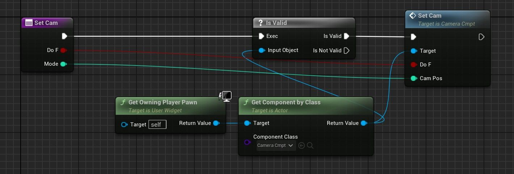

# PushUI使用指南🫸🏻​​🖥️

## 来源与状态

- 原始 URL：https://dev.epicgames.com/community/learning/tutorials/3919/unreal-engine-fab-guide-to-using-pushui

## 运行时分类

- 类型：图文教程
- 判断：API 未识别到核心视频信号，可整理正文约 1764 字符。

## 摘要

使用 PushUI 更轻松地管理小部件的指南。

## 中文整理

### 概览

[PushUI](https://www.fab.com/sellers/Astaraa) 指南。

### 设置

第一步：将 cmpt 放入您的角色中。按播放键，您将看到一个功能性 Esc 菜单。角色与玩家控制器：如果你想要一个在角色之外持续存在的平显（角色被摧毁或拥有另一个角色），那么 PC 是不错的选择。

### 推

PushUICmpt -> HUD -> PushWidget 或从其他小部件 GetOwningPlayer -> GetComponentByClass(PushUICmpt) -> HUD -> PushWidget。然后删除： PushUICmpt -> HUD -> PopWidget 通常，小部件的结构应类似于覆盖/内容。

### 参数

我们在推送时有这些可选参数。 **RemoveIfVisible** - 检查我们是否希望该小部件在再次按下时隐藏。如果我们想要一个按钮来切换元素，例如按 TAB 键打开库存，然后再次按 TAB 键关闭它，则很有用。否则它将重新打开。 **Cam** - 指示 [CameraCmpt](https://www.fab.com/sellers/Astaraa) 的相机模式。 **水平/垂直对齐** - 通常我们可以让小部件的覆盖层将其定位在屏幕上。我们可以跳过这一点并在此处执行此操作，其中小部件只是一个面板而不是整个屏幕。

### 与 CameraCmpt 集成

理想情况下，我们将保持模块化——易于更新且无依赖性。所以... 1. **复制 W_PushHUD**，名称类似于 W_PushHUD_MyGame（指示您的游戏）。 2. 在角色中，选择 **PushUICmpt**，并将 Class 选项设置为 W_PushHUD_MyGame 3. 打开 W_PushHUD_MyGame，切换到 Graph 并（在左侧面板中）**覆盖函数 SetCam**。 4. 添加如下所示的逻辑。

目前它没有像 Lyra 的实现那样具有不同的图层类别，例如 Game、GameMenu、Menu、Modal。我计划将来添加它。 - [Astaraa 的 FAB 资产](https://fab.com/sellers/Astaraa)

## 相关链接

- [Astaraa's FAB Assets](https://fab.com/sellers/Astaraa)
