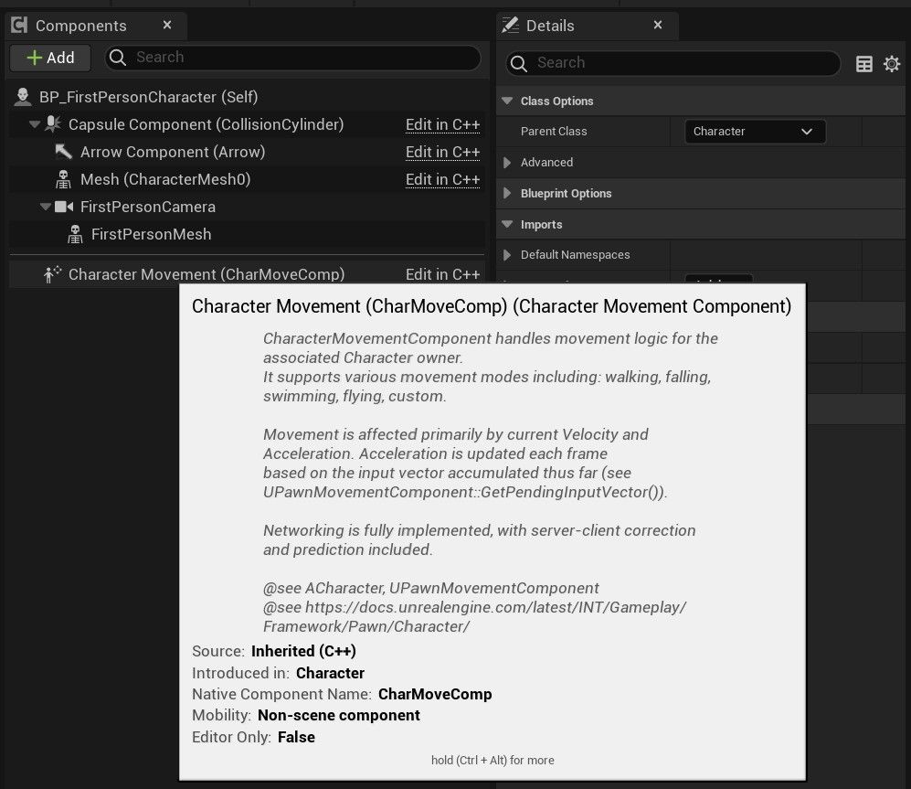
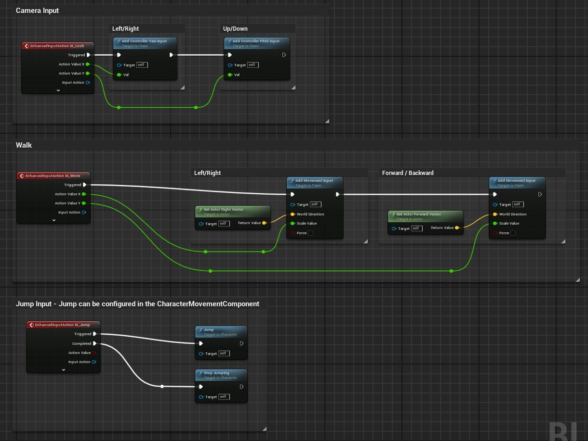
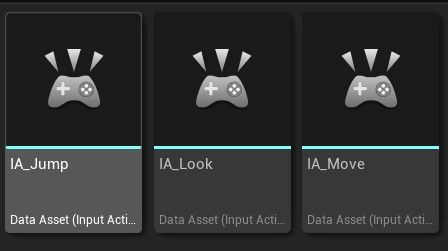
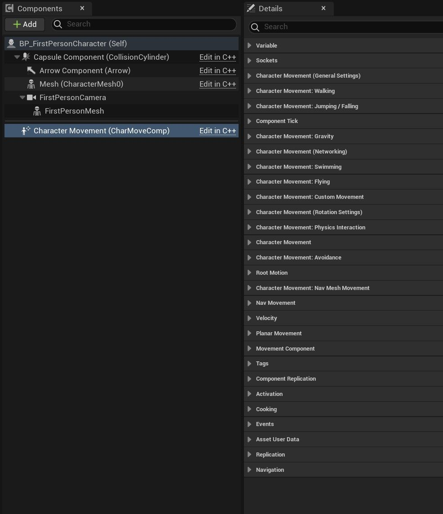
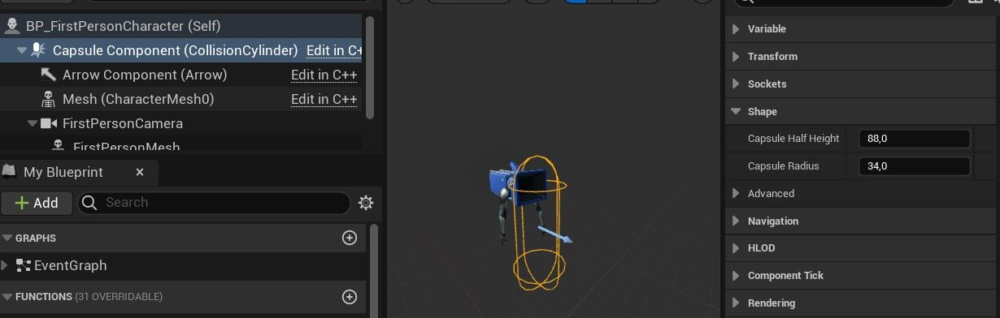
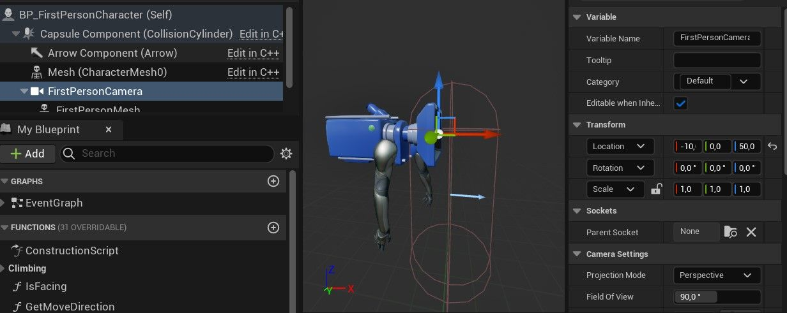
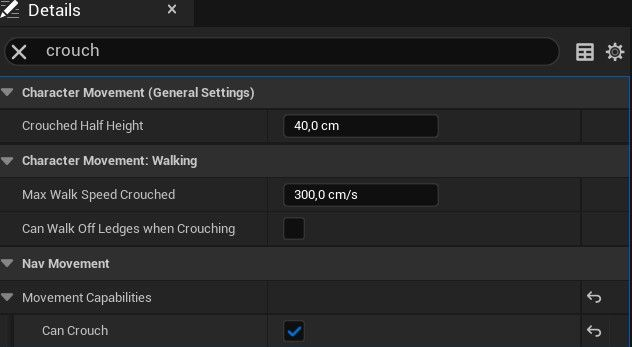
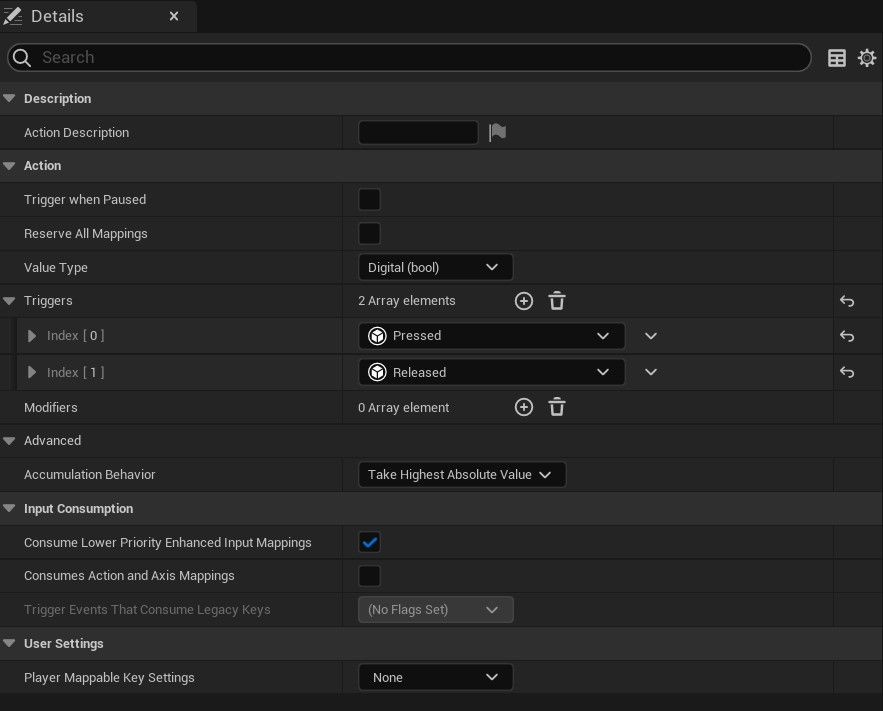
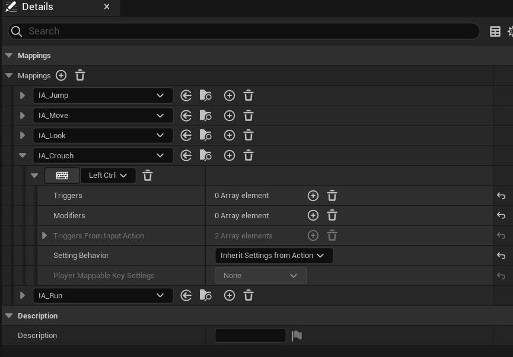

# 第一人称动作 01：简介 (Part 1/3)

Source file: `unreal-engine-first-person-motion-01-introduction.origin.md`.

This document was split during ue-kb import to keep source chunks buildable.

## 来源与状态

- 原始 URL：https://dev.epicgames.com/community/learning/tutorials/a3wo/unreal-engine-first-person-motion-01-introduction
## 运行时分类

- 类型：图文教程
- 判断：API 未识别到核心视频信号，可整理正文约 4185 字符。
## 摘要

介绍第一人称动作（蹲伏和奔跑）。
## 中文整理
### 介绍

在本教程中，我们将从 **第一人称模板** 开始，完善 **BP_FirstPersonCharacter** 蓝图。
### 先决条件

您应该已经了解以下基础知识： - 蓝图脚本 - 虚幻引擎 5 增强输入系统 - [蓝图脚本](https://docs.unrealengine.com/5.3/en-US/blueprints-visual-scripting-in-unreal-engine) - [增强输入](https://docs.unrealengine.com/5.3/en-US/enhanced-input-in-unreal-engine)
### 默认行走动作

得益于封装在 **Character** 类（**BP_FirstPersonCharacter **父类）中的 **CharacterMovement **组件以及 **BP_FirstPersonCharacter** 中实现的默认 **事件图**，良好的行走运动管理已经存在。还创建了一些 **输入操作** 和输入 **映射上下文**。






### 角色动作细节

有关其功能的更多详细信息，API 参考和详细信息面板是不错的起点： - [API 参考：UCharacterMovementComponent](https://docs.unrealengine.com/5.3/en-US/API/Runtime/Engine/GameFramework/UCharacterMovementComponent)


### 机身尺寸

身体尺寸影响角色与世界上的障碍物互动的方式。它的维度必须与你正在构建的世界相一致。您可以通过 **Capsule Component Shape 配置主体尺寸。半高**和**半径**是角色身体高度和宽度的一半。


### 眼睛配置

另一个重要的角色设定是眼睛的配置。一个好的视角确实可以提高游戏的可玩性。 **相机组件**中的两个参数确实改变了感觉：眼睛高度和视野。


### 蹲伏

蹲伏已由 **CharacterMovement** 组件管理。我们只需激活组件中的功能（**CanCrouch **在详细信息面板中）。



然后，我们所要做的就是： - 创建一个带有两个触发器（**按下 **和 **释放**）的新 **InputAction **DataAsset (**IA_Crouch**)。所以我们可以通过按下一个键来蹲下并在释放这个键时取消蹲下



- 将其映射到 **IMC_Default **(**InputMappingContext** DataAsset)，例如在 **Left Ctrl** 上



- 在 **BP_FirstPersonCharacter** 蓝图事件图中实现与 **IA_Crouch ** 关联的事件，以设置 **CharacterMovement** 组件

**蹲伏**

```
Begin Object Class=/Script/InputBlueprintNodes.K2Node_EnhancedInputAction Name="K2Node_EnhancedInputAction_0" ExportPath="/Script/InputBlueprintNodes.K2Node_EnhancedInputAction'/Game/Blueprint/Game/BP_FirstPersonCharacter.BP_FirstPersonCharacter:EventGraph.K2Node_EnhancedInputAction_0'"
   InputAction="/Script/EnhancedInput.InputAction'/Game/FirstPerson/Input/Actions/IA_Crouch.IA_Crouch'"
   NodePosX=2112
   NodePosY=-48
   AdvancedPinDisplay=Hidden
   NodeGuid=B065031A49E2CC404D9468997A3CEF26
   CustomProperties Pin (PinId=8497528C43691368876C3F84184A7C11,PinName="Triggered",PinToolTip="Triggering occurred after one or more processing ticks",Direction="EGPD_Output",PinType.PinCategory="exec",PinType.PinSubCategory="",PinType.PinSubCategoryObject=None,PinType.PinSubCategoryMemberReference=(),PinType.PinValueType=(),PinType.ContainerType=None,PinType.bIsReference=False,PinType.bIsConst=False,PinType.bIsWeakPointer=False,PinType.bIsUObjectWrapper=False,PinType.bSerializeAsSinglePrecisionFloat=False,PersistentGuid=00000000000000000000000000000000,bHidden=False,bNotConnectable=False,bDefaultValueIsReadOnly=False,bDefaultValueIsIgnored=False,bAdvancedView=False,bOrphanedPin=False,)
   CustomProperties Pin (PinId=DFEB44C340947C5D003E51A68AFAEFE4,PinName="Started",PinToolTip="An event has occurred that has begun Trigger evaluation. Note: Triggered may also occur this frame, but this event will always be fired first.",Direction="EGPD_Output",PinType.PinCategory="exec",PinType.PinSubCategory="",PinType.PinSubCategoryObject=None,PinType.PinSubCategoryMemberReference=(),PinType.PinValueType=(),PinType.ContainerType=None,PinType.bIsReference=False,PinType.bIsConst=False,PinType.bIsWeakPointer=False,PinType.bIsUObjectWrapper=False,PinType.bSerializeAsSinglePrecisionFloat=False,LinkedTo=(K2Node_CallFunction_2 21FA5DD543DFF8BE0716E5BB305A4272,),PersistentGuid=00000000000000000000000000000000,bHidden=False,bNotConnectable=False,bDefaultValueIsReadOnly=False,bDefaultValueIsIgnored=False,bAdvancedView=True,bOrphanedPin=False,)
   CustomProperties Pin (PinId=D8BE6FB04EB7F03F694547BA20923F3E,PinName="Ongoing",PinToolTip="Triggering is still being processed. For example, an action with a \"Press and Hold\" trigger\nwill be \"Ongoing\" while the user is holding down the key but the time threshold has not been met yet.",Direction="EGPD_Output",PinType.PinCategory="exec",PinType.PinSubCategory="",PinType.PinSubCategoryObject=None,PinType.PinSubCategoryMemberReference=(),PinType.PinValueType=(),PinType.ContainerType=None,PinType.bIsReference=False,PinType.bIsConst=False,PinType.bIsWeakPointer=False,PinType.bIsUObjectWrapper=False,PinType.bSerializeAsSinglePrecisionFloat=False,PersistentGuid=00000000000000000000000000000000,bHidden=False,bNotConnectable=False,bDefaultValueIsReadOnly=False,bDefaultValueIsIgnored=False,bAdvancedView=True,bOrphanedPin=False,)
   CustomProperties Pin (PinId=2535599940E2DEEF8C159AA900EE9CAA,PinName="Canceled",PinToolTip="Triggering has been canceled. For example,  the user has let go of a key before the \"Press and Hold\" time threshold.\nThe action has started to be evaluated, but never completed.",Direction="EGPD_Output",PinType.PinCategory="exec",PinType.PinSubCategory="",PinType.PinSubCategoryObject=None,PinType.PinSubCategoryMemberReference=(),PinType.PinValueType=(),PinType.ContainerType=None,PinType.bIsReference=False,PinType.bIsConst=False,PinType.bIsWeakPointer=False,PinType.bIsUObjectWrapper=False,PinType.bSerializeAsSinglePrecisionFloat=False,PersistentGuid=00000000000000000000000000000000,bHidden=False,bNotConnectable=False,bDefaultValueIsReadOnly=False,bDefaultValueIsIgnored=False,bAdvancedView=True,bOrphanedPin=False,)
```
