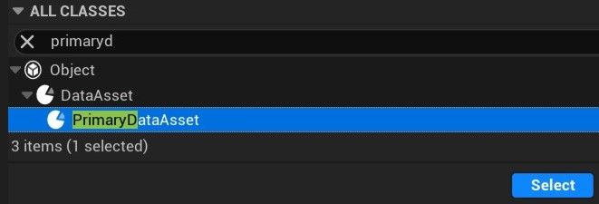

# 第一人称动作 01：简介 (Part 3/3)

Source file: `unreal-engine-first-person-motion-01-introduction.origin.md`.

This document was split during ue-kb import to keep source chunks buildable.

### 游戏设置

为了避免在许多蓝图中到处设置变量，甚至更糟糕的是在蓝图代码中使用常量，一个好方法是使用**主数据资产**。这样设置就可以集中起来，并且很容易找到和修改。您还可以想象具有不同值的相同设置资源的多个重复项，以便在它们之间轻松切换以用于测试目的或作为游戏功能。创建这些资产的工作流程： - 使用设置变量创建继承**主数据资产**的蓝图 - 您甚至可以创建多个蓝图以对设置进行分层排序



​​​​​ - 使用这些蓝图作为类型和设置变量值来创建**数据资产**。然后，从任何蓝图轻松访问这些设置： - 在 **FP_GameMode** 蓝图中添加根设置蓝图类型的变量，指向根设置数据资产，该变量可以从任何地方读取。 - 创建一个 **蓝图库** 函数 (**GetSettings**) 以获取此变量的快捷方式。

**获取设置纯函数**

```
Begin Object Class=/Script/BlueprintGraph.K2Node_FunctionEntry Name="K2Node_FunctionEntry_0" ExportPath="/Script/BlueprintGraph.K2Node_FunctionEntry'/Game/Blueprint/BP_Utility.BP_Utility:GetSettings.K2Node_FunctionEntry_0'"
   ExtraFlags=469901312
   FunctionReference=(MemberName="GetSettings")
   bIsEditable=True
   NodePosX=-272
   NodePosY=16
   NodeGuid=F108B7C14D84346CFA9CC795B8D98B10
   CustomProperties Pin (PinId=23161D084C786142CAECB5ADAA318402,PinName="then",Direction="EGPD_Output",PinType.PinCategory="exec",PinType.PinSubCategory="",PinType.PinSubCategoryObject=None,PinType.PinSubCategoryMemberReference=(),PinType.PinValueType=(),PinType.ContainerType=None,PinType.bIsReference=False,PinType.bIsConst=False,PinType.bIsWeakPointer=False,PinType.bIsUObjectWrapper=False,PinType.bSerializeAsSinglePrecisionFloat=False,LinkedTo=(K2Node_DynamicCast_0 0A671D774C8E2999D7D520A1C992B534,),PersistentGuid=00000000000000000000000000000000,bHidden=False,bNotConnectable=False,bDefaultValueIsReadOnly=False,bDefaultValueIsIgnored=False,bAdvancedView=False,bOrphanedPin=False,)
   CustomProperties Pin (PinId=843621BE45470DF354B05E825F5FB664,PinName="__WorldContext",Direction="EGPD_Output",PinType.PinCategory="object",PinType.PinSubCategory="",PinType.PinSubCategoryObject="/Script/CoreUObject.Class'/Script/CoreUObject.Object'",PinType.PinSubCategoryMemberReference=(),PinType.PinValueType=(),PinType.ContainerType=None,PinType.bIsReference=False,PinType.bIsConst=False,PinType.bIsWeakPointer=False,PinType.bIsUObjectWrapper=False,PinType.bSerializeAsSinglePrecisionFloat=False,PersistentGuid=00000000000000000000000000000000,bHidden=True,bNotConnectable=False,bDefaultValueIsReadOnly=False,bDefaultValueIsIgnored=False,bAdvancedView=False,bOrphanedPin=False,)
End Object
```

- [数据资产](https://docs.unrealengine.com/5.3/en-US/data-assets-in-unreal-engine)
## 相关链接

- [Blueprint scripting](https://docs.unrealengine.com/5.3/en-US/blueprints-visual-scripting-in-unreal-engine)
- [Enhanced input](https://docs.unrealengine.com/5.3/en-US/enhanced-input-in-unreal-engine)
- [API reference : UCharacterMovementComponent](https://docs.unrealengine.com/5.3/en-US/API/Runtime/Engine/GameFramework/UCharacterMovementComponent)
- [Data Assets](https://docs.unrealengine.com/5.3/en-US/data-assets-in-unreal-engine)
