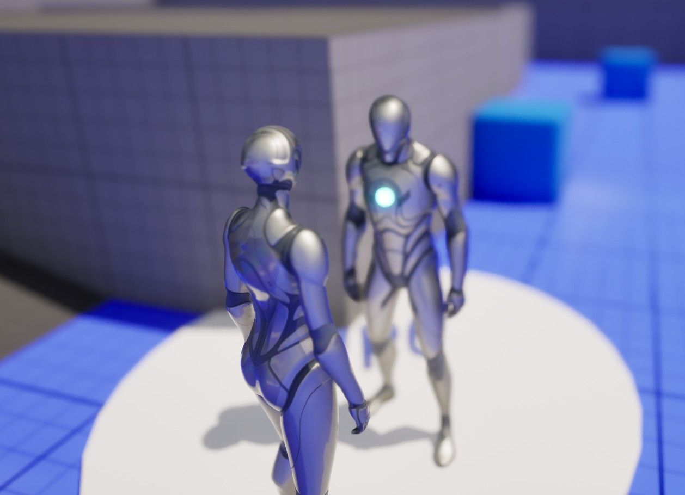
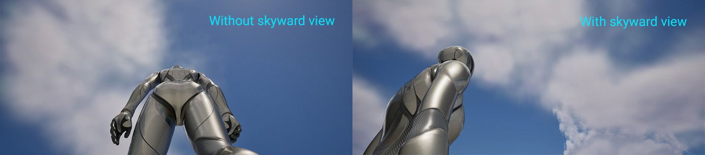

# Astaraa 的 CameraCmpt 指南 📹

## 来源与状态

- 原始 URL：https://dev.epicgames.com/community/learning/tutorials/RxoK/unreal-engine-fortnite-astaraa-s-cameracmpt-guide

## 运行时分类

- 类型：图文教程
- 判断：API 未识别到核心视频信号，可整理正文约 5270 字符。

## 摘要

CameraCmpt 使用指南。

## 中文整理

### 概览

[CameraCmpt](https://www.fab.com/sellers/Astaraa) 指南。这个人往往会过度解释。这一切真的很简单。

### 设置

CameraCmpt - 基本逻辑。 CameraCmpt_Input - 具有输入逻辑的子级。如果您不想更改任何输入逻辑，只需将 CameraCmpt_Input 放入您的角色中即可。否则，理想情况下，您将**复制 CameraCmpt_Input** 并将其命名为 CameraCmpt_MG（我的游戏）之类的名称，然后将您的版本放入您的角色中。然后，您对输入工作方式所做的任何更改都将是单独的，并且可以轻松更新，而无需重做更改。 *最初您只需放入 CameraCmpt 即可完成。就是这样。但我决定进行这种分离，因为我们通常想要自定义输入逻辑，并且不想在有更新时重做它。这就是我们保持模块化的方式。*我们假设您的角色有一个普通的相机和弹簧臂。如果您更改了相机或使用 GameplayCamera，则需要添加常用的弹簧臂/相机才能使用。

### 后续步骤

1. 打开 CameraCmpt 并**查看关键示例**，如果其他关键事件与您自己的冲突，则断开或分配其他关键事件。 2. 将 **Sprint** 调整为您想要的冲刺速度和基本速度，如果不需要则断开连接，或调整以使用您自己的冲刺设置。 3. 放入 B_CameraPad 作为相机更改示例。 4. 使用您想要的项目位置更新 CamVectors。我们有 2 个相机层。主要 - 这可以循环并受缩放等调整的影响。这是我们主要的基础层。要更改此设置，我们只需更改 CamMode 变量即可。 CycleCamera 就是这样做的。次要 - 这不受缩放等调整的影响。用于临时调整菜单、交互等。它激活IsCustomCamera。要使用它，我们调用SetCam 或AdjustCam。命名约定可能会进行调整以更好地反映这一点。 IsCustomCamera 可以被认为是 IsSecondary 或 IsTempCam。

### 选项

- CamMode (int=1) - 当前相机模式。更改此设置以设置玩家从 BeginPlay 上的 SaveGame 值开始或加载的模式，以记住玩家的首选项。 - CamVectors（数组） - 我们可以循环浏览或与 SetCam 一起使用的位置。 - CamModeCombat - 如果您设置了战斗指示器，例如武器模式！=无武装，则这将对应于战斗时使用的位置。它将覆盖基本位置，仍然使用菜单或其他交互触发的临时位置。同样的想法可以很容易地应用于其他事物 - 我们可以将它们称为“基础覆盖”。它可能装有其他物品。也许您想要一个相机视图显示武器，另一个相机视图显示拿着灯。也许你的灯笼将你的视图变成一个大的等距透视图或放大的双筒望远镜，同时仍然处理临时/交互变化。禁用临时更改的模式选项将是一个很好的未来补充。默认情况下，此模式不执行任何操作，因为它对于您的项目来说是唯一的。类似的 - BaseSpeed - 相机从一个位置转换到下一个位置的速度。默认值=5（平滑但敏捷）。 1 非常慢。 10 非常快。 - PlayerCanCycle - 默认情况下，玩家可以按 V（或您设置的任何键）在不同视图中循环摄像机。此选项可防止玩家执行此操作。 - ShowDebug - 启用在屏幕上显示当前位置索引。 - HasSkywardView - 启用/禁用天空视图，即仰视时出现的特定角度。通常，第三人称相机不擅长仰视，无论是天空还是大型建筑物。它们通常可以让您清楚地看到自己的屁股，或者最终落在草地上。所以我一直用“SkywardView”来解决这个问题。

### 功能

- SetCam - 设置相机模式和深度模糊，但作为辅助模式，激活 IsCustomCamera - 例如菜单、交互 - 不受缩放或其他事物（如主/主模式）的影响。要设置主模式，只需设置 CamMode 变量即可。 - CycleCamera - 循环浏览 CamVectors 中的相机位置。 - 调整凸轮 - 我们可以用它来进行特定的调整，而不是预设位置。然而，这没有景深。可以重新设计为 *SetCamPos* 并赋予它 DoF。 - AdjustCamBase - 重置我们的相机。可以重命名为*ResetCam*。 - 瞄准 - 切换瞄准开/关的视图。调整以适合您的游戏。

### 添加/编辑相机位置

选择字符中的CameraCmpt并修改CamVectors中的条目。

### 矢量库

- 描述 |矢量-后中| (X=300.000000,Y=0.000000,Z=0.000000) - 后仰| (X=300.000000,Y=0.000000,Z=50.000000) - 动作 | (X=200.000000,Y=60.000000,Z=60.000000) - 动作距离 | (X=300.000000,Y=60.000000,Z=60.000000) - 左动作 | (X=200.000000,Y=-60.000000,Z=60.000000) - 操作关闭 | (X=80.000000,Y=60.000000,Z=50.000000) - 目标 | (X=150.000000,Y=60.000000,Z=60.000000 - 1P | 由于存在许多差异，最好有第二个专用摄像机。 - ARPG/RTS (间距：-55 到 -70) | (X=250.000000,Y=0.000000,Z=800.000000) 第一人物、横向卷轴、RTS/ARPG 摄像机通常不会像第三人称那样使用动态摄像机，但我决定让事情变得简单，而不是添加更多选项，例如倾斜，尽管有时车辆具有奇怪的角度并且可能会使用倾斜 - [Astaraa 的 FAB 资产](https://fab.com/sellers/Astaraa)。

## 相关链接

- [Astaraa's FAB Assets](https://fab.com/sellers/Astaraa)
