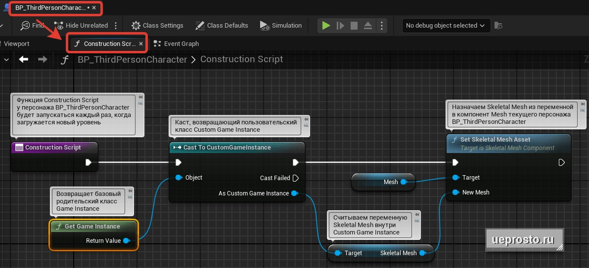
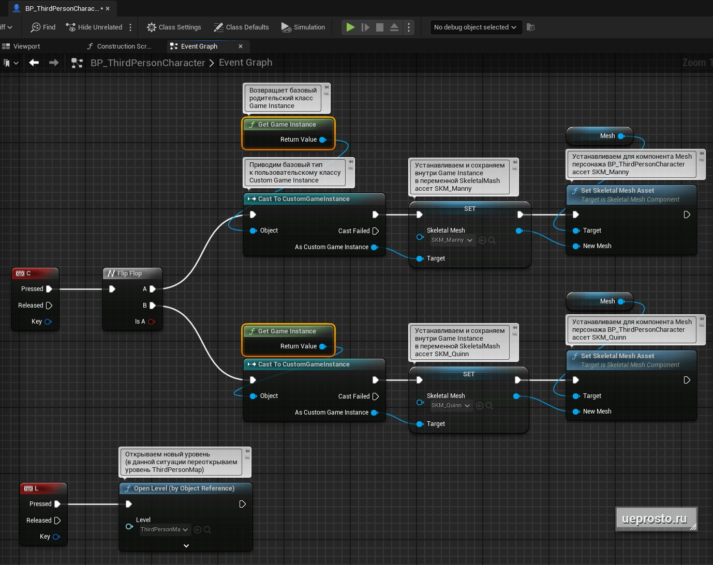

# 游戏实例：在加载不同关卡之间保存所选角色

## 来源与状态

- 原始 URL：https://dev.epicgames.com/community/learning/tutorials/33DJ/unreal-engine-game-instance

## 运行时分类

- 类型：图文教程
- 判断：API 未识别到核心视频信号，可整理正文约 2867 字符。

## 摘要

在当前的游戏关卡中，我们选择两个角色之一：男性“SKM_Manny”或女性“SKM_Quinn”。然后我们在进入游戏的下一个级别时保存此选择。

## 中文整理

### 概览

举个例子，考虑这样一种情况，在当前的游戏关卡中，我们选择两个角色之一：男性“SKM_Manny”或女性“SKM_Quinn”。然后，当我们使用 GameInstance 类进入游戏的下一个级别时，我们保存此选择。 *** 在示例中，为了简单起见，我们将使用 Cast，但最好使用 Interfaces 将不同的类相互连接。* 1. 为了示例简单，重新打开关卡时，我们将使用相同的“ThirdPersonMap”关卡，该关卡包含在虚幻引擎中的标准第三人称游戏模板中。为此，在角色“BP_ThirdPersonCharacter”的“Event Graph”选项卡中，我们将创建一个新节点“Open Level”。在我们的代码中，它将负责在按下“L”键时重新打开“ThirdPersonMap”关卡。 2. 要保存所选角色，请创建“CustomGameInstance”类。让我们在其中定义一个类型为“SkeletalMeshObject”的新变量“SkeletalMesh”。并通过选择女性角色资源“SKM_Quinn”来设置默认值。 3. 每次加载新关卡时，我们都会从“CustomGameInstance”对象中读取“SkeletalMesh”变量的值，并将其设置为当前角色“BP_ThirdPersonCharacter”的Mesh。要完成此任务，最好使用角色“BP_ThirdPersonCharacter”的“构造脚本”功能。在“构造脚本”中，我们转向基类“游戏实例”。接下来，使用类型转换，我们将其转换为“自定义游戏实例”。然后从这个类中我们将访问“Skeletal Mesh”变量。然后我们将该变量的值赋给当前角色“BP_ThirdPersonCharacter”的Mesh组件。因此，当移动到新的关卡时，角色将自动从游戏实例中先前保存的变量中恢复。

4. 在“BP_ThirdPersonCharacter”中的“C”键上，我们将设置更改角色的过程，在此过程中，此更改将保存在“Custom GameInstance”类中的“SkeletalMesh”变量中。为了交替改变角色，我们将放置“Flip Flop”节点。设置角色本身的过程与第 3 点“构造脚本”中的代码类似。但是，我们不是读取变量的值，而是将所选的角色存储在该变量中。之后，将Mesh组件中的角色设置为“BP_ThirdPersonCharacter”。

* 您可以在我们的文章中学习对 Game Instance 类及其所有设置、功能、实践和示例的详细分析：[虚幻引擎游戏实例](https://ueprosto.ru/blueprints/game-instance.html) 👉👉 书籍 [Blueprint.鸟瞰图】：【下载虚幻引擎蓝图书籍】(https://ueprosto.ru/lp/bp-book-eg.html)
