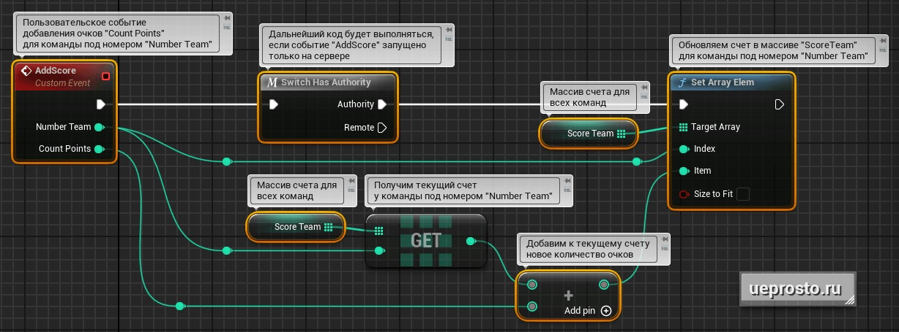

# 游戏状态：多团队多人游戏的分数跟踪系统

## 来源与状态

- 原始 URL：https://dev.epicgames.com/community/learning/tutorials/pLw1/unreal-engine-game-state

## 运行时分类

- 类型：图文教程
- 判断：API 未识别到核心视频信号，可整理正文约 2660 字符。

## 摘要

我们正在创建一个系统，允许您在多人团队游戏中跟踪分数、保存和更新多个团队的分数。

## 中文整理

### 概览

根据任务条款，我们有几个小组，每个小组都有一个分数。这些信息需要在某处存储和处理。最合适的解决方案是 Game State 类，因为每个团队的得分直接反映了游戏当前的状态。因此，接下来我们将使用自定义类“CustomGameState”来实现事件图表中的代码。 1）游戏中可以有多个队伍，使用数组来存储他们当前的分数很方便。让我们创建一个整数数组“ScoreTeam”，其中每个元素将对应于某个团队的当前得分。在这种情况下，元件的序列号将与命令号一致。例如，第一队的当前得分将存储在“ScoreTeam”数组中的索引[0]下。 2) 让我们创建一个自定义事件“添加分数”，当特定团队获得分数时将触发该事件。对于此事件，我们将定义两个整数参数： * Number Team (int) — 团队编号。 * 计数点数 (int) - 授予的点数。 3) 然后我们将使用“Switch Has Authority”节点，以便该过程仅通过“Authority”输出引脚继续。这确保了代码只在服务器上运行。 4) 使用“Set Array Elem”函数，我们可以将特定团队的新得分值添加到“ScoreTeam”数组中。为了实现这一点，我们需要传递该团队的编号（“Number Team”）作为 Index 参数。 5) 接下来您需要计算新的账户价值。为此，我们将使用“ScoreTeam”数组中的“GET”节点。我们将命令号作为参数传递给该节点。 “GET”节点将返回指定号码的球队的当前得分。 6) 然后将“添加分数”事件的“计数分数”参数中指定的分数添加到当前分数中。接下来，我们将“Number Team”命令生成的新得分值传递给“Set Array Elem”函数的“Item”参数。反过来，该函数将用新分数覆盖“ScoreTeam”数组中的当前分数。因此，我们在 GameState 类中开发了一个系统，允许您在多人团队游戏中跟踪、保存和更新点。

* 您可以在我们的文章中学习对 Game State 类及其所有设置、功能、实践和示例的详细分析：[虚幻引擎游戏状态](https://ueprosto.ru/blueprints/gamestate.html) 👉👉👉 书籍 [Blueprint.鸟瞰图】：【下载虚幻引擎蓝图书籍】(https://ueprosto.ru/lp/bp-book-eg.html)
