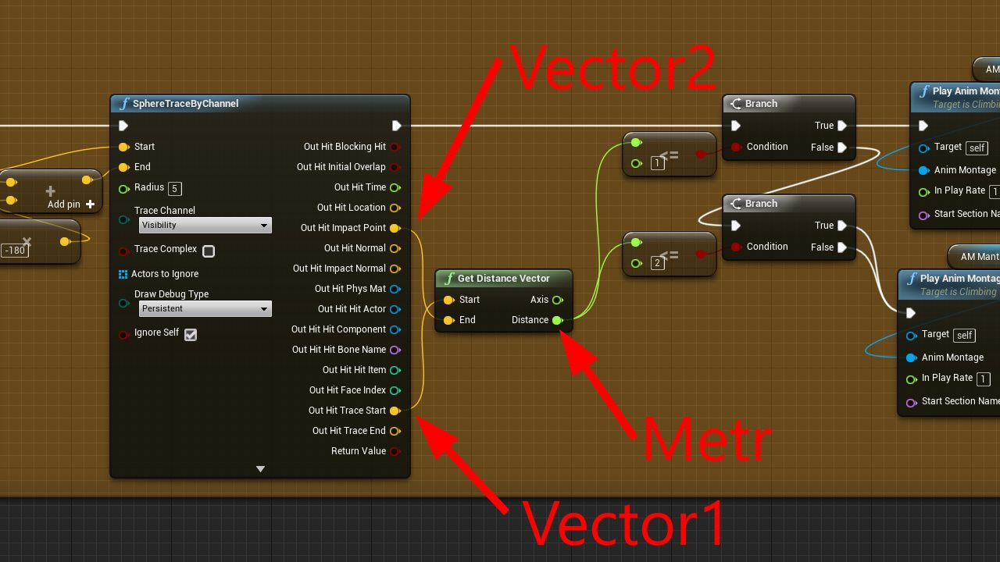

# 获取两个向量的距离

## 来源与状态

- 原始 URL：https://dev.epicgames.com/community/learning/tutorials/589M/unreal-engine-get-distance-two-vectors

## 运行时分类

- 类型：图文教程
- 判断：API 未识别到核心视频信号，可整理正文约 456 字符。

## 摘要

简介 BP 的开发人员大家好。我最近需要计算从角色到墙壁的距离。引擎中只有一个距离Actor。我努力思考如何做到这一点，并注意到很多人也不知道如何计算两个向量的距离。我决定与您分享“GetDistanceVectors”函数。

## 中文整理

### 概览



**复制代码 > 创建函数 > 打开函数 > 在函数中粘贴代码。如上图所示连接节点**

```
Begin Object Class=K2Node_FunctionEntry Name="K2Node_FunctionEntry_1072"
   ExtraFlags=469893120
   SignatureName="Get Distance Vector"
   bIsEditable=True
   NodeGuid=E5393350466DC4001B170C8290A6EAC1
   CustomProperties Pin (PinId=1F7108CA41ABC0C3F4F456990B4A5EF4,PinName="then",Direction="EGPD_Output",PinType.PinCategory="exec",PinType.PinSubCategory="",PinType.PinSubCategoryObject=None,PinType.PinSubCategoryMemberReference=(),PinType.PinValueType=(),PinType.bIsMap=False,PinType.bIsSet=False,PinType.bIsArray=False,PinType.bIsReference=False,PinType.bIsConst=False,PinType.bIsWeakPointer=False,LinkedTo=(K2Node_FunctionResult_2 46FA90B443ECD0C0B1D5E7A8C3C14139,),PersistentGuid=00000000000000000000000000000000,bHidden=False,bNotConnectable=False,bDefaultValueIsReadOnly=False,bDefaultValueIsIgnored=False,bAdvancedView=False,)
   CustomProperties Pin (PinId=AADC924D4100BBB1AB77609778B43C42,PinName="Start",Direction="EGPD_Output",PinType.PinCategory="struct",PinType.PinSubCategory="",PinType.PinSubCategoryObject=ScriptStruct'/Script/CoreUObject.Vector',PinType.PinSubCategoryMemberReference=(),PinType.PinValueType=(),PinType.bIsMap=False,PinType.bIsSet=False,PinType.bIsArray=False,PinType.bIsReference=False,PinType.bIsConst=False,PinType.bIsWeakPointer=False,LinkedTo=(K2Node_CallFunction_4529 4624076248A9C1F6A89F30BD0C3E619A,),PersistentGuid=00000000000000000000000000000000,bHidden=False,bNotConnectable=False,bDefaultValueIsReadOnly=False,bDefaultValueIsIgnored=False,bAdvancedView=False,)
   CustomProperties Pin (PinId=F1B126D74059F43F7B65FB92BF36A23C,PinName="End",Direction="EGPD_Output",PinType.PinCategory="struct",PinType.PinSubCategory="",PinType.PinSubCategoryObject=ScriptStruct'/Script/CoreUObject.Vector',PinType.PinSubCategoryMemberReference=(),PinType.PinValueType=(),PinType.bIsMap=False,PinType.bIsSet=False,PinType.bIsArray=False,PinType.bIsReference=False,PinType.bIsConst=False,PinType.bIsWeakPointer=False,LinkedTo=(K2Node_CallFunction_4529 8F25B60B428E4A0B67A5B08A445FA022,),PersistentGuid=00000000000000000000000000000000,bHidden=False,bNotConnectable=False,bDefaultValueIsReadOnly=False,bDefaultValueIsIgnored=False,bAdvancedView=False,)
   CustomProperties UserDefinedPin Name="Start" IsArray=0 IsReference=0 PinDir="EGPD_Output" Category=struct SubCategoryObject=/Script/CoreUObject.Vector 
   CustomProperties UserDefinedPin Name="End" IsArray=0 IsReference=0 PinDir="EGPD_Output" Category=struct SubCategoryObject=/Script/CoreUObject.Vector
```
