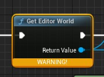
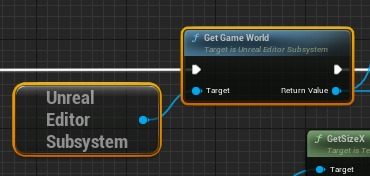

# “获取编辑器世界”已弃用 - 已解决

## 来源与状态

- 原始 URL：https://dev.epicgames.com/community/learning/tutorials/M6LY/unreal-engine-get-editor-world-deprecated-resolved

## 运行时分类

- 类型：图文教程
- 判断：API 未识别到核心视频信号，可整理正文约 2779 字符。

## 摘要

从 5.1 升级项目后，每当我在资源浏览器中右键单击资源时，都会收到“某些 AssetActionUtilityBlueprints 存在一些问题”错误。我将在下面解释问题是什么以及如何解决它。

## 中文整理

### # Unreal Blueprints 5.2 - “获取编辑器世界”已弃用 - 已解决

- UE 5.2 预览版 将旧项目升级到 UE 5.2 后可能会出现此问题。我在更新一个包含 Epic Games、Epic Content、**汽车****材料**资产包的项目后遇到了这个问题。加载该项目后，右键单击项目中的任何资源都会在虚幻编辑器的右下角引发错误（这不是致命的，但会分散注意力并指示潜在的代码问题）：单击“**显示消息日志**”会显示以下消息：

```
/Game/AutomotiveMaterials/Utils/AngleConvertUtility/UTIL_AngleMapConversion.UTIL_AngleMapConversion needs to be re-saved and possibly upgraded.
```

上面的消息显示，就我而言，错误发生在名为“UTIL_AngleMapConversion”的资产中。检查该消息以了解哪个蓝图可能导致您出现错误。打开该蓝图，您将看到导致问题的节点 - 您可能需要进行一些挖掘，因为问题节点可能位于 **Material Function** 内部。单击**编译**将在**编译器结果**中显示以下错误：

```
Get Editor World : Usage of 'Get Editor World' has been deprecated. The Editor Scripting Utilities Plugin is deprecated - Use the function in Unreal Editor Subsystem
```

单击超链接词“**获取编辑器世界**”，将直接导航到有问题的节点 - 它将如下所示：



您需要使用以下蓝图代码替换该节点：



要创建此代码， 1. 右键单击​​图表中的空白位置以显示节点的上下文菜单。 2. 搜索 **Get UrealEditorSubsystem** 3. 选择 **Get UnrealEditorSubsystem** 您的图形现在具有 **UNREAL EDITOR SUBSYSTEM** 节点 1. 单击并拖出 **UNREAL EDITOR SUBSYSTEM** 节点输出引脚 2. 搜索并选择 **Get Game World** 将这些节点重新连接以替换 **Get Editor World ** 节点**，**删除 **Get Editor World** 节点，**编译**，然后你很好！ - 结束 - - [原始要点，位于 gist.github.com/ScottKirvan - 欢迎贡献/评论](https://gist.github.com/ScottKirvan/be6550e546fca0e525f2803c9c6e2b19)

**复制/粘贴替换节点的片段**

```
Begin Object Class=/Script/BlueprintGraph.K2Node_GetEditorSubsystem Name="K2Node_GetEditorSubsystem_0" ExportPath=/Script/BlueprintGraph.K2Node_GetEditorSubsystem'"/Game/AutomotiveMaterials/Utils/AngleConvertUtility/UTIL_AngleMapConversion.UTIL_AngleMapConversion:convertTarget.K2Node_GetEditorSubsystem_0"'
   CustomClass=/Script/CoreUObject.Class'"/Script/UnrealEd.UnrealEditorSubsystem"'
   NodePosX=288
   NodePosY=-224
   NodeGuid=093529F74F5CD19F02F16AB5098C0229
   CustomProperties Pin (PinId=04E8892F4E9DB2FB6B23A2A1F978B5C5,PinName="ReturnValue",Direction="EGPD_Output",PinType.PinCategory="object",PinType.PinSubCategory="",PinType.PinSubCategoryObject=/Script/CoreUObject.Class'"/Script/UnrealEd.UnrealEditorSubsystem"',PinType.PinSubCategoryMemberReference=(),PinType.PinValueType=(),PinType.ContainerType=None,PinType.bIsReference=False,PinType.bIsConst=False,PinType.bIsWeakPointer=False,PinType.bIsUObjectWrapper=False,PinType.bSerializeAsSinglePrecisionFloat=False,LinkedTo=(K2Node_CallFunction_2 A039BA4F406782AE22458F8CF20DAD55,),PersistentGuid=00000000000000000000000000000000,bHidden=False,bNotConnectable=False,bDefaultValueIsReadOnly=False,bDefaultValueIsIgnored=False,bAdvancedView=False,bOrphanedPin=False,)
End Object
Begin Object Class=/Script/BlueprintGraph.K2Node_CallFunction Name="K2Node_CallFunction_2" ExportPath=/Script/BlueprintGraph.K2Node_CallFunction'"/Game/AutomotiveMaterials/Utils/AngleConvertUtility/UTIL_AngleMapConversion.UTIL_AngleMapConversion:convertTarget.K2Node_CallFunction_2"'
   FunctionReference=(MemberParent=/Script/CoreUObject.Class'"/Script/UnrealEd.UnrealEditorSubsystem"',MemberName="GetGameWorld")
   NodePosX=528
```

附录：@jimaki 在迁移一些数据后在旧版本的 Unreal 中看到类似的错误。原因是需要启用 **编辑器脚本插件**。他看到了一个看起来与上面描述的非常相似的错误，但没有看到任何添加虚幻编辑器子系统节点的方法（这是一个较新的节点，所以当然不可用）——启用插件解决了这个问题。

## 相关链接

- [Original gist, at gist.github.com/ScottKirvan - contribs/comments welcome](https://gist.github.com/ScottKirvan/be6550e546fca0e525f2803c9c6e2b19)
