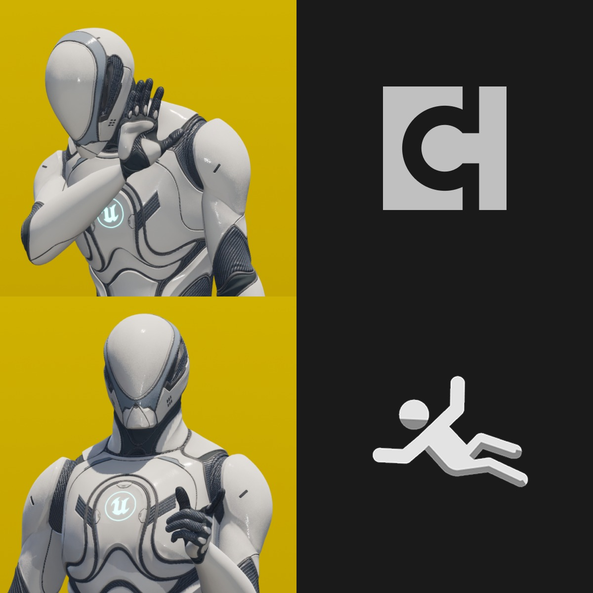
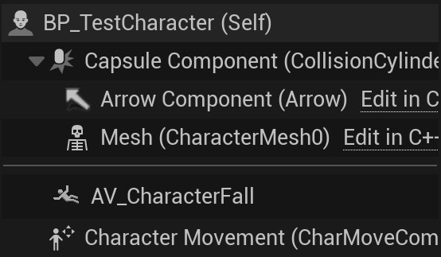

# 如何：向 Actor 组件添加自定义图标

## 来源与状态

- 原始 URL：https://dev.epicgames.com/community/learning/tutorials/j2oe/unreal-engine-how-to-adding-a-custom-icon-to-your-actor-component

## 运行时分类

- 类型：图文教程
- 判断：API 未识别到核心视频信号，可整理正文约 5014 字符。

## 摘要

本教程展示如何向 Actor 组件类添加自定义图标。

## 中文整理

### 将自定义图标添加到 Actor 组件



您的角色是否包含许多 Actor 组件，并且您希望能够在视觉上区分每个组件？您是否拥有插件并希望您的 Actor 组件在视觉上与创建的默认组件不同？在本教程中，我将展示如何向 Actor 组件添加自定义图标，以便它在编辑器中易于识别且唯一。但首先，应得的学分！非常感谢 [QuodSoler](https://www.quodsoler.com/)，他的博客文章帮助我学习了如何执行此操作并编写了教程：[自定义您的虚幻类图标 |科德·索莱尔](https://www.quodsoler.com/blog/customize-your-unreal-class-icons)

### 目录

1. 先决条件和项目设置 2. 创建“编辑器”项目 3. 导入图标资源 4. 将图标添加到 Actor 组件 5. 结束语

### 先决条件和项目设置

在编写本教程时，我一直在使用： - JetBrains Rider 2025.1.4 - Unreal Engine 5.6 在本教程中，没有选择使用什么项目模板，因为您只会打开编辑器来查看结果。在本教程中，我们将仅使用 **C++**，因为我们正在扩展编辑器。此外，我将使用我的 [AVCharacterFall](https://github.com/AntonVasserman/UEPlugins/tree/main/Plugins/AVCharacterFall) 插件作为本教程中的示例参考。

### 创建“编辑器”项目

在包含 ActorComponent 的项目旁边创建另一个带有后缀“Editor”的项目。 （例如，对于我的“AVCharacterFall”项目，我创建了一个“AVCharacterFallEditor”项目）接下来打开“.uplugin”文件并更新“模块”部分以包含编辑器项目：

**更新了 AVCharacterFall.uplugin**

```cpp
"Modules": [
		{
			"Name": "AVCharacterFall",
			"Type": "Runtime",
			"LoadingPhase": "Default"
		},
		{
			"Name": "AVCharacterFallEditor",
			"Type": "Editor",
			"LoadingPhase": "Default"
```

请注意，“编辑器”项目的类型设置为 *Editor* 而不是 *Runtime*。

### 导入图标资源

获取所需的 PNG 图标并将其保存在“内容”文件夹内的某个位置，但请记住它的保存位置。就我而言，它保存在：“*AVCharacterFall/Content/Editor/Slate/Icons/*”。我建议图标具有良好的 N x N 分辨率。我个人使用了 250 x 250 的图标。

### 将图标添加到 Actor 组件

要将图标添加到您的 Actor 组件，我们需要覆盖模块在启动时执行的操作，即我们想要加载和绑定图标的时间。这有助于我们将编辑器和插件项目分开，因为现在我们可以清楚地分离与编辑器调整相关的代码和作为插件逻辑的代码。转到您的编辑器项目模块头文件和源文件（在我的例子中，这些文件是“AVCharacterFallEditor.h/cpp”）。确保 virtual void StartupModule() 被覆盖，如果没有，则覆盖它：

**AVCharacterFallEditorModule 头文件**

```cpp
class FAVCharacterFallEditorModule : public IModuleInterface
{
	//~ IModuleInterface Begin
public:
	virtual void StartupModule() override;
	//~ IModuleInterface End
};
```

接下来实现 StartupModule() 来设置自定义 StyleSet，稍后我们将在此处设置 Icon 和实际 Actor 组件之间的绑定：

**创建样式集**

```cpp
void FAVCharacterFallEditorModule::StartupModule()
{
	static TSharedPtr<FSlateStyleSet> StyleSet = nullptr;
	
	if (!StyleSet.IsValid())
	{
		// Setup StyleSet
		StyleSet = MakeShareable(new FSlateStyleSet("AVCharacterFallStyle"));
		if (const TSharedPtr<IPlugin> CurrentPlugin = IPluginManager::Get().FindPlugin(TEXT("AVCharacterFall"));
			CurrentPlugin.IsValid())
```

细分： - 首先创建一个静态 StyleSet，它保证在 StartupModule() 被多次调用的情况下，我们不会重置 StyleSet。 - 然后设置样式集要使用的内容文件夹的根目录，特别是在我的例子中，我还添加了“Editor/Slate”后缀。 - 最后，我们注册样式集。此时我们已经设置了一个新的空 StyleSet，没有任何绑定。现在，在注册 StyleSet 之前，添加设置和绑定自定义图标的逻辑：

**自定义图标绑定**

```cpp
void FAVCharacterFallEditorModule::StartupModule()
{
	static TSharedPtr<FSlateStyleSet> StyleSet = nullptr;
	
	if (!StyleSet.IsValid())
	{
		// Setup StyleSet
		StyleSet = MakeShareable(new FSlateStyleSet("AVCharacterFallStyle"));
		if (const TSharedPtr<IPlugin> CurrentPlugin = IPluginManager::Get().FindPlugin(TEXT("AVCharacterFall"));
			CurrentPlugin.IsValid())
```

- 首先注意大段带注释的代码，这是一个较旧的实验，我决定保留它，因为它教我如何使用不同 Actor 组件的图标，并且我决定分享它，以防有人发现它有用。 - 然后我们创建两个字符串，即我们要覆盖其图标的 Actor 组件的名称，以及该自定义图标的路径（相对于我们之前设置的 StyleSet 的内容目录） - 最后，我们创建一个 FSlateImageBrush 并将其绑定到 Actor 组件。现在，下次您使用 Actor 组件时，它应该包含自定义图标：



为了稍微组织一下代码，您可以将一些逻辑提取到它们自己的函数中。我采取的方法是将 StyleSet 设置提取到 SetupCustomIcons() 函数中，并在其中调用设置特定组件的函数，目前只有 SetupCharacterFallComponentIcon(FSlateStyleSet* StyleSet)。以下是完整的源文件：

**完整源文件**

```cpp
#include "AVCharacterFallEditor.h"

#include "PropertyEditorModule.h"
#include "Components/AV_CharacterFallComponent.h"
#include "Interfaces/IPluginManager.h"
#include "Styling/SlateStyle.h"
#include "Styling/SlateStyleRegistry.h"

#define LOCTEXT_NAMESPACE "FAVCharacterFallModule"
```

### 结束语

我希望每个人都发现这个“如何”有用，并且我希望它实现其目标： 1. 展示如何添加所有编辑器逻辑应位于的“编辑器”项目。 2. 展示如何向 Actor 组件添加自定义图标。 ❗免责声明❗：本教程的创建是我学习 UE 并获得专业知识的教育旅程的一部分。其主要目的是共享知识并接收建设性反馈以供学习。我还在学习中，还有很长的路要走。虽然它可能并不完美，但我尽力提供可靠的信息和最佳实践，我希望任何人都觉得它有用且具有教育意义！ :)
