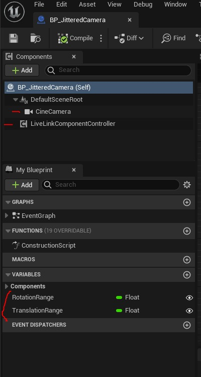
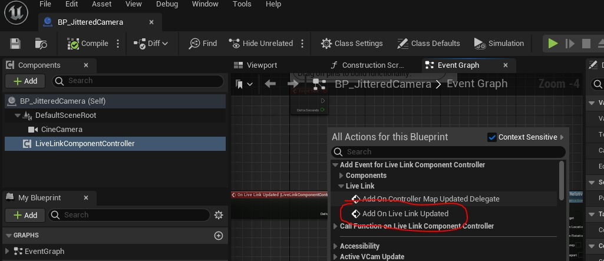
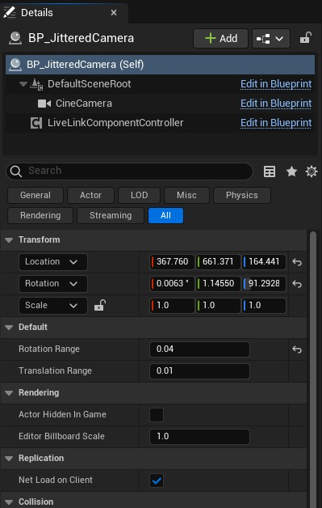
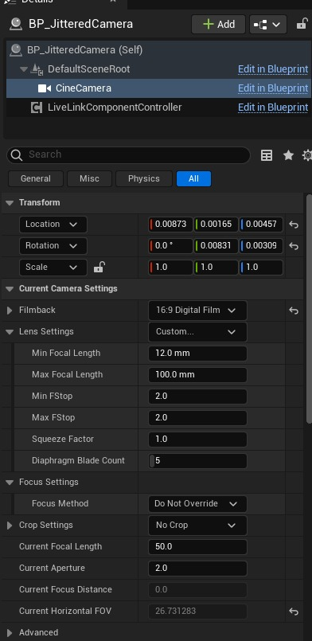
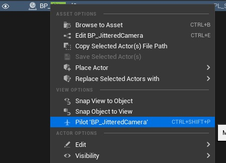
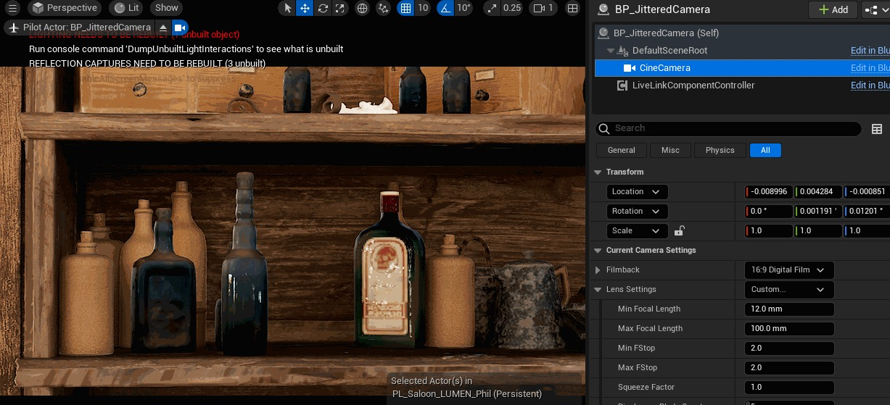
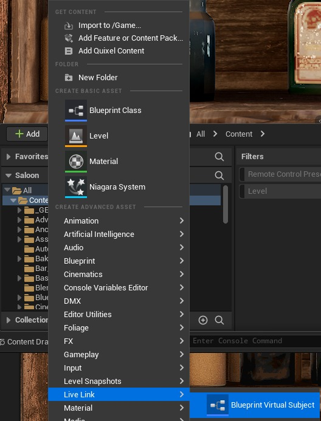
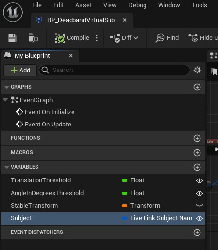
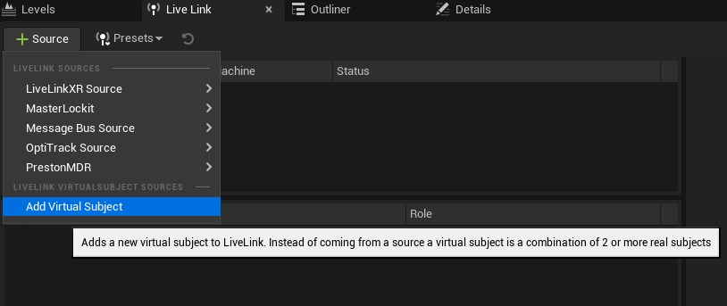
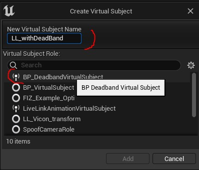

# 如何处理 ICVFX 拍摄中发生的相机抖动

## 来源与状态

- 原始 URL：https://dev.epicgames.com/community/learning/tutorials/dXG5/unreal-engine-how-to-deal-with-camera-jitter-happening-on-an-icvfx-shoot

## 运行时分类

- 类型：图文教程
- 判断：API 未识别到核心视频信号，可整理正文约 6301 字符。

## 摘要

在 LED Volume 中拍摄场景时，摄像机的跟踪数据可能包含少量噪声，这可能会导致镜头出现轻微移动或闪烁。这可能会导致问题，例如瓶子上的反射并在图像中产生锯齿状边缘。虚拟艺术部门可能会发现很难在编辑器中识别这些问题。本教程提供了两种解决方案： 1- 重现抖动的蓝图，使剪辑师能够预测拍摄过程中摄像机的移动。 2- Live Link 虚拟主体，通过在现场拍摄时对动作捕捉数据应用“死区”来减少噪音。

## 中文整理

### 在编辑器中模拟抖动相机的蓝图

创建继承自 Actor 的新蓝图。我正在调用我的 **BP_JitteredCamera。** 我们需要添加 **两个组件： ** - 一个 **CineCamera** 组件将在 DefaultSceneRoot 下设置。 - 一个 **LiveLinkComponentController**。我们使用此组件只是为了能够添加可在编辑器中使用的事件。还有两个变量，都是浮点数： - **RotationRange** - **TranslationRange**



现在让我们在事件图中添加**实时链接更新**：您可以复制下面的代码。

```
Begin Object Class=/Script/BlueprintGraph.K2Node_ComponentBoundEvent Name="K2Node_ComponentBoundEvent_1" ExportPath=/Script/BlueprintGraph.K2Node_ComponentBoundEvent'"/Game/FromEpic/VirtualCameraJitter/BP_JitteredCamera.BP_JitteredCamera:EventGraph.K2Node_ComponentBoundEvent_1"'
   DelegatePropertyName="OnLiveLinkUpdated"
   DelegateOwnerClass=/Script/CoreUObject.Class'"/Script/LiveLinkComponents.LiveLinkComponentController"'
   ComponentPropertyName="LiveLinkComponentController"
   EventReference=(MemberParent=/Script/CoreUObject.Package'"/Script/LiveLinkComponents"',MemberName="LiveLinkTickDelegate__DelegateSignature")
   bInternalEvent=True
   CustomFunctionName="BndEvt__BP_JitteredCamera_LiveLinkComponentController_K2Node_ComponentBoundEvent_1_LiveLinkTickDelegate__DelegateSignature"
   NodePosX=-208
   NodePosY=768
   NodeGuid=345FF9D242F6F3B2D180DAB28D0A7C41
```

或者，如果由于您的组件或变量没有完全相同的名称而无法正常工作，请选择您的组件“**LiveLinkComponentController**”，然后在事件图表中单击鼠标右键并查找 **Add On Live Link Updated**



然后您可以查看上面的代码来重新创建事件的逻辑。我们将 CineCamera 的相对位置和旋转设置为一些小的随机值，每次更新实时链接时这些值都会更改。编译并保存您的蓝图。现在将此演员拖到场景中并将“旋转范围”和“平移范围”设置为某个小值：



如果您选择 CineCamera 组件，您将看到变换值快速变化。您还可以将参数设置为与您期望的设置类似的参数。例如，在这里，我首先将聚焦方法设置为“不覆盖”，并将当前焦距设置为 50。



现在，您可以将 BP_JitteredCamera 演员引导到视口中，并获得一些与您在片场可能看到的类似的噪音。





### LiveLink 虚拟主体：添加死区以消除现场时来自动作捕捉系统的一些噪音。

对于本节，我希望您熟悉 livelink 系统、nDisplay 系统以及 ICVFX 拍摄期间控制摄像机的方式。您可以下载我们的 ICVFX 生产测试示例以熟悉其工作原理。 - [机内 VFX 制作模板](https://docs.unrealengine.com/5.1/en-US/in-camera-vfx-production-test-sample-project-for-unreal-engine) - [Livelink 文档](https://docs.unrealengine.com/5.1/en-US/live-link-in-unreal-engine) - [ICVFX 制作测试示例](https://unrealengine.com/marketplace/en-US/product/product-test) - [博客：相机 VFX 示例](https://unrealengine.com/en-US/spotlights/take-unreal-engine-s-latest-in-camera-vfx-toolset-for-a-spin) 创建一个新的虚拟 Livelink ：点击 **+Add** 并在 **LiveLink** 菜单下选择 **蓝图虚拟主题**



出现一个新窗口并选择角色 **LiveLinkCameraRole** 我正在调用这个新蓝图 **BP_DeadbandVirtualSubject** 我们需要 4 个变量： - **TranslationThreshold**，浮动 - **AngleDegreesThreshold**，浮动 - **StableTransform**，一种转换，我们在其中保留我们正在传递的相机的转换 - subject，一个 **LiveLinkSubjectName ** 结构。这将包含我们从动作捕捉系统收到的实时链接。



在EventGraph中，让我们更新Event On Update：您可以复制并粘贴下面的代码。

**更新事件**

```
Begin Object Class=/Script/BlueprintGraph.K2Node_Event Name="K2Node_Event_1" ExportPath=/Script/BlueprintGraph.K2Node_Event'"/Game/Stages/NantStudios/LiveLink/BP_DeadbandVirtualSubject.BP_DeadbandVirtualSubject:EventGraph.K2Node_Event_1"'
   EventReference=(MemberParent=/Script/CoreUObject.Class'"/Script/LiveLink.LiveLinkBlueprintVirtualSubject"',MemberName="OnUpdate")
   bOverrideFunction=True
   NodePosX=-496
   NodePosY=128
   bCommentBubblePinned=True
   NodeGuid=3D1FFF644FE0BB754C9FC58EFCFE30DC
   CustomProperties Pin (PinId=755C5E0B420639DB553E6A905CD9F221,PinName="OutputDelegate",Direction="EGPD_Output",PinType.PinCategory="delegate",PinType.PinSubCategory="",PinType.PinSubCategoryObject=None,PinType.PinSubCategoryMemberReference=(MemberParent=/Script/CoreUObject.Class'"/Script/LiveLink.LiveLinkBlueprintVirtualSubject"',MemberName="OnUpdate"),PinType.PinValueType=(),PinType.ContainerType=None,PinType.bIsReference=False,PinType.bIsConst=False,PinType.bIsWeakPointer=False,PinType.bIsUObjectWrapper=False,PinType.bSerializeAsSinglePrecisionFloat=False,PersistentGuid=00000000000000000000000000000000,bHidden=False,bNotConnectable=False,bDefaultValueIsReadOnly=False,bDefaultValueIsIgnored=False,bAdvancedView=False,bOrphanedPin=False,)
   CustomProperties Pin (PinId=9A07DA0145F83FE0F0FD528914B3515B,PinName="then",Direction="EGPD_Output",PinType.PinCategory="exec",PinType.PinSubCategory="",PinType.PinSubCategoryObject=None,PinType.PinSubCategoryMemberReference=(),PinType.PinValueType=(),PinType.ContainerType=None,PinType.bIsReference=False,PinType.bIsConst=False,PinType.bIsWeakPointer=False,PinType.bIsUObjectWrapper=False,PinType.bSerializeAsSinglePrecisionFloat=False,LinkedTo=(K2Node_EvaluateLiveLinkFrameWithSpecificRole_0 2E6CC3A64A4237A4907BA39A619B3602,),PersistentGuid=00000000000000000000000000000000,bHidden=False,bNotConnectable=False,bDefaultValueIsReadOnly=False,bDefaultValueIsIgnored=False,bAdvancedView=False,bOrphanedPin=False,)
End Object
```

我们在这里做什么：我们首先评估从动作捕捉系统收到的 **LiveLink 数据**。它包含两部分，**静态数据**和**帧数据。 ** 我们按原样复制 **静态数据** 部分。从**帧数据**中，我们获得**变换**，并将**位置**和**旋转**与我们在**StableTransform **变量下的**之前的****值进行比较。如果新位置和旧位置之间的距离大于我们的**翻译阈值**，我们就会传递新位置。否则我们保留旧位置。如果新旋转和旧旋转之间的角度大于我们的**旋转阈值**，我们就通过新旋转。否则我们保留旧的轮换。在 **StableTransform** 中，我们存储刚刚传递的任何值。就是这样。编译并保存。在“Live Link”窗口（位于“Window-Virtual Production”下）中，您可以将我们的新蓝图添加为虚拟主题：



出现一个新窗口。选择您的虚拟主题角色（在我的例子中为 BP_DeadbandVirtualSubject）。不要忘记选择一个正确的名称：我将我的名称设置为 LL_withDeadBand



选择您添加的这个新源并设置平移阈值和角度阈值。在“主题”下，设置用于将虚拟相机指向的实时链接主题。在下图中，此实时链接称为 Alexa_mini_LF_A。虽然它不是“实时”，但不要忘记将其另存为新预设，因为您希望渲染节点能够同时拥有来自动作捕捉系统的实时链接以及这个新的虚拟实时链接。在世界大纲中，选择用于控制 nDisplay actor 的内部视锥体的摄像机。在其 LiveLinkComponentController 中，将主题表示更改为新的 LL_withDeadBand。

## 相关链接

- [In-Camera VFX Production Template](https://docs.unrealengine.com/5.1/en-US/in-camera-vfx-production-test-sample-project-for-unreal-engine)
- [Livelink documentation](https://docs.unrealengine.com/5.1/en-US/live-link-in-unreal-engine)
- [ICVFX Producrion Test Sample](https://unrealengine.com/marketplace/en-US/product/production-test)
- [Blog: In Camera VFX sample](https://unrealengine.com/en-US/spotlights/taking-unreal-engine-s-latest-in-camera-vfx-toolset-for-a-spin)
