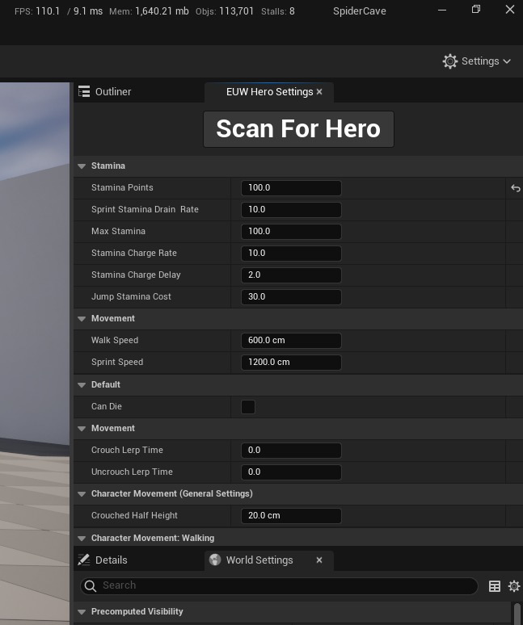
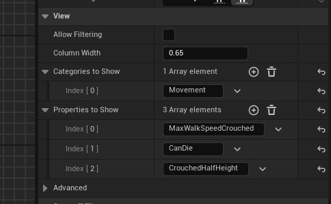
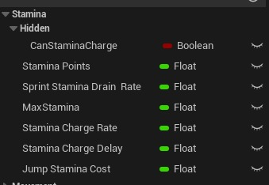

# 如何为角色制作快速简单的调试菜单

## 来源与状态

- 原始 URL：https://dev.epicgames.com/community/learning/tutorials/DdKX/unreal-engine-how-to-make-a-quick-and-simple-debug-menu-for-a-character

## 运行时分类

- 类型：图文教程
- 判断：API 未识别到核心视频信号，可整理正文约 2454 字符。

## 摘要

它使用编辑器实用程序小部件、详细信息视图小部件元素和变量类别来在 PIE 运行时轻松显示和编辑蓝图变量。

## 中文整理

### 如何为角色制作快速简单的调试菜单。

它使用编辑器实用程序小部件、详细信息视图小部件元素和变量类别来在 PIE 运行时轻松显示和编辑蓝图变量。预览：



1. 创建编辑器实用程序小部件 - 我使用 Stack Box 作为基类 2. 从调色板添加按钮和详细信息视图小部件元素 3. 在类设置中启用“在 PIE 中启用” 4. 添加代码 5. 单击详细视图小部件并设置要显示的类别 6. 单击运行小部件或返回关卡窗口 -> 工具 -> 编辑器实用程序小部件 -> 您的小部件

```
Begin Object Class=/Script/BlueprintGraph.K2Node_GetEditorSubsystem Name="K2Node_GetEditorSubsystem_4" ExportPath="/Script/BlueprintGraph.K2Node_GetEditorSubsystem'/Game/SpiderCave/UI/Debug/EUW_HeroSettings.EUW_HeroSettings:EventGraph.K2Node_GetEditorSubsystem_4'"
   CustomClass="/Script/CoreUObject.Class'/Script/UnrealEd.UnrealEditorSubsystem'"
   NodePosX=640
   NodePosY=1024
   NodeGuid=D6D257B14A085D1F690419A0CC904E11
   CustomProperties Pin (PinId=E4935CFC45BA4F557D2F5FB1AC6CD05E,PinName="ReturnValue",Direction="EGPD_Output",PinType.PinCategory="object",PinType.PinSubCategory="",PinType.PinSubCategoryObject="/Script/CoreUObject.Class'/Script/UnrealEd.UnrealEditorSubsystem'",PinType.PinSubCategoryMemberReference=(),PinType.PinValueType=(),PinType.ContainerType=None,PinType.bIsReference=False,PinType.bIsConst=False,PinType.bIsWeakPointer=False,PinType.bIsUObjectWrapper=False,PinType.bSerializeAsSinglePrecisionFloat=False,LinkedTo=(K2Node_CallFunction_1 1D94C2EB4E77467DB84AD6B0195B338B,),PersistentGuid=00000000000000000000000000000000,bHidden=False,bNotConnectable=False,bDefaultValueIsReadOnly=False,bDefaultValueIsIgnored=False,bAdvancedView=False,bOrphanedPin=False,)
End Object
Begin Object Class=/Script/BlueprintGraph.K2Node_CallFunction Name="K2Node_CallFunction_1" ExportPath="/Script/BlueprintGraph.K2Node_CallFunction'/Game/SpiderCave/UI/Debug/EUW_HeroSettings.EUW_HeroSettings:EventGraph.K2Node_CallFunction_1'"
   FunctionReference=(MemberParent="/Script/CoreUObject.Class'/Script/UnrealEd.UnrealEditorSubsystem'",MemberName="GetGameWorld")
   NodePosX=624
```



我使用子类别来隐藏播放器控制器中的变量



我尝试让它在 PIE 时自动扫描播放器，但失败了。如果你能弄清楚的话请评论！！！！
